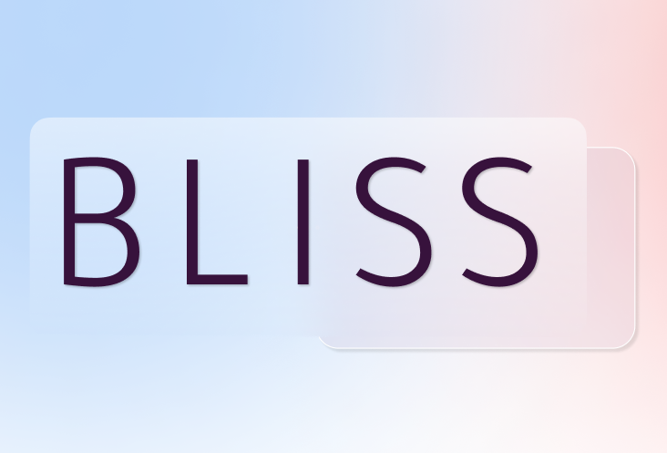

# 
Universidad Peruana de Ciencias Aplicadas

## 
Desarrollo de Aplicaciones Open Source WS53

  

## 
Informe del TB1

<h4 style="text-align: center;"> Ingeniería de Software </h4>
<h4 style="text-align: center;"> Ciclo 2024-01 </h4>
<h4 style="text-align: center;"> Docente: Juan Antonio Flores Moroco </h4>
<h4 style="text-align: center;"> Startup: BeautyServices </h4>
<h4 style="text-align: center;"> Producto: Bliss  </h4>

## Integrantes

| Nombre |Código de alumno|
|:-------:|:----------:|
|André Arturo Bernaola Pérez|U202114192|
|Diego Ivan Cabrera Buitron|U20211B293|
|Elvia Marcela Rodriguez Villa|U20231C784|
|David Alejandro Rivas Sarango|U20191E831|
|Diego Martin Sorano Medriano|U202114793|

## 
Agosto 2024

## Registro de versiones del informe

| Versión   | Fecha     | Autor |Descripción de la modificación |
|-----------|-----------|-------|-------------                  |
| 1         | 16/08/24  |       |                               |
|           |           |       |                               |
|           |           |       |                               |

## Project Report Collaboration Insights

URL de la organización del proyecto: [https://github.com/upc-opensource-g-bliss]

**TB1**
|Integrante|Tareas Asignadas|
|-|-|
|André Arturo Bernaola Pérez||
|Diego Ivan Cabrera Buitron||
|Elvia Marcela Rodriguez Villa||
|David Alejandro Rivas Sarango||
|Diego Martin Sorano Medriano||

**TB1 Github**

***

## Contenido
1. [Capítulo I: Introducción](#1.) 
1.1. [***Startup Profile***](#1.1.)  
1.1.1. [Descripción del startup](#1.1.1.) 
1.1.2.[Perfiles de los integrantes del equipo](#1.1.2.) 
1.2. [***Solution Profile***](#1.2.) 
1.2.1. [Antecedentes y Problemática](#1.2.1.) 
1.2.2. [Lean UX Process](#1.2.2.) 
1.2.2.1. [Lean UX Problem Statements](#1.2.2.1.) 
1.2.2.2. [Lean UX Assumptions](#1.2.2.2.) 
1.2.2.3. [Lean UX Hypothesis Statements](#1.2.2.3.) 
1.2.2.4. [Lean UX Canvas](#1.2.2.4.) 
1.3. [***Segmentos objetivo***](#1.3.) 
2. [**Capítulo II: Requirements Elicitation & Analysis**](#2.) 
2.1. [***Competidores***](#2.1.) 
2.1.1. [Análisis competitivo](#2.1.1.) 
2.1.2. [Estrategias y tácticas frente a competidores](#2.1.2.) 
2.2. [***Entrevistas***](#2.2.) 
2.2.1. [Diseño de entrevistas](#2.2.1.) 
2.2.2. [Registro de entrevistas](#2.2.2.) 
2.2.3. [Análisis de entrevistas](#2.2.3.) 
2.3. [***Needfinding***](#2.3.) 
2.3.1. [User Personas](#2.3.1.) 
2.3.2. [User Task Matrix](#2.3.2.) 
2.3.3. [User Journey Mapping](#2.3.3.) 
2.3.4. [Empathy Mapping](#2.3.4.) 
2.3.5. [As-is Scenario Mapping](#2.3.5.) 
2.4. [***Ubiquitous Language***](#2.4.) 
3. [**Capítulo III: Requirements Specification**](#3.) 
3.1. [***To-Be Scenario Mapping***](#3.1.) 
3.2. [***User Stories***](#3.2.) 
3.3. [***Impact Mapping***](#3.3.) 
3.4. [***Product Backlog***](#3.4.) 
4. [**Capítulo IV: Product Design.**](#4.) 
4.1. [***Style Guidelines***](#4.1.) 
4.1.1. [General Style Guidelines](#4.1.1.) 
4.1.2. [Web Style Guidelines](#4.1.2.) 
4.2. [***Information Architecture***](#4.2.) 
4.2.1. [Organization Systems](#4.2.1.) 
4.2.2. [Labeling Systems](#4.2.2.) 
4.2.3. [SEO Tags and Meta Tags](#4.2.3.) 
4.2.4. [Searching Systems](#4.2.4.) 
4.2.5. [Navigation Systems](#4.2.5.) 
4.3. [***Landing Page UI Design***](#4.3.) 
4.3.1. [Landing Page Wireframe](#4.3.1.) 
4.3.2. [Landing Page Mock-up](#4.3.2.) 
4.4. [***Web Applications UX/UI Design***](#4.4.) 
4.4.1. [Web Applications Wireframes](#4.4.1.) 
4.4.2. [Web Applications Wireflow Diagrams](#4.4.2.) 
4.4.3. [Web Applications Mock-ups](#4.4.3.) 
4.4.4. [Web Applications User Flow Diagrams](#4.4.4.) 
4.5. [***Web Applications Prototyping***](#4.5.) 
4.6. [***Domain-Driven Software Architecture***](#4.6.) 
4.6.1. [Software Architecture Context Diagram](#4.6.1.) 
4.6.2. [Software Architecture Container Diagrams](#4.6.2.) 
4.6.3. [Software Architecture Components Diagrams](#4.6.3.) 
4.7. [***Software Object-Oriented Design***](#4.7.) 
4.7.1. [Class Diagrams](#4.7.1.) 
4.7.2. [Class Dictionary](#4.7.2.) 
4.8. [***Database Design***](#4.8.) 
4.8.1. [Database Diagram](#4.8.1.) 
5. [**Capítulo V: Product Implementation, Validation & Deployment**](#5.) 
5.1. [***Software Configuration Management***](#5.1.) 
5.1.1. [Software Development Environment Configuration](#5.1.1.) 
5.1.2. [Source Code Management](#5.1.2.) 
5.1.3. [Source Code Style Guide & Conventions](#5.1.3.) 
5.1.4. [Software Deployment Configuration](#5.1.4.) 
5.2. [***Landing Page, Services & Applications Implementation***](#5.2.) 
5.2.1. [Sprint 1](#5.2.1.) 
5.2.1.1. [Sprint Planning 1](#5.2.1.1.) 
5.2.1.2. [Sprint Backlog 1](#5.2.1.2.) 
5.2.1.3. [Development Evidence for Sprint Review](#5.2.1.3.) 
5.2.1.4. [Testing Suite Evidence for Sprint Review](#5.2.1.4.) 
5.2.1.5. [Execution Evidence for Sprint Review](#5.2.1.5.) 
5.2.1.6. [Services Documentation Evidence for Sprint Review](#5.2.1.6.) 
5.2.1.7. [Software Deployment Evidence for Sprint Review](#5.2.1.7.) 
5.2.1.8. [Team Collaboration Insights during Sprint](#5.2.1.8.) 
5.3. [***Validation Interviews***](#5.3.) 
5.3.1.[Diseño de Entrevistas](#5.3.1.) 
5.3.2.[Registro de Entrevistas](#5.3.2.) 
5.3.3.[Evaluaciones según Heurísticas](#5.3.3.) 
5.4. [***Video About-the-Product***](#5.4.) 
6. [**Conclusiones**](#6.) 
7. [**Bibliografía**](#7.) 
8. [**Anexos**](#8.) 

## Students Outcomes

| Criterio específico | Acciones realizadas | Conclusiones |
|---------------------|---------------------|--------------|
|Comunica oralmente con efectividad a diferentes rangos de audiencia.| **André Arturo Bernaola Pérez**   **Diego Ivan Cabrera Buitron**   **Elvia Marcela Rodriguez Villa**   **David Alejandro Rivas Sarango**   **Diego Martin Soriano Medrano** | |
|Comunica por escrito con efectividad a diferentes rangos de audiencia|**André Arturo Bernaola Pérez**   **Diego Ivan Cabrera Buitron**   **Elvia Marcela Rodriguez Villa**   **David Alejandro Rivas Sarango**   **Diego Martin Soriano Medrano** | |

***

<h2>Capítulo I: Introducción</h2>

<h3> 1.1 Startup Profile</h3>

<h4> 1.1.1. Descripción del startup</h4>

Las empresas de belleza y del cuidado personal están creciendo rápidamente, especialmente el sector de tratamientos faciales y dermocosmética, que ha crecido casi 8 veces en los últimos 10 años. Los centros de belleza están diseñados para satisfacer las necesidades de la clase media emergente de 2019, la cual está creciendo. 

La importancia del servicio personalizado al usuario es evidente en este contexto. Los salones de belleza en Perú, que crecen cada vez más, luchan por diferenciarse en un mercado donde la oferta aún está polarizada e informal. Las pequeñas empresas familiares son un buen lugar para empezar, son un poco más relajadas y tienen un estilo de gestión bajo, pero pueden personalizarse y atender las necesidades individuales de cada cliente. Los datos del Inei muestran que el 75.6% de los salones de belleza están dirigidos por mujeres. 

Para aprovechar al máximo la competencia competitiva y el crecimiento, es fundamental elevar la calidad del servicio y la gestión, con un mayor énfasis en ofrecer experiencias de usuario personalizadas. No sólo aumentará la satisfacción del cliente, sino que también ayudará a formalizar y "profesionalizar" la industria de la belleza, permitiéndoles establecer relaciones más sólidas y duraderas con sus clientes.

**Misión**: Ofrecer un servicio de belleza y cuidado personal altamente personalizado, centrado en satisfacer las necesidades y expectativas de cada cliente.

**Visión**: Ser los referente en la industria de la belleza y cuidado personal, reconocidos por brindar experiencias personalizadas, contribuyendo al crecimiento y formalizar este sector.

##### Logotipo de la Startup:

##### Logotipo del producto:

  

<h4> 1.1.2. Perfiles de los integrantes del equipo</h4>

|Integrante |Descripción|
|-----------|-----------|
||**David Alejandro Rivas Sarango**   Mi nombre es **David Rivas**, actualmente estoy cursando la carrera de Ingeniería de Software en la UPC. Soy una persona honesta y responsable. Me interesa el área de Data Science, por esto estoy siguiendo cursos de capacitacion en SQL y Python.|
||**Diego Ivan Cabrera Buitron**   Mi nombre es **Diego Cabrera**, estoy cursando la carrera de Ingeniería de Software, me considero una persona responsable y perseverante. Al culminar mi carrera quiero especializarme en el sector de la ciberseguridad|
|           ||
|           ||

<h3> 1.2. Solution Profile</h3>

<h4> 1.2.1. Antecedentes y Problemática</h4>

##### What (Qué)
###### ¿Cuál es el problema?
Muchas personas pueden encontrar difícil reservar citas de servicios de cuidado y belleza. Asimismo, a muchas Mypes de este rubro se les dificulta encontrar nuevos clientes.
###### ¿Cuál es la relación con la persona en cuestión?
Las personas en cuestión son clientes potenciales que desean acceder a servicios de cuidado y belleza de manera conveniente y confiable; y estilistas o dueños de negocio que desean promocionar su negocio a más personas.

##### When (Cuando)
###### ¿Cuándo sucede el problema?
El problema puede ocurrir cuando los clientes desean reservar citas de servicios de cuidado y belleza, mas no tienen tiempo para buscar proveedores o llamar por teléfono para hacer una reserva.
###### ¿Cuándo utiliza el cliente el producto?
Cuando los clientes deseen buscar, reservar y pagar por servicios de cuidado y belleza, ya sea en casa o en el establecimiento del proveedor, y cuando los proveedores de servicios de cuidado y belleza necesitan hacer uso de una plataforma para promocionar sus servicios.

##### Where (Dónde)
###### ¿A dónde se dirige?
El cliente se dirige a la aplicación para buscar y reservar citas de servicios de cuidado y belleza con proveedores cercanos a su ubicación.
###### ¿Dónde surge el problema?
El problema surge cuando los clientes desean reservar citas de servicios de cuidado y belleza, pero encuentran dificultades para encontrar proveedores confiables o para coordinar horarios que se ajusten a su agenda.
###### ¿Dónde está el cliente cuando usa el producto?
El cliente puede usar el producto desde cualquier lugar donde tenga acceso a Internet, como su hogar, su lugar de trabajo o en movimiento a través de dispositivos móviles.

##### Who (Quién)
###### ¿Quiénes están involucrados?
Los clientes que buscan servicios de cuidado y belleza y los proveedores que ofrecen estos servicios.
###### ¿A quiénes les sucede el problema?
El problema afecta a los clientes que desean acceder a servicios de cuidado y belleza y a los proveedores que buscan aumentar su clientela y gestionar sus citas de manera eficiente.
###### ¿Quién lo utilizará?
El cliente de este producto es quien busque servicios de cuidado y belleza, especialmente mujeres de 20 a 45 años en el sector socioeconómico B-C de Lima, así como Mypes que brinden servicios de cuidado y belleza en Lima.

##### Why (Por qué)
###### ¿Cuál es la causa del problema?
La causa del problema es la falta de una plataforma centralizada que conecte de manera conveniente a los clientes con proveedores de servicios de cuidado y belleza, así como la dificultad para coordinar horarios y encontrar proveedores confiables en el mercado actual.

#### 2H
##### How (Cómo)
###### ¿En qué condiciones nuestros clientes usan el producto?
Nuestros clientes usarán el producto en diversas condiciones, ya sea cuando estén en casa buscando un servicio de cuidado y belleza para una ocasión especial, durante un descanso en el trabajo mientras navegan por opciones de tratamientos, o incluso en movimiento cuando necesiten reservar rápidamente un servicio mientras están fuera de casa.
###### ¿Cómo nos conocieron los compradores? 
Los compradores pueden conocernos a través de diversas fuentes, como recomendaciones de amigos o familiares, publicidad en línea a través de redes sociales, reseñas en línea, o incluso a través de promociones con otros negocios locales
###### ¿Cómo prefieren los consumidores acceder a nuestro contenido?
A través de dispositivos móviles, como teléfonos inteligentes o tabletas. A los consumidores les gustaría poder encontrar fácilmente información sobre los servicios disponibles, ver reseñas y calificaciones de otros usuarios, y realizar reservas en pocos pasos.
###### ¿Que llevó a la persona a llegar a esta situación?
La situación surge de la necesidad de las personas de mantener su apariencia y bienestar mediante servicios de cuidado y belleza, así como de la dificultad para encontrar proveedores confiables y coordinar citas de manera conveniente en el mercado actual. Esto puede deberse a la falta de tiempo o a la falta de opciones cercanas.

##### How much (Cuánto)
###### ¿Cuál es la magnitud del problema?
De acuerdo con la Asociación Peruana de Empresarios de la Belleza (2022), 4 de cada 10 peluquerías se vieron obligadas a cerrar a raíz de la pandemia, y solo un 30% de estas siguen en la formalidad. Esto, en muchos casos, es producto de los elevados costos tanto del alquiler como de la materia prima que los estilistas requieren para realiza su labor.

<h4> 1.2.2. Lean UX Process</h4>

El objetivo de nuestra aplicación es mejorar la gestión de clientes mediante una plataforma que facilite a los clientes la búsqueda y reserva de servicios de belleza y cuidado personal.

<h5> 1.2.2.1. Lean UX Problem Statements</h5>

a) El objetivo de nuestra aplicación es mejorar la gestión de clientes mediante una
plataforma que facilite a los clientes la búsqueda y reserva de servicios de belleza y
cuidado personal. 
Sin embargo, nos enfrentamos a un desafío significativo: la alta tasa de informalidad en
la industria, que genera desconfianza entre los clientes al seleccionar un centro para sus
necesidades de belleza. Esta falta de transparencia y garantías sobre la calidad de los
servicios ofrecidos crea incertidumbre y afecta negativamente la experiencia del
usuario.

¿Cómo podemos mejorar el proceso de selección del cliente para salones,
tratamientos y servicios, asegurando un diseño que promueva la confianza y
seguridad?

b) Otro objetivo a mencionar es el de proporcionar un sistema eficiente de y
transparente para la búsqueda y reserva de servicios, así como establecer canales de
comunicación efectivos con los clientes.
Nos enfrentamos a otro desafío significativo, los sistemas de gestión de citas para
servicios de cuidado y belleza son ineficientes y generan desconfiaza en el usuario final.

¿Cómo podemos implementar estrategias efectivas para fomentar la transparencia y la
calidad en los servicios ofrecidos por los centros de belleza, mejorando así la confianza
de los usuarios en nuestra plataforma?

c) Reconocemos la importancia de garantizar una experiencia segura y sin
preocupaciones para los usuarios que utilizan nuestra plataforma para reservar servicios
de belleza. La alta tasa de informalidad en la industria de los centros de belleza crea
desafíos adicionales para garantizar la calidad y confiabilidad de los servicios ofrecidos.

¿Cómo podemos establecer procedimientos claros y efectivos para verificar y promover
la formalidad y calidad de los centros de belleza asociados, brindando así una
experiencia de usuario más segura y confiable en nuestra plataforma?

<h5> 1.2.2.2. Lean UX Assumptions</h5>

<h5> 1.2.2.3. Lean UX Hypothesis Statements.</h5>

* **Hypothesis Statement 01:**
  
  **Creemos que** ofrecer una amplia gama de servicios de cuidado y belleza a través de
nuestra aplicación para usuarios que buscan comodidad y conveniencia ayudará a que
estos puedan reservar citas fácilmente y acceder a servicios de calidad.

  **Sabremos** que hemos tenido éxito
  
  **Cuando** se vea un aumento significativo en la
cantidad de reservas realizadas a través de nuestra aplicación, así como una mayor
retención de clientes satisfechos.

* **Hypothesis Statement 02:**
  
**Creemos que** implementar un sistema de verificación de estilistas calificados y negocios
confiables garantizará la calidad de las citas reservadas y ayudará a que nuestros
usuarios se sientan seguros al reservar servicios de cuidado y belleza.

**Sabremos** que hemos tenido éxito
  
  **Cuando** se reciban comentarios positivos de los
usuarios acerca de la garantía y la buena calidad del servicio recibido, así como cuando
veamos un mayor tráfico en la aplicación.

* **Hypothesis Statement 03:**
  
  **Creemos que** establecer colaboraciones estratégicas con salones de belleza, estilistas,
marcas de belleza relevantes, y ofrecer programas de referidos atractivos ayudará a que
adquiramos clientes de manera efectiva y aumentemos la visibilidad de nuestra
aplicación.

**Sabremos** que hemos tenido éxito

  **Cuando** observemos un aumento en la adquisición
de clientes durante los períodos de nuestras colaboraciones, así como una mayor
interacción de los usuarios con la aplicación a través de programas de referidos.

* * **Hypothesis Statement 04:**
    
**Creemos que** aumentaremos la confianza del usuario y fomentaremos la lealtad a
nuestra marca si incorporamos funciones de calificación y reseñas para que los usuarios
puedan evaluar la calidad de los servicios recibidos y compartir sus experiencias con
otros usuarios.

**Sabremos** que hemos tenido éxito

**Cuando** observemos un aumento significativo en la
participación de los usuarios en la función de calificación y reseñas, así como un
incremento en la cantidad de reseñas positivas y una mejora general en la percepción
de la calidad de los servicios por parte de los usuarios.

<h5> 1.2.2.4. Lean UX Canvas</h5>

  

Enlace para acceder al Canvas (https://app.mural.co/t/studentprojects6765/m/studentprojects6765/1723924811878/e2acd47a64a2a0139c4cf13feb7c67c6a2e5f92d?sender=u9e84aeace61d1c60b4be6095)

<h3> 1.3. Segmento objetivo</h3>

1. MYPES: Este segmento esta compuesto por dueños de negocios que brindan servicios de cuidado y belleza que funcionan en Lima.

2. Aficionadas al embellecimiento: Este segmento esta compuesto por mujeres en el rango de edad de 20 a 45 años, del sector socioeconómico B-C que residan en Lima.

<h2> Capítulo II: Requirements Elicitation & Analysis</h2>

<h3> 2.1. Competidores</h3>

<h4> 2.1.1. Análisis Competitivo</h4>

||Bliss  |Treatwell |SimplyBook |Booksy  |
|:-:|:-:|:-:|:-:|:-:|
|**Overview**|Bliss es una plataforma de citas y reservas, enfocadas en la búsqueda, comparación y programación del servicio de negocios de belleza y bienestar|Treatwell es una plataforma de reserva de servicios de belleza y bienestar en Europa.|SimplyBook.me es una plataforma de programación en línea para una variedad de negocios, que facilita la gestión de citas y reservas.|Booksy es una aplicación de reserva de citas enfocada en la industria de belleza y bienestar, que facilita a los usuarios la búsqueda y reserva de servicios de peluquería, estética y cuidado personal.|
|**Ventajas Competitivas**|Ofrece una interfaz intuitiva para su facilidad de uso, disponibilidad las 24 horas del día, gestión centralizada de citas con la finalidad de poder ver y gestionar todas sus citas desde la plataforma.|Ofrece conveniencia alpermitir a los clientes reservar servicios de belleza en línea y acceso a una amplia gama de salones y tratamientos.|Ofrece conveniencia al permitir a los clientes reservar citas en línea las 24 horas del día y acceso a funciones como recordatorios automáticos y pagos en línea.|Ofrece conveniencia al permitir a los clientes encontrar y reservar servicios de belleza en línea las 24 horas del día, así como acceder a información detallada sobre profesionales, servicios y precios.|
|**Mercado Objetivo**|Las micro y pequeñas empresas enfocadas en la industria de belleza y bienestar que estén interesadas en publicar sus servicios en una plataforma online, también las mujeres que busquen gestionar y pedir este servicio.|Usuarios urbanos interesados en servicios de belleza y bienestar en Europa.|Negocios de servicios que requieren programación de citas, como peluquerías, salones de belleza, consultorios médicos, centros de fitness y más. |Usuarios que buscan servicios de belleza y bienestar, así como profesionales de la industria de belleza y cuidado personal.|
|**Estrategias de Marketing**|Fomentar la participación en nuestra plataforma al permitir que los clientes reaccionen y compartan los servicios, al igual que hacer colaboraciones con las empresas de esta industria para un marketing digital.|Marketing digital, colaboraciones con salones de belleza, promociones y programas de fidelización.|Marketing digital, promoción en redes sociales, colaboraciones con negocios afines y programas de referidos.|Marketing digital, promoción en redes sociales, colaboraciones con negocios afines y programas de referidos.|Marketing digital dirigido a usuarios finales y a profesionales, promoción en redes sociales, colaboraciones con salones y eventos de la industria.|
|**Productos & Servicios**|Gestión de citas y reserva a servicios del sector belleza y bienestar, permitir transacciones de pago en línea, interfaz intuitiva para presentar los servicios que ofrece su empresa y sección de comentarios para que los clientes muestres y opiniones y las empresas puedan comunicarse con sus clientes.|Reserva de citas para servicios de peluquería, belleza y bienestar|Plataforma de programación en línea con funciones como calendarios, recordatorios de citas, gestión de personal y pagos en línea.|Aplicación móvil y plataforma en línea que permite la reserva de citas, gestión de agendas y comunicación entre clientes y profesionales.|
|**Precios & Costos**|Las empresas deberán pagar en nuestra plataforma, será un porcentaje bajo por cada reserva o cita pagada, sin embargo, para los que buscan un servicio la aplicación será gratuita.|Varían según el servicio y la ubicación del salón.|Varían según el plan y las características seleccionadas, con opciones de suscripción mensual o anual.|Varían según el plan y las características seleccionadas para los profesionales, mientras que para los usuarios finales, la aplicación es gratuita.|
|**Canales de distribución (WEB y/o Móvil)**|Plataforma en línea y aplicación móvil.|Plataforma en línea y aplicación móvil.|Plataforma en línea y aplicación móvil.|Aplicación móvil disponible en tiendas de aplicaciones y plataforma en línea.|
|**Fortalezas**|Función de filtrado de servicios de belleza según precio, lugar, valorados por la comunidad, entre otros. Interfaz intuitiva para que las empresas puedan mostrar a los usuarios sus servicios. Herramientas para permitir a la comunidad expresarse y recomendar los servicios de su agrado.|Amplia red de salones asociados, conveniencia de reserva en línea, variedad de servicios.|Interfaz intuitiva, amplia personalización, adaptabilidad a diferentes industrias y tipos de negocios.|Especialización en la industria de belleza, interfaz intuitiva, amplia red de profesionales y servicios.|
|**Debilidades**|Dependencia por los comentarios y puntajes de los usuarios, pues sin ellos no podremos filtrar los mejores servicios. Las empresas que paguen por nuestro servicio posiblemente no puedan seguir nuestra curva de aprendizaje para todas las|Dependencia de la disponibilidad de los salones asociados, posibles problemas de calidad del servicio.|Posible curva de aprendizaje para usuarios nuevos, limitaciones en funciones avanzadas en planes más básicos.|Dependencia de la disponibilidad de los profesionales, posibles problemas de calidad del servicio.|
|**Oportunidades**|Existen usuarios interesados en plataformas similares. Muchas empresas pequeñas no usan estos medios, pero están interesados. Colaboraremos con ellos para llegar al público objetivo. Facilidad al expandir nuestros servicios pues es digital. Después de la pandemia las plataformas digitales ganaron confianza.|Expansión a nuevos mercados, introducción de nuevos servicios, mejorar la experiencia del usuario.|Expansión a nuevos mercados, mejora continua de características y funciones, colaboraciones estratégicas con otros servicios.|Expansión a nuevos mercados, introducción de nuevas características y servicios, colaboraciones estratégicas con marcas de belleza.|
|**Amenazas**|Competiremos con aplicaciones ya establecidas. Podría haber problemas a la seguridad de los datos y física de las empresas al cualquier usuario pedir sus servicios. |Competencia de otras plataformas similares, cambios en las preferencias de los consumidores, problemas regulatorios.|Competencia de otras plataformas de programación en línea, cambios en las necesidades y expectativas de los usuarios, problemas de seguridad de datos.|Competencia de otras aplicaciones de reserva de citas, cambios en las preferencias de los usuarios, problemas de calidad del servicio por parte de los profesionales.|

<h4> 2.1.2. Estrategias y tácticas frente a competidores</h4>

**Estrategias:**

* Ampliación de servicios: Ofrecer una amplia gama de servicios de manicura, pedicura y tratamientos faciales, asegurando que cubran las necesidades de los usuarios y proporcionen una experiencia de belleza completa en el hogar.

* Verificación de profesionales: Implementar un riguroso proceso de verificación para los estilistas y negocios asociados, garantizando la calidad y confiabilidad de los servicios ofrecidos a través de la plataforma.

* Enfoque en la comodidad del usuario: Centrarse en la conveniencia y la facilidad de uso de la aplicación para mejorar la experiencia del usuario y fomentar la repetición de negocios.

**Tácticas:**

* Optimización de la interfaz de usuario: Mejorar la navegación y la búsqueda dentro de la aplicación para que los usuarios puedan encontrar fácilmente servicios disponibles que se ajusten a sus horarios y preferencias.

* Sistema de calificación y comentarios: Implementar un sistema de calificación y comentarios para que los usuarios puedan evaluar la calidad de los servicios recibidos, lo que ayudará a construir confianza y transparencia en la plataforma.

* Programación flexible: Permitir a los usuarios seleccionar franjas horarias específicas y preferencias de estilistas al reservar citas, ofreciendo opciones que se adapten a sus
horarios y necesidades.

* Promoción de garantía de calidad: Comunicar claramente la garantía de calidad y verificación de profesionales en la plataforma a través de campañas de marketing y mensajes en la aplicación para generar confianza entre los usuarios.

* Incentivos para usuarios y estilistas: Ofrecer descuentos, promociones o recompensas tanto para los usuarios que realicen reservas como para los estilistas que mantengan altos estándares de servicio y calidad.

* Colaboraciones estratégicas: Establecer asociaciones con marcas de productos de belleza o influencers para aumentar la visibilidad y la credibilidad de la plataforma entre el público objetivo.

<h3> 2.2. Entrevistas</h3>

<h4> 2.2.1. Diseño de entrevistas</h4>

### Segmento 1

• ¿Cómo sueles enterarte de nuevos servicios de cuidado y belleza, como tratamientos de belleza, manicura, masajes, extensiones de pestañas, tintes de cabello, depilación, etc.?

• ¿Qué canales de información utilizas con más frecuencia para buscar estos servicios? (Por ejemplo, redes sociales, buscadores en línea, recomendaciones de amigos o familiares, etc.)

• Cuando buscas un servicio específico, como manicura o extensiones de pestañas, ¿qué características te gustaría ver en un catálogo en línea para ayudarte a tomar una decisión informada?

• ¿Has buscado servicios de tintes de cabello, cortes de pelo o peinados en línea? ¿Qué información te gustaría encontrar en una plataforma digital para obtener una cotización precisa?

• ¿Qué aspectos te llaman más la atención al descubrir un nuevo servicio de cuidado y belleza en línea? (Por ejemplo, la calidad de las imágenes, las reseñas de otros usuarios, la descripción detallada de los servicios, etc.)

• ¿Has utilizado alguna vez plataformas digitales específicas para encontrar y reservar servicios de cuidado y belleza? Si es así, ¿qué aspectos te gustaron más de esas plataformas y cuáles crees que podrían mejorar?

• ¿Qué información consideras más importante al buscar y comparar diferentes proveedores de servicios de cuidado y belleza en línea? (Por ejemplo, precios, disponibilidad de citas, ubicación, reseñas de clientes, etc.)

• ¿Qué tan importante es para ti la facilidad y rapidez del proceso de reserva en línea al elegir un proveedor de servicios de cuidado y belleza?

• ¿Has experimentado algún problema o dificultad al reservar servicios de cuidado y belleza en línea en el pasado? ¿Qué aspectos crees que podrían mejorar para hacer este proceso más eficiente?

• ¿Te gustaría tener acceso a promociones especiales o descuentos exclusivos al reservar servicios de cuidado y belleza a través de una plataforma digital? ¿Cómo te gustaría recibir esta información?

• ¿Qué características adicionales te gustaría ver en una plataforma digital para reservar servicios de cuidado y belleza que aún no existan en otras plataformas?

• ¿Qué tan importante es para ti la seguridad y confianza en la plataforma digital al proporcionar información personal y financiera para reservar servicios de cuidado y belleza?

### Segmento 2

• ¿Qué servicios de cuidado y belleza ofrece actualmente en su negocio?

• ¿Cuáles son los servicios más solicitados por los clientes de su negocio?

• ¿Cómo suelen los clientes reservar citas actualmente en su negocio?

• ¿Cuál es su principal desafío o dificultad al gestionar las reservas y citas en su negocio actualmente?

• ¿Qué características o funciones le gustaría ver en una aplicación que les ayude a gestionar las reservas y citas de su negocio y dar a conocerlo a más personas?

• ¿Con qué frecuencia hace uso de las redes sociales o medios de información para poder contactar a sus clientes?

• ¿Qué aspectos considera más importantes al elegir una plataforma para promocionar sus servicios y aceptar reservas? (Por ejemplo, costo, facilidad de uso, popularidad)

• Actualmente, ¿ofrece servicios de cuidado y belleza a domicilio?

• Sí: ¿A qué tipo de clientes ofrece este tipo de servicio? (Por ejemplo, clientes frecuentes o conocidos, cualquier persona que lo/a contacte)

• No: ¿Por qué? (qué necesita o desea para implementar este servicio)

• *Explicación breve de la aplicación* ¿Cómo cree que una aplicación como la que estamos desarrollando podría beneficiar a su negocio y a sus clientes?

• Considerando los posibles beneficios que podría traerle esta aplicación a su negocio, ¿estaría dispuesto/a a pagar una comisión por cada servicio adquirido a través de la aplicación? (de ser posible, especificar tasa máxima en % o, si es comisión fija, monto en soles)

• ¿Estaría dispuesto/a a ofrecer promociones o descuentos exclusivos a través de la aplicación para atraer nuevos clientes o fidelizar a los existentes?

• ¿Qué sugerencias o comentarios adicionales tiene para mejorar la experiencia de reserva de servicios de cuidado y belleza a través de una aplicación?

<h4> 2.2.2. Registro de entrevistas</h4>

***Entrevistas a Clientes***

|Nombre entrevistado| Paco Ramirez Serna|
|-|-|
|Edad|21 años|
|Profesión | Estudiante de Economía|
|Departamento|Lima, Perú|
||Paco, estudiante de economía, utiliza principalmente Instagram y Facebook para descubrir servicios de cuidado y belleza, valorando las fotos y opiniones en tiempo real. En un catálogo en línea, busca fotografías de alta calidad, testimonios de clientes, precios claros e información sobre la experiencia de los profesionales. Al obtener cotizaciones, prefiere detalles de los servicios, comparativas de precios, imágenes antes y después, y reseñas. Le atraen las imágenes de calidad y reseñas al descubrir nuevos servicios, y ya ha usado plataformas como StyleSeat, aunque cree que podrían ofrecer más detalles sobre los profesionales y su trabajo. Al comparar proveedores, prioriza las reseñas, ubicación, disponibilidad y precios.|
|Duración entrevista: 2:32|URL: [ https://upcedupe-my.sharepoint.com/:v:/g/personal/u20211b293_upc_edu_pe/Eb1SlaolL0hPgcxnmQAkrl8BAtm7CIc5veK7VOxQ5YVp8g?nav=eyJyZWZlcnJhbEluZm8iOnsicmVmZXJyYWxBcHAiOiJPbmVEcml2ZUZvckJ1c2luZXNzIiwicmVmZXJyYWxBcHBQbGF0Zm9ybSI6IldlYiIsInJlZmVycmFsTW9kZSI6InZpZXciLCJyZWZlcnJhbFZpZXciOiJNeUZpbGVzTGlua0NvcHkifX0&e=BfN0lJ]|

|Nombre entrevistado|  Valeria Fernanda Valle Martinez|
|-|-|
|Edad|19 años|
|Profesión | Estudiante de Psicología|
|Departamento|Lima, Perú|
||Valeria nos menciona que usa anuncios en las redes sociales para buscar salones de belleza, el que más usa es Instagram. Sin embargo, nos cuenta que los anuncios no le permiten conocer la información completa del local como, por ejemplo: la calidad de los productos, precio, ubicación o servicio. Nos contó que no usa aplicaciones para gestionar las citas, pero reconoce el valor de estas, pues le permitirían ver la información de los salones de belleza y los compararlo con otros para buscar el mejor servicio. Mostro interés en nuestro proyecto, y afirmo que la característica más resaltante seria que la mantengan informada de las promociones y datos de los salones de belleza.|
|Duración entrevista: 4:49|URL: [ https://drive.google.com/file/d/1S4OemuKdZ3HVOmgrfeUWXDjV7_4m7pIx/view?usp=sharing]|

***Entrevistas a MYPES***

|Nombre entrevistado|  María Margarita Rodríguez Ninaquispe de Cienfuegos|
|-|-|
|Edad|55 años|
|Profesión | Estilista|
|Departamento|Lima, Perú|
||María, dueña de un salón de belleza con 30 años de historia, nos cuenta que sus clientes le pueden enviar un mensaje por WhatsApp para reservar una cita, esto beneficia a sus clientes pues no se molestan en esperar su turno mejorando la atención. Menciona que está interesada en promocionar su negocio por redes sociales u otras plataformas, pero teme exponerse a la delincuencia por estos medios. Esto no la detiene de llevar servicio a domicilio con sus clientes habituales. Le contamos de nuestro proyecto y como queremos presentarle una plataforma para que clientes puedan reservar citas, pero, aunque reconozca los beneficios teme que delincuentes creen perfiles falsos y lleguen a su local, por ello incluso usando WhatsApp como medio de comunicación con clientes reconoce que solo acepta cita a los clientes habituales o por recomendación, nunca a extraños. |
|Duración entrevista: 8:54|URL:[https://drive.google.com/file/d/1dBjvYYgw0as8N2YYhyk_MVW3MaRZ0CLA/view?usp=sharing]|

|Nombre entrevistado|  Yaritza Gutiérrez Córdova|
|-|-|
|Edad|21 años|
|Profesión |  Estilista – Estudiante de Ingeniería Civil|
|Departamento|Lima, Perú|
||Yaritza, es una estudiante de la carrera de ingeniería Civil y actualmente tiene un emprendimiento de salón de belleza, ella nos cuenta que su hermana es la que hace sus reservas de las citas para sus clientes, pero tiene el miedo a que su hermana un día pueda confundirse y no pueda ella ir a la cita y que ella si va a hogares a hacer ofrecer sus servicios, pero siempre se demora al escoger los productos con los clientes. Le dimos la información sobre nuestro proyecto y le presentamos todas las funciones de nuestra plataforma con el sistema de reserva de citas, consultas y compra de productos de belleza, ella le sorprendió mucho nuestro proyecto también nos dio una recomendación para poder implementar a la aplicación y esta es que con ayuda de la IA los clientes puedan seleccionar los productos que van a querer que se le usen y puedan ver como un “resultado” con la ia con una foto de estos mismos.|
|Duración entrevista: 5:24|URL: [https://drive.google.com/file/d/1BaFeF2a1AaS3HgkfppCM8Afc9LAMu6gs/view?usp=sharing]|

<h4> 2.2.3. Análisis de entrevistas</h4>

**Segmento 1: Clientes de la industria de belleza y bienestar.**

Basado en las entrevistas concluimos que los clientes buscan en los anuncios de las redes sociales salones de belleza o servicios, por ello les cuesta tener información actualizada e información relevante como marca de sus productos, servicio, entre otros. Por ello una plataforma como la nuestra que le ayude a acceder a esta información actualizada y gestione las visitas les sería muy útil.

**Segmento 2: Empresas pequeñas**

Con respecto a las entrevistas de trabajadores en el sector belleza y bienestar, notamos que sienten que se exponen al peligro cuando atienden a un cliente, siempre está la probabilidad que busquen hacerles daño y robarles. Aun con eso, reconocen que una plataforma que permita la comunicación con clientes para ofrecer un mejor servicio sería de gran ayuda. La característica más importante para estos trabajadores es la seguridad que ofrece la plataforma al agendar una cita.

<h3> 2.3. Needfinding</h3>

<h4> 2.3.1. User Personas</h4>

**User Persona 1**

**User Persona 2**

<h4> 2.3.2. User Task Matrix</h4>

**Segmento 1**
|Task Matrix|Importancia|
|-|-|
|Buscar servicios de belleza|Alta|
|Seleccionar un centro|Media|
|Reservar un servicio|Media|
|Elegir Servicio|Media|
|Visualizar centros cercanos|Baja|
|Recibir confirmación de reserva|Baja|
|Proporcionar retroalimentación|Media|

**Segmento 2**
|Task Matrix|Importancia|
|-|-|
|Registrarse en la plataforma|Alta|
|Gestionar información del centro|Media|
|Confirmar y gestionar reservas|Media|
|Comunicarse con los clientes|Alta|
|Recibir y responder a la retroalimentación|Media|
|Recibir confirmación de reserva|Media|
|Subir y mantener el catálogo de servicios|Alta|
|Crear y administrar promociones|Baja|

<h4> 2.3.3. User Journey Mapping</h4>

|Etapa|Descubrimiento|Investigación|Reserva|Experiencia de servicio|Post-servicio|
|-|-|-|-|-|-|
|Feliz|Encuentra la plataforma por recomendación.|Encuentra reseñas positivas sobre servicios ofrecidos.|Recibe confimarción inmediata de la reserva.|Recibe un servicio satisfactorio según sus preferencias.|Recibe un agradecimiento y una invitación para futuros servicios.|
|Neutra|Navega por varias opciones de búsqueda.|Lee descripciones de servicios y precios.|Elije fecha y hora disponible para la cita.|Llega al centro de belleza según lo programado.|Deja comentarios o calificaciones sobre	la experiencia.|
|No Feliz|Selecciona nuestra plataforma debido a buenas críticas.|Filtra resultados según ubicación y servicios deseados.|Proporciona detalles	sobre preferencias del servicio.|No se	siente bienvenido	y cómodo en el centro.|No se siente valorado como cliente y motivado para regresar.|
|Experiencia|Siente curiosidad por explorar opciones.|Busca información detallada y reseñas para tomar decisiones informadas.|Necesita transparencia en los precios y opciones de personalización.|Desea un servicio de alta calidad que cumpla con sus expectativas.|Desea compartir su experiencia y ayudar a otros usuarios.|
|Expectativa|Expectativas de encontrar una solución conveniente.|Desea un centro con buena reputación y servicios	de calidad.|Necesita una herramienta intuitiva para programar citas.|Desea una experiencia satisfactoria y sin contratiempos.|Desea sentirse valorado como cliente y motivado para volver.|

<h4> 2.3.4. Empathy Mapping</h4>

<h4> 2.3.5. As-is Scenario Mapping</h4>

**User Persona 1**

|Phases|Búsqueda y Descubrimiento de Servicios|Selección y Reserva de Citas|Experiencia del Servicio|Post-Servicio y Retorno|
|-|-|-|-|-|
|Doing| - Los usuarios buscan servicios de cuidado y belleza.   - Solicitud de recomendaciones a amigos, familiares o buscando en directorios en línea. | - Los usuarios llaman por teléfono al salón de belleza seleccionado.   - Se consulta por la disponibilidad de citas y se reserva una si es que hay.|-	Los usuarios asisten a su cita programada.   - Se recibe el servicio	de cuidado y belleza acordado.|Después del servicio, los usuarios pueden proporcionar comentarios verbales al estilista o al salón de belleza.|
|Thinking|“Me siento limitado por las opciones disponibles  y  me preocupa no poder encontrar un lugar que se ajuste a lo que necesito. No estoy seguro de si podré encontrar un servicio de calidad cerca de mí”.|“Estoy	frustrado porque	tengo	que comunicarme	por teléfono en lugar de reservar  de  manera más sencilla. Además, me preocupa que no haya disponibilidad de citas cuando llame”.|“Me pregunto si el	estilista cumplirá	con mis expectativas. Me	preocupa también que el ambiente	del salón  no  sea cómodo y que el servicio no sea de	buena calidad”.|“El servicio no está mal, pero no cumplió del todo con mis expectativas”.|
|Feeling|Pueden sentirse limitados por las pocas opciones disponibles. Preocupación por la calidad del servicio que recibirán.|Ansiedad al tratar de encontrar un horario conveniente	para confirmar una cita.|Satisfacción si la experiencia fue positiva, pero también decepción si el servicio	no cumplió con sus expectativas.|Desánimo si la experiencia no fue satisfactoria y no se tiene un medio claro de proporcionar comentarios.|

 

**User Persona 2**

|Phases|Promoción	y visibilidad|Gestión de citas y comunicación|Experiencia	del Servicio|Retroalimentación y fidelización|
|-|-|-|-|-|
|Doing|-	Publicación anuncios   en   redes sociales  locales  y directorios en línea para promocionar los servicios de belleza.|-	Los clientes se contactan por teléfono con los estilistas para preguntar	sobre	los servicios	y	para programar citas.|-	El estilista realiza los servicios de belleza acordados con los clientes en el salón| - Al  final  del servicio, el estilista solicita retroalimentación verbalmente a los clientes.|
|Thinking|“Me siento frustrado porque	la competencia es alta y es difícil destacar entre otros estilistas o salones. Me preocupa no poder llegar a suficientes clientes potenciales”.|“Me siento estresado porque responder a llamadas telefónicas y mensajes	consume mucho tiempo y a menudo interrumpe mi trabajo. Me preocupa que algunos clientes se vayan a otra parte si no puedo responder	de inmediato".|“Me pregunto si el cliente está satisfecho con el resultado. La verdad es que no entendí bien lo que me explicó”.|“Ojalá este cliente vuelva. Me ha dicho que el servicio estuvo bien, pero no se veía muy convencido”.|
|Feeling|Los estilistas se desmotivan por la falta de visibilidad y se lucha constantemente para atraer nuevos clientes.|Los estilistas abruman por la constante interrupción de las llamadas telefónicas y los mensajes, y se preocupan	por mantener la lealtad de los clientes.|Se siente tensión por cumplir con las expectativas del cliente y mantener una reputación positiva.|Sensación	de inseguridad		y preocupación por la retroalimentación del cliente.   Ansiedad	por mantener la lealtad del cliente y su reputación profesional.|

 

 
<h3> 2.4. Ubiquitous Language</h3>

|Término (Inglés)|Término (Español)|Definición|
|-|-|-|
| **Client** | Cliente | Persona que utiliza los servicios de cuidado y belleza ofrecidos por el salón. El cliente puede reservar citas, pedir servicios personalizados y proporcionar feedback. |
| **Stylist** | Estilista | Profesional que ofrece servicios de cuidado y belleza dentro del salón. El estilista realiza las tareas según las citas agendadas y es responsable de la satisfacción del cliente. |
| **Appointment** | Cita | Reserva realizada por un cliente para recibir uno o más servicios en una fecha y hora específicas. Las citas pueden ser gestionadas y confirmadas a través del sistema. |
| **Service** | Servicio | Actividad específica ofrecida por el salón, como un corte de cabello, manicura, pedicura, etc. Los servicios son solicitados y recibidos por los clientes durante una cita. |
| **Reservation** | Reservación | Proceso de solicitar y asegurar una cita en el sistema del salón. Una reservación incluye la selección del servicio, estilista, y la fecha/hora preferida. |
| **Feedback** | Retroalimentación | Opinión o evaluación proporcionada por un cliente después de recibir un servicio. El feedback se utiliza para mejorar la calidad del servicio y la satisfacción del cliente. |
| **Promotion** | Promoción | Estrategias y acciones diseñadas para aumentar la visibilidad de los servicios del salón y atraer más clientes. Las promociones pueden incluir descuentos, paquetes especiales, y publicidad. |
| **Availability** | Disponibilidad | El tiempo en que un estilista está libre para realizar servicios y el horario disponible para que un cliente haga una reservación. La disponibilidad se gestiona a través del sistema de citas. |

<h2>Capítulo 3: Requirements Specification</h2>

<h3> 3.1. To-be scenario mapping</h3>

**User Persona 1**

| Phases | Doing | Thinking | Feeling |
|-|-|-|-|
| **Búsqueda y Descubrimiento de Servicios** | Los usuarios utilizan una plataforma en línea con filtros avanzados para encontrar servicios de cuidado y belleza. La plataforma ofrece recomendaciones personalizadas basadas en preferencias previas y reseñas de otros usuarios. | "Tengo una variedad de opciones de alta calidad y es fácil encontrar el servicio adecuado para mí."| Confianza en que encontrarán un servicio que cumpla con sus expectativas.|
| **Selección y Reserva de Citas** | Los usuarios reservan citas a través de una aplicación o sitio web, con disponibilidad de horarios en tiempo real. Reciben confirmaciones automáticas y recordatorios antes de la cita. | "Es conveniente y rápido reservar una cita en línea, y tengo la seguridad de que mi horario está confirmado." | Tranquilidad al saber que la cita está confirmada y sin preocupaciones de disponibilidad.|
| **Experiencia del Servicio** | Los usuarios asisten a la cita con expectativas claras de lo que recibirán. El servicio se personaliza según las preferencias del cliente previamente indicadas en la plataforma. | "Estoy emocionado por recibir el servicio, ya que sé que se han considerado mis preferencias."| Satisfacción y anticipación positiva por la experiencia.|
| **Post-Servicio y Retorno** | Los usuarios pueden dejar comentarios y reseñas a través de la plataforma, con incentivos para hacerlo. Reciben recomendaciones de seguimiento para mantener el cuidado recibido. | "Me encanta cómo puedo dar mi opinión fácilmente y obtener recomendaciones personalizadas."| Empoderamiento y satisfacción continua con el servicio.|

 

**User Persona 2**

| Phases | Doing | Thinking | Feeling |
|-|-|-|-|
| **Promoción y Visibilidad** | Los estilistas utilizan la plataforma para destacar sus servicios con perfiles detallados, incluyendo portafolios y testimonios. Reciben apoyo en marketing digital a través de la plataforma para llegar a más clientes potenciales. | "Tengo herramientas para destacar entre la competencia y atraer a los clientes correctos."| Motivación al ver cómo la visibilidad mejora y los clientes interesados aumentan.|
| **Gestión de Citas y Comunicación** | Las citas se gestionan a través de la plataforma, liberando tiempo para que los estilistas se concentren en su trabajo sin interrupciones. Un sistema de mensajería dentro de la plataforma permite la comunicación directa y eficiente con los clientes. | "Puedo gestionar mi agenda de manera eficiente y dedicar más tiempo a los servicios."| Alivio al no tener que lidiar con interrupciones constantes y satisfacción con una gestión de citas organizada. |
| **Experiencia del Servicio** | Los estilistas proporcionan servicios personalizados basados en la información y preferencias del cliente disponibles en la plataforma. Reciben retroalimentación en tiempo real a través de la aplicación. | "Estoy seguro de que el cliente recibirá exactamente lo que desea."| Confianza en su capacidad para cumplir y superar las expectativas del cliente.|
| **Retroalimentación y Fidelización** | La plataforma solicita automáticamente retroalimentación al cliente y comparte los resultados con el estilista. La plataforma ofrece herramientas para la fidelización de clientes, como descuentos personalizados o recomendaciones de productos. | "Tengo un sistema que me ayuda a mejorar continuamente y a mantener la lealtad de mis clientes."| Seguridad y confianza en la calidad del servicio que ofrecen y en la relación a largo plazo con sus clientes. |

 

<h3> 3.2. User Stories</h3>

|User Story ID|Título|Descripción|Criterios de Aceptación|EpicID|
|-|-|-|-|-|
|US01|Verificación de correo electrónico|Como usuario nuevo, quiero poder crear una cuenta en la aplicación proporcionando mi nombre, dirección de correo electrónico y contraseña.|**Escenario 1:** Registro completado    Dado que un nuevo usuario quiere registrarse    Cuando ingresa su nombre, dirección de correo electrónico y contraseña Y presiona el botón de Crear Cuenta    Entonces se envía un correo de verificación a la dirección enviada    **Escenario 2:** Error al registrar los datos    Dado que un nuevo usuario quiere registrarse    Cuando ingresa un nombre, contraseña o un correo electrónico que no cumpla los requisitos establecidos     Y presiona el botón de Crear Cuenta    Entonces aparece en pantalla un mensaje de error, indicando donde se encuentra el error y pidiendo que se ingrese de nuevo|EP001: Gestión de cuenta del usuario|
|US002|Verificación de correo electrónico|Como usuario, quiero recibir un correo electrónico de verificación después de registrarme para confirmar mi dirección de correo electrónico.|**Escenario 1:** Verificación exitosa    Dado que un usuario quiere crear una nueva cuenta    Cuando encuentra el correo que le mandamos donde está el enlace con el código    para crear su cuenta    Y ingresa correctamente su código al enlace    Entonces la cuenta nueva esta creada y se le redirige a la página principal de la aplicación    **Escenario 2:** Error en la verificación    Dado que un usuario quiere crear una nueva cuenta    Cuando no encuentra el correo que mandamos a la dirección registrada y ya    presiono el botón mandar de nuevo    Y ya pasaron 15 minutos    Entonces aparecerá un mensaje de error que pedirá ingresar de nuevo el correo electrónico|EP001: Gestión de cuenta del usuario|
|US003|Inicio de sesión de usuario|Como usuario registrado, quiero poder iniciar sesión en la aplicación utilizando mi correo electrónico y contraseña.|**Escenario 1:** Iniciar sesión exitosa   Dado que un usuario quiere ingresar a su cuenta   Cuando el usuario proporciona su dirección de correo electrónico y contraseña   Y presiona el botón Iniciar Sesión   Entonces el usuario es redirigido a la página principal de la aplicación   **Escenario 2:** Error al iniciar sesión   Dado que un usuario quiere ingresar a su cuenta   Cuando el usuario proporciona un correo electrónico o contraseña invalido   Y presiona el botón Iniciar Sesión   Entonces aparece en pantalla un mensaje de error, indicando donde se encuentra el   error y pidiendo que se ingrese de nuevo   |EP001: Gestión de cuenta del usuario|
|US004|Creación de perfil de estilista|Como estilista, quiero poder crear un perfil en la aplicación para mostrar información sobre mi salón de belleza y los servicios que ofrezco.|**Escenario 1:** Publicación de perfil de estilista   Dado que el usuario quiere ser reconocido como estilista para ofrecer sus servicios   Cuando accede a la página de creación de perfil desde la página principal   Y completa el formulario de creación de perfil con información sobre su salón, servicios y promociones   Entonces se completa el perfil, se guarda la información y se muestra en la aplicación|EP002|
|US005|Edición de perfil de estilista|Como estilista, quiero poder editar mi perfil en la aplicación para actualizar la información sobre mi salón y servicios. |**Escenario 1:** Modificar el perfil de estilista   Dado que el estilista quiere cambiar la información de su perfil    Cuando accede a la página de creación de perfil desde la página principal   Y cambia la información guardada en su formulario   Entonces se modifica el perfil, se guarda la información y se muestra en la aplicación|EP002|
|US006|Visualización de perfil de estilista|Como usuario, quiero poder ver el perfil de un estilista en la aplicación para obtener información sobre su salón y los servicios que ofrece.|**Escenario 1:** Visualización de perfil de estilista   Dado que el usuario desea ver la información de un estilista en su perfil   Cuando ingrese a la opción de Búsqueda de Servicio en la página principal   Y presione al estilista que le interese   Entonces aparecerá la información de su perfil de estilista, esta información contiene la ubicación de su salón de belleza y los servicios que ofrece|EP002|
|US007|Búsqueda de servicios de belleza|Como usuario, quiero poder buscar servicios de belleza en la aplicación según mis preferencias y necesidades.|**Escenario 1:** Búsqueda por Tipo de Servicio   Dado que un usuario desea encontrar un servicio de belleza específico en la aplicación,   Cuando accede a la función de búsqueda y selecciona el tipo de servicio que necesita, como corte de cabello o manicura,   Y la aplicación filtra los resultados para mostrar solo los estilistas que ofrecen ese tipo de servicio en su área,   Entonces el usuario puede explorar las opciones disponibles y seleccionar un estilista para programar una cita.   **Escenario 2:** Búsqueda por Ubicación   Dado que un usuario prefiere encontrar un estilista cercano a su ubicación,    Cuando utiliza la función de búsqueda y especifica su ubicación actual o código postal,   Y la aplicación muestra una lista de estilistas disponibles en esa área junto con sus servicios ofrecidos,   Entonces el usuario puede revisar las opciones cerca de él y elegir un estilista conveniente para programar una cita.|EP003|
|US008|Gestión de citas |Como usuario, quiero poder comparar los precios de diferentes servicios de belleza para tomar decisiones informadas. |**Escenario 1:** Comparación de Precios al Buscar   Dado que un usuario busca servicios de belleza en la aplicación,   Cuando accede a la sección de búsqueda de servicios y selecciona un tipo específico de servicio,   Y se le presentan opciones de diferentes estilistas junto con los precios de cada servicio,Entonces el usuario puede comparar los precios y tomar decisiones informadassobre qué servicio reservar.   **Escenario 2:** Evaluación de Relación Calidad-Precio   Dado que un usuario está explorando los perfiles de estilistas en la aplicación,   Cuando selecciona un estilista en particular y examina los servicios que ofrece,   Y encuentra una lista detallada de servicios con sus respectivos precios,   Entonces el usuario puede evaluar la relación calidad-precio y decidir si desea reservar una cita con ese estilista.|EP003|
| US009 | Generación de cita en línea | Como usuario, quiero poder generar una cita en línea para un servicio de belleza específico con un estilista disponible. | **Escenario 1:** Reserva de Cita desde el Calendario   Dado que un usuario ha encontrado un servicio de belleza deseado en la aplicación,   Cuando selecciona un estilista disponible para ese servicio,   Y elige una fecha y hora conveniente para la cita desde el calendario proporcionado,   Entonces el usuario completa el proceso de generación de cita en línea y recibe una confirmación de la reserva.   **Escenario 2:** Flujo Sencillo de Reserva de Cita   Dado que un usuario está navegando por la lista de servicios de belleza ofrecidos en la aplicación,   Cuando encuentra un servicio específico que desea reservar,   Y selecciona la opción de "Reservar cita" junto al servicio deseado,   Entonces se le guía a través de un flujo sencillo para elegir un estilista disponible y confirmar los detalles de la cita. | EP003 |
| US010 | Suscripción de estilista al sistema de pagos | Como estilista, quiero poder suscribirme al sistema de pagos en la aplicación para acceder a todas las funciones de promoción y gestionar los pagos de las citas de manera segura. | **Escenario 1:** Suscripción Premium Exitosa   Dado que un estilista desea acceder a las funciones de promoción en la aplicación,   Cuando accede a la sección de suscripción al sistema de pagos desde su perfil,   Y completa el formulario de suscripción proporcionando la información requerida,   Entonces el estilista completa con éxito el proceso de suscripción y obtiene acceso a todas las funciones premium.   **Escenario 2:** Habilitación de Pagos Seguros   Dado que un estilista está listo para gestionar los pagos de las citas a través de la aplicación,   Cuando inicia sesión en su cuenta y encuentra una opción para suscribirse al sistema de pagos,   Y sigue los pasos para completar la suscripción y verificar su cuenta bancaria o método de pago preferido,   Entonces el estilista está habilitado para recibir pagos de manera segura a través de la plataforma. | EP004 |
| US011 | Gestión de pagos de citas por parte del estilista | Como estilista, quiero poder gestionar los pagos de las citas realizadas a través de la aplicación para garantizar una transacción segura y sin problemas. | **Escenario 1:** Registro de Pago Post-Cita   Dado que un estilista ha completado una cita con un cliente,   Cuando accede al registro de citas realizadas en la aplicación,   Y selecciona una cita específica para la cual necesita gestionar el pago,   Entonces el estilista puede registrar manualmente el pago recibido por la cita o marcar la cita como pagada si se procesó electrónicamente.   **Escenario 2:** Proceso de Reembolso Eficiente   Dado que un estilista necesita realizar un reembolso por una cita cancelada o modificada,   Cuando accede a la sección de gestión de pagos y selecciona la cita correspondiente,   Y sigue el proceso para procesar el reembolso a través del sistema de pagos integrado en la aplicación,   Entonces el estilista completa con éxito el reembolso y se asegura de que el cliente reciba el reembolso de manera oportuna y adecuada. | EP004 |
| US012 | Gestión de facturación y reportes para estilistas | Como estilista, quiero poder acceder a herramientas de gestión de facturación y generar reportes sobre los ingresos y pagos de mi negocio. | **Escenario 1:** Exploración Detallada del Perfil del Estilista   Dado que un usuario busca servicios de belleza ofrecidos por un estilista en particular,   Cuando accede al perfil del estilista en la aplicación,   Y encuentra una lista detallada de servicios que el estilista ofrece, junto con sus descripciones y precios,   Entonces el usuario puede revisar los servicios disponibles y decidir si desea reservar una cita con ese estilista.   **Escenario 2:** Comparación de Servicios entre Estilistas   Dado que un usuario está buscando un servicio específico en la aplicación,   Cuando utiliza la función de búsqueda para encontrar estilistas que ofrecen ese servicio en su área,   Y examina los perfiles de los estilistas que aparecen en los resultados de búsqueda,   Entonces el usuario puede ver los servicios ofrecidos por cada estilista y comparar las opciones antes de tomar una decisión de reserva. | EP004 |
| US013 | Filtro por Tipo de Servicio | Como usuario, quiero poder filtrar los servicios de belleza por tipo para encontrar fácilmente lo que necesito. |**Escenario 1:** Búsqueda por Tipo de Servicio   Dado que un usuario está buscando servicios de belleza en la aplicación,   Cuando selecciona un tipo de servicio específico, como corte de pelo o manicura,   Y el sistema filtra los resultados para mostrar solo los estilistas que ofrecen ese tipo de servicio,   Entonces el usuario puede explorar las opciones disponibles para ese servicio.   **Escenario 2:** Actualización de Servicios en el Perfil   Dado que un estilista actualiza los servicios que ofrece en su perfil,   Cuando un cliente busca un servicio específico proporcionado por ese estilista,   Y el sistema filtra los resultados para mostrar ese servicio en el perfil del estilista,   Entonces el cliente puede ver la lista de servicios disponibles y programar una cita según sus necesidades. | EP005 |
| US014 | Filtro por Ubicación | Como usuario, quiero poder filtrar los servicios de belleza por ubicación para encontrar opciones cerca de mí. | **Escenario 1:** Búsqueda por Ubicación   Dado que un usuario ha seleccionado una fecha y hora para una cita en la aplicación,   Cuando procede a confirmar la cita seleccionada,   Y el sistema verifica la disponibilidad del estilista para esa fecha y hora,   Entonces el usuario recibe una confirmación de que la cita está programada correctamente.   **Escenario 2:** Búsqueda sin Resultados   Dado que un usuario ha elegido un horario de cita en la aplicación,   Cuando intenta confirmar la cita, pero el horario seleccionado ya no está disponible debido a una reserva reciente,   Entonces el sistema notifica al usuario sobre la falta de disponibilidad y le solicita que elija otro horario. | EP005 |
| US015 | Filtro por Rango de Precios | Como usuario, quiero poder filtrar los servicios de belleza por rango de precios para encontrar opciones que se ajusten a mi presupuesto. | **Escenario 1:** Selección de Rango de Precios   Dado que el usuario está en la página de búsqueda de servicios,   Cuando especifica un rango de precios utilizando una barra deslizante o campos de texto   Y presiona el botón de búsqueda,   Entonces se muestran solo los estilistas y salones cuyos servicios están dentro de ese rango de precios especificado.   **Escenario 2:** Rango de Precios no Coincidente   Dado que el usuario está en la página de búsqueda de servicios,   Cuando especifica un rango de precios que no coincide con ningún servicio disponible,   Y presiona el botón de búsqueda,   Entonces se muestra un mensaje indicando que no se encontraron resultados dentro del rango de precios especificado. | EP005 |
| US016 | Visualización de disponibilidad de citas | Como usuario, quiero poder ver la disponibilidad de citas de los estilistas en la aplicación para elegir un horario conveniente para mí. | **Escenario 1:** Exploración de Calendario   Dado que un usuario busca un servicio en la aplicación,   Cuando selecciona un estilista específico para ver su disponibilidad de citas,   Y el sistema muestra un calendario con los horarios disponibles del estilista,   Entonces el usuario puede seleccionar una fecha y hora conveniente para programar su cita.   **Escenario 2:** Actualización de Disponibilidad   Dado que un estilista actualiza su horario de disponibilidad en la aplicación,   Cuando un cliente busca una cita con ese estilista,   Y el sistema muestra los horarios actualizados y disponibles del estilista,   Entonces el cliente puede elegir una cita que se ajuste a su horario. | EP006 |
| US017 | Notificación de confirmación de reserva | Como usuario, quiero recibir una notificación de confirmación después de reservar una cita en la aplicación para tener la seguridad de que se ha realizado correctamente. | **Escenario 1:** Notificación Automática   Dado que un usuario ha realizado una reserva de cita en la aplicación,   Cuando la reserva se procesa correctamente por el sistema,   Y se genera automáticamente una notificación de confirmación,   Entonces el usuario recibe la notificación en su dispositivo móvil o por correo electrónico,   Y la notificación incluye detalles como la fecha, hora y ubicación de la cita. | EP006 |
| US018 | Cancelación de cita por parte del usuario | Como usuario, quiero tener la opción de cancelar una cita reservada en la aplicación en caso de necesidad. | **Escenario 1:** Cancelación Confirmada   Dado que un usuario necesita cancelar una cita previamente reservada en la aplicación,   Cuando accede a la sección de citas próximas en la aplicación,   Y selecciona la opción de cancelar la cita correspondiente,   Entonces se le presenta un mensaje de confirmación para asegurarse de que realmente desea cancelar la cita.   **Escenario 2:** Cancelación con Cargo Adicional   Dado que un usuario necesita cancelar una cita debido a un imprevisto de último minuto,   Cuando intenta cancelar la cita después del plazo establecido por la política de cancelación,   Entonces se le informa al usuario sobre posibles cargos por cancelación tardía, si corresponde,   Y se le da la opción de confirmar la cancelación y aceptar los cargos adicionales, o reconsiderar y conservar la cita. | EP006 |
| US019 | Dejar valoración y reseña después de la cita | Como usuario, quiero poder dejar una valoración y reseña sobre el servicio recibido después de completar una cita para ayudar a otros usuarios en su elección. | **Escenario 1:** Publicación de Reseña Poscita   Dado que un usuario ha completado una cita con un estilista,   Cuando accede a la sección de valoraciones en la aplicación,   Y escribe una reseña detallada sobre la experiencia del servicio recibido,   Entonces selecciona una calificación de estrellas y confirma la publicación de la reseña.   **Escenario 2:** Reconocimiento de Reseña Positiva   Dado que un estilista ha prestado un servicio a un cliente,   Cuando el cliente deja una reseña y calificación después de la cita,   Y la reseña incluye comentarios positivos sobre la calidad del servicio y la profesionalidad del estilista,   Entonces el estilista recibe una notificación sobre la nueva reseña y puede verla en su perfil. | EP007 |
| US020 | Visualizar valoraciones y reseñas de otros usuarios | Como usuario, quiero poder ver las valoraciones y reseñas dejadas por otros usuarios sobre un estilista en particular para tomar decisiones informadas. | Escenario 1: Exploración de Valoraciones en el Perfil   Dado que un usuario busca información sobre un estilista en particular,   Cuando accede al perfil del estilista en la aplicación,   Y encuentra una sección dedicada a las valoraciones y reseñas dejadas por otros usuarios,   Entonces puede leer las valoraciones y reseñas para tomar decisiones informadas sobre el estilista.   Escenario 2: Revisión de Valoraciones en la Búsqueda   Dado que un usuario está explorando los resultados de búsqueda de estilistas en la aplicación,   Cuando selecciona un estilista específico para ver más detalles,   Y encuentra una lista de valoraciones y reseñas dejadas por otros usuarios,   Entonces puede ver la calificación promedio y leer las reseñas para evaluar la calidad del servicio del estilista. | EP007 |
| US021 | Filtrar estilistas por calificación y reseñas | Como usuario, quiero poder filtrar y ordenar la lista de estilistas disponibles según su calificación y las reseñas dejadas por otros usuarios. | **Escenario 1:** Filtrado por Calificación y Reseñas   Dado que un usuario está buscando un estilista en la aplicación,   Cuando accede a la función de filtro y ordenamiento,   Y selecciona la opción de filtrar estilistas por calificación y reseñas,   Entonces la lista de estilistas se actualiza para mostrar solo aquellos con calificaciones y reseñas específicas.   **Escenario 2:** Ordenamiento por Calificación   Dado que un usuario está navegando por la lista de estilistas disponibles en la aplicación,   Cuando activa la función de filtro por calificación y reseñas,   Y elige ordenar la lista en función de las calificaciones más altas,   Entonces la lista se reorganiza para mostrar primero los estilistas mejor valorados según las reseñas de otros usuarios. | EP007 |
| US022 | Recepción de calificación detallada después de la cita | Como estilista, quiero recibir una calificación detallada de mis servicios después de cada cita para comprender mejor las áreas en las que puedo mejorar. | **Escenario 1:** Retroalimentación Constructiva   Dado que un estilista ha completado una cita con un cliente,   Cuando el cliente deja una calificación detallada y comentarios sobre la experiencia del servicio recibido,   Y el estilista recibe la calificación y comentarios después de la cita,   Entonces el estilista puede comprender mejor las áreas en las que puede mejorar y proporcionar una experiencia óptima en futuras citas.   **Escenario 2:** Agradecimiento por Retroalimentación Positiva   Dado que un estilista recibe una calificación positiva de un cliente después de una cita,   Cuando el cliente destaca aspectos específicos del servicio que disfrutó y proporciona comentarios elogiosos,   Y el estilista recibe la calificación y comentarios con gratitud,   Entonces el estilista se siente motivado y confiado en la calidad de su trabajo. | EP008 |
| US023 | Respuesta a la retroalimentación del cliente | Como estilista, quiero tener la opción de responder a la retroalimentación dejada por los clientes para agradecerles o abordar cualquier inquietud que puedan tener. | **Escenario 1:** Manejo de Retroalimentación Negativa   Dado que un estilista recibe una retroalimentación negativa de un cliente después de una cita,   Cuando el estilista tiene la opción de responder a la retroalimentación del cliente,   Y decide abordar las preocupaciones del cliente o agradecerle por sus comentarios,   Entonces la respuesta del estilista se muestra junto con la retroalimentación del cliente en la aplicación.   **Escenario 2:** Agradecimiento por Retroalimentación Constructiva   Dado que un estilista recibe una retroalimentación constructiva de un cliente después de una cita,   Cuando el estilista toma nota de los comentarios del cliente y se compromete a mejorar en áreas específicas,   Y el estilista responde con un mensaje personalizado expresando su aprecio por la retroalimentación útil,   Entonces el cliente se siente valorado y comprendido por el estilista. | EP008 |
| US024 | Análisis de calificaciones y retroalimentación recibidas | Como estilista, quiero tener acceso a herramientas de análisis para comprender mejor las áreas en las que puedo mejorar en base a las calificaciones y retroalimentación recibidas. | **Escenario 1:** Análisis de Desempeño Mensual   Dado que un estilista accede al panel de análisis en la aplicación,   Cuando revisa las calificaciones y retroalimentación recibidas de los clientes en un período de tiempo específico,   Y utiliza herramientas de análisis para identificar patrones y áreas de mejora en su servicio,   Entonces el estilista puede tomar medidas para mejorar la calidad de su trabajo y la satisfacción del cliente.   **Escenario 2:** Investigación de Calificación Baja   Dado que un estilista está revisando su desempeño mensual en la aplicación,   Cuando analiza las calificaciones y retroalimentación recibidas de los clientes durante el último mes,   Y encuentra que un servicio en particular tiene una calificación más baja de lo esperado,   Entonces el estilista investiga las razones detrás de la calificación y toma medidas correctivas según sea necesario. | EP008 |
| US025 | Registro en el programa de fidelización | Como cliente, quiero poder registrarme en el programa de fidelización de la aplicación para obtener beneficios exclusivos y recompensas. | **Escenario 1:** Registro de Membresía Exitoso   Dado que un cliente accede a la sección de programas de fidelización en la aplicación,   Cuando encuentra información sobre los beneficios exclusivos y recompensas del programa de fidelización,   Y decide registrarse en el programa proporcionando su información personal,   Entonces el cliente completa con éxito el proceso de registro y recibe una confirmación de su membresía.   **Escenario 2:** Registro antes de Reserva   Dado que un cliente está a punto de finalizar una reserva en la aplicación,   Cuando se le presenta la opción de registrarse en el programa de fidelización antes de completar la reserva,   Y el cliente elige registrarse para obtener beneficios adicionales,   Entonces el cliente completa el registro y puede disfrutar de las ventajas del programa en futuras reservas. | EP009 |
| US026 | Acumulación de puntos de fidelización | Como cliente, quiero poder acumular puntos de fidelización cada vez que uso los servicios de un estilista participante para obtener recompensas. | **Escenario 1:** Acumulación Automática de Puntos   Dado que un cliente utiliza los servicios de un estilista participante en el programa de fidelización,   Cuando la cita se completa con éxito y se marca como realizada en la aplicación,   Y el sistema asigna automáticamente una cantidad de puntos al cliente por la cita realizada,   Entonces los puntos de fidelización se acumulan en la cuenta del cliente y pueden ser utilizados para obtener recompensas.   **Escenario 2:** Decisión de Acumulación Continua   Dado que un cliente revisa su saldo de puntos en la aplicación,   Cuando encuentra que ha acumulado suficientes puntos para obtener una recompensa deseada,   Y decide continuar acumulando puntos para obtener una recompensa aún mejor en el futuro,   Entonces el cliente valora el programa de fidelización como una forma efectiva de ser recompensado por su lealtad. | EP009 |
| US027 | Canje de puntos por recompensas | Como cliente, quiero poder canjear los puntos de fidelización acumulados por recompensas y beneficios exclusivos. | **Escenario 1:** Canje Exitoso de Puntos   Dado que un cliente ha acumulado suficientes puntos de fidelización en su cuenta,   Cuando accede a la sección de recompensas en la aplicación,   Y selecciona una recompensa disponible para canjear con sus puntos acumulados,   Entonces el sistema verifica la disponibilidad de la recompensa y los puntos suficientes en la cuenta del cliente,   Y completa con éxito el canje de puntos, proporcionando la recompensa al cliente.   **Escenario 2:** Insuficiencia de Puntos para Canje   Dado que un cliente busca recompensas disponibles en la aplicación,   Cuando encuentra una recompensa deseada pero no tiene suficientes puntos para canjearla,   Entonces el cliente tiene la opción de seguir acumulando puntos o explorar otras recompensas disponibles. | EP009 |
| US028 | Verificación de antecedentes de estilistas | Como usuario, quiero poder verificar los antecedentes de los estilistas en la aplicación para garantizar una experiencia segura y satisfactoria. | **Escenario 1:** Revisión de Antecedentes del Estilista   Dado que un usuario busca información sobre un estilista en particular en la aplicación,   Cuando accede a la sección de verificación de antecedentes o seguridad del estilista,   Y encuentra detalles sobre la verificación de antecedentes y las revisiones de otros usuarios,   Entonces el usuario puede sentirse seguro al programar una cita con el estilista.   **Escenario 2:** Registro Verificado del Estilista   Dado que un estilista se registra en la plataforma como proveedor de servicios,   Cuando proporciona información personal y profesional para verificar su identidad y antecedentes,   Y la plataforma realiza verificaciones de antecedentes y revisa la reputación del estilista a través de revisiones de otros usuarios,   Entonces el estilista puede comenzar a ofrecer sus servicios en la plataforma con una mayor credibilidad y confianza por parte de los usuarios. | EP010 |
| US029 | Revisiones y comentarios de otros usuarios | Como usuario, quiero poder leer las revisiones y comentarios dejados por otros usuarios sobre un estilista en particular para evaluar su reputación y calidad de servicio. | **Escenario 1:** Exploración de Revisiones del Estilista   Dado que un usuario está interesado en programar una cita con un estilista específico,   Cuando busca el perfil del estilista en la aplicación,   Y encuentra una sección dedicada a las revisiones y comentarios de otros usuarios,   Entonces el usuario puede leer las experiencias anteriores de los clientes con ese estilista para tomar una decisión informada.   **Escenario 2:** Dejar una Revisión Después de la Cita   Dado que un usuario ha completado una cita con un estilista,   Cuando se le solicita dejar una revisión y calificación después de la cita,   Y comparte su experiencia detallada junto con comentarios útiles para otros usuarios,   Entonces la revisión se publica en el perfil del estilista para ayudar a otros usuarios en su decisión de reserva. | EP010 |
|US030 | Denuncia de comportamiento inapropiado | Como usuario, quiero tener la opción de denunciar cualquier comportamiento inapropiado o preocupante por parte de un estilista en la aplicación. | **Escenario 1:** Denuncia Post-Cita   Dado que un usuario ha experimentado un comportamiento inapropiado por parte de un estilista durante una cita,   Cuando el usuario accede a la sección de opciones adicionales en la aplicación después de la cita,   Y selecciona la opción de "Denunciar comportamiento inapropiado",   Entonces se le presenta un formulario donde puede proporcionar detalles sobre la situación y enviar la denuncia al equipo de soporte de la aplicación.   **Escenario 2:** Reporte de Observación Inapropiada   Dado que un usuario ha sido testigo de un comportamiento inapropiado hacia otro cliente por parte de un estilista en la aplicación,   Cuando el usuario accede al perfil del estilista o la página de la cita afectada,   Y encuentra la opción de "Reportar comportamiento inapropiado",   Entonces puede proporcionar detalles sobre lo observado y enviar un informe al equipo de soporte para su revisión. | EP010|
|US031 | Como usuario, quiero tener una pantalla fluida de inicio para poder navegar de manera sencilla. | Como usuario, hemos implementado una pantalla de inicio fluida que permite una navegación sencilla en nuestra aplicación. Esto garantiza una experiencia de usuario intuitiva y eficiente desde el primer momento de uso. | **Escenario 1:** Pantalla Fluida de Inicio   Dado que el usuario inicia la aplicación,   Cuando la pantalla de inicio se carga sin demoras perceptibles,   Entonces se garantiza una transición fluida hacia la navegación principal de la aplicación.   **Escenario 2:** Acceso Rápido a Funcionalidades Clave   Dado que el usuario ha abierto la aplicación,   Cuando accede a la pantalla de inicio,   Y encuentra las opciones principales claramente etiquetadas y organizadas,   Entonces puede navegar fácilmente hacia funciones clave como búsqueda de servicios, visualización de perfiles de estilistas y programación de citas con no más de dos toques o clics. | EP001|

|Epic ID|Título|Descripción|
|-|-|-|
|EP001|Registro|Como usuario, quiero registrarme en la aplicación y poder autenticar mi identidad para acceder a los beneficios y promociones de mi cuenta.|
|EP002|Perfil de estilista|Como estilista, quiero mostrar información de mi salón de belleza, los servicios que puedo ofrecer y promociones.|
|EP003|Gestión de citas|Como estilista, deseo poder gestionar mis citas programadas de forma sencilla para poder administrar mejor mi tiempo y, por consiguiente, mi negocio.|
|EP004|Sistema de Pagos|Como estilista, quiero suscribirme para acceder a todas las funciones que permiten promocionar mi negocio. También, gestionar los pagos de las citas de forma segura.|
|EP005|Búsqueda de servicio|Como usuario, quiero poner parámetros en la búsqueda de los servicios, parámetros como tipo de servicio, ubicación, rango de precios, entre otros. También, poder modificar estos parámetros.|
|EP006|Sistema de Reservas|Como usuario, quiero poder ver la disponibilidad de citas de los estilistas y realizar una reserva en línea para el servicio deseado en un horario conveniente para mí.|
|EP007|Valoración de servicio|Como usuario, quiero poder dejar una valoración y reseña sobre el servicio recibido después de mi cita para ayudar a otros usuarios a tomar decisiones informadas.|
|EP008|Sistema de Calificación y Retroalimentación|Como estilista, quiero recibir una calificación detallada de mis servicios para comprender mejor las áreas en las que puedo mejorar y proporcionar una experiencia óptima a mis clientes.|
|EP009|Programa de Fidelización|Como estilista, quiero poder ofrecer incentivos especiales y recompensas a mis clientes leales como parte de un programa de fidelización para mantener su preferencia hacia mi negocio.|
|EP010|Seguridad y Verificación de Estilistas|Como usuario, quiero poder verificar la autenticidad y la reputación de los estilistas a través de un sistema de verificación de antecedentes y revisiones de otros usuarios para garantizar una experiencia segura y satisfactoria.|

<h3> 3.3. Impact Mapping. </h3>

<h3> 3.4. Product Backlog.</h3>

<h2>Capítulo 4: Product Design</h2>

<h3> 4.1. Style Guidelines</h3>

<h4> 4.1.1. General Style Guidelines</h4>

El enfoque del estilo del presente producto está enfocade en el uso de la estética glassmorphism ya que está acorde a las tendencias de uso de los últimos años en el sector de la belleza y el cuidad personal.

A continuación mostraremos algunas imágenes de referencia del Style Guidelines document.

 
 
 
 
 

 

<h4> 4.1.2. Web Style Guidelines</h4>

<h4> 4.1.3. Mobile Style Guidelines</h4>

<h3> 4.2. Information Architecture</h3>

<h4> 4.2.1. Organization Systems</h4>

El sistema de organización del contenido está basado en categorías específicas como servicios, especialistas, y comentarios. Además, se incluyen promociones y ofertas especiales, lo cual sugiere un esquema de categorización por tópicos y audiencia. La organización visual se presenta en formato jerárquico, mostrando primero los servicios disponibles y luego los detalles específicos de cada uno, como los comentarios de los usuarios.

<h4> 4.2.2. Labeling Systems</h4>

Las etiquetas utilizadas para representar la información son claras y concisas, buscando evitar la confusión. Por ejemplo, se utilizan etiquetas como "Servicios", "Especialistas", "Comentarios" y "Buscar" para guiar a los usuarios. Además, se emplean etiquetas específicas para describir los servicios, como "Limpieza y tratamiento de uñas" y "Diseño en Gel".

<h4> 4.2.3. SEO Tags and Meta Tags</h4>

<h4> 4.2.4. Searching Systems</h4>

El sistema de búsqueda está diseñado para facilitar el acceso rápido a la información. Se proporciona una barra de búsqueda en varias secciones del diseño, permitiendo a los usuarios filtrar los resultados por diferentes criterios, como el tipo de servicio o la ubicación. Además, se ofrecen opciones de búsqueda con filtros específicos y se muestra cómo lucirán los datos después de realizar una búsqueda.

<h4> 4.2.5. Navigation Systems</h4>

El sistema de navegación incluye menús y botones claros que guían a los usuarios a través del contenido de manera efectiva. Los usuarios pueden navegar fácilmente entre las diferentes secciones, como "Servicios", "Comentarios", y "Promociones". La navegación está diseñada para ser intuitiva, permitiendo a los usuarios cumplir sus metas e interactuar de manera satisfactoria con el producto.

<h4> 4.3.2. Landing Page Mock-up</h4>

<h3> 4.4. Web Applications UX/UI Design</h3>

<h4> 4.4.1. Web Applications Wireframes</h4>

<h4> 4.4.2. Web Applications Wireflow Diagrams</h4>

<h4> 4.4.3. Web Applications Mock-ups</h4>

<h4> 4.4.2. Web Applications User Flow Diagrams</h4>

<h3> 4.5. Web Applications Prototyping</h3>

<h3> 4.6. Domain-Driven Software Architecture</h3>

<h4> 4.6.1. Software Architecture Context Diagram</h4>

<h4> 4.6.2. Software Architecture Container Diagrams</h4>

<h4> 4.6.3. Software Architecture Components Diagrams</h4>

<h3> 4.7. Software Object-Oriented Design</h3>

<h4> 4.7.1. Class Diagrams</h4>

<h4>4.7.2. Class Dictionary</h4>

<h3> 4.8. Database Design</h3>

<h4> 4.8.1. Database Diagram</h4>

<h2>Capítulo 5: Product Implementation, Validation & Deployment</h2>

<h3> 5.1. Software Configuration Management</h3>

<h4> 5.1.1.Software Development Environment Configuration</h4>

**Project Management**

Para la organizacion del proyecto necesitabamos una planificación en cuanto a tareas asignadas, un punto de reunión y un repositorio donde trabajaramos en conjunto cada avance del proyecto, es por esto que elegimos las siguientes herramientas:

* Centro de organización de trabajo: Github
    
* Planificación de tareas: Trello
    
* Reuniones con el equipo: Google Meet
    
**Requirements Management**

Para realizar las actividades del proyecto necesitábamos designarlas a cada integrante del grupo en caso de revisión o cambios, esta lista de asignaciones fue realizada en Trello:

<table>
    <tbody>
        <tr>
            <td>Link de referencia: </td>
            <td>https://www.trello.com/</td>
        </tr>
    </tbody>
</table>

**Product UX/UI Design**

Para el diseño de los wireframe y mockups, además de un prototipo de Web App se utilizó Figma:

<table>
    <tbody>
        <tr>
            <td>Link de referencia: </td>
            <td>https://www.figma.com/</td>
        </tr>
    </tbody>
</table>

**Software Development**

La herramienta para la implementación del proyecto es IntelliJ de Jetbrains:

<table>
    <tbody>
        <tr>
            <td>Link de referencia: </td>
            <td>https://www.jetbrains.com/idea/</td>
        </tr>
    </tbody>
</table>

HTML: El lenguaje base de etiquetado para aplicaciones web sera empleado en este proyecto.

<table>
    <tbody>
        <tr>
            <td>Link de referencia: </td>
            <td>https://www.w3schools.com/html/html5_syntax.asp</td>
        </tr>
    </tbody>
</table>

CSS: Viene de la mano con HTML, Cascade Styles Sheet maneja el diseño de las aplicaciones web.

<table>
    <tbody>
        <tr>
            <td>Link de referencia: </td>
            <td>https://www.w3schools.com/css/css_intro.asp</td>
        </tr>
    </tbody>
</table>

Lenguaje empleado en la implementación del proyecto es TypeScript:

<table>
    <tbody>
        <tr>
            <td>Link de referencia: </td>
            <td>https://www.typescriptlang.org/</td>
        </tr>
    </tbody>
</table>

Framework de JavaScript Angular para el diseño (Frontend):

<table>
    <tbody>
        <tr>
            <td>Link de referencia: </td>
            <td>https://angular.io/</td>
        </tr>
    </tbody>
</table>

**Software Testing**

Gherkin es un sistema de etiquetado utilizado para detallar como se comporta el software de manera legible.

<table>
    <tbody>
        <tr>
            <td>Link de referencia: </td>
            <td>https://cucumber.io/docs/gherkin/</td>
        </tr>
    </tbody>
</table>

**Software Deployment**

Se ha utilizado Netlify para el despliegue de la landing page:

<table>
    <tbody>
        <tr>
            <td>Link de referencia: </td>
            <td>https://www.netlify.com/</td>
        </tr>
    </tbody>
</table>

<h4> 5.1.2.Source Code Management</h4>

<table>
    <tbody>
        <tr>
            <td> Bliss-landing-page </td>
            <td> https://github.com/upc-opensource-g-bliss/Landing-Page </td>
        </tr>
        <tr>
            <td>Link Bliss-web-services: </td>
            <td>  </td>
        </tr>
        <tr>
            <td>Link Front Web Applications: </td>
            <td>  </td>
        </tr>
        <tr>
            <td>Link "Testing": </td>
            <td>  </td>
        </tr>
    </tbody>
</table>

**Flujo de trabajo GitFlow**

Usaremos el flujo de trabajo planteado por Vincent Driessen en "A successful Git branching model" con los siguientes parámetros:
 * Una rama de producción.
 * Una rama de pruebas.
 * Una rama en la que se solucionen los bugs rapidamente y vuelvan a producción.
 * Ramas de features a implementar.
 * Cada cambio en producción debe establecerse como una nueva versión.
 * Para este proyecto en concreto consideramos que los cambios en la rama de producción y de pruebas deben tener autorización de un compa­ñero de equipo.
   
Teniendo en cuenta la información anterior nos inclinamos por este tipo de organización en los branches:

* **Main branch:** Esta rama esta destinada a la producción de la aplicación, cada cambio deberá tener autorización de un compañero de equipo para evitar cambios sin verificar.
* **Hotfix branch:** En esta rama se incluirán todas las versiones que poseen errores identificados y que con cada arreglo de este se despliegue otra vez a Main Branch además de implementarla en lo que será Develop Branch.
* **Release branch:** Esta rama se utilizará para una previa a lo que será el Main Branch, aquí se seguirá de cerca a la aplicación en otros ambientes en busca de bugs.
* **Develop branch:** Esta rama está destinada a las constantes implementaciones en caliente de los features, 
* **Features branch:** Cada feature poseerá su respectiva rama, una vez que se encuentre correctamente implementada será fusionada con Develop branch.

Con cada deployment de la aplicación debe establecerse como una nueva versión.

<h4> 5.1.3.Source Code Style Guide & Conventions</h4>

Usaremos buenas prácticas en cuanto al código de manera que sea coherente y sostenible.

**HTML:**

* Cada etiqueta, id, nombre y clase será nombrada usando Lowercase.
* Utilizar UTF-8.
* Redacción en inglés.
* En cada referencia a un archivo, colocar el tipo de archivo (.css, .js).
* Terminar cada etiqueta con />.
    
**CSS:**

* Width del body al 100%.
* En cuanto a las imágenes, especificar el ancho (Width) de acuerdo a la etiqueta padre.
* Cada etiqueta, nombre y clase será nombrada de acuerdo al propósito y clasificación del elemento.
* Separación de palabras con un guion "-".
* Margin y padding en "*" con valor de 0.
  

<h4> 5.1.4.Software Deployment Configuration</h4>

### Landing Page Deployment

Se desplegó en Github Pages, para esto necesitamos:

* Una cuenta personal
* Permisos de Github
* Repositorio existente

  Siguiendo los siguientes pasos:
  
1) Ir a configuración de nuestro repositorio de Github.
2) Seleccionar el apartado de Pages.
3) Elegir la rama main y folder(/root).
4) Una vez hecho el paso anterior se estaría contruyendo y poco tiempo después tendriamos que observar la landing desplegada.

  

<h3> 5.2.Landing Page, Services & Applications Implementation </h3>

<h4> 5.2.1.Sprint 1</h4>

<h5> 5.2.1.1.Sprint Planning 1</h5>

<h5> 5.2.1.2.Sprint Backlog 1</h5>

<h5> 5.2.1.3.Development Evidence for Sprint Review</h5>

<h5> 5.2.1.4.Testing Suite Evidence for Sprint Review</h5>

<h5> 5.2.1.5.Execution Evidence for Sprint Review</h5>

En este primer sprint se desarrolló la Landing Page con Tailwind, siendo desplegada en GithubPages. En esta landing encontraremos los features principales con el primer diseño de acuerdo al mockup de este.

<h5> 5.2.1.6.Services Documentation Evidence for Sprint Review</h5>

Para este primer sprint no fue contemplada la evidencia de documentación de los servicios.

<h5> 5.2.1.7.Software Deployment Evidence for Sprint Review</h5>

Link de Landing Page: https://upc-opensource-g-bliss.github.io/Landing-Page/

<h5> 5.2.1.8.Team Collaboration Insights during Sprint</h5>

<h4> 5.3.3.Evaluaciones según heurísticas</h4>

<h3> 5.3. Validation Interviews</h3>

<h4> 5.3.1.Diseño de Entrevistas</h4>

<h4> 5.3.2.Registro de Entrevistas</h4>

<h3> 5.4. Video About-the-Product</h3>

<h2>Conclusiones</h2>

<h2>Bibliografía</h2>

<h2>Anexos</h2>

