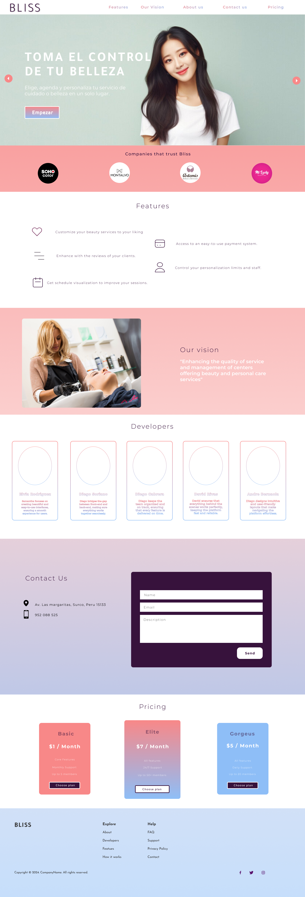
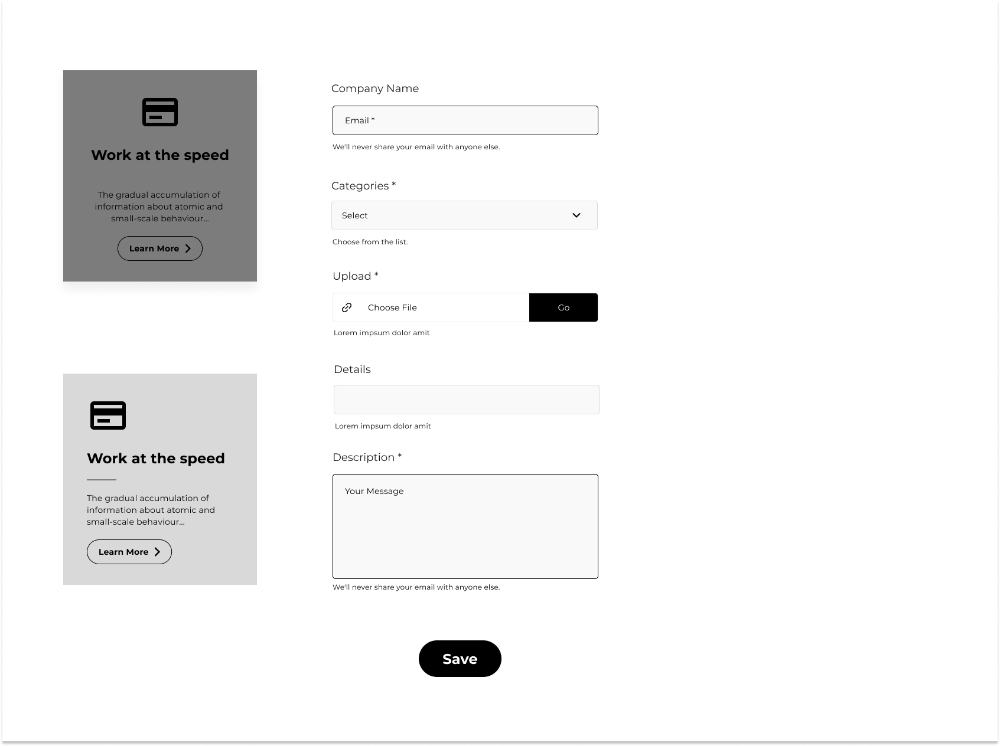
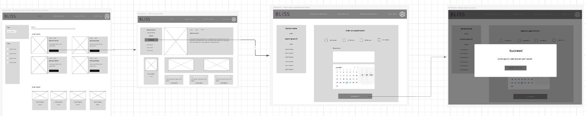
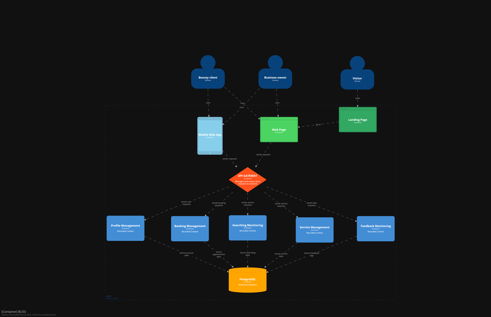
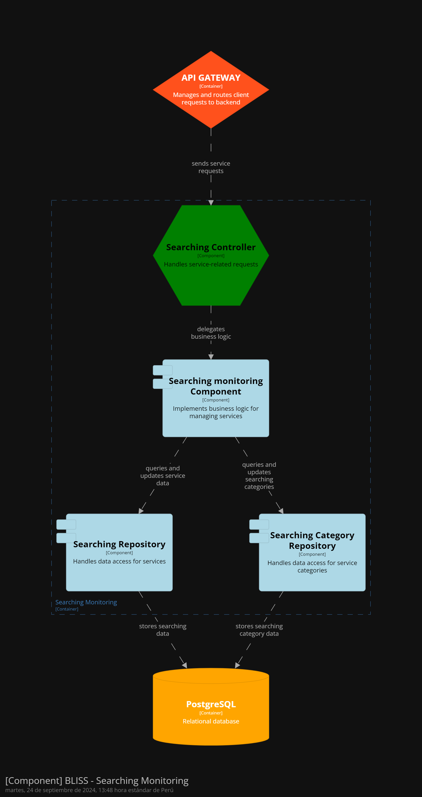
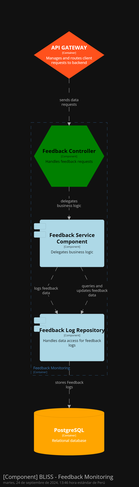

<p align="center">
  
</p>

# <center>Universidad Peruana de Ciencias Aplicadas</center>

###  <center>Ingeniería de Software</center>

###  <center>Ciclo 2024-02</center>

## <center>Desarrollo de Aplicaciones Open Source WS53</center>

###  <center>Docente: Juan Antonio Flores Moroco</center>

## <center>Informe del TB1</center>

###  <center>Startup: BeautyServices </center>

###  <center>Producto: Bliss </center>

##  <center>Integrantes

| Nombre |Código de alumno|
|:-------:|:----------:|
|André Arturo Bernaola Pérez|U202114192|
|Diego Ivan Cabrera Buitron|U20211B293|
|Elvia Marcela Rodriguez Villa|U20231C784|
|David Alejandro Rivas Sarango|U20191E831|
|Diego Martin Soriano Medrano|U202114793|

## <center>Agosto 2024</center>

## Registro de versiones del informe

| Versión   | Fecha     | Autor |Descripción de la modificación |
|-----------|-----------|-------|-------------                  |
| 1         |16/08/24|Rivas David|Creación del documento de trabajo en markdown|
| 2         |18/08/2024|Cabrera Diego|Desarrollo del capítulo 1 y Entrevistas|
| 3         |24/08/2024|Rivas David,  Rodriguez Elvia|Desarrollo de las US y Product Backlog|
|4          |25/08/2024|Bernaola Andre|Implementación de la Landing Page|
|5          |25/08/2024|Soriano Diego|Elaboracion de Diagrama de Clases|
|6          |28/08/2024|Soriano Diego|Elaboración de diagrama de base de datos|
|7          |28/08/2024|Rivas David|Capítulo 5|
|8          |30/08/2024|Cabrera Diego|Arreglo de entrevistas|
|9          |01/09/2024|Bernaola Andre|Elaboración de modelos C4|
|10          |04/09/2024|Rivas David|SEO and Meta tags|
|11          |07/09/2024| Rivas David|Puntos 4.7 y 4.8|
|12          |09/09/2024|Rodriguez Elvia, Rivas David|Implementación de Wireframes, Mockups y Prototipo|
|13          |18/09/2024|Rodriguez Elvia, Rivas David|Correcciones de Implementación de Wireframes, Mockups y Prototipo|
|14         |18/09/2024|Cabrera Diego|Corrección del capítulo 1 y Entrevistas|
|15          |18/08/2024|Soriano Diego|Correcciones en la elaboración de diagrama de base de datos|
|16          |23/09/2024|Bernaola, Andre|Actualización de Diagramas de Contexto|
|17          |23/09/2024|Rivas Sarango|Elaboracion de Capítulo V|

<br/>

## Project Report Collaboration Insights

URL de la organización del proyecto: [https://github.com/upc-opensource-g-bliss]

**TB1**
|Integrante|Tareas Asignadas|
|-|-|
|André Arturo Bernaola Pérez|Elaboración de Diagramas de clase, Implementación de Landing Page y Domain-Driven Software Architecture|
|Diego Ivan Cabrera Buitron|Entrevistas, Diseño del logo y Assumptions|
|Elvia Marcela Rodriguez Villa|Elaboración de User Stories, Diseño de Landing Page|
|David Alejandro Rivas Sarango|Elaboración de User Stories, Elaboración de Product Backlog, Elaboración de Capítulo 5|
|Diego Martin Soriano Medrano|Elaboración de Diagrama de base de datos|

**TB1 Github**


**TP**
|Integrante|Tareas Asignadas|
|-|-|
|André Arturo Bernaola Pérez|Actualización de Diagramas de Contexto|
|Diego Ivan Cabrera Buitron| |
|Elvia Marcela Rodriguez Villa|Actualización de Mockups y Prototipo|
|David Alejandro Rivas Sarango|Elaboración de Capítulo 5|
|Diego Martin Soriano Medrano|Elaboración de Diagrama de base de datos|

**TP Github**


***

## Contenido
1. [**Capítulo I: Introducción**](#capítulo-i-introducción) <br>
1.1. [***1.1.Startup Profile***](#11-startup-profile) <br>
1.1.1. [1.1.1. Descripción del startup](#111-descripción-del-startup) <br>
1.1.2.[1.1.2. Perfiles de los integrantes del equipo](#112-perfiles-de-los-integrantes-del-equipo) <br>
1.2. [***1.2. Solution Profile***](#12-solution-profile) <br>
1.2.1. [1.2.1.Antecedentes y Problemática](#121-antecedentes-y-problemática) <br>
1.2.2. [1.2.2.Lean UX Process](#122-lean-ux-process) <br>
1.2.2.1. [1.2.2.1.Lean UX Problem Statements](#1221-lean-ux-problem-statements) <br>
1.2.2.2. [1.2.2.2.Lean UX Assumptions](#1222-lean-ux-assumptions) <br>
1.2.2.3. [1.2.2.3.Lean UX Hypothesis Statements](#1223-lean-ux-hypothesis-statements) <br>
1.2.2.4. [1.2.2.4. Lean UX Canvas](#1224-lean-ux-canvas) <br>
1.3. [***1.3. Segmentos objetivo***](#13-segmentos-objetivo) <br>
2. [**2. Capítulo II: Requirements Elicitation & Analysis**](#capítulo-ii-requirements-elicitation-&-analysis) <br>
2.1. [***Competidores***](#21-competidores) <br>
2.1.1. [Análisis competitivo](#211-análisis-competitivo) <br>
2.1.2. [Estrategias y tácticas frente a competidores](#212-estrategias-y-tácticas-frente-a-competidores) <br>
2.2. [***Entrevistas***](#22-entrevistas) <br>
2.2.1. [Diseño de entrevistas](#221-diseño-de-entrevistas) <br>
2.2.2. [Registro de entrevistas](#222-registro-de-entrevistas) <br>
2.2.3. [Análisis de entrevistas](#223-análisis-de-entrevistas) <br>
2.3. [***Needfinding***](#23-needfinding) <br>
2.3.1. [User Personas](#231-user-personas) <br>
2.3.2. [User Task Matrix](#232-user-task-matrix) <br>
2.3.3. [User Journey Mapping](#233-user-journey-mapping) <br>
2.3.4. [Empathy Mapping](#234-empathy-mapping) <br>
2.3.5. [As-is Scenario Mapping](#235-as-is-scenario-mapping) <br>
2.4. [***Ubiquitous Language***](#24-ubiquitous-Language)
3. [**Capítulo III: Requirements Specification**](#capítulo-iii-requirements-specification) <br>
3.1. [***To-Be Scenario Mapping***](#31-to-be-scenario-mapping) <br>
3.2. [***User Stories***](#32-user-stories) <br>
3.3. [***Impact Mapping***](#33-impact-mapping) <br>
3.4. [***Product Backlog***](#34-product-backlog) <br>
4. [**Capítulo IV: Product Design**](#capítulo-iv-product-design) <br>
4.1. [***Style Guidelines***](#41-style-guidelines) <br>
4.1.1. [General Style Guidelines](#411-general-style-guidelines) <br>
4.1.2. [Web Style Guidelines](#412-web-style-guidelines) <br>
4.2. [***Information Architecture***](#42-information-architecture) <br>
4.2.1. [Organization Systems](#421-organization-systems) <br>
4.2.2. [Labeling Systems](#422-labeling-systems) <br>
4.2.3. [SEO Tags and Meta Tags](#423-seo-tags-and-meta-tags) <br>
4.2.4. [Searching Systems](#424-searching-systems) <br>
4.2.5. [Navigation Systems](#425-navigation-systems) <br>
4.3. [***Landing Page UI Design***](#43-landing-page-ui-design) <br>
4.3.1. [Landing Page Wireframe](#431-landing-page-wireframe) <br>
4.3.2. [Landing Page Mock-up](#432-landing-page-mock-up) <br>
4.4. [***Web Applications UX/UI Design***](#44-web-applications-uxui-design) <br>
4.4.1. [Web Applications Wireframes](#441-web-applications-wireframes) <br>
4.4.2. [Web Applications Wireflow Diagrams](#442-web-applications-wireflow-diagrams) <br>
4.4.3. [Web Applications Mock-ups](#443-web-applications-mock-ups) <br>
4.4.4. [Web Applications User Flow Diagrams](#444-web-applications-user-flow-diagrams) <br>
4.5. [***Web Applications Prototyping***](#45-web-applications-prototyping) <br>
4.6. [***Domain-Driven Software Architecture***](#46-domain-driven-software-architecture) <br>
4.6.1. [Software Architecture Context Diagram](#461-software-architecture-context-diagram) <br>
4.6.2. [Software Architecture Container Diagrams](#462-software-architecture-container-diagrams) <br>
4.6.3. [Software Architecture Components Diagrams](#463-software-architecture-components-diagrams) <br>
4.7. [***Software Object-Oriented Design***](#47-software-object-oriented-design) <br>
4.7.1. [Class Diagrams](#471-class-diagrams) <br>
4.7.2. [Class Dictionary](#472-class-dictionary) <br>
4.8. [***Database Design***](#48-database-design) <br>
4.8.1. [Database Diagram](#481-database-diagram) <br>
5. [**Capítulo V: Product Implementation, Validation & Deployment**](#capítulo-v-product-implementation-validation-&-deployment) <br>
5.1. [***Software Configuration Management***](#51-software-configuration-management) <br>
5.1.1. [Software Development Environment Configuration](#511-software-development-environment-configuration) <br>
5.1.2. [Source Code Management](#512-source-code-management) <br>
5.1.3. [Source Code Style Guide & Conventions](#513-source-code-style-guide-&-conventions) <br>
5.1.4. [Software Deployment Configuration](#514-software-deployment-configuration) <br>
5.2. [***Landing Page, Services & Applications Implementation***](#52-landing-page-services-&-applications-implementation) <br>
5.2.1. [Sprint 1](#521-sprint-1) <br>
5.2.1.1. [Sprint Planning 1](#5211-sprint-planning-1) <br>
5.2.1.2. [Sprint Backlog 1](#5212-sprint-backlog-1) <br>
5.2.1.3. [Development Evidence for Sprint Review](#5213-development-evidence-for-sprint-review) <br>
5.2.1.4. [Testing Suite Evidence for Sprint Review](#5214-testing-suite-evidence-for-sprint-review) <br>
5.2.1.5. [Execution Evidence for Sprint Review](#5215-execution-evidence-for-sprint-review) <br>
5.2.1.6. [Services Documentation Evidence for Sprint Review](#5216-services-documentation-evidence-for-sprint-review) <br>
5.2.1.7. [Software Deployment Evidence for Sprint Review](#5217-software-deployment-evidence-for-sprint-review) <br>
5.2.1.8. [Team Collaboration Insights during Sprint](#5218-team-collaboration-insights-during-sprint) <br>
5.2.2. [Sprint 2](#522-sprint-2) <br>
5.2.2.1. [Sprint Planning 2](#5221-sprint-planning-2) <br>
5.2.2.2. [Sprint Backlog 2](#5222-sprint-backlog-2) <br>
5.2.2.3. [Development Evidence for Sprint Review](#5223-development-evidence-for-sprint-review) <br>
5.2.2.4. [Testing Suite Evidence for Sprint Review](#5224-testing-suite-evidence-for-sprint-review) <br>
5.2.2.5. [Execution Evidence for Sprint Review](#5225-execution-evidence-for-sprint-review) <br>
5.2.2.6. [Services Documentation Evidence for Sprint Review](#5226-services-documentation-evidence-for-sprint-review) <br>
5.2.2.7. [Software Deployment Evidence for Sprint Review](#5227-software-deployment-evidence-for-sprint-review) <br>
5.2.2.8. [Team Collaboration Insights during Sprint](#5228-team-collaboration-insights-during-sprint) <br>
5.2.3. [Sprint 3](#532-sprint-3) <br>
5.2.3.1. [Sprint Planning 3](#5231-sprint-planning-2) <br>
5.2.3.2. [Sprint Backlog 3](#5232-sprint-backlog-2) <br>
5.2.3.3. [Development Evidence for Sprint Review](#5233-development-evidence-for-sprint-review) <br>
5.2.3.4. [Testing Suite Evidence for Sprint Review](#5234-testing-suite-evidence-for-sprint-review) <br>
5.2.3.5. [Execution Evidence for Sprint Review](#5235-execution-evidence-for-sprint-review) <br>
5.2.3.6. [Services Documentation Evidence for Sprint Review](#5236-services-documentation-evidence-for-sprint-review) <br>
5.2.3.7. [Software Deployment Evidence for Sprint Review](#5237-software-deployment-evidence-for-sprint-review) <br>
5.2.3.8. [Team Collaboration Insights during Sprint](#5238-team-collaboration-insights-during-sprint) <br>
5.3. [***Validation Interviews***](#53-validation-interviews) <br>
5.3.1.[Diseño de Entrevistas](#531-diseño-de-entrevistas) <br>
5.3.2.[Registro de Entrevistas](#532-registro-de-entrevistas) <br>
5.3.3.[Evaluaciones según Heurísticas](#533-evaluaciones-según-heurísticas) <br>
5.4. [***Video About-the-Product***](#54-video-about-the-product) <br>
6. [**Conclusiones**](#conclusiones) <br>
7. [**Bibliografía**](#bibliografía) <br>
8. [**Anexos**](#anexos)

<br/>

## Students Outcomes

| Criterio específico | Acciones realizadas | Conclusiones |
|---------------------|---------------------|--------------|
|Comunica oralmente con efectividad a diferentes rangos de audiencia.| **André Arturo Bernaola Pérez** <br> **TB1** <br> En esta entrega, expliqué a mi equipo las decisiones arquitectónicas del modelo C4, lo que facilitó la comprensión del enfoque adoptado. Además, implementé retroalimentación activa para mejorar tanto las User Stories como el diagrama de base de datos, integrando de manera efectiva las sugerencias del equipo para optimizar la calidad del proyecto. <br>**TP** Lideré al equipo en el diseño de los bounded context, organizando tareas y asegurando la alineación arquitectónica. Además, supervisé la integración de las propuestas para garantizar la calidad del trabajo. <br>**TB2** <br> **Diego Ivan Cabrera Buitron** <br> **TB1** <br> Para esta entrega identifiqué el problema a solucionar y así pude realizar los assumptions y las entrevistas de manera concreta. <br>**TP** -Para esta entrega logré identificar los bounded context para poder ejecutar el booking component y desplegarlo.<br>**Elvia Marcela Rodriguez Villa** <br> **TB1** En la presente actividad he colaborado con el diseño y elaboración de productos como mockups y prototipos, por ello ha sido necesaria una comunicación constante con mis compañeros de trabajo para acordar decisiones e incorporar opiniones a fin de elaborar un producto de acuerdo a las necesidads de un usuario final. <br>**TP** En esta actividad, participé en discusiones con mis compañeros para asegurar que todos estuvieran al tanto de las decisiones tomadas. Mantuve una comunicación constante sobre los avances del equipo y consulté al profesor para recibir retroalimentación sobre nuestras propuestas, lo que nos ayudó a mejorar nuestro enfoque. Esta interacción con diferentes audiencias demostró mi capacidad para comunicarme de manera efectiva y colaborar en equipo. <br>**David Alejandro Rivas Sarango** <br> **TB1** En esta entrega diseñe la aplicación web de acuerdo a los sectores entrevistados, nuestros ahora clientes deben sentirse cómodos con el servicio que les proporcionamos y estamos al tanto de la retroalimentación que se nos brinda para una mejora continua. <br>**TP** En esta entrega realice ls diseños del home y su codificación en Angular que me permitieron saber el orden de flujo que recibe un cliente cuando requiere un servicio de belleza. <br>**TB2** En esta tercera entrega la principal actividad fue elaborar el backend del proyecto, acordando entre los miembros del equipo los métodos y entidades a crear y como se conectarían, personalmente, me encargué de payments que se relaciona con la tala cliente y reserva. <br>**Diego Martin Soriano Medrano** <br> **TB1** <br> Para la primera entrega del trabajo, realicé diversas actividades, entre las cuales destaco la habilidad para comunicar efectivamente mis ideas y consideraciones sobre el desarrollo del proyecto a mis compañeros de grupo. <br>**TP**  <br>**TB2**<br> Se integraron nuevas estrategias de comunicación para que todos puedan comunicar sus necesidades según las tereas y actividades asignadas para poder sobrellevar el desarrollo del trabajo. <br> | Se ha demostrado una clara comprensión y aplicación de las técnicas y herramientas necesarias, lo que ha permitido una integración coherente de los distintos componentes del proyecto. La capacidad para adaptar y mejorar las User Stories y el diagrama de base de datos ha optimizado la calidad y precisión del trabajo realizado. En general, el equipo ha establecido una base sólida para las siguientes etapas del proyecto, evidenciando un trabajo colaborativo y bien documentado que facilita la continuación del desarrollo con una visión clara y alineada. |
|Comunica por escrito con efectividad a diferentes rangos de audiencia|**André Arturo Bernaola Pérez** <br> **TB1** <br> Al realizar los diagramas del modelo C4 para el trabajo, justifiqué la arquitectura y los patrones empleados de manera detallada para asegurar una comprensión clara de las decisiones técnicas. <br> **TP** Implementé estrategias de gestión que facilitaron la comunicación y el flujo de trabajo eficiente, logrando la entrega a tiempo y una integración coherente con el resto del proyecto. <br>  **Diego Ivan Cabrera Buitron** <br> **TB1** <br> Al identificar el problema, en la realización de las entrevistas, tomé muy en cuenta las necesidades de nuestro público objetico para poder analizarlas. <br>**TP** La identificar las funcionalidades de los servicios, pude comprender las necesidades de nuetro público objetivo y qué se requiere para poder realizarlas.<br>**Elvia Marcela Rodriguez Villa** <br> **TB1** <br> Las decisiones respecto al diseño visual e interactivo de los mockups y prototipos fueron debidamente justificados de acuerdo a los parámetros y heurísticas de diseño UX, por lo mencionado, he incluido información escrita que especifica la razón detras del diseño visual y estructura de los productos mencionados. <br>**TP**En esta actividad, participé en discusiones con mis compañeros para asegurar que todos estuvieran al tanto de las decisiones tomadas. Mantuve una comunicación constante sobre los avances del equipo y consulté al profesor para recibir retroalimentación sobre nuestras propuestas, lo que nos ayudó a mejorar nuestro enfoque. Esta interacción con diferentes audiencias demostró mi capacidad para comunicarme de manera efectiva y colaborar en equipo. <br>**David Alejandro Rivas Sarango** <br> **TB1** Para esta entrega planteamos grupalmente las pautas que nos permitirán trabajar ordenadamente durante los sprints, siendo la documentación lo primero que realizamos, en mi caso realize las historias de usuario, que son vitales para los requisitos que debe cumplir el proyecto.<br>**TP** En esta entrega realice ls diseños del home y su codificación en Angular que me permitieron saber el orden de flujo que recibe un cliente cuando requiere un servicio de belleza. <br> **TB2** Nos encargamos de documentar cada actividad que realizabamos, mi trabajo principal fue realizar la presentación del producto final al usuario sus opiniones sobre el producto Front ya elaborado y desplegado. <br>**Diego Martin Soriano Medrano** <br> **TB1** <br> Para llevar a cabo el trabajo de manera organizada, se emplearon diversos canales de comunicación, a través de los cuales fue necesario transmitir por escrito nuestras consideraciones sobre partes específicas del proyecto. <br> **TP** <br> Para llevar a cabo el trabajo de manera organizada, reconsidero el uso canales de comunicación, para poder llevar a cabo el desarrollo del trabajo de forma fluida y para que todos puedan desarrollar las partes asignadas del proyecto. <br> | El equipo ha establecido una sólida base en comunicación escrita, logrando documentar claramente los diagramas del modelo C4, las historias de usuario y el diseño UX. Esta documentación ha facilitado la coordinación y comprensión entre los miembros del equipo, sentando una base efectiva para el desarrollo continuo del proyecto.|

***

<br/>

## Capítulo I: Introducción

### 1.1. Startup Profile

#### 1.1.1. Descripción del startup

<p style="text-align: justify">
Las empresas de belleza y del cuidado personal están creciendo a un ritmo acelerado, especialmente el sector de tratamientos faciales y dermocosmética, que ha crecido casi 8 veces en los últimos 10 años. Los centros de belleza están diseñados para satisfacer las necesidades de la clase media emergente de 2019, la cual está creciendo. 

La importancia del servicio personalizado al usuario es evidente en este contexto. Los salones de belleza en Perú, que crecen cada vez más, luchan por diferenciarse en un mercado donde la oferta aún está polarizada e informal. Las pequeñas empresas familiares son un buen lugar para empezar, son un poco más moldeables y tienen un estilo de gestión diferente y poco complejo. La principal ventaja que tienen estos establecimientos es que los servicios suelen ser bastante personalizables de acuerdo a las necesidades específicas de cada cliente. Los datos del Inei muestran que el 75.6% de los salones de belleza están dirigidos por mujeres. 

Para aprovechar al máximo la alta competitividad y el constante crecimiento de estos establecimientos, es fundamental elevar la calidad del servicio y prestar atención a la forma en que se gestiona la atención a los clientes, con un mayor énfasis en ofrecer experiencias de usuario personalizadas. No sólo aumentará la satisfacción del cliente, sino que también ayudará a formalizar y "profesionalizar" la industria de la belleza, permitiéndoles establecer relaciones más sólidas y duraderas con sus clientes.
</p>

<br/>

**Misión**: Ofrecer un servicio de belleza y cuidado personal altamente personalizado, centrado en satisfacer las necesidades y expectativas de cada cliente.

**Visión**: Ser los referente en la industria de la belleza y cuidado personal, reconocidos por brindar experiencias personalizadas, contribuyendo al crecimiento y formalizar este sector.

##### Logotipo de la Startup:


##### Logotipo del producto:

 <br>

#### 1.1.2. Perfiles de los integrantes del equipo

|Integrante |Descripción|
|-----------|-----------|
| |Mi nombre es **André Arturo Bernaola Pérez**, estoy cursando la carrera de Ingeniería de Software, me gusta jugar videojuegos y aprender en mis momentos libre. Aspiro a trabajar como desarrollador fullstack. |
||**Diego Ivan Cabrera Buitron** <br> Mi nombre es **Diego Cabrera**, estoy cursando la carrera de Ingeniería de Software, me considero una persona responsable y perseverante. Al culminar mi carrera quiero especializarme en el sector de la ciberseguridad|
||**David Alejandro Rivas Sarango** <br> Mi nombre es **David Rivas**, actualmente estoy cursando la carrera de Ingeniería de Software en la UPC. Soy una persona honesta y responsable. Me interesa el área de Data Science, por esto estoy siguiendo cursos de capacitacion en SQL y Python.|
||**Elvia Marcela Rodríguez Villa** <br> Soy Elvia Rodríguez, actual estudiante universitaria y egresada de Laboratoria. Soy actual embajadora del programa de estudiantes de Microsoft y fui participante de diversos voluntariados y Hackathons cómo Ciencia en tu Comunidad y el Laboratorio de Emprendimientos de SENAJU. Asimismo, soy maestra de inglés y suelo incorporar mis conocimientos de programación de interfaces de usuario en mi labor educativa. |
||**Diego Martin Soriano Medrano** <br/> Estudio la carrera de ingeniería de software. Me considero una persona creativa y paciente. Tengo conocimiento en el uso de diferentes herramientas informáticas y lenguajes de programación. que ayudan a realizar distintos tipos de trabajo y a resolver problemas. Parte de mis habilidades blandas es siempre tomar en cuenta la opinión de mis compañeros, lo cual me facilita el poder trabajar en equipo, para agilizar diferentes actividades.|

### 1.2. Solution Profile
#### 1.2.1. Antecedentes y Problemática
#### 5W
##### What (Qué)
###### ¿Cuál es el problema?
El problema principal que enfrentan los clientes en la industria de la belleza es la dificultad para reservar citas de servicios de cuidado personal de manera eficiente y conveniente. Muchos clientes a menudo se encuentran frustrados, ya que el proceso actual es engorroso y poco transparente, lo que provoca una experiencia negativa. Esta situación no solo afecta a los usuarios que buscan servicios como manicura, pedicura, y tratamientos faciales, sino también a las pequeñas y medianas empresas (MYPES) del sector, que luchan por atraer y retener clientes en un mercado cada vez más competitivo.

##### When (Cuando)
###### ¿Cuándo sucede el problema?
El problema surge cada vez que un cliente desea reservar un servicio de belleza, pero se encuentra con obstáculos en el proceso de reserva. Esto es especialmente problemático en días de alta demanda, como los fines de semana o durante ocasiones especiales, cuando los clientes buscan acceder a servicios rápidamente. En estos momentos, la presión por encontrar disponibilidad y coordinar citas se intensifica, lo que puede llevar a la frustración y a la insatisfacción general con el servicio.

##### Where (Dónde)
###### ¿Dónde surge el problema?
El problema se presenta en la ciudad de Lima, un área donde el mercado de servicios de belleza está en constante crecimiento. Sin embargo, la falta de un sistema formal que facilite la conexión entre proveedores y clientes limita el acceso a opciones confiables. Actualmente, las reservas se gestionan principalmente a través de llamadas telefónicas o mensajes informales, como WhatsApp, lo que genera confusión y falta de claridad en la disponibilidad de servicios.

##### Who (Quién)
###### ¿Quiénes están involucrados?
Los afectados por este problema son principalmente dos grupos. Primero, los clientes potenciales, que son en su mayoría mujeres de entre 20 y 45 años, pertenecientes a los sectores socioeconómicos B-C en Lima, que desean acceder a servicios de belleza de manera rápida y confiable. Este grupo se encuentra frecuentemente desilusionado al no poder encontrar opciones adecuadas que se ajusten a sus necesidades y horarios. En segundo lugar, los proveedores de servicios de belleza, que incluyen dueños de MYPES y estilistas, enfrentan desafíos significativos para atraer nuevos clientes y gestionar sus citas de manera eficaz debido a la informalidad del sector.

##### Why (Por qué)
###### ¿Cuál es la causa del problema?
Las causas del problema son multifacéticas. En primer lugar, la falta de una plataforma centralizada que conecte de manera eficiente a clientes y proveedores limita las opciones disponibles para los usuarios. Además, la gestión manual de reservas, que es común en el sector, incrementa la posibilidad de errores y dificultades en la coordinación de horarios. La alta informalidad en el sector también contribuye a la desconfianza de los clientes, quienes pueden sentirse inseguros al seleccionar un proveedor sin garantías de calidad.

#### 2H
##### How (Cómo)
###### ¿En qué condiciones nuestros clientes usan el producto?
Los clientes y proveedores suelen gestionar las reservas a través de canales no especializados, como llamadas telefónicas y mensajes de WhatsApp. Esta dependencia en métodos informales no solo conduce a la desorganización, sino que también crea incertidumbre respecto a la disponibilidad de servicios. Por ejemplo, un cliente que llama para hacer una reserva puede no recibir una respuesta inmediata, lo que lo lleva a buscar alternativas, mientras que un proveedor puede perder oportunidades de negocio por no poder confirmar citas de manera oportuna.

##### How much (Cuánto)
###### ¿Cuál es la magnitud del problema?
La magnitud del problema es alarmante. Según la Asociación Peruana de Empresarios de la Belleza (2022), un 40% de las peluquerías y centros de belleza se vieron obligados a cerrar durante la pandemia, y solo un 30% de los que permanecen operando siguen funcionando de manera formal. Esta situación resalta la necesidad urgente de abordar la falta de formalidad y confianza en el sector, ya que la insatisfacción de los clientes y la ineficiencia en la gestión de las reservas afectan directamente la viabilidad de estas pequeñas empresas.

#### 1.2.2. Lean UX Process

A continuación, aplicaremos el proceso Lean UX en nuestro trabajo para optimizar el desarrollo de nuestra solución. Esta metodología nos permitirá centrarnos en la colaboración y la validación continua, asegurando que nuestro producto final responda efectivamente a las necesidades de nuestros usuarios.

<br/>

##### 1.2.2.1. Lean UX Problem Statements

**Aspectos:**

- Dominio (Domain): Personas que frecuentan servicios de belleza.

- Segmento de clientes (Customer Segment): Clientes mujeres jovenes y adultas.

- Puntos de dolor (Pain Points): Clientas habituales de centros de belleza tienen dificultades al intentar localizar establecimientos confiables y al realizar reservas de citas, lo que genera frustración y afecta su experiencia general y la satisfacción con los servicios de belleza.

- Brecha (Gap): Existen pocas plataformas que ofrezcan las herramientas necesarias y cumplan con los requerimientos para satisfacer las demandas de clientas en la búsqueda de salones de belleza. Las soluciones disponibles no facilitan adecuadamente la localización de establecimientos, la selección y modificación de servicios, la gestión de reservas, ni la comunicación efectiva entre las clientas y los salones de belleza.

- Visión/Estrategia (Vision/Strategy): Desarrollar una aplicación que integre las herramientas esenciales y cumpla con los requisitos necesarios, permitiendo a las clientas acceder y reservar de manera fácil y rápida los servicios de belleza que requieran.

- Segmento inicial (Initial Segment): Mujeres en el rango de edad de 20 a 45 años, del sector socioeconómico B-C que residen en la ciudad de Lima.

<br>

**Problem Statement:**

En la escena de personas que frecuentan servicios de belleza, clientas mujeres jovenes y adultas tienen dificultades al intentar localizar establecimientos confiables y al realizar reservas de citas, lo que genera frustración y afecta su experiencia general y la satisfacción con los servicios de belleza. Actualmente, hay una escasez de plataformas que ofrezcan las herramientas necesarias y cumplan con los requerimientos para satisfacer las demandas de clientas en la búsqueda de salones de belleza. Las soluciones disponibles no facilitan adecuadamente la localización de establecimientos, la selección y modificación de servicios, la gestión de reservas, ni la comunicación efectiva entre las clientas y los salones de belleza. Nuestra visión es desarrollar una aplicación que integre las herramientas esenciales y cumpla con los requisitos necesarios, permitiendo a las clientas acceder y reservar de manera fácil y rápida los servicios de belleza que requieran. Comenzaremos enfocándonos en mujeres en el rango de edad de 20 a 45 años, del sector socioeconómico B-C que residen en la ciudad de Lima.

<br>

**Aspectos:**

- Dominio (Domain): La Micro y Pequeña Empresa (MYPE)

- Segmento de clientes (Customer Segment): Dueños de negocios de Belleza

- Puntos de dolor (Pain Points): Negocios de belleza enfrentan dificultades en la gestión de la oferta de sus servicios, así como en la atención a las reservas de sus clientes, estos obstaculos pueden resultar en malas experiencia para sus clientes, ineficiencia operativa y, en última instancia, afectar la rentabilidad del negocio.

- Brecha (Gap): Existen pocas plataformas que ofrezcan las herramientas y funcionalidades necesarias para que los dueños de negocios de belleza puedan ofrecer sus servicios de manera sencilla y rápida. Además, estas plataformas no facilitan una gestión eficiente de las reservas de citas, ni permiten realizar cambios en los servicios ofrecidos a petición de los clientes. 

- Visión/Estrategia (Vision/Strategy): Desarrollar una aplicación que integre las herramientas necesarias para la publicación sencilla de servicios de belleza y que cumpla con los requisitos para una gestión rápida y eficiente de las citas solicitadas, que a su vez permita la comunicación efectiva entre los dueños de negocios de belleza y sus clientas.

- Segmento inicial (Initial Segment): Dueños de de negocios que brindan servicios de cuidado de belleza que funcionan en la ciudad de Lima.

<br>

**Problem Statement:**

En el ámbito de la Micro y Pequeña Empresa (MYPE), dueños de negocios de Belleza enfrentan dificultades en la gestión de la oferta de sus servicios, así como en la atención a las reservas de sus clientes, estos obstaculos pueden resultar en malas experiencia para sus clientes, ineficiencia operativa y, en última instancia, afectar la rentabilidad del negocio. Actualmente, existen pocas plataformas que ofrezcan las herramientas y funcionalidades necesarias para que los dueños de negocios de belleza puedan ofrecer sus servicios de manera sencilla y rápida. Además, estas plataformas no facilitan una gestión eficiente de las reservas de citas, ni permiten realizar cambios en los servicios ofrecidos a petición de los clientes. Nuestra visión es desarrollar una aplicación que integre las herramientas necesarias para la publicación sencilla de servicios de belleza y que cumpla con los requisitos para una gestión rápida y eficiente de las citas solicitadas, que a su vez permita la comunicación efectiva entre los dueños de negocios de belleza y sus clientas. Comenzaremos enfocándonos en dueños de negocios que brindan servicios de cuidado de belleza que funcionan en la ciudad de Lima.

<br>

##### 1.2.2.2. Lean UX Assumptions

Creo que mis clientes necesitan saber cómo y dónde acceder a servicios de manicure, pedicure y tratamientos faciales a domicilio de manera conveniente y segura. 

Estas necesidades se pueden resolver con una aplicación que conecte a clientes con profesionales de belleza verificados, ofreciendo una amplia gama de servicios personalizados y garantizando medidas de seguridad y calidad. 

Asumimos que el 80% de los clientes que reservan servicios de belleza valoran más la conveniencia de una plataforma en línea y la confianza en la seguridad del servicio que la experiencia en un salón tradicional. Validaremos esta suposición mediante encuestas de satisfacción y análisis de uso de la plataforma. 

Asumimos que el 70% de los clientes valorarán la facilidad de uso de la plataforma para realizar reservas, y que un proceso de reserva simplificado aumentará la tasa de conversión en un 15%. Mediremos esto a través del tiempo promedio de reserva y la cantidad de reservas completadas. 

El cliente también puede adquirir estos beneficios adicionales como descuentos por lealtad, recomendaciones personalizadas y acceso a productos exclusivos. 

Asumimos que el 50% de los nuevos usuarios se registrarán a través de programas de referidos y marketing digital, y que estos usuarios serán más propensos a realizar reservas en comparación con los usuarios que lleguen por otros medios. Validaremos esto mediante análisis de origen de tráfico y tasas de conversión de cada medio. 

Mi competencia principal en el mercado serán aplicaciones similares que ofrecen servicios de belleza a domicilio, salones de belleza locales y plataformas de reserva en línea. Los venceremos debido a nuestra estrategia de enfoque en la seguridad y calidad, personalización de servicios, y programas de fidelización. 

Asumimos que el 60% de los clientes potenciales podrían tener dudas respecto a la seguridad de contratar servicios a domicilio. Validaremos esta suposición implementando una encuesta de confianza en el proceso de registro, así como un piloto con un sistema de verificación de profesionales que incluya feedback de clientes sobre su sensación de seguridad. 

Asumimos que implementar procesos de verificación de profesionales y mostrar claramente las certificaciones de los estilistas incrementará la confianza de los clientes en un 30%. Mediremos este impacto mediante encuestas de confianza y un aumento en el uso del servicio de reservas a domicilio.

###### 1.2.2.3. Lean UX Hypothesis Statements

* **Hypothesis Statement 01:**
  
  **Creemos que** ofrecer una amplia gama de servicios de cuidado y belleza a través de nuestra aplicación para usuarios que buscan comodidad y conveniencia ayudará a que estos puedan reservar citas fácilmente y acceder a servicios de calidad.

  **Sabremos** que hemos tenido éxito
  
  **Cuando** se vea un aumento significativo en la cantidad de reservas realizadas a través de nuestra aplicación, así como una mayor retención de clientes satisfechos.

* **Hypothesis Statement 02:**
  
**Creemos que** implementar un sistema de verificación de estilistas calificados y negocios confiables garantizará la calidad de las citas reservadas y ayudará a que nuestros usuarios se sientan seguros al reservar servicios de cuidado y belleza.

**Sabremos** que hemos tenido éxito
  
  **Cuando** se reciban comentarios positivos de los usuarios acerca de la garantía y la buena calidad del servicio recibido, así como cuando veamos un mayor tráfico en la aplicación.

* **Hypothesis Statement 03:**
  
  **Creemos que** establecer colaboraciones estratégicas con salones de belleza, estilistas, marcas de belleza relevantes, y ofrecer programas de referidos atractivos ayudará a que adquiramos clientes de manera efectiva y aumentemos la visibilidad de nuestra aplicación.

**Sabremos** que hemos tenido éxito

  **Cuando** observemos un aumento en la adquisición de clientes durante los períodos de nuestras colaboraciones, así como una mayor interacción de los usuarios con la aplicación a través de programas de referidos.

* * **Hypothesis Statement 04:**
    
**Creemos que** aumentaremos la confianza del usuario y fomentaremos la lealtad a nuestra marca si incorporamos funciones de calificación y reseñas para que los usuarios puedan evaluar la calidad de los servicios recibidos y compartir sus experiencias con otros usuarios.

**Sabremos** que hemos tenido éxito

**Cuando** observemos un aumento significativo en la participación de los usuarios en la función de calificación y reseñas, así como un incremento en la cantidad de reseñas positivas y una mejora general en la percepción de la calidad de los servicios por parte de los usuarios.

###### 1.2.2.4. Lean UX Canvas

<p align="center">
    
</p>

<br/>

### 1.3. Segmento objetivo

1. Clientas aficionadas al embellecimiento: Este segmento esta compuesto por mujeres en el rango de edad de 20 a 45 años, del sector socioeconómico B-C que residan en Lima.

2. MYPES: Este segmento esta compuesto por dueños de negocios que brindan servicios de cuidado y belleza que funcionan en Lima.

<br/>

## Capítulo II: Requirements Elicitation & Analysis
### 2.1. Competidores

Identificación y descripción 

<br/>

#### 2.1.1. Análisis Competitivo

||Bliss <br>|Treatwell |SimplyBook |Booksy <br>|
|:-:|:-:|:-:|:-:|:-:|
|**Overview**|Bliss es una plataforma de citas y reservas, enfocadas en la búsqueda, comparación y programación del servicio de negocios de belleza y bienestar|Treatwell es una plataforma de reserva de servicios de belleza y bienestar en Europa.|SimplyBook.me es una plataforma de programación en línea para una variedad de negocios, que facilita la gestión de citas y reservas.|Booksy es una aplicación de reserva de citas enfocada en la industria de belleza y bienestar, que facilita a los usuarios la búsqueda y reserva de servicios de peluquería, estética y cuidado personal.|
|**Ventajas Competitivas**|Ofrece una interfaz intuitiva para su facilidad de uso, disponibilidad las 24 horas del día, gestión centralizada de citas con la finalidad de poder ver y gestionar todas sus citas desde la plataforma.|Ofrece conveniencia alpermitir a los clientes reservar servicios de belleza en línea y acceso a una amplia gama de salones y tratamientos.|Ofrece conveniencia al permitir a los clientes reservar citas en línea las 24 horas del día y acceso a funciones como recordatorios automáticos y pagos en línea.|Ofrece conveniencia al permitir a los clientes encontrar y reservar servicios de belleza en línea las 24 horas del día, así como acceder a información detallada sobre profesionales, servicios y precios.|
|**Mercado Objetivo**|Las micro y pequeñas empresas enfocadas en la industria de belleza y bienestar que estén interesadas en publicar sus servicios en una plataforma online, también las mujeres que busquen gestionar y pedir este servicio.|Usuarios urbanos interesados en servicios de belleza y bienestar en Europa.|Negocios de servicios que requieren programación de citas, como peluquerías, salones de belleza, consultorios médicos, centros de fitness y más. |Usuarios que buscan servicios de belleza y bienestar, así como profesionales de la industria de belleza y cuidado personal.|
|**Estrategias de Marketing**|Fomentar la participación en nuestra plataforma al permitir que los clientes reaccionen y compartan los servicios, al igual que hacer colaboraciones con las empresas de esta industria para un marketing digital.|Marketing digital, colaboraciones con salones de belleza, promociones y programas de fidelización.|Marketing digital, promoción en redes sociales, colaboraciones con negocios afines y programas de referidos.|Marketing digital, promoción en redes sociales, colaboraciones con negocios afines y programas de referidos.|Marketing digital dirigido a usuarios finales y a profesionales, promoción en redes sociales, colaboraciones con salones y eventos de la industria.|
|**Productos & Servicios**|Gestión de citas y reserva a servicios del sector belleza y bienestar, permitir transacciones de pago en línea, interfaz intuitiva para presentar los servicios que ofrece su empresa y sección de comentarios para que los clientes muestres y opiniones y las empresas puedan comunicarse con sus clientes.|Reserva de citas para servicios de peluquería, belleza y bienestar|Plataforma de programación en línea con funciones como calendarios, recordatorios de citas, gestión de personal y pagos en línea.|Aplicación móvil y plataforma en línea que permite la reserva de citas, gestión de agendas y comunicación entre clientes y profesionales.|
|**Precios & Costos**|Las empresas deberán pagar en nuestra plataforma, será un porcentaje bajo por cada reserva o cita pagada, sin embargo, para los que buscan un servicio la aplicación será gratuita.|Varían según el servicio y la ubicación del salón.|Varían según el plan y las características seleccionadas, con opciones de suscripción mensual o anual.|Varían según el plan y las características seleccionadas para los profesionales, mientras que para los usuarios finales, la aplicación es gratuita.|
|**Canales de distribución (WEB y/o Móvil)**|Plataforma en línea y aplicación móvil.|Plataforma en línea y aplicación móvil.|Plataforma en línea y aplicación móvil.|Aplicación móvil disponible en tiendas de aplicaciones y plataforma en línea.|
|**Fortalezas**|Función de filtrado de servicios de belleza según precio, lugar, valorados por la comunidad, entre otros. Interfaz intuitiva para que las empresas puedan mostrar a los usuarios sus servicios. Herramientas para permitir a la comunidad expresarse y recomendar los servicios de su agrado.|Amplia red de salones asociados, conveniencia de reserva en línea, variedad de servicios.|Interfaz intuitiva, amplia personalización, adaptabilidad a diferentes industrias y tipos de negocios.|Especialización en la industria de belleza, interfaz intuitiva, amplia red de profesionales y servicios.|
|**Debilidades**|Dependencia por los comentarios y puntajes de los usuarios, pues sin ellos no podremos filtrar los mejores servicios. Las empresas que paguen por nuestro servicio posiblemente no puedan seguir nuestra curva de aprendizaje para todas las|Dependencia de la disponibilidad de los salones asociados, posibles problemas de calidad del servicio.|Posible curva de aprendizaje para usuarios nuevos, limitaciones en funciones avanzadas en planes más básicos.|Dependencia de la disponibilidad de los profesionales, posibles problemas de calidad del servicio.|
|**Oportunidades**|Existen usuarios interesados en plataformas similares. Muchas empresas pequeñas no usan estos medios, pero están interesados. Colaboraremos con ellos para llegar al público objetivo. Facilidad al expandir nuestros servicios pues es digital. Después de la pandemia las plataformas digitales ganaron confianza.|Expansión a nuevos mercados, introducción de nuevos servicios, mejorar la experiencia del usuario.|Expansión a nuevos mercados, mejora continua de características y funciones, colaboraciones estratégicas con otros servicios.|Expansión a nuevos mercados, introducción de nuevas características y servicios, colaboraciones estratégicas con marcas de belleza.|
|**Amenazas**|Competiremos con aplicaciones ya establecidas. Podría haber problemas a la seguridad de los datos y física de las empresas al cualquier usuario pedir sus servicios. |Competencia de otras plataformas similares, cambios en las preferencias de los consumidores, problemas regulatorios.|Competencia de otras plataformas de programación en línea, cambios en las necesidades y expectativas de los usuarios, problemas de seguridad de datos.|Competencia de otras aplicaciones de reserva de citas, cambios en las preferencias de los usuarios, problemas de calidad del servicio por parte de los profesionales.|

#### 2.1.2. Estrategias y tácticas frente a competidores

**Estrategias:**

* Ampliación de servicios: Ofrecer una amplia gama de servicios de manicura, pedicura y tratamientos faciales, asegurando que cubran las necesidades de los usuarios y proporcionen una experiencia de belleza completa en el hogar.

* Verificación de profesionales: Implementar un riguroso proceso de verificación para los estilistas y negocios asociados, garantizando la calidad y confiabilidad de los servicios ofrecidos a través de la plataforma.

* Enfoque en la comodidad del usuario: Centrarse en la conveniencia y la facilidad de uso de la aplicación para mejorar la experiencia del usuario y fomentar la repetición de negocios.

**Tácticas:**

* Optimización de la interfaz de usuario: Mejorar la navegación y la búsqueda dentro de la aplicación para que los usuarios puedan encontrar fácilmente servicios disponibles que se ajusten a sus horarios y preferencias.

* Sistema de calificación y comentarios: Implementar un sistema de calificación y comentarios para que los usuarios puedan evaluar la calidad de los servicios recibidos, lo que ayudará a construir confianza y transparencia en la plataforma.

* Programación flexible: Permitir a los usuarios seleccionar franjas horarias específicas y preferencias de estilistas al reservar citas, ofreciendo opciones que se adapten a sus
horarios y necesidades.

* Promoción de garantía de calidad: Comunicar claramente la garantía de calidad y verificación de profesionales en la plataforma a través de campañas de marketing y mensajes en la aplicación para generar confianza entre los usuarios.

* Incentivos para usuarios y estilistas: Ofrecer descuentos, promociones o recompensas tanto para los usuarios que realicen reservas como para los estilistas que mantengan altos estándares de servicio y calidad.

* Colaboraciones estratégicas: Establecer asociaciones con marcas de productos de belleza o influencers para aumentar la visibilidad y la credibilidad de la plataforma entre el público objetivo.

### 2.2. Entrevistas
#### 2.2.1. Diseño de entrevistas

### Segmento 1

• ¿Cómo sueles enterarte de nuevos servicios de cuidado y belleza, como tratamientos de belleza, manicura, masajes, extensiones de pestañas, tintes de cabello, depilación, etc.?

• ¿Qué canales de información utilizas con más frecuencia para buscar estos servicios? (Por ejemplo, redes sociales, buscadores en línea, recomendaciones de amigos o familiares, etc.)

• Cuando buscas un servicio específico, como manicura o extensiones de pestañas, ¿qué características te gustaría ver en un catálogo en línea para ayudarte a tomar una decisión informada?

• ¿Has buscado servicios de tintes de cabello, cortes de pelo o peinados en línea? ¿Qué información te gustaría encontrar en una plataforma digital para obtener una cotización precisa?

• ¿Qué aspectos te llaman más la atención al descubrir un nuevo servicio de cuidado y belleza en línea? (Por ejemplo, la calidad de las imágenes, las reseñas de otros usuarios, la descripción detallada de los servicios, etc.)

• ¿Has utilizado alguna vez plataformas digitales específicas para encontrar y reservar servicios de cuidado y belleza? Si es así, ¿qué aspectos te gustaron más de esas plataformas y cuáles crees que podrían mejorar?

• ¿Qué información consideras más importante al buscar y comparar diferentes proveedores de servicios de cuidado y belleza en línea? (Por ejemplo, precios, disponibilidad de citas, ubicación, reseñas de clientes, etc.)

• ¿Qué tan importante es para ti la facilidad y rapidez del proceso de reserva en línea al elegir un proveedor de servicios de cuidado y belleza?

• ¿Has experimentado algún problema o dificultad al reservar servicios de cuidado y belleza en línea en el pasado? ¿Qué aspectos crees que podrían mejorar para hacer este proceso más eficiente?

• ¿Te gustaría tener acceso a promociones especiales o descuentos exclusivos al reservar servicios de cuidado y belleza a través de una plataforma digital? ¿Cómo te gustaría recibir esta información?

• ¿Qué características adicionales te gustaría ver en una plataforma digital para reservar servicios de cuidado y belleza que aún no existan en otras plataformas?

• ¿Qué tan importante es para ti la seguridad y confianza en la plataforma digital al proporcionar información personal y financiera para reservar servicios de cuidado y belleza?


### Segmento 2

• ¿Qué servicios de cuidado y belleza ofrece actualmente en su negocio?

• ¿Cuáles son los servicios más solicitados por los clientes de su negocio?

• ¿Cómo suelen los clientes reservar citas actualmente en su negocio?

• ¿Cuál es su principal desafío o dificultad al gestionar las reservas y citas en su negocio actualmente?

• ¿Qué características o funciones le gustaría ver en una aplicación que les ayude a gestionar las reservas y citas de su negocio y dar a conocerlo a más personas?

• ¿Con qué frecuencia hace uso de las redes sociales o medios de información para poder contactar a sus clientes?

• ¿Qué aspectos considera más importantes al elegir una plataforma para promocionar sus servicios y aceptar reservas? (Por ejemplo, costo, facilidad de uso, popularidad)

• Actualmente, ¿ofrece servicios de cuidado y belleza a domicilio?

• Sí: ¿A qué tipo de clientes ofrece este tipo de servicio? (Por ejemplo, clientes frecuentes o conocidos, cualquier persona que lo/a contacte)

• No: ¿Por qué? (qué necesita o desea para implementar este servicio)

• *Explicación breve de la aplicación* ¿Cómo cree que una aplicación como la que estamos desarrollando podría beneficiar a su negocio y a sus clientes?

• Considerando los posibles beneficios que podría traerle esta aplicación a su negocio, ¿estaría dispuesto/a a pagar una comisión por cada servicio adquirido a través de la aplicación? (de ser posible, especificar tasa máxima en % o, si es comisión fija, monto en soles)

• ¿Estaría dispuesto/a a ofrecer promociones o descuentos exclusivos a través de la aplicación para atraer nuevos clientes o fidelizar a los existentes?

• ¿Qué sugerencias o comentarios adicionales tiene para mejorar la experiencia de reserva de servicios de cuidado y belleza a través de una aplicación?

#### 2.2.2. Registro de entrevistas

***Entrevistas a Clientes***

|**Nombre entrevistado**|  **Gabriela Suemy Ayllón García-Pacheco**|
|:-|:-|
|Edad|19 años|
|Profesión | Estudiante de Psicología|
|Departamento|Lima, Perú|
||Como primera entrevistada, tenemos a Gabriela que prefiere buscar servicios de belleza a través de recomendaciones de amigos y familiares, aunque también utiliza redes sociales y buscadores en línea. Valora las opiniones de otros clientes, descripciones detalladas de los servicios, fotos del trabajo previo, y la información sobre productos, estilistas, precios y duración de los servicios. Las imágenes de antes y después, la reputación basada en reseñas, y la calidad de los productos utilizados son aspectos clave para ella. Ha probado plataformas digitales para reservar servicios y aprecia la conveniencia de comparar proveedores, destacando la importancia de la calidad, experiencia, precios competitivos, y la facilidad para reservar citas.|
|**Nombre entrevistado**| **Paco Ramirez Serna**|
|Edad|21 años|
|Profesión | Estudiante de Economía|
|Departamento|Lima, Perú|
||Como segundo entrevistado, Paco, estudiante de economía, utiliza principalmente Instagram y Facebook para descubrir servicios de cuidado y belleza, valorando las fotos y opiniones en tiempo real. En un catálogo en línea, busca fotografías de alta calidad, testimonios de clientes, precios claros e información sobre la experiencia de los profesionales. Al obtener cotizaciones, prefiere detalles de los servicios, comparativas de precios, imágenes antes y después, y reseñas. Le atraen las imágenes de calidad y reseñas al descubrir nuevos servicios, y ya ha usado plataformas como StyleSeat, aunque cree que podrían ofrecer más detalles sobre los profesionales y su trabajo. Al comparar proveedores, prioriza las reseñas, ubicación, disponibilidad y precios.|
|**Nombre entrevistado**|  **Valeria Fernanda Valle Martinez**|
|Edad|19 años|
|Profesión | Estudiante de Psicología|
|Departamento|Lima, Perú|
||Como última entrevistada, Valeria nos menciona que usa anuncios en las redes sociales para buscar salones de belleza, el que más usa es Instagram. Sin embargo, nos cuenta que los anuncios no le permiten conocer la información completa del local como, por ejemplo: la calidad de los productos, precio, ubicación o servicio. Nos contó que no usa aplicaciones para gestionar las citas, pero reconoce el valor de estas, pues le permitirían ver la información de los salones de belleza y los compararlo con otros para buscar el mejor servicio. Mostro interés en nuestro proyecto, y afirmo que la característica más resaltante seria que la mantengan informada de las promociones y datos de los salones de belleza.|
|Duración de todas las entrevistas: 10:01|URL: [https://upcedupe-my.sharepoint.com/:v:/g/personal/u20211b293_upc_edu_pe/ETSuRSDyu71Fk7bCFMuzb8YBB6gs-mPMxVkgGed6zgOzBA?nav=eyJyZWZlcnJhbEluZm8iOnsicmVmZXJyYWxBcHAiOiJPbmVEcml2ZUZvckJ1c2luZXNzIiwicmVmZXJyYWxBcHBQbGF0Zm9ybSI6IldlYiIsInJlZmVycmFsTW9kZSI6InZpZXciLCJyZWZlcnJhbFZpZXciOiJNeUZpbGVzTGlua0NvcHkifX0&e=fDPef5]|


***Entrevistas a MYPES***

|**Nombre entrevistado**|  **Matías Munives Santamaría**|
|:-|:-|
|Edad|21 años|
|Profesión |  Estilista – Estudiante de Ingeniería de Sistemas|
|Departamento|Lima, Perú|
||Como primer entrevistado tenemos a Matías, él ofrece servicios básicos como cortes de cabello, manicura, pedicura, masajes y faciales. Comenta que los cortes de cabello y las manicuras son los servicios más solicitados por sus clientes. Actualmente, las citas se gestionan principalmente a través de llamadas y mensajes por WhatsApp, aunque a veces surgen problemas cuando los clientes cancelan a último minuto. Le interesó nuestra propuesta de una aplicación que simplifique la organización de las reservas y atraiga a más clientes, siempre que sea fácil de usar y no demasiado costosa. También mencionó que no ofrecen servicios a domicilio debido a la logística y el personal requerido, pero estarían abiertos a considerar esta opción si se simplificara el proceso. Finalmente, está dispuesto a pagar una comisión por cada servicio adquirido a través de la aplicación, pero con un límite de 50 soles.|
|**Nombre entrevistado**|  **Yaritza Gutiérrez Córdova**|
|Edad|21 años|
|Profesión |  Estilista – Estudiante de Ingeniería Civil|
|Departamento|Lima, Perú|
||Como segunda entrevistada tenemos a Yaritza, es una estudiante de la carrera de ingeniería Civil y actualmente tiene un emprendimiento de salón de belleza, ella nos cuenta que su hermana es la que hace sus reservas de las citas para sus clientes, pero tiene el miedo a que su hermana un día pueda confundirse y no pueda ella ir a la cita y que ella si va a hogares a hacer ofrecer sus servicios, pero siempre se demora al escoger los productos con los clientes. Le dimos la información sobre nuestro proyecto y le presentamos todas las funciones de nuestra plataforma con el sistema de reserva de citas, consultas y compra de productos de belleza, ella le sorprendió mucho nuestro proyecto también nos dio una recomendación para poder implementar a la aplicación y esta es que con ayuda de la IA los clientes puedan seleccionar los productos que van a querer que se le usen y puedan ver como un “resultado” con la ia con una foto de estos mismos.|
|**Nombre entrevistado**|  **María Margarita Rodríguez Ninaquispe de Cienfuegos**|
|Edad|55 años|
|Profesión | Estilista|
|Departamento|Lima, Perú|
||Como última entrevistada, María, dueña de un salón de belleza con 30 años de historia, nos cuenta que sus clientes le pueden enviar un mensaje por WhatsApp para reservar una cita, esto beneficia a sus clientes pues no se molestan en esperar su turno mejorando la atención. Menciona que está interesada en promocionar su negocio por redes sociales u otras plataformas, pero teme exponerse a la delincuencia por estos medios. Esto no la detiene de llevar servicio a domicilio con sus clientes habituales. Le contamos de nuestro proyecto y como queremos presentarle una plataforma para que clientes puedan reservar citas, pero, aunque reconozca los beneficios teme que delincuentes creen perfiles falsos y lleguen a su local, por ello incluso usando WhatsApp como medio de comunicación con clientes reconoce que solo acepta cita a los clientes habituales o por recomendación, nunca a extraños. |
|Duración de todas las entrevistas: 17:53|URL: [https://upcedupe-my.sharepoint.com/:v:/g/personal/u20211b293_upc_edu_pe/EbRAqowXhXxOk2oAw1bJc9QBacWJc91SVV_AIoctqCQ1-A?nav=eyJyZWZlcnJhbEluZm8iOnsicmVmZXJyYWxBcHAiOiJPbmVEcml2ZUZvckJ1c2luZXNzIiwicmVmZXJyYWxBcHBQbGF0Zm9ybSI6IldlYiIsInJlZmVycmFsTW9kZSI6InZpZXciLCJyZWZlcnJhbFZpZXciOiJNeUZpbGVzTGlua0NvcHkifX0&e=ood0YP]|

#### 2.2.3. Análisis de entrevistas</h4></div>

**Segmento 1: Clientes de la industria de belleza y bienestar.**

Las entrevistas revelan patrones claros en las preferencias de los clientes. La mayoría prefiere buscar servicios a través de redes sociales, especialmente Instagram, donde las imágenes de alta calidad sobre el trabajo de belleza y las reseñas de otros usuarios juegan un papel importante en su toma de decisiones. Sin embargo, muchos encuentran que la información proporcionada en estas plataformas es insuficiente. Como destacó Gabriela: “Las fotos del trabajo de belleza y las reseñas son clave, pero muchas veces no encuentro toda la información que necesito en un solo lugar”. Esto indica una clara necesidad de una plataforma como Bliss que ofrezca información visual, precios, disponibilidad y testimonios, permitiendo a los usuarios tomar decisiones informadas sin tener que buscar en múltiples fuentes. En cuanto a la seguridad en la plataforma, el 67% de los entrevistados indicaron que sería un factor de suma importancia el elegir dónde reservar servicios de belleza. Además, un 33% de los clientes consideró que las promociones y descuentos son atractivos al tomar decisiones.


**Segmento 2: Empresas pequeñas**

Los propietarios de MYPES, como Matías, señalan que gestionar las reservas es un desafío constante debido a las cancelaciones de último momento y la dificultad de coordinar las citas a través de múltiples canales. Además, las preocupaciones de seguridad de María resaltaron la necesidad de que nuestra empresa incluya un sistema de autenticación para proteger a la empresa y a los clientes. "Gestionar todo a través de WhatsApp es difícil y siempre existe el riesgo de atender a personas que no conocemos", comentó María, resaltando la importancia de brindar soluciones integradas que aumenten la eficiencia operativa y la seguridad. El 67% de los dueños de negocios señalaron que una aplicación que les permita gestionar las citas de forma eficiente es de suma importancia para mejorar la operatividad, mientras que el 33% destacó la importancia de la identificación para evitar riesgos en la seguridad.


### 2.3. Needfinding
#### 2.3.1. User Personas

**User Persona 1**


<br>

**User Persona 2**


<br>

#### 2.3.2. User Task Matrix

Para la realización del User Task Matrix se consideraron dos segmentos objetivos: **Clientas** (mujeres de 20 a 45 años del sector socioeconómico B-C) y **MYPES** (dueños de negocios que brindan servicios de cuidado y belleza en Lima). Este análisis identifica las tareas que cada segmento realiza para cumplir sus objetivos.

##### **1. Clientas**

| Task Matrix                                           | Frecuencia | Importancia |
|------------------------------------------------------|------------|-------------|
| 1. Requerir servicios de belleza                      | Alta       | Alta        |
| 2. Buscar locales de servicios de belleza cercanos    | Alta       | Alta        |
| 3. Seleccionar un centro de belleza                   | Alta       | Media       |
| 4. Pedir atención o realizar una reserva              | Media      | Alta        |
| 5. Recibir confirmación de reserva                    | Media      | Media       |
| 6. Elegir el servicio requerido                        | Media      | Alta        |
| 7. Pedir cambios en el servicio requerido             | Media      | Alta        |
| 8. Proporcionar retroalimentación sobre el servicio    | Baja       | Media       |
| 9. Preferencias de comunicación                       | Media      | Media       |

###### **Análisis para Clientas**:  
Las tareas más críticas para las **Clientas** incluyen requerir servicios de belleza y buscar locales cercanos, ambas con alta frecuencia e importancia. Esto refleja la necesidad de una plataforma que facilite el acceso a servicios personalizados y que ofrezca una experiencia intuitiva. Además, las tareas relacionadas con la selección de un centro de belleza y la recepción de confirmaciones son esenciales para garantizar la satisfacción del cliente, indicando que un sistema de reservas eficiente puede mejorar la experiencia del usuario.

##### **2. MYPES**

| Task Matrix                                           | Frecuencia | Importancia |
|------------------------------------------------------|------------|-------------|
| 1. Publicitar el local de belleza en internet         | Alta       | Alta        |
| 2. Mantener un catálogo de servicios actualizado      | Alta       | Alta        |
| 3. Atender, confirmar y gestionar reservas             | Alta       | Alta        |
| 4. Atender las reservas y a todos los clientes        | Alta       | Alta        |
| 5. Realizar cambios en el servicio a ser realizado    | Media      | Alta        |
| 6. Mantener constante comunicación con los clientes    | Alta       | Alta        |
| 7. Gestionar y actualizar información del centro de belleza | Media      | Media       |
| 8. Crear y administrar promociones del local          | Baja       | Media       |
| 9. Recibir y responder a la retroalimentación         | Baja       | Media       |
| 10. Optimizar tiempos de respuesta para reservas      | Media      | Alta        |

###### **Análisis para MYPES**:  
Las **MYPES** destacan en tareas como publicitar su local, gestionar reservas y mantener comunicación constante con los clientes, todas con alta frecuencia e importancia. Esto indica que tienen un fuerte enfoque en la promoción de sus servicios y en asegurar una experiencia de atención efectiva. La necesidad de optimizar tiempos de respuesta también sugiere que los dueños de negocios buscan herramientas que les permitan gestionar sus operaciones de manera más eficiente, mejorando así la relación con los clientes y la satisfacción general.

En conclusión segmentos muestran un alto grado de interacción con sus respectivas tareas, pero con diferentes prioridades. Las **Clientas** están más centradas en la experiencia y accesibilidad de los servicios, mientras que las **MYPES** se enfocan en la gestión y promoción de su negocio. Esta diferencia en el enfoque sugiere que la plataforma debería ofrecer soluciones adaptadas a las necesidades específicas de cada segmento, garantizando una experiencia efectiva tanto para usuarios finales como para proveedores de servicios.

<br>

#### 2.3.3. User Journey Mapping

| **Etapa**                            | **Descubrimiento**                                   | **Investigación**                                  | **Búsqueda**                                           | **Reserva**                                                    | **Personalización**                                | **Experiencia de Servicio**                         | **Post-servicio**                                    |
| ------------------------------------ | ---------------------------------------------------- | -------------------------------------------------- | ------------------------------------------------------ | -------------------------------------------------------------- | -------------------------------------------------- | --------------------------------------------------- | ---------------------------------------------------- |
| **Emoción**                          | **Curiosidad**                                       | **Interés**                                        | **Expectativa**                                        | **Confianza**                                                  | **Entusiasmo**                                     | **Satisfacción**                                    | **Apreciación**                                      |
| **Diálogo**                          | "¡He oído que esta plataforma es genial!"            | "¿Qué dicen las reseñas? Necesito algo confiable." | "¿Puedo encontrar lo que busco rápidamente?"           | "Confirmación de cita recibida, ¡todo listo!"                  | "¿Puedo elegir un aromatizante específico?"        | "¡Hola! Bienvenido, ¿en qué puedo ayudarte hoy?"    | "Gracias por su visita, esperamos verte de nuevo."   |
| **Acciones**                         | Encuentra la plataforma a través de recomendaciones. | Lee reseñas y compara servicios.                   | Usa filtros por ubicación, precio y tipo de servicio.  | Selecciona fecha y hora, recibe confirmación.                  | Ajusta preferencias del servicio según sus deseos. | Disfruta del servicio en un ambiente acogedor.      | Deja comentarios positivos y recibe agradecimientos. |
| **Pensamientos**                     | "Espero encontrar algo que me guste."                | "Quiero asegurarme de que esto valga la pena."     | "Estos filtros son útiles, me están ayudando."         | "Todo está funcionando bien, me siento seguro."                | "Esta opción es perfecta para mí."                 | "Estoy emocionado por ver cómo quedará."            | "Me gustaría volver y recomendar a otros."           |
| **Expectativas**                     | Buscar una solución conveniente y fácil de usar.     | Encontrar información detallada y confiable.       | Encontrar recomendaciones personalizadas rápidamente.  | Tener un proceso de reserva simple y eficiente.                | Esperar un servicio adaptado a mis necesidades.    | Recibir un servicio que supere mis expectativas.    | Sentirme valorado y motivado a regresar.             |
| **Interacciones adicionales**        | Comparte en redes sociales sobre la plataforma.      | Pregunta a amigos sobre sus experiencias.          | Consulta opiniones y calificaciones de otros usuarios. | Revisa términos y condiciones antes de confirmar.              | Explora opciones adicionales sugeridas.            | Conversa con el especialista sobre preferencias.    | Participa en encuestas de satisfacción.              |
| **Consideraciones de accesibilidad** | Navegación intuitiva para todos los usuarios.        | Información disponible en diferentes idiomas.      | Filtros accesibles y opciones de búsqueda fácil.       | Opciones de reserva accesibles para personas con discapacidad. | Funciones de accesibilidad en la personalización.  | Atención al cliente disponible durante el servicio. | Seguimiento personalizado tras el servicio.          |

<br>

#### 2.3.4. Empathy Mapping


<br>


<br>

#### 2.3.5. As-is Scenario Mapping

**Segmento objetivo: Clientes**


<br>

**Segmento objetivo: MYPES**

 

<br>

### 2.4. Ubiquitous Language

|Término (Inglés)|Término (Español)|Definición|
|-|-|-|
| **Client** | Cliente | Persona que utiliza la plataforma para explorar y reservar servicios de belleza y cuidado personal. Se caracteriza por sus preferencias de estilo y cuidado, intereses en tendencias, y la búsqueda de experiencias personalizadas. |
| **Specialist** | Especialista | Profesional de la belleza asociado a un salón que ofrece servicios a través de la plataforma. Puede ser un estilista, manicurista, cosmetólogo, dermatólogo estético, masajista, entre otros. Los especialistas están verificados y capacitados, y algunos cuentan con certificaciones o formación especializada. |
| **Local** | Local | Puede ser un salón de belleza, spa, centro estético o un profesional independiente. Los proveedores pueden ofrecer servicios en su propio establecimiento o a domicilio. La plataforma permite la inscripción de salones grandes y pequeños, así como profesionales freelancers. |
| **Appointment** | Cita | Solicitud formal realizada por el cliente para agendar un servicio de belleza con un especialista. La reserva incluye la selección de un especialista, servicio, fecha y hora, así como la opción de agregar servicios adicionales. |
| **Service** | Servicio |  Actividad específica ofrecida por los especialistas, como corte y tinte de cabello, manicure/pedicure, tratamientos faciales, maquillaje para eventos, masajes terapéuticos, tratamientos de piel (ej., microdermoabrasión), entre otros. Los servicios están categorizados por tipo (cuidado del cabello, uñas, piel, etc.) y pueden incluir información sobre productos utilizados (ej., productos veganos, orgánicos) y detalles respectivos |
| **Service Detail** | Detalle del servicio | Se refiere a la descripción específica de un servicio ofrecido en la plataforma. Los detalles del servicio incluyen información importante para que el cliente comprenda lo que se ofrece y pueda tomar una decisión informada. Estos detalles suelen incluir:descripción, duración, costo, productos utilizados, beneficios y restricciones|
| **Booking** | Reservación | Solicitud formal realizada por el cliente para agendar un servicio de belleza con un especialista. La reserva incluye la selección de un especialista, servicio, fecha y hora, así como la opción de agregar servicios adicionales. |
| **Booking Confirmation** | Confirmación de reserva | Proceso donde el salón aprueba la solicitud de un cliente. Una vez aprobada, el sistema envía una notificación al cliente con todos los detalles de la cita |
| **Review** | Reseña  | Sistema de evaluación donde los clientes califican los servicios recibidos, asignando una calificación de estrellas (1 a 5) y dejando un comentario sobre la experiencia. Estos reviews son visibles en el perfil del local y ayudan a otros usuarios a tomar decisiones informadas. |
| **Promotion** | Promoción | Estrategias y acciones diseñadas para aumentar la visibilidad de los servicios del salón y atraer más clientes. Las promociones pueden incluir descuentos, paquetes especiales, y publicidad. |
| **Availability** | Disponibilidad | El tiempo en que un estilista está libre para realizar servicios y el horario disponible para que un cliente haga una reservación. La disponibilidad se gestiona a través del sistema de citas. |
| **Service Catalog** | Catálogo de servicios | Base de datos completa que muestra todos los servicios disponibles, con precios detallados, duración, descripciones, imágenes del servicio y productos utilizados, así como la posibilidad de personalizar algunos servicios (ej., elegir tipos de productos o tratamientos específicos). |
| **Service History** | Historial de Servicios | Registro completo de las reservas anteriores de un cliente, que incluye los servicios recibidos, los especialistas que los atendieron, fechas, tarifas pagadas y cualquier review dejado. Este historial también es visible para los especialistas, lo que les permite personalizar la atención según las preferencias previas del cliente. |
| **Personalized Experience** | Experiencia personalizada | Característica que permite a los salones ofrecer recomendaciones o personalizar los servicios en función de las necesidades y preferencias del cliente, estas pueden ser respecto al producto a utilizar (tinte de cabello de determinada marca), servicio extendido (diseño de uñas simple con incrustaciones adicionales) o uso de referencias (diseño de uñas inspiradas en una imagen proporcionada por el cliente) |
| **Brand Partnerships** | Alianza con marcas | Programas de asociación con marcas de belleza locales que ofrecen productos y tratamientos exclusivos a través de la plataforma. Estos pueden incluir líneas de productos que solo se encuentran en salones asociados.|
| **Local's agenda** | Agenda del local | Calendario dinámico que permite a los locales gestionar su disponibilidad. Los clientes pueden seleccionar horarios en función de las horas abiertas, y el sistema actualiza automáticamente para evitar sobreposiciones de citas.|
| **Client's agenda** | Agenda del cliente | Herramienta que permite a los usuarios gestionar y organizar sus citas, servicios reservados, y eventos relacionados con los servicios de belleza y cuidado personal dentro de la plataforma. Ofrece un espacio centralizado donde el cliente puede visualizar, modificar o cancelar sus citas de manera fácil y eficiente.|
| **Local's profile** | Perfil del local | Página pública donde los clientes pueden ver información sobre un local, incluyendo experiencia, servicios ofrecidos, certificaciones, ubicación, fotos de trabajos anteriores, reviews de clientes, y tarifas.|
| **Favorites** | Favoritos | Los "Servicios Guardados como Favoritos" se refiere a la funcionalidad que permite a los usuarios seleccionar y almacenar los servicios, categorías, o especialistas que prefieren, para facilitar su acceso y reserva en el futuro. Esta opción está diseñada para optimizar la experiencia del cliente al permitirle crear una lista personalizada de servicios que desean probar.|


<br>

## Capítulo 3: Requirements Specification
### 3.1. To-be scenario mapping

**Segmento objetivo: Clientes**


<br>

**Segmento objetivo: MYPES**


<br>

###  3.2. User Stories

|Epic ID|Título|Descripción|
|-|-|-|
|EP001|Gestión de usuario|Como usuario de la aplicación (cliente o empresa), quiero gestionar mi perfil personal o de empresa para mantener la información actualizada.|
|EP002|Busqueda y selección de servicios|Como cliente, quiero buscar y seleccionar servicios de belleza con facilidad, para encontrar la opción que mejor se adapte a mis necesidades.|
|EP003|Reserva y confirmacion de servicios|Como cliente, quiero reservar un servicio y recibir una confirmación clara y rápida, para asegurarme de que mi cita esté programada.|
|EP004|Retroalimentación y valoración|Como cliente, quiero proporcionar retroalimentación y valoraciones sobre los servicios recibidos, para ayudar a otros clientes y mejorar la calidad de los servicios ofrecidos.|
|EP005|Gestión del catálogo de servicios|Como empresa, deseo gestionar mis servicios ofrecidos.|
|EP006|Personalización del servicio|Como cliente, quiero adaptar mi solicitud de servicios de belleza y/o cuidado de acuerdo a mis preferencias y a la disposición de la empresa que ofrece el servicio.|
|EP007|Seguridad y Verificación|Como usuario de la aplicación (cliente o empresa), quiero asegurarme de que mi identidad y la de otros usuarios estén verificadas, para garantizar un entorno seguro y confiable dentro de la plataforma. |
|EP008|Reservas|Como empresa, quiero gestionar sus reservas para garantizar una experiencia de servicio mas fluida y satisfactoria.|
|EP009|Sistema de pagos| Como usuario de la aplicación (cliente o empresa), quiero gestionar los pagos de manera segura y eficiente, para asegurar transacciones confiables y sin inconvenientes.|
|EP010|Gestión Reservas|Como usuario de la aplicación (cliente o empresa), quiero visualizar mis  reservas.|
|EP011|Acceso a información relevante |Como visitante, quiero conocer la información más relevantes de Bliss|


####  3.2.1 User Stories-Usuario

|ID|Título|Descripción|Criterios de Aceptación|EpicID|
|-|-|-|-|-|
| US001 | Creación de cuenta                            | Como  visitante quiero crear una cuenta proporcionando mi nombre, dirección de correo electrónico y contraseña.|**Escenario 1: Registro completado :** <br>Dado que un nuevo visitante quiere registrarse  <br> Cuando ingresa su nombre, dirección de correo electrónico y contraseña <br>Y presiona el botón de Crear Cuenta  <br> Entonces se enviará un correo de verificación a la dirección proporcionada  <br> **Escenario 2:Error al registrar los datos**  <br> Dado que un nuevo visitante intenta registrarse  <br> Cuando ingresa un nombre, correo electrónico o constraseña  que no cumplen con  los requisitos establecidos  <br>  Y presiona el botón de Crear Cuenta  <br> Entonces aparecerá  un mensaje de error, indicando donde está el problema y solicitando que se ingrese nuevamente| EP001: Gestión de usuario |
| US002  | Verificación de correo electrónico           | Como visitante quiero recibir un correo electrónico de verificación después de registrarme para confirmar mi dirección de correo electrónico| **Escenario 1: Verificación exitosa** <br>Dado que un visitante ha recibido el correo de verificación  <br> Cuando ingresa al enlace con el código de verificación  <br> Y proporciona el código correctamente <br> Entonces su cuenta será activada y será redirigido a la página principal <br>**Escenario 2: Error en la verificación** Dado que un visitante no ha recibido el correo de verificación <br> Cuando presiona el botón "Reenviar correo" tras 15 minutos  <br> presiono el botón mandar de nuevo  <br> Entonces el se muestra un mensaje de error indicando que el correo no se pudo verificar y colicitará ingresar nuevamente la dirección de correo.| EP007: Seguridad y Verificación|
| US003  |Inicio de sesión de usuario| Como usuario registrado, quiero iniciar sesión  utilizando mi correo electrónico y contraseña para acceder a mi cuenta| **Escenario 1: Inicio sesión exitoso** <br> Dado que un usuario quiere acceder a su cuenta <br> Cuendo ingresa su correo electrónico y contraseña correctos <br> Y presiona el botón Iniciar Sesión <br> Entonces será redirigido a la página principal <br> **Escenario 2: Error al iniciar sesión** <br> Dado que un usuario intenta acceder a su cuenta <br> Cuando ingresa un correo electrónico o contraseña incorrectos <br> Y presiona el botón Iniciar Sesión <br> Entonces se mostrará un mensaje de error y se solicitará que lo intente de nuevo | EP001: Gestión de usuario|
| US004  | Visualización de servicios reservados | Como cliente, quiero ver una lista de los servicios que he reservado para poder revisar los detalles y fechas de mis próximas citas| **Escenario 1: Servicios reservados disponibles** <br> Dado que el cliente tiene citas reservadas <br> Cuando vaya a la sección de Schedule <br>Entonces se muestra una lista de servicios reservados previamente por el cliente, incluyendo detalles como la fecha, hora, especialista, salón y ubicación.<br> **Escenario 2: No hay servicios reservados** Dado que el cliente no tiene citas reservadas <br> Cuando ingrese a la sección "My schedule" <br> Entonces se mostrará un mensaje indicando que no tiene servicios reservados actualmente.<br> | EP011: Gestión Reservas|
| US005  | Visualización de historial de servicios                 | Como cliente, quiero visualizar el historial de servicios de belleza que he solicitado anteriormente para poder consultar mis experiencias previas |**Escenario 1:Historial con servicios** <br> Dado que el cliente queire ver sus servicios anteriores <br>Cuando accede a la sección de "My services" <br>Entonces se mostrará una lista de los servicios previamente solicitados  <br> **Escenario2: Historial sin serivicios almacenadoa** <br> Dado que el cliente quiere ver sus servicios anteriores <br> Cuando accede a la sección de historial y no hay registros <br> Entonces se mostrará un mensaje indicando que no hay servicios almacenados en el historial | EP002: Busqueda y selección de servicios|
| US006  | Visualización de disponibilidad de citas     | Como cliente, quiero ver la disponibilidad de citas para el servicio seleccionada en los centros de belleza y cuidado para elegir un horario conveniente.| **Disponibilidad correcta** <br> Dado que el cliente selecciona un servicio  específico <br> Cuando selecciona el especialista <br>  Y detalla sus preferencias <br> Entonces se muestran los horarios disponibles a elegir en el calendario del formulario de reserva.<br>**Escenario 2: Error al acceder a los detalles del servicio**<br>Dado que el cliente selecciona un servicio y especialista <br> Cuando los detalles no están completos<br> Entonces se muestra un mensaje de advertencia sobre la falta de información.| EP003: Reserva y Confirmación de Servicios|
| US007  | Catálogo de servicios     | Como cliente, quiero ver los servicios de los centros de belleza y cuidado para elegir lo que necesito en este momento.| **Visualización de servicios** <br>Dado que el cliente quiere encontrar la variedad de servicios que ofrecen las empresas en Bliss <br> Cuando el cliente ingrese a la sección Home <br> Entonces se mostrarán todos los servicios disponibles, organizados de manera clara y flitrable por categorías, tipo de servicio, precios y popularidad.<br>**Escenario 2: Error en la visualización del servicio**<br> Dado que el cliente desea encontrar los servicios que ofrecen las empresas en Bliss <br> Cuando ingrese a la sección de "Home"<br> Entonces si por algún motivo no se pueden cargar los servicios disponibles, se mosntrará un mensaje de error indicando "No se pueden cargar los servicios en este momento" e invitará al cliente intentarlo más tarde.<br>| EP002: Busqueda y selección de servicios|
| US008  | Crear reserva de citas                           | Como cliente, quiero registrar una nueva reserva para poder acceder a mi servicio deseado.|**Escenario 1:Correcta reserva de cita**<br>Dado que el cliente quiere reservar una cita <br>Cuando rellena el formulario de reserva, confirma su intención de reserva y realiza el pago, <br>Entonces el sistema almacena la información de la reserva en la base de datos y el cliente recibe una confirmación de reserva por correo electrónico o notificación en la aplicación.<br> **Escenario 2:Error de reserva de cita**<br>Dado que el cliente quiere reservar una cita <br>Cuando confirma su intención de reserva pero no se procesa correctamente el pago,<br>Entonces el sistema muestra un mensaje de error indicando que la reserva no pudo ser completada debido a un problema con el pago, y sugiere intentar nuevamente o utilizar otro método de pago.|EP003: Reserva y confirmacion de servicios|
| US009  | Cancelación de cita por parte del cliente    | Como cliente, quiero cancelar una cita reservada en la aplicación para asegurarme de no asistir a un servicio que ya no deseo| **Escenario 1: Cancelación Confirmada**<br> Dado que el cliente quiere cancelar una cita<br> Cuando selecciona la opción de cancelar la cita Y la fecha actual es al menos dos días antes de la fecha programada <br> Entonces se presenta un mensaje de confirmación para asegurar la cancelación Y se eliminala cita  de su agenda personal.<br>**Escenario 2: Error de Cancelación** Dado que el cliente quiere cancelar una cita<br> Cuando selecciona la opción de cancelar la cita Y la fecha actual es menor a dos días antes de la fecha programada <br>Entonces se muestra un mensaje de error indicando que la cancelación no puede realizarse ya que no se cumple el plazo mínimo de deos días de anticipación. <br>**Escenario 3: Error técnico de Cancelación** Dado que el cliente quiere cancelar una cita<br> Cuando selecciona la opción de cancelar la cita <br>Entonces se muestra un mensaje de error debido a un problema técnico y sugiere intentar más tarde o contactar al soporte| EP003:	Reserva y confirmacion de servicios|
| US010  | Búsqueda de servicios                        | Como cliente, quiero  buscar un servicio o establecimiento específico mediante un cuadro de texto de busqueda para encontrar facilmente lo que necesito | **Escenario 1: Busqueda por nombre** <br>Dado que el cliente quiere buscar un servicio o establecimiento específico <br> Cuando escribe el nombre del establecimiento o servicio en el cuadro de búsqueda <br> Entonces visualiza los resultados coincidentes con su búsqueda<br>**Escenario 2: Búsqueda sin coincidencias** <br>Dado que el cliente busca un servicio o establecimiento <br> Cuando el cliente ingrsa un nombre que no tiene coincidencias en el catálogo<br>Entonces el sistema muestra un mensaje que indica "No se encontraron resultados y sugiere términos alternativos "<br>| EP002: Busqueda y selección de servicios|
| US011  | Notificación de confirmación de reserva      | Como cliente, quiero recibir una notificación de confirmación después de reservar una cita para tener la seguridad de que se ha realizado correctamente.| **Escenario 1: Notificación Automática**<br> Dado que el cliente reserva una cita <br>Cuando pasa 1 minuto <br>Entonces recibe la notificación con detalles de la cita en su correo electrónico.<br> **Escenario 2: Notificación no enviada**<br> Dado que el cliente reserva una cita <br>Cuando pasa 1 minuto y  no recibe una notificación en ningún dispositivo vinculado <br>Entonces puede seleccionar la opción de reenviar confirmación. | EP003: Reserva y confirmacion de servicios|
| US012  | Dejar valoración y reseña después de la cita | Como cliente, quiero dejar una valoración y reseña sobre el servicio recibido después de completar una cita para ayudar a otros cliente en su elección.| **Escenario 1: Publicación de Reseña Postcita confirmada** <br> Dado que el usuario ya recibio el servicio <br> Cuando selecciona la opción de dejar reseña en el perfil de la empresa Y  escriba respecto a su experiencia Y asigne un puntaje con un indicador de 5 estrellas <br>Entonces su reseña se visualiza en el perfil de la empresa <br>**Escenario 2: Error en la reseña**<br> Dado que el usuario ya recibio el servicio <br>Cuando selecciona la opción de dejar reseña en el perfil de la empresa Y no pueda publicar su reseña  <br>Entonces se muestra un mensaje de error al publicar la reseña| EP004: Retroalimentación y valoración|
| US013  | Pago | Como cliente, quiero pagar el servicio de belleza o cuidado en una plataforma para asegurarme de que se procese mi pago sin problemas| **Escenario 1: Pago Directo** <br>Dado que el cliente tiene su tarjeta bancaria asociada <br> Cuando selecciona un servicio para reservar una cita Y se reciba la confirmación del banco solicitado <br> Entonces se reserva el servicio solicitado.<br>**Escenario 2: Error de Pago** <br>Dado que el cliente tiene su tarjeta bancaria asociada <br> Cuando selecciona un servicio para reservar una cita Y no se recibe la confirmación del banco asociado <br> Entonces no se reserva el servicio solicitado y se muestra un mensaje de error.<br>| EP009: Sistema de pagos|
| US014 | Visualización del detalle de servicio | Como cliente, quiero saber la información del servicio al que accederé para poder elegir mejor. | **Escenario 1: Visualización correcta** <br>Dado que el cliente quiere conocer información explícita del servicio <br> Cuando selecciona un servicio del catálogo <br> Y entra a la pestaña del servicio <br> Entonces se muestra la información más relevante del servicio en cuestión.<br>**Escenario 2: Error de visualización** <br>Dado que el cliente quiere conocer información explícita del servicio <br> Cuando selecciona un servicio del catálogo <br> Y entra a la pestaña del servicio <br> Entonces no se muestra la información más relevante del servicio y aparece un mensaje de error. | EP002: Búsqueda y selección de servicios |
| US015 | Visualización de reseñas del servicio | Como cliente, quiero ver las reseñas del servicio al que accederé para tomar una mejor decisión. | **Escenario 1: Visualización correcta** <br>Dado que el cliente quiere ver las reseñas del servicio <br> Cuando selecciona un servicio del catálogo <br> Y entra a la pestaña del servicio <br> Entonces se muestran las reseñas previamente calificadas del servicio.<br>**Escenario 2: Error de visualización** <br>Dado que el cliente quiere ver las reseñas del servicio <br> Cuando selecciona un servicio del catálogo <br> Y entra a la pestaña del servicio <br> Entonces aparece un mensaje de error de carga de reseñas. | EP002: Búsqueda y selección de servicios |
| US016 | Personalización del servicio | Como cliente, quiero personalizar algunos detalles del servicio reservado para que se ajuste a mis necesidades. | **Escenario 1: Personalización correcta del servicio** <br>Dado que el cliente quiere personalizar el servicio <br> Cuando realiza una reserva y puede modificar o incluir detalles respecto al servicio (ej. técnicas específicas, productos deseados) y tiene la intención de confirmar estas opciones <br> Entonces se establecen los nuevos requisitos del servicio.<br>**Escenario 2: Error en la personalización del servicio**<br>Dado que el cliente quiere personalizar el servicio <br> Cuando realiza una reserva e intenta modificar aspectos que no fueron aceptados por la empresa que ofrece el servicio <br> Entonces se muestra una ventana emergente con un mensaje que indica que no se puede modificar ese aspecto del servicio. | EP006: Personalización del servicio |
| US017 | Visualización de precios del servicio | Como cliente, quiero visualizar tanto el precio total como el precio base del servicio reservado para estimar el presupuesto. | **Escenario 1: Correcto cálculo del servicio personalizado** <br>Dado que el cliente quiere pagar el servicio <br> Cuando se encuentra en la sección de boleta de pago <br> Entonces se establece y se muestra el correcto cálculo del precio final del servicio.<br>**Escenario 2: Error en el cálculo del servicio** <br>Dado que el cliente quiere pagar el servicio <br> Cuando se encuentra en la sección de boleta de pago <br> Entonces no se establece ni se visualiza un precio base ni total del servicio y se muestra un mensaje de error | EP009: Sistema de pagos |
| US018 | Ver perfil de cliente | Como cliente, quiero poder ver mi perfil para acceder a mi información personal en mi cuenta como nombre, teléfono, información bancaria, dirección y servicios favoritos. | **Escenario 1: Visualización correcta del perfil del cliente** <br>Dado que el cliente quiere ver su perfil <br> Cuando ingresa a su perfil de cliente <br> Entonces se muestra la información del cliente.<br>**Escenario 2: Error en la visualización del perfil del cliente**<br>Dado que el cliente quiere ver su perfil <br> Cuando ingresa a su perfil de cliente <br> Entonces la información no se carga. | EP001: Gestión de usuario |
| US019 | Editar mi perfil de cliente | Como cliente, quiero editar mi perfil para mantener actualizada mi cuenta. | **Escenario 1: Correcta actualización del perfil del cliente** <br>Dado que el cliente quiere modificar su información personal <br> Cuando realiza las modificaciones necesarias en el perfil de cliente <br> Entonces el sistema actualiza la información editada.<br> **Escenario 2: Error al actualizar el perfil del cliente** <br>Dado que el cliente quiere modificar su información personal <br> Cuando realiza las modificaciones necesarias en el perfil de cliente <br> Entonces se muestra un mensaje de error al actualizar. | EP001: Gestión de usuario |
| US020 | Notificación de recordatorio de cita | Como cliente, quiero recibir una notificación de recordatorio antes de mi cita para asegurarme de no olvidarla. | **Escenario 1: Recordatorio programado** <br>Dado que el cliente ha reservado una cita <br>Cuando se acerque la fecha de la cita, por ejemplo, 24 horas antes <br>Entonces el cliente recibe una notificación de recordatorio por correo electrónico o mensaje de texto con los detalles de la cita.<br> **Escenario 2: Recordatorio no recibido** <br>Dado que el cliente ha reservado una cita <br>Cuando se acerque la fecha de la cita y el cliente no recibe la notificación <br>Entonces el cliente puede solicitar un recordatorio manualmente a través de la aplicación o el sitio web. | EP008: Reservas |
| US021  | Visualización de ticket de pago | Como cliente, quiero visualizar la boleta/factura que realize en la plataforma para acceder a un servicio de belleza o cuidado para confirmar la compra.| **Escenario 1: Visualización correcta** <br>Dado que el cliente se encuentra pagando el servicio. <br> Cuando confirme el pago <br> Entonces aparecerá una ventana con la información de la compra.<br>**Escenario 2: Visualización incorrecta** <br>Dado que el cliente se encuentra pagando el servicio. <br> Cuando confirme el pago <br> Entonces se mostrará un mensaje de error.<br>| EP009: Sistema de pagos|

#### 3.2.2 User Stories-Empresa Especialista

|ID|Título|Descripción|Criterios de Aceptación|EpicID|
|-|-|-|-|-|
| US021  | Registro de perfil de empresa | Como empresa, quiero crear un perfil para mostrar información sobre mi negocio y los servicios que ofrezco.|**Escenario 1: Creación exitosa de perfil de empresa:** <br>Dado que la empresa quiere crear su perfil <br>Cuando llena correctamente el formulario de creación de perfil <br>Entonces el sistema mostrará un mensaje de confirmación indicando que el perfil de la empresa ha sido creado exitosamente. <br>**Escenario 2: Error al crear perfil de empresa** <br>Dado que la empresa quiere crear su perfil <br>Cuando llena el formulario de creación de perfil y ocurre un error durante el proceso<br> Entonces el sistema mostrará un mensaje de error al crear el perfil.| EP001:Gestión de usuario|
| US022  | Edición de perfil de especialista  | Como empresa, quiero editar los perfiles de mis especialistas  para que el cliente pueda visualizar las características de los especialistas.| **Escenario 1: Modificar el perfil de especialista**<br> Dado que la empresa quiere editar la información de uno de sus especialistas.<br>  Cuando modifica la información en su formulario<br> Y confirma los cambios <br> Entonces el sistema muestra un mensaje de confirmación indicando que la edición de ha realizado correctamente<br> Y la información actualizada es visible para los clientes.<br>  **Escenario 2: Error al modificar el perfil del especialista**<br> Dado que la empresa quiere editar el perfil de uno de sus especialistas <br> Cuando cambia la informacion en su formulario<br> Y confirma los cambios <br>Entonces el sistema muestra un mensaje de error indicando que no se pudo completar la edición <br> Y a información modificada no se guarda en la base de datos.| EP002:Busqueda y selección de servicios|
| US023 | Gestión de citas | Como empresa, quiero asignar disponibilidad y detalles de los servicios para que los clientes puedan agendarlos. | Escenario 1: Visualización de Citas: <br> Dado que la empresa quiere gestionar sus citas, <br> Cuando accede a la lista de citas futuras, <br> Entonces puede ver detalles de cada cita y modificar los detalles de las mismas. <br> Escenario 2: Error de Citas: <br> Dado que la empresa quiere gestionar sus citas futuras, <br> Cuando accede a la lista de citas futuras, <br> Entonces no aparecerá ninguna cita. | EP009: Reservas |
| US024 | Lista de servicios | Como empresa, quiero saber los detalles de cada servicio actualmente ofrecido para mantener actualizado mi sector. | Escenario 1: Visualización de Servicios: <br> Dado que la empresa quiere gestionar sus servicios, <br> Cuando accede a la lista de servicios, <br> Entonces puede ver detalles de cada servicio y modificar los detalles de las mismas. <br> Escenario 2: Error de Visualización de Servicios: <br> Dado que la empresa quiere gestionar sus servicios, <br> Cuando accede a la lista de servicios, <br> Entonces no aparecerá ningún servicio. | EP005: Gestión del catálogo de servicios |
| US025 | Creación de servicio | Como empresa, quiero crear y especificar los detalles de un servicio para que los usuarios lo soliciten. | Escenario 1: Creación Correcta de Servicio: <br> Dado que la empresa quiere crear un servicio, <br> Cuando cree y modifique los datos del servicio, <br> Entonces el servicio será publicado en el catálogo de servicios de la empresa. <br> Escenario 2: Error al Crear Servicio: <br> Dado que la empresa quiere crear un servicio, <br> Cuando cree y modifique los datos del servicio, <br> Entonces el sistema mostrará un mensaje de error. | EP005: Gestión del catálogo de servicios |
| US026 | Eliminación de servicio | Como empresa, quiero poder eliminar un servicio que yo creé para mantener los servicios relevantes y a mi criterio. | Escenario 1: Eliminación Correcta de Servicio: <br> Dado que la empresa quiere eliminar un servicio, <br> Cuando quiera confirmar la eliminación, <br> Entonces el sistema muestra que el servicio ha sido correctamente eliminado. <br> Escenario 2: Error en la Eliminación de Servicio: <br> Dado que la empresa quiere eliminar un servicio, <br> Cuando quiera confirmar la eliminación, <br> Entonces el sistema muestra un mensaje de error en la eliminación. | EP005: Gestión del catálogo de servicios |
| US027 | Actualización de servicios ofrecidos | Como empresa, quiero actualizar los detalles de los servicios que ofrezco en la aplicación. | Escenario 1: Actualización de Servicios: <br> Dado que la empresa quiere modificar un servicio, <br> Cuando modifica e intenta guardar los cambios en uno de los servicios ofrecidos, <br> Entonces los cambios se visualizarán en la sección de detalles del servicio. <br> Escenario 2: Error de Disponibilidad de Servicios: <br> Dado que la empresa quiere modificar un servicio, <br> Cuando modifica e intenta guardar los cambios en uno de los servicios ofrecidos, <br> Entonces recibe un mensaje de error al guardar el cambio. | EP005: Gestión del catálogo de servicios |
| US028 | Suscripción al sistema de pagos | Como empresa, quiero suscribirme al sistema de pagos en la aplicación para gestionar los pagos de las citas de manera segura. | Escenario 1: Habilitación de Pagos Seguros: <br> Dado que la empresa quiere recibir pagos por los servicios en la aplicación, <br> Cuando sigue los pasos para completar la suscripción y confirma los reglamentos, <br> Entonces está habilitado para recibir pagos de manera segura. <br> Escenario 2: Error en la Habilitación: <br> Dado que la empresa quiere recibir pagos por los servicios en la aplicación, <br> Cuando sigue los pasos para completar la suscripción y confirma los reglamentos, <br> Entonces el sistema muestra un mensaje de error al habilitar los pagos. | EP010: Sistema de pagos |
| US029 | Integración con calendario personal | Como empresa, quiero sincronizar mis citas y reservas con mi calendario personal (Google Calendar, Outlook) para mantenerme organizado. | Escenario 1: Sincronización Exitosa: <br> Dado que la empresa desea sincronizar su calendario, <br> Cuando la empresa importe el calendario de citas en su calendario personal, <br> Entonces las citas y reservas se reflejarán en el calendario personal del usuario. <br> Escenario 2: Error en la Sincronización: <br> Dado que la empresa desea sincronizar su calendario, <br> Cuando la empresa importe el calendario de citas en su calendario personal, <br> Entonces el sistema muestra un mensaje de error y no se visualizan las citas. | EP012: Gestión de Citas y Reservas |
| US030 | Creación de Especialista | Como empresa, quiero crear y completar los detalles de un especialista para mantener a mi equipo actualizado. | Escenario 1: Creación Correcta de Especialista: <br> Dado que la empresa quiere crear un perfil de especialista, <br> Cuando cree el especialista, <br> Entonces el especialista podrá verse en la lista de especialistas de la empresa. <br> Escenario 2: Error al Crear Especialista: <br> Dado que la empresa quiere crear un perfil de especialista, <br> Cuando cree el especialista, <br> Entonces el especialista no podrá verse en la lista de especialistas de la empresa y mostrará un mensaje de error. | EP001: Gestión de usuario |
| US031 | Eliminación de Especialista | Como empresa, quiero eliminar el perfil de un especialista para mantener a mi equipo actualizado. | Escenario 1: Eliminación Correcta de Especialista: <br> Dado que la empresa quiere eliminar el perfil de un especialista, <br> Cuando elimine el especialista, <br> Entonces el especialista dejará de verse en la lista de especialistas de la empresa. <br> Escenario 2: Error al Eliminar Especialista: <br> Dado que la empresa quiere eliminar el perfil de un especialista, <br> Cuando elimine el especialista, <br> Entonces el especialista seguirá viéndose en la lista de especialistas de la empresa. | EP001: Gestión de usuario |
| US032 | Modificación de datos del Especialista | Como empresa, quiero modificar el perfil de un especialista para mantener a mi equipo actualizado. | Escenario 1: Modificación Correcta de Especialista: <br> Dado que la empresa quiere modificar el perfil de un especialista, <br> Cuando modifique los datos del especialista y guarde los cambios, <br> Entonces la nueva información podrá verse en la lista de especialistas de la empresa. <br> Escenario 2: Error en la Modificación de Especialista: <br> Dado que la empresa quiere modificar los datos del perfil de un especialista, <br> Cuando modifique los datos del especialista y guarde los cambios, <br> Entonces los datos anteriores del especialista seguirán viéndose en la lista de especialistas de la empresa. | EP001: Gestión de usuario |
| US033 | Visualización de reseña de servicios | Como empresa, quiero poder visualizar las reseñas de un servicio para disponer de críticas constructivas alrededor de mi negocio. | Escenario 1: Visualización de Reseñas: <br> Dado que la empresa quiere visualizar una reseña de un servicio, <br> Cuando quiera mirar el contenido del mismo, <br> Entonces el sistema muestra el detalle de cada reseña. <br> Escenario 2: Error en la Visualización de Reseñas: <br> Dado que la empresa quiere visualizar una reseña de un servicio, <br> Cuando quiera mirar el contenido del mismo, <br> Entonces el sistema mostrará un mensaje de error al cargar el contenido de la reseña. | EP004: Retroalimentación y valoración |
| US034 | Visualización de servicios  | Como empresa, quiero poder visualizar los servicios que ofrezco para  manejar mejor mi negocio. | Escenario 1: Visualización de Servicios Populares: <br> Dado que la empresa quiere visualizar los servicios, <br> Cuando quiera identificar y mirar el contenido de los mismos, <br> Entonces el sistema muestra la lista de los servicios. <br> Escenario 2: Error en la Visualización de Servicios : <br> Dado que la empresa quiere visualizar los servicios, <br> Cuando quiera identificar y mirar el contenido de los mismos, <br> Entonces el sistema mostrará un mensaje de error al cargar los servicios. | EP004: Retroalimentación y valoración |


#### 3.2.2 User Stories- Landing Page

|ID|Título|Descripción|Criterios de Aceptación|EpicID|
|-|-|-|-|-|
| US035 | Solicitud de evaluación | Como visitante del segmento empresa quiero solicitar información para convertirme en empresa asociada | **Criterio de Aceptación:**<br>**Escenario 1: Solicitud de información**<br>**Dado** que el usuario selecciona un elemento "call to action"<br>**Cuando** llena el formulario de solicitud de información<br>**Entonces** Bliss tendrá acceso a los datos del usuario y evaluará la incorporación de la empresa como partner. | EP012: Acceso a Información |
| US036 | Visualizar alianzas | Como visitante del segmento cliente y empresa quiero visualizar las alianzas que tiene Bliss para conocer su posicionamiento dentro de la industria de la belleza | **Criterio de Aceptación:**<br>**Escenario 1: Visualización de alianzas**<br>**Dado** que el usuario quiere conocer las alianzas estratégicas del producto<br>**Cuando** se encuentra en la sección de Alianzas<br>**Entonces** el usuario podrá tomar una decisión informada sobre las alianzas. | EP011: Experiencia del Usuario |
| US037 | Visualizar objetivo de Bliss | Como visitante del segmento empresa y cliente quiero conocer el objetivo y valores generales de la solución | **Criterio de Aceptación:**<br>**Escenario 1: Información Correcta**<br>**Dado** que el visitante está en la sección "Objetivos"<br>**Cuando** lee la sección a detalle<br>**Entonces** tendrá una comprensión clara de los aspectos generales de la solución. | EP012: Acceso a la Información |
| US038 | Navegación por la landing page | Como visitante, quiero visualizar los datos más relevantes de Bliss para obtener más información sobre el producto. | **Criterio de Aceptación:**<br>**Escenario 1: Navegación Correcta**<br>**Dado** que el visitante está en la landing page<br>**Cuando** navega por las secciones de la página estática<br>**Entonces** puede conocer los detalles más relevantes de Bliss. | EP012: Acceso a la Información |
| US039 | Visualizar equipo de Bliss | Como visitante del segmento empresa y cliente, quiero ver la información sobre el equipo, para conocer al equipo a cargo de la solución. | **Criterio de Aceptación:**<br>**Escenario 1: Información Correcta**<br>**Dado** que el visitante está en la sección "Quiénes Somos"<br>**Cuando** revisa la información del equipo<br>**Entonces** puede ver perfiles detallados de los miembros del equipo, incluyendo nombres, roles y biografías. | EP011: Experiencia del Usuario |
| US040 | Visualizar visión del equipo | Como visitante del segmento empresa y cliente de la landing page, quiero ver la visión de la empresa para conocer mejor a la empresa. | **Criterio de Aceptación:**<br>**Escenario 1: Visión Correcta**<br>**Dado** que el visitante está en la sección "Nuestra visión"<br>**Cuando** revisa la visión de la empresa<br>**Entonces** puede leer una declaración clara y bien presentada de la visión y objetivos de la empresa. | EP011: Experiencia del Usuario |


#### 3.2.3. Technical Stories

| ID    | Título | Descripción| Criterios de Aceptación| EpicID|
|-|-|-|-|-|
| TS001 | Implementar endpoint de creación de cuenta                      | Como Developer, necesito implementar un endpoint RESTful para permitir a los usuarios registrarse en la aplicación y autenticar su identidad para acceder a sus cuentas| **Escenario 1: Creación exitosa**<br>Dado que se envía una solicitud POST con datos válidos<br>Cuando se recibe la solicitud<br>Entonces se crea una cuenta y se retorna un código 201 con el Created con el encabezado 'Location' que enlace a "/users/{id}".<br>**Escenario 2:  Datos de registro faltantes o inválidos**<br>Dado que el Developer implementa el endpoint "/api/register"<br>Cuando un usuario envía una solicitud POST con datos de registro faltantes o inválidos<br>Entonces la respuesta debe ser 400 Bad Request con un mensaje que indique los campos requeridos o el formato incorrecto.<br>**Escenario 3: Usuario ya registrado**<br>Dado que el Developer implementa el endpoint "/api/register"<br>Cuando un usuario envía una solicitud POST con un correo electrónico que ya está registrado en el sistema<br>Entonces la respuesta debe ser 409 Conflict indicando que el recurso ya existe.| EP001: Gestión de usuario                  |
| TS002 | Implementar verificación de correo                              | Como Developer, necesito implementar un endpoint RESTful para verificar la dirección de correo electrónico del usuario.                    | **Escenario 1: Verificación exitosa**<br>Dado que se envía una solicitud GET con un código de verificación válido<br>Cuando se recibe la solicitud<br>Entonces se activa la cuenta y se retorna un código 200 con el mensaje "Cuenta activada".<br>**Escenario 2: Error en verificación**<br>Dado que se envía un código de verificación inválido<br>Cuando se recibe la solicitud<br>Entonces se retorna un código 400 con un mensaje de error.                         | EP007: Seguridad y Verificación            |
| TS003 | Implementar hash de contraseñas                            | Como Developer, quiero implementar el hash de contraseñas en el endpoint de creación de cuenta y en el inicio de sesión para proteger las contraseñas de los usuarios y garantizar la seguridad.                                          | **Escenario 1: Hash de contraseñas en creación de cuenta**<br>Dado que se envía una solicitud POST para crear una cuenta<br>Cuando se recibe la contraseña del usuario<br>Entonces la contraseña debe ser convertida en un hash antes de almacenarla en la base de datos.<br>**Escenario 2: Verificación de contraseñas durante el inicio de sesión**<br>Dado que se envía una solicitud POST para iniciar sesión<br>Cuando se recibe una contraseña del usuario<br>Entonces la contraseña proporcionada debe ser comparada con el hash almacenado en la base de datos.                                                                                                                                                                                                                    | EP001: Gestión de usuario                  |
| TS004 | Implementar autenticación con tokens JWT                   | Como Developer, quiero implementar la autenticación basada en JWT (JSON Web Tokens) en el endpoint de inicio de sesión para permitir a los usuarios autenticados acceder a recursos protegidos.                                           | **Escenario 1: Generación de token JWT**<br>Dado que se envía una solicitud POST para iniciar sesión con credenciales válidas<br>Cuando se recibe la solicitud<br>Entonces se debe generar un token JWT y retornar un código 200 con el token en el cuerpo de la respuesta.<br>**Escenario 2: Validación de token JWT**<br>Dado que se envía una solicitud GET a un endpoint protegido<br>Cuando se incluye un token JWT en el encabezado de autorización<br>Entonces se debe validar el token y permitir el acceso si es válido, o retornar un código 401 si el token es inválido o ha expirado.                                                                                                                                                                                          | EP001: Gestión de usuario                  |
| TS005 | Implementar endpoint de inicio de sesión                        | Como Developer, necesito implementar un endpoint RESTful para el inicio de sesión de usuarios.                                             | **Escenario 1: Inicio de sesión exitoso**<br>Dado que se envía una solicitud POST con credenciales válidas<br>Cuando se recibe la solicitud<br>Entonces se retorna un código 200 con un token de autenticación.<br>**Escenario 2: Error en inicio de sesión**<br>Dado que se envía una solicitud POST con credenciales inválidas<br>Cuando se recibe la solicitud<br>Entonces se retorna un código 401 con un mensaje de error.                                          | EP001: Gestión de usuario                  |
| TS006 | Implementar endpoint de visualización de reservas               | Como Developer, necesito implementar un endpoint RESTful para que los clientes puedan ver sus reservas.                                    | **Escenario 1: Visualización de reservas**<br>Dado que se envía una solicitud GET con un token válido<br>Cuando se recibe la solicitud<br>Entonces se retorna un código 200 con la lista de reservas del cliente.<br>**Escenario 2: No hay reservas**<br>Dado que el cliente no tiene reservas<br>Cuando se recibe la solicitud<br>Entonces se retorna un código 200 con un mensaje "No hay reservas".                                                                   | EP011: Gestión Reservas                    |
| TS007 | Implementar endpoint de historial de servicios                  | Como Developer, necesito implementar un endpoint RESTful para que los clientes puedan ver el historial de servicios solicitados.           | **Escenario 1: Visualización de historial**<br>Dado que se envía una solicitud GET con un token válido<br>Cuando se recibe la solicitud<br>Entonces se retorna un código 200 con la lista del historial de servicios del cliente.<br>**Escenario 2: No hay historial**<br>Dado que el cliente no tiene historial<br>Cuando se recibe la solicitud<br>Entonces se retorna un código 200 con un mensaje "No hay historial".                                                | EP002: Busqueda y selección de servicios   |
| TS008 | Implementar endpoint de disponibilidad de citas                 | Como Developer, necesito implementar un endpoint RESTful para mostrar la disponibilidad de citas para un servicio específico.              | **Escenario 1: Disponibilidad de citas**<br>Dado que se envía una solicitud GET con un servicio específico<br>Cuando se recibe la solicitud<br>Entonces se retorna un código 200 con los horarios disponibles.<br>**Escenario 2: Error de disponibilidad**<br>Dado que el servicio solicitado no tiene disponibilidad<br>Cuando se recibe la solicitud<br>Entonces se retorna un código 404 con un mensaje "No hay disponibilidad".                                      | EP003: Reserva y Confirmación de Servicios |
| TS009 | Implementar endpoint de creación de reserva                     | Como Developer, necesito implementar un endpoint RESTful para que los clientes puedan crear una nueva reserva.                             | **Escenario 1: Creación de reserva exitosa**<br>Dado que se envía una solicitud POST con los datos válidos de reserva<br>Cuando se recibe la solicitud<br>Entonces se retorna un código 201 con el mensaje "Reserva creada" y los detalles de la reserva.<br>**Escenario 2: Error en la creación de reserva**<br>Dado que se envía una solicitud POST con datos inválidos<br>Cuando se recibe la solicitud<br>Entonces se retorna un código 400 con un mensaje de error. | EP003: Reserva y Confirmación de Servicios |
| TS010 | Implementar endpoint de cancelación de reserva                  | Como Developer, necesito implementar un endpoint RESTful para que los clientes puedan cancelar una reserva existente.                      | **Escenario 1: Cancelación exitosa**<br>Dado que se envía una solicitud DELETE con una reserva válida<br>Cuando se recibe la solicitud<br>Entonces se retorna un código 200 con el mensaje "Reserva cancelada".<br>**Escenario 2: Error en cancelación**<br>Dado que se envía una solicitud DELETE con una reserva no válida o fuera de plazo<br>Cuando se recibe la solicitud<br>Entonces se retorna un código 400 o 403 con un mensaje de error.                       | EP003: Reserva y Confirmación de Servicios |
| TS011 | Endpoint para gestión de reseñas | Como Developer, quiero crear un endpoint para permitir a los usuarios dejar una reseña y valoración sobre el servicio recibido, así como consultar y gestionar estas reseñas. | **Escenario 1: Creación exitosa de reseña**<br>Dado que el Developer implementa el endpoint "/services/{serviceId}/reviews"<br>Cuando un usuario envía una solicitud POST con una reseña válida<br>Entonces la respuesta debe ser 201 Created con el encabezado 'Location' que enlace a "/services/{serviceId}/reviews/{reviewId}"<br>Y la reseña debe ser guardada en el sistema.<br>**Escenario 2: Datos de reseña faltantes o inválidos**<br>Dado que el Developer implementa el endpoint "/services/{serviceId}/reviews"<br>Cuando un usuario envía una solicitud POST con datos de reseña faltantes o inválidos<br>Entonces la respuesta debe ser 400 Bad Request con un mensaje que indique los campos requeridos o el formato incorrecto.<br>**Escenario 3: Consulta exitosa de reseñas**<br>Dado el endpoint "/services/{serviceId}/reviews"<br>Cuando un usuario envía una solicitud GET para obtener las reseñas de un servicio<br>Entonces la respuesta debe ser 200 OK con una lista de reseñas relacionadas con ese servicio.<br>**Escenario 4: Actualización exitosa de reseña**<br>Dado el endpoint "/services/{serviceId}/reviews/{reviewId}"<br>Y la reseña existe en el sistema<br>Cuando un usuario envía una solicitud PUT con información válida para actualizar la reseña<br>Entonces la respuesta debe ser 200 OK<br>Y la reseña debe reflejar las actualizaciones realizadas.<br>**Escenario 5: Eliminación exitosa de reseña**<br>Dado el endpoint "/services/{serviceId}/reviews/{reviewId}"<br>Y la reseña existe en el sistema<br>Cuando un usuario envía una solicitud DELETE<br>Entonces la respuesta debe ser 204 No Content<br>Y la reseña debe ser eliminada del sistema.<br>**Escenario 6: Reseña no encontrada**<br>Dado el endpoint "/services/{serviceId}/reviews/{reviewId}"<br>Cuando un usuario envía una solicitud GET, PUT o DELETE con un ID de reseña que no existe<br>Entonces la respuesta debe ser 404 Not Found indicando que la reseña no fue encontrada.| EP004: Retroalimentación y valoración      |
| TS012 | Endpoint para gestión de citas   | Como Developer, quiero crear un endpoint para permitir a las empresas gestionar sus citas programadas, incluyendo la actualización, visualización y cancelación.         | **Escenario 1: Actualización exitosa de cita**<br>Dado el endpoint "/stylists/{id}/appointments/{appointmentId}"<br>Y la cita existe en el sistema<br>Cuando el estilista realiza una solicitud PUT con información válida para actualizar la cita<br>Entonces la respuesta debe ser 200 OK<br>Y la cita debe reflejar las actualizaciones realizadas.<br>**Escenario 2: Visualización exitosa de cita**<br>Dado el endpoint "/stylists/{id}/appointments/{appointmentId}"<br>Y la cita existe en el sistema<br>Cuando el estilista realiza una solicitud GET<br>Entonces la respuesta debe ser 200 OK con la información de la cita.<br>**Escenario 3: Cancelación exitosa de cita**<br>Dado el endpoint "/stylists/{id}/appointments/{appointmentId}"<br>Y la cita existe en el sistema<br>Cuando el estilista realiza una solicitud DELETE<br>Entonces la respuesta debe ser 204 No Content<br>Y la cita debe ser eliminada del sistema.<br>**Escenario 4: Cita no encontrada**<br>Dado el endpoint "/stylists/{id}/appointments/{appointmentId}"<br>Cuando el estilista realiza una solicitud GET, PUT o DELETE con un ID de cita que no existe<br>Entonces la respuesta debe ser 404 Not Found indicando que la cita no fue encontrada.| EP009   |
| TS013 | Implementar funcionalidades de administración de usuarios  | Como Developer, quiero implementar funcionalidades de administración de usuarios para permitir a los administradores gestionar y modificar usuarios en el sistema.                                                                        | **Escenario 1: Creación de usuario**<br>Dado que un administrador envía una solicitud POST para crear un usuario<br>Cuando se reciben los datos del nuevo usuario<br>Entonces el usuario debe ser creado y almacenado en la base de datos con un código 201.<br>**Escenario 2: Modificación de usuario**<br>Dado que un administrador envía una solicitud PUT para modificar un usuario existente<br>Cuando se reciben los datos actualizados del usuario<br>Entonces el usuario debe ser actualizado en la base de datos con un código 200.<br>**Escenario 3: Eliminación de usuario**<br>Dado que un administrador envía una solicitud DELETE para eliminar un usuario<br>Cuando se recibe la solicitud<br>Entonces el usuario debe ser eliminado de la base de datos con un código 204. | EP003: Reserva y Confirmación de Servicios     |
| TS014 | Creación de endpoint para registro de perfil de empresa     | Como desarrollador, quiero crear un endpoint para permitir a las empresas registrar sus perfiles, proporcionando los detalles necesarios del negocio y los servicios que ofrecen.        | **Escenario 1: Solicitud exitosa**<br>Dado que el cliente envía una solicitud POST al endpoint `/api/empresas` con datos válidos<br>Cuando se procesa la solicitud<br>Entonces el sistema debe devolver un código de estado 201 y un mensaje de confirmación de que el perfil ha sido creado exitosamente.<br>**Escenario 2: Solicitud fallida por datos incompletos**<br>Dado que el cliente envía una solicitud POST al endpoint `/api/empresas` con datos incompletos<br>Cuando se procesa la solicitud<br>Entonces el sistema debe devolver un código de estado 400 con un mensaje de error que describa el campo faltante.                                                           | EP001: Gestión de usuario                |
| TS015 | Creación de endpoint para edición de perfil de especialista | Como desarrollador, quiero crear un endpoint para permitir a las empresas editar los perfiles de los especialistas para que los clientes puedan ver la información actualizada de estos. | **Escenario 1: Solicitud exitosa**<br>Dado que el cliente envía una solicitud PUT al endpoint `/api/especialistas/{id}` con datos válidos<br>Cuando se procesa la solicitud<br>Entonces el sistema debe devolver un código de estado 200 con un mensaje de confirmación de que el perfil del especialista ha sido actualizado correctamente.<br>**Escenario 2: Solicitud fallida por especialista no encontrado**<br>Dado que el cliente envía una solicitud PUT al endpoint `/api/especialistas/{id}` con un id no válido<br>Cuando se procesa la solicitud<br>Entonces el sistema debe devolver un código de estado 404 con un mensaje indicando que el especialista no fue encontrado. | EP002: Búsqueda y selección de servicios |
| TS016 | Endpoint para asignar disponibilidad y gestionar citas      | Como desarrollador, quiero implementar un endpoint para permitir a las empresas asignar disponibilidad y gestionar citas de sus servicios.                                               | **Escenario 1: Consulta exitosa de citas**<br>Dado que el cliente envía una solicitud GET al endpoint `/api/citas`<br>Cuando se procesa la solicitud<br>Entonces el sistema debe devolver un código de estado 200 con una lista de citas disponibles.<br>**Escenario 2: Solicitud fallida por disponibilidad no asignada**<br>Dado que el cliente envía una solicitud GET al endpoint `/api/citas` sin que haya disponibilidad<br>Entonces el sistema debe devolver un código de estado 404 indicando que no hay citas disponibles.                                                                                                                                                       | EP008: Reservas                          |
| TS017 | Visualización de reseñas de servicios                       | Como desarrollador, quiero crear un endpoint para permitir a las empresas visualizar las reseñas de los servicios ofrecidos.                                                             | **Escenario 1: Visualización exitosa de reseñas**<br>Dado que el cliente envía una solicitud GET al endpoint `/api/servicios/{id}/reseñas` con un id de servicio válido<br>Cuando se procesa la solicitud<br>Entonces el sistema debe devolver un código de estado 200 con la lista de reseñas del servicio.<br>**Escenario 2: Error por servicio no encontrado**<br>Dado que el cliente envía una solicitud GET al endpoint `/api/servicios/{id}/reseñas` con un id no válido<br>Cuando se procesa la solicitud<br>Entonces el sistema debe devolver un código de estado 404 indicando que el servicio no fue encontrado.                                                                | EP004: Retroalimentación y valoración    |
| TS018 | Creación de Especialista               | Como Developer, quiero implementar la funcionalidad para crear un nuevo especialista en el sistema para gestionar los profesionales disponibles para las reservas. | **Escenario 1: Creación exitosa de especialista**<br>Dado que un administrador envía una solicitud POST para crear un especialista<br>Cuando se reciben los datos del nuevo especialista<br>Entonces el especialista debe ser creado y almacenado en la base de datos con un código 201.<br>**Escenario 2: Datos inválidos**<br>Dado que un administrador envía una solicitud POST con datos inválidos<br>Cuando se recibe la solicitud<br>Entonces se debe retornar un código 400 con un mensaje de error adecuado.                    | EP001: Gestión de usuario        |
| TS019 | Eliminación de Especialista            | Como Developer, quiero implementar la funcionalidad para eliminar un especialista del sistema para mantener la información del personal actualizada.               | **Escenario 1: Eliminación exitosa de especialista**<br>Dado que un administrador envía una solicitud DELETE para eliminar un especialista<br>Cuando se recibe la solicitud<br>Entonces el especialista debe ser eliminado de la base de datos con un código 204.<br>**Escenario 2: Especialista no encontrado**<br>Dado que un administrador envía una solicitud DELETE para un especialista que no existe<br>Cuando se recibe la solicitud<br>Entonces se debe retornar un código 404 con un mensaje de error adecuado.               | EP001: Gestión de usuario        |
| TS020 | Implementar actualización de especialidades         | Como Developer, quiero permitir la actualización de especialidades de los especialistas para que la información refleje las habilidades actuales.                           | **Escenario 1: Actualización exitosa de especialidades**<br>Dado que un administrador envía una solicitud PUT para actualizar las especialidades de un especialista<br>Cuando se recibe la solicitud<br>Entonces las especialidades deben ser actualizadas en la base de datos y se debe retornar un código 200.<br>**Escenario 2: Especialidad no encontrada**<br>Dado que un administrador envía una solicitud PUT para actualizar especialidades de un especialista que no existe<br>Cuando se recibe la solicitud<br>Entonces se debe retornar un código 404 con un mensaje de error adecuado. | EP002: Búsqueda y selección de servicios |
| TS021 | Implementar asignación de servicios a especialistas | Como Developer, quiero implementar la funcionalidad para asignar servicios a especialistas para que los servicios ofrecidos estén claramente asociados a cada especialista. | **Escenario 1: Asignación exitosa de servicios**<br>Dado que un administrador envía una solicitud POST para asignar un servicio a un especialista<br>Cuando se recibe la solicitud<br>Entonces el servicio debe ser asignado al especialista y la base de datos debe actualizarse con un código 200.<br>**Escenario 2: Asignación fallida**<br>Dado que un administrador envía una solicitud POST para asignar un servicio a un especialista que no existe<br>Cuando se recibe la solicitud<br>Entonces se debe retornar un código 404 con un mensaje de error adecuado.                           | EP004: Búsqueda y selección de servicios |
| TS022 | Creación de servicio en el sistema                          | Como desarrollador, quiero crear un endpoint que permita a las empresas crear servicios para que los clientes puedan solicitarlos.                                                       | **Escenario 1: Solicitud exitosa de creación**<br>Dado que el cliente envía una solicitud POST al endpoint `/api/servicios` con datos válidos<br>Cuando se procesa la solicitud<br>Entonces el sistema debe devolver un código de estado 201 indicando que el servicio ha sido creado exitosamente.<br>**Escenario 2: Error por datos inválidos**<br>Dado que el cliente envía una solicitud POST al endpoint `/api/servicios` con datos inválidos<br>Cuando se procesa la solicitud<br>Entonces el sistema debe devolver un código de estado 400 indicando los errores de validación.                                                                                                    | EP005: Gestión del catálogo de servicios |
| TS023 | Actualización de servicios ofrecidos                      | Como Developer, quiero implementar la funcionalidad para actualizar los detalles de un servicio ofrecido para reflejar cambios en la información del servicio.   | **Escenario 1: Actualización exitosa de servicio**<br>Dado que un administrador envía una solicitud PUT para actualizar un servicio existente<br>Cuando se reciben los datos actualizados del servicio<br>Entonces el servicio debe ser actualizado en la base de datos con un código 200.<br>**Escenario 2: Servicio no encontrado**<br>Dado que un administrador envía una solicitud PUT para un servicio que no existe<br>Cuando se recibe la solicitud<br>Entonces se debe retornar un código 404 con un mensaje de error adecuado. | EP002: Búsqueda y selección de servicios |
| TS024 | Eliminación de servicio en el sistema                       | Como desarrollador, quiero implementar un endpoint para permitir a las empresas eliminar servicios obsoletos o irrelevantes.                                                             | **Escenario 1: Eliminación exitosa**<br>Dado que el cliente envía una solicitud DELETE al endpoint `/api/servicios/{id}` con un id válido<br>Cuando se procesa la solicitud<br>Entonces el sistema debe devolver un código de estado 200 indicando que el servicio ha sido eliminado exitosamente.<br>**Escenario 2: Error por servicio no encontrado**<br>Dado que el cliente envía una solicitud DELETE al endpoint `/api/servicios/{id}` con un id no válido<br>Cuando se procesa la solicitud<br>Entonces el sistema debe devolver un código de estado 404 indicando que el servicio no fue encontrado.                                                                               | EP005: Gestión del catálogo de servicios |
| TS025 | Visualización de servicios ofrecidos por la empresa       | Como Developer, quiero implementar la funcionalidad para que la empresa visualice todos los servicios ofrecidos para gestionar y actualizar la información de manera centralizada.                                      | **Escenario 1: Visualización correcta de servicios**<br>Dado que un administrador de la empresa envía una solicitud GET para ver todos los servicios ofrecidos<br>Cuando se recibe la solicitud<br>Entonces se debe retornar la lista completa de servicios ofrecidos por la empresa con un código 200.<br>**Escenario 2: No hay servicios disponibles**<br>Dado que un administrador de la empresa envía una solicitud GET pero no hay servicios ofrecidos<br>Cuando se recibe la solicitud<br>Entonces se debe retornar una lista vacía con un código 200.                  | EP002: Búsqueda y selección de servicios |
| TS026 | Implementar endpoint de búsqueda de servicios                   | Como Developer, necesito implementar un endpoint RESTful "/api/search" para que los clientes puedan buscar servicios o establecimientos específicos.     | **Escenario 1: Búsqueda exitosa**<br>Dado que se envía una solicitud GET con un término de búsqueda válido (tipo de servicio, ubicación, rango de precios)<br>Cuando se recibe la solicitud<br>Entonces se retorna un código 200 con los resultados de la búsqueda.<br>**Escenario 2: Parámetros de búsqueda inválidos**<br>Dado que el Developer implementa el endpoint "/api/search"<br>Cuando un usuario envía una solicitud GET con parámetros de búsqueda en un formato incorrecto<br>Entonces la respuesta debe ser 400 Bad Request con un mensaje que indique el formato correcto de los parámetros.<br>**Escenario 3: Ningún servicio encontrado**<br>Dado que el Developer implementa el endpoint "/api/search"<br>Cuando un usuario envía una solicitud GET con parámetros de búsqueda válidos pero no se encuentran servicios que coincidan<br>Entonces la respuesta debe ser 200 OK con una lista vacía de servicios.| EP002: Búsqueda y selección de servicios   |
| TS027 | Incorporación de variables de personalización de servicio | Como Developer, quiero implementar la funcionalidad para permitir la incorporación de variables de personalización en los servicios ofrecidos para ajustar los servicios a las necesidades específicas de los clientes. | **Escenario 1: Incorporación exitosa de variables**<br>Dado que un administrador envía una solicitud POST para incorporar variables de personalización en un servicio<br>Cuando se reciben los datos de las variables<br>Entonces las variables deben ser incorporadas y almacenadas en la base de datos con un código 201.<br>**Escenario 2: Datos inválidos**<br>Dado que un administrador envía una solicitud POST con datos inválidos<br>Cuando se recibe la solicitud<br>Entonces se debe retornar un código 400 con un mensaje de error adecuado.                       | EP006: Personalización de Servicios      |
| TS028 | Recomendaciones basadas en historial del usuario          | Como Developer, quiero implementar la funcionalidad para generar recomendaciones personalizadas basadas en el historial de reservas del usuario para ayudarle a descubrir nuevos servicios que puedan interesarle.      | **Escenario 1: Recomendaciones basadas en historial**<br>Dado que un usuario ha realizado varias reservas y envía una solicitud GET para recomendaciones<br>Cuando se recibe la solicitud<br>Entonces se deben generar recomendaciones basadas en el historial de reservas del usuario con un código 200.<br>**Escenario 2: Sin historial suficiente**<br>Dado que un usuario no tiene suficiente historial para recomendaciones<br>Cuando se recibe la solicitud<br>Entonces se debe retornar un mensaje indicando que no hay recomendaciones disponibles con un código 204. | EP006: Personalización de Servicios      |
| TS029 | Recomendaciones basadas en servicios cercanos             | Como Developer, quiero implementar la funcionalidad para generar recomendaciones de servicios basados en la proximidad a la ubicación actual del usuario para facilitar la búsqueda de opciones cercanas.               | **Escenario 1: Recomendaciones basadas en proximidad**<br>Dado que un usuario envía una solicitud GET para recomendaciones basadas en proximidad<br>Cuando se recibe la solicitud con la ubicación del usuario<br>Entonces se deben generar recomendaciones de servicios cercanos con un código 200.<br>**Escenario 2: Sin servicios cercanos**<br>Dado que no hay servicios cercanos a la ubicación del usuario<br>Cuando se recibe la solicitud<br>Entonces se debe retornar un mensaje indicando que no hay servicios cercanos con un código 204.                          | EP006: Personalización de Servicios      |
| TS030 | Implementar endpoint de procesamiento de pagos                  | Como Developer, necesito implementar un endpoint RESTful para procesar pagos de los clientes para los servicios reservados.                | **Escenario 1: Pago exitoso**<br>Dado que se envía una solicitud POST con los detalles de pago válidos<br>Cuando se recibe la solicitud<br>Entonces se retorna un código 200 con el mensaje "Pago procesado".<br>**Escenario 2: Error en el procesamiento del pago**<br>Dado que se envía una solicitud POST con detalles de pago inválidos<br>Cuando se recibe la solicitud<br>Entonces se retorna un código 400 con un mensaje de error.                               | EP006: Gestión de Pagos                    |
| TS031 | Sincronización con Google Calendar                          | Como desarrollador, quiero crear un endpoint para permitir la sincronización de citas y reservas con el calendario personal de la empresa, como Google Calendar o Outlook.               | **Escenario 1: Sincronización exitosa**<br>Dado que el cliente envía una solicitud POST al endpoint `/api/sincronizar-calendario` con las credenciales necesarias para Google Calendar<br>Cuando se procesa la solicitud<br>Entonces el sistema debe devolver un código de estado 200 indicando que las citas han sido sincronizadas correctamente.<br>**Escenario 2: Error en las credenciales**<br>Dado que el cliente envía una solicitud POST al endpoint `/api/sincronizar-calendario` con credenciales inválidas<br>Cuando se procesa la solicitud<br>Entonces el sistema debe devolver un código de estado 401 indicando un error de autenticación.                                | EP008: Reservas   |
| TS032 | Sistema de suscripción a pagos                              | Como desarrollador, quiero implementar un endpoint para permitir que las empresas se suscriban al sistema de pagos dentro de la aplicación.                                              | **Escenario 1: Suscripción exitosa**<br>Dado que el cliente envía una solicitud POST al endpoint `/api/pagos/suscripcion` con datos válidos<br>Cuando se procesa la solicitud<br>Entonces el sistema debe devolver un código de estado 201 indicando que la suscripción ha sido creada exitosamente.<br>**Escenario 2: Error de validación en los datos**<br>Dado que el cliente envía una solicitud POST al endpoint `/api/pagos/suscripcion` con datos inválidos<br>Cuando se procesa la solicitud<br>Entonces el sistema debe devolver un código de estado 400 indicando los errores de validación.                                                                                    | EP009: Sistema de pagos                  |

<br>

### 3.3. Impact Mapping

El Impact Mapping es una técnica estratégica utilizada para alinear los objetivos del negocio con los entregables de producto, ayudando a visualizar cómo diferentes actores pueden contribuir a alcanzar las metas establecidas. En el proyecto Bliss, esta técnica nos ha permitido identificar los actores clave, definir los cambios esperados en su comportamiento, y establecer las acciones que el equipo debe llevar a cabo para provocar esos cambios, logrando así cumplir con los Business Goals (objetivos de negocio).


Link de Miro: https://miro.com/welcomeonboard/SjRSYUFMUThqcHdEZ2JnV3ZJVkxhendnbzJUeHpxREozMUhBdlhKM2JSVml2TFFudTZ4dlQ2RDNNRjk5NllrUXwzMDc0NDU3MzY0MTkwNzY3NzU4fDI=?share_link_id=407431920605

#### 3.4. Product Backlog

| **Orden**| **User Story ID**| **Título**| **Descripción**| **Story Points**|
| - | - | - | - | - |
| 1         | US038             | Navegación por la landing page               | Como visitante, quiero visualizar los datos más relevantes de Bliss para obtener más información sobre el producto.                                                        | 8                |
| 2         | US040             | Visualizar visión del equipo                 | Como visitante del segmento empresa y cliente de la landing page, quiero ver la visión de la empresa para conocer mejor a la empresa.                                      | 3                |
| 3         | US036             | Visualizar alianzas                          | Como visitante del segmento cliente y empresa, quiero visualizar las alianzas que tiene Bliss para conocer su posicionamiento dentro de la industria de la belleza.        | 5                |
| 4         | US037             | Visualizar objetivo de Bliss                 | Como visitante del segmento empresa y cliente, quiero conocer el objetivo y valores generales de la solución.                                                              | 3                |
| 5         | US039             | Visualizar equipo de Bliss                   | Como visitante del segmento empresa y cliente, quiero ver la información sobre el equipo, para conocer al equipo a cargo de la solución.                                   | 4                |
| 6         | US001             | Creación de cuenta                           | Como visitante, quiero crear una cuenta proporcionando mi nombre, dirección de correo electrónico y contraseña.                                                            | 5                |
| 7         | US002             | Verificación de correo electrónico           | Como visitante, quiero recibir un correo electrónico de verificación después de registrarme para confirmar mi dirección de correo electrónico.                             | 2                |
| 8         | US003             | Inicio de sesión de usuario                  | Como usuario registrado, quiero iniciar sesión utilizando mi correo electrónico y contraseña para acceder a mi cuenta.                                                     | 3                |
| 9         | US010             | Búsqueda de servicios                        | Como cliente, quiero buscar un servicio o establecimiento específico mediante un cuadro de texto de búsqueda para encontrar fácilmente lo que necesito.                    | 4                |
| 10        | US007             | Catálogo de servicios                        | Como cliente, quiero ver los servicios de los centros de belleza y cuidado para elegir lo que necesito en este momento.                                                    | 5                |
| 11        | US006             | Visualización de disponibilidad de citas     | Como cliente, quiero ver la disponibilidad de citas para el servicio seleccionado en los centros de belleza y cuidado para elegir un horario conveniente.                  | 5                |
| 12        | US008             | Crear reserva de citas                       | Como cliente, quiero registrar una nueva reserva para poder acceder a mi servicio deseado.                                                                                 | 8                |
| 13        | US011             | Notificación de confirmación de reserva      | Como cliente, quiero recibir una notificación de confirmación después de reservar una cita para tener la seguridad de que se ha realizado correctamente.                   | 3                |
| 14        | US013             | Pago                                         | Como cliente, quiero pagar el servicio de belleza o cuidado en una plataforma para asegurarme de que se procese mi pago sin problemas.                                     | 5                |
| 15        | US020             | Notificación de recordatorio de cita         | Como cliente, quiero recibir una notificación de recordatorio antes de mi cita para asegurarme de no olvidarla.                                                            | 3                |
| 16        | US004             | Visualización de servicios reservados        | Como cliente, quiero ver una lista de los servicios que he reservado para poder revisar los detalles y fechas de mis próximas citas.                                       | 4                |
| 17        | US005             | Visualización de historial de servicios      | Como cliente, quiero visualizar el historial de servicios de belleza que he solicitado anteriormente para poder consultar mis experiencias previas.                        | 3                |
| 18        | US012             | Dejar valoración y reseña después de la cita | Como cliente, quiero dejar una valoración y reseña sobre el servicio recibido después de completar una cita para ayudar a otros clientes en su elección.                   | 4                |
| 19        | US014             | Visualización del detalle de servicio        | Como cliente, quiero saber la información del servicio al que accederé para poder elegir mejor.                                                                            | 3                |
| 20        | US015             | Visualización de reseñas del servicio        | Como cliente, quiero ver las reseñas del servicio al que accederé para tomar una mejor decisión.                                                                           | 3                |
| 21        | US018             | Ver perfil de cliente                        | Como cliente, quiero poder ver mi perfil para acceder a mi información personal en mi cuenta como nombre, teléfono, información bancaria, dirección y servicios favoritos. | 3                |
| 22        | US019             | Editar mi perfil de cliente                  | Como cliente, quiero editar mi perfil para mantener actualizada mi cuenta.                                                                                                 | 2                |
| 23        | US021             | Registro de perfil de empresa                | Como empresa, quiero crear un perfil para mostrar información sobre mi negocio y los servicios que ofrezco.                                                                | 5                |
| 24        | US022             | Edición de perfil de especialista            | Como empresa, quiero editar los perfiles de mis especialistas para que el cliente pueda visualizar las características de los especialistas.                               | 3                |
| 25        | US023             | Gestión de citas                             | Como empresa, quiero asignar disponibilidad y detalles de los servicios para que los clientes puedan agendarlos.                                                           | 5                |
| 26        | US024             | Lista de servicios                           | Como empresa, quiero saber los detalles de cada servicio actualmente ofrecido para mantener actualizado mi sector.                                                         | 3                |
| 27        | US025             | Creación de servicio                         | Como empresa, quiero crear y especificar los detalles de un servicio para que los usuarios lo soliciten.                                                                   | 5                |
| 28        | US026             | Eliminación de servicio                      | Como empresa, quiero poder eliminar un servicio que yo creé para mantener los servicios relevantes y a mi criterio.                                                        | 3                |
| 29        | US027             | Actualización de servicios ofrecidos         | Como empresa, quiero actualizar los detalles de los servicios que ofrezco en la aplicación.                                                                                | 4                |
| 30        | US028             | Suscripción al sistema de pagos              | Como empresa, quiero suscribirme al sistema de pagos en la aplicación para gestionar los pagos de las citas de manera segura.                                              | 5                |
| 31        | US030             | Creación de Especialista                     | Como empresa, quiero crear y completar los detalles de un especialista para mantener a mi equipo actualizado.                                                              | 5                |
| 32        | US031             | Eliminación de Especialista                  | Como empresa, quiero eliminar el perfil de un especialista para mantener a mi equipo actualizado.                                                                          | 3                |
| 33        | US032             | Modificación de datos del Especialista       | Como empresa, quiero modificar el perfil de un especialista para mantener a mi equipo actualizado.                                                                         | 3                |
| 34        | US033             | Visualización de reseña de servicios         | Como empresa, quiero poder visualizar las reseñas de un servicio para disponer de críticas constructivas alrededor de mi negocio.                                          | 2                |
| 35        | US029             | Integración con calendario personal          | Como empresa, quiero sincronizar mis citas y reservas con mi calendario personal (Google Calendar, Outlook) para mantenerme organizado.                                    | 5                |
| 36        | US034             | Visualización de servicios                   | Como empresa, quiero poder visualizar los servicios que ofrezco para manejar mejor mi negocio.                                                                             | 2                |
| 37        | US035             | Solicitud de evaluación                      | Como visitante del segmento empresa, quiero solicitar información para convertirme en empresa asociada.                                                                    | 5                |
| 38        | US009             | Cancelación de cita por parte del cliente    | Como cliente, quiero cancelar una cita reservada en la aplicación para asegurarme de no asistir a un servicio que ya no deseo.                                             | 3                |
| 39        | US017             | Visualización de precios del servicio        | Como cliente, quiero visualizar tanto el precio total como el precio base del servicio reservado para estimar el presupuesto.                                              | 3                |
| 40        | US028             | Notificación de cambios en servicios         | Como empresa, quiero recibir notificaciones sobre cambios en los servicios ofrecidos para estar al tanto de las actualizaciones.                                           | 4                |

Link Product Backlog Trello: https://trello.com/b/nl4FsaI0/si729-bliss-202402-grupo3

## Capítulo 4: Product Design
###  4.1. Style Guidelines
#### 4.1.1. General Style Guidelines

##### Justificación del Diseño de BLISS

###### 1. Elección de Colores

- **Paleta de Colores de la Temporada 2016:** La selección de colores en BLISS está inspirada en la paleta de colores de la temporada 2016. Estos colores aportan una apariencia moderna y atractiva, alineada con las tendencias de diseño contemporáneas.
- **Coherencia con Identidad y Valores:** Los colores elegidos no solo siguen las tendencias de la temporada, sino que también reflejan la identidad y los valores de BLISS. Se busca transmitir profesionalismo, elegancia y un enfoque en el cuidado personal, sin dejar de lado la usabilidad. La combinación de estos colores crea un ambiente visualmente agradable y coherente con la marca.


###### 2. Tipografías Utilizadas

- **Montserrat y Tajawal:** La elección de las tipografías Montserrat y Tajawal contribuye a una experiencia de usuario óptima. Montserrat aporta una sensación de modernidad y claridad, ideal para títulos y encabezados, mientras que Tajawal proporciona una legibilidad excepcional para textos en árabe y en otros idiomas, asegurando que el contenido sea accesible para todos los usuarios.


###### 3. Uso de la Librería Simple Design System

- **Componentes de Diseño:** BLISS emplea componentes de la librería Simple Design System para garantizar un diseño coherente y una interfaz de usuario intuitiva. Esta librería facilita la creación de una plataforma estética y funcional, proporcionando una base sólida para el diseño de la interfaz y la experiencia de usuario.

###### 4. Selección de Iconos Relacionados con Belleza

- **Iconos Específicos:** En BLISS, se han seleccionado iconos que representan elementos clave de servicios de belleza, como uñas, cabello, planchas y otros aspectos relacionados. Estos iconos incluyen:
  - **Uñas:** Representan servicios de manicura y pedicura.
  - **Cabello:** Reflejan servicios de corte, peinado y coloración.
  - **Plancha:** Indica tratamientos de alisado y estilizado del cabello.
  - **Otros Servicios de Belleza:** Incluyen iconos para tratamientos faciales, depilación, etc.


#### 4.1.2. Web Style Guidelines
Tipografía Adaptativa en Web

Para garantizar una lectura cómoda y accesible en diversos dispositivos, la tipografía en BLISS utiliza unidades relativas que permiten que los tamaños de fuente se ajusten automáticamente según el ancho de la pantalla. Este enfoque asegura que el texto sea claramente legible en cualquier dispositivo, desde teléfonos móviles hasta pantallas de escritorio, sin necesidad de hacer zoom o ajustes adicionales por parte del usuario.

Jerarquía Visual en Pantallas Anchas

La jerarquía visual en BLISS se mantiene utilizando una combinación efectiva de tamaños de fuente diferenciados para encabezados, subtítulos y texto de cuerpo. Los encabezados se destacan con tamaños de fuente mayores y estilos prominentes, lo que atrae la atención del usuario y facilita la navegación. El texto de cuerpo, aunque más pequeño, sigue siendo legible y está cuidadosamente espaciado para asegurar una lectura fluida y cómoda en pantallas más amplias.

Espaciado y Distribución

En el diseño web, el espaciado juega un papel crucial para evitar la congestión y mejorar la usabilidad. El espaciado entre líneas (interlineado) y entre párrafos está diseñado para mantener una presentación ordenada y clara. En pantallas más grandes, este espaciado se ajusta para evitar el desbordamiento del texto y asegurar una apariencia limpia y atractiva, mientras que en dispositivos móviles, se adapta para proporcionar una experiencia de lectura igualmente cómoda.

Componentes Responsivos en Diseño Horizontal

Filtros y Menús

Los filtros y menús en BLISS se estructuran horizontalmente para maximizar el uso del espacio en pantallas anchas. Los filtros se presentan en una barra lateral o en un menú desplegable horizontal, lo que permite a los usuarios ajustar sus búsquedas de manera eficiente sin que el contenido principal se vea comprometido. Este diseño facilita una navegación intuitiva y accesible, manteniendo el flujo de la interfaz sin necesidad de desplazamiento vertical innecesario.

Tarjetas (Cards)

Las tarjetas en BLISS se organizan en una disposición horizontal para aprovechar el espacio disponible y mejorar la visualización de información. Cada tarjeta presenta detalles clave sobre servicios, especialistas y promociones, con un diseño que facilita la lectura y la interacción. El diseño horizontal de las tarjetas permite una vista más amplia del contenido y una navegación fluida entre diferentes secciones.

Botones y Acciones

Los botones en BLISS están estratégicamente ubicados y diseñados para ser fácilmente accesibles en pantallas anchas. Se colocan en ubicaciones visibles y se dimensionan adecuadamente para facilitar la interacción sin esfuerzo. El diseño horizontal de los botones permite un flujo natural en la navegación y asegura que las acciones principales estén siempre al alcance del usuario, promoviendo una experiencia de usuario eficiente.


#### 4.1.3. Mobile Style Guidelines

**Imágenes**

Dentro de la página web se encontrarán imágenes relacionadas a los servicios usuales que permitan a los usuarios una comprensión de cada sección de la aplicación web.

**Botones**

Utilizaremos botones cuando necesitemos una acción del usuario para confirmar o cancelar los cambios ya sea de pestaña o personales.

**Pop-Ups**

Se utilizarán ventanas emergentes cuando se desee agregar un elemento ya sea un servicio o reseña para este.


Para asegurar la legibilidad en dispositivos móviles, la tipografía se adapta a diferentes tamaños de pantalla mediante el uso de unidades relativas. Los tamaños de fuente se ajustan en función del ancho de la pantalla, permitiendo que el texto sea claramente legible sin importar el dispositivo.

1.2 Jerarquía Visual

La jerarquía visual se mantiene mediante el uso de tamaños de fuente diferenciados para encabezados, subtítulos, y texto de cuerpo. Los encabezados son más grandes y prominentes para captar la atención, mientras que el texto de cuerpo es más pequeño pero aún legible, asegurando una experiencia de lectura cómoda.

1.3 Espaciado

El espaciado entre líneas (interlineado) y el espaciado entre párrafos se ajusta para evitar el desbordamiento del texto y asegurar una presentación limpia y ordenada en pantallas más pequeñas.

2. Componentes Responsivos Verticales

2.1 Filtros

Los filtros se presentan en una estructura vertical en dispositivos móviles para facilitar la navegación. Los filtros se agrupan en secciones desplegables que permiten a los usuarios ajustar sus búsquedas sin ocupar demasiado espacio en pantalla. Esta disposición vertical permite a los usuarios aplicar filtros rápidamente y ver los resultados sin necesidad de desplazarse horizontalmente.

2.2 Tarjetas (Cards)

Las tarjetas son un componente clave en la interfaz de BLISS, y se presentan en un diseño vertical para dispositivos móviles. Cada tarjeta contiene información esencial sobre servicios, especialistas, y promociones. El diseño vertical asegura que el contenido de las tarjetas sea fácil de leer y navegar, con un tamaño adecuado para tocar y seleccionar.


2.3 Otros Elementos

- Espaciado y Márgenes: Los márgenes y el espaciado entre componentes se ajustan para evitar la superposición y garantizar una experiencia de usuario fluida. En dispositivos móviles, el espaciado adicional entre elementos interactivos ayuda a prevenir toques accidentales.

- Imágenes y Medios: Las imágenes se redimensionan y ajustan para adaptarse al tamaño de la pantalla, manteniendo la calidad visual sin comprometer la velocidad de carga. El contenido multimedia se presenta de manera vertical para facilitar la visualización en pantallas más pequeñas.

- Navegación y Menús: Los menús de navegación se presentan en formato de menú desplegable o de tipo "hamburguesa" para maximizar el espacio en pantalla. La navegación vertical permite a los usuarios acceder a diferentes secciones sin desordenar la interfaz.


### 4.2. Information Architecture

La arquitectura de la información (AI) en el diseño presentado tiene como objetivo organizar el contenido y las funciones de manera que los usuarios puedan navegar fácilmente, encontrar lo que necesitan, y realizar acciones con mínima fricción. A continuación, se presentan algunos alcances clave sobre la AI en base a los pantallazos compartidos:

Estructura jerárquica clara: La estructura de navegación es lineal y bien organizada. Las principales secciones como "Home", "Servicios", "Agenda" y "Perfil" están claramente definidas en la parte superior, lo que da a los usuarios acceso rápido a las áreas más importantes. Esto refleja una arquitectura jerárquica tradicional, donde las páginas y subpáginas están bien categorizadas.

Facilitación de tareas: El diseño facilita que los usuarios completen tareas clave, como buscar y reservar servicios. El sistema de búsqueda y filtrado (ubicado a la izquierda) permite reducir resultados en base a etiquetas, precio, o categorías, lo que agiliza la experiencia de navegación y búsqueda, un componente clave en aplicaciones centradas en servicios.

Flujo de usuario: El flujo desde la pantalla de inicio hasta el registro y la selección de servicios es lineal, asegurando que los usuarios puedan completar el proceso de manera intuitiva sin pasos confusos. La AI sigue un flujo orientado a tareas, que guía al usuario de manera secuencial hacia los resultados que busca (ej. selección de servicios, reservar citas).

Diseño de grilla y consistencia visual: Los elementos de cada página están organizados en una grilla uniforme, con una consistencia visual que facilita la exploración. Esto ayuda a los usuarios a familiarizarse rápidamente con el diseño, ya que las mismas ubicaciones y estilos de elementos interactivos (botones, tarjetas de servicio) se repiten en varias páginas.

Enfoque en accesibilidad y usabilidad: Las opciones como las categorías, los especialistas populares y las reseñas están claramente accesibles y estructuradas de manera que los usuarios puedan explorar y tomar decisiones sin esfuerzo. Esto garantiza que las opciones sean visibles y accesibles, sin necesidad de que los usuarios recuerden o busquen contenido previamente visitado.

Personalización y control del usuario: El diseño ofrece personalización a través de funciones como la selección de horarios y la gestión de citas. Esto es un ejemplo de flexibilidad, donde los usuarios tienen el control sobre sus decisiones de reservas y pueden acceder fácilmente a sus calendarios para gestionar sus citas, mostrando una arquitectura adaptable a las necesidades individuales.

Sistemas de recomendación: Los servicios recomendados y especialistas populares se presentan de manera prominente, lo cual demuestra que se han implementado sistemas de sugerencias basados en la interacción o preferencias del usuario. Estos bloques de información están bien ubicados para mejorar la relevancia y captar la atención sin ser intrusivos.

Retroalimentación e interacción clara: Las interacciones están bien definidas. Por ejemplo, los botones de "reservar" o "más información" están colocados estratégicamente para proporcionar retroalimentación instantánea cuando el usuario interactúa con ellos, asegurando una navegación fluida y sin ambigüedades.

#### 4.2.1. Organization Systems

El sistema de organización en BLISS está diseñado para estructurar la información y los servicios de manera clara y accesible. Aquí se detalla cómo se organiza el contenido y las funcionalidades en la aplicación:

1. Estructura Principal de la Interfaz

Home (Página Principal):

Objetivo: Proporcionar una visión general de las ofertas y servicios disponibles.
Contenido: Muestra salones cercanos, servicios recomendados, y especialistas populares. Esta sección sirve como punto de partida para explorar otras funcionalidades ya que se puede realizar una exploración por filtrado. 

My Services (Mis Servicios):

Objetivo: Permitir a los usuarios gestionar sus servicios reservados o favoritos.
Contenido: Lista de servicios y reservas pasadas.

Schedule (Agenda):

Objetivo: Facilitar la gestión de citas y horarios.
Contenido:  Lista de citas programadas con información de servicio, fecha y hora. 


#### 4.2.2. Labeling Systems

A continuación los labels más importantes de la organización: 

1. Salons Near to Me
Descripción: Una funcionalidad que muestra los salones cercanos al usuario, con detalles básicos como nombre, ubicación, y tipo de servicios ofrecidos.
Elementos:
Vera's Salon y My Lucky: Ejemplos de salones que aparecen en la sección, cada uno con un resumen de su enfoque y características.

2. Filter
Funcionalidad: El usuario puede filtrar los resultados para refinar la búsqueda según criterios como tipo de servicio (Hair, Nails, Makeup) o categoría de salón.
Popular Tags: Etiquetas populares que permiten a los usuarios encontrar rápidamente temas o servicios relevantes, como Agata (9) o Jelly Nails (15).
Filter By Price: Un deslizador para ajustar el rango de precios, lo que permite encontrar servicios en un rango de $0 a $1000.
3. Recommended Services
Descripción: Una sección que muestra servicios destacados o recomendados, donde se pueden ver promociones y descuentos.

4. Popular Specialist
Descripción: Esta sección destaca a especialistas conocidos en la industria de la belleza, como Julian Jameson, con varias fotos del mismo especialista.

Opciones de Visualización:
Showing All 12 Results: Esta funcionalidad indica la cantidad de resultados mostrados y permite cambiar la visualización según las preferencias del usuario (por ejemplo, lista o cuadrícula).
Views: ::: Opción para cambiar entre diferentes estilos de visualización como popularidad, precio, o productos destacados.

#### 4.2.3. SEO Tags and Meta Tags

##### 1. Meta Tags

- **Meta Title**: `BLISS: Encuentra los Mejores Servicios de Belleza Cerca de Ti`
- **Meta Description**: `Descubre los mejores salones de belleza y servicios personalizados con BLISS. Encuentra cortes de cabello, manicuras, pedicuras, maquillaje, y más cerca de ti. ¡Reserva ahora!`
**Meta Keywords**: `servicios de belleza, salones cerca de mí, cortes de cabello, manicura, pedicura, maquillaje, BLISS`
- **Meta Robots**: `index, follow`
- **Meta Charset**: `UTF-8`

##### 2. SEO Tags

- **Open Graph Tags**:
  - `og:title`: `BLISS: Encuentra los Mejores Servicios de Belleza Cerca de Ti`
  - `og:description`: `Descubre los mejores salones de belleza y servicios personalizados con BLISS. Encuentra cortes de cabello, manicuras, pedicuras, maquillaje, y más cerca de ti. ¡Reserva ahora!`Los SEO Tags y Meta Tags son fundamentales para mejorar la visibilidad en motores de búsqueda y optimizar la experiencia del usuario. A continuación, se detallan los tags que se implementarán tanto en la Landing Page estática como en la Web Application del sistema de servicios personalizados:

**Título:**

Landing Page: 

```html
<title>Servicios Personalizados de Belleza - Encuentra a los Mejores Especialistas</title>
```

Web Application: 

```html
<title>Plataforma de Gestión de Citas de Belleza - Tu Centro, Tus Servicios</title>
```

**Meta Description**

Landing Page: 

```html 
<meta name="description" content="Explora nuestra plataforma de servicios de belleza personalizados, donde puedes elegir entre una amplia gama de especialistas y tratamientos para el cuidado personal.">
```

Web Application: 
```html
<meta name="description" content="Gestiona fácilmente tus citas y servicios de belleza. Plataforma diseñada para clientes y negocios del sector de la estética.">
```

**Meta Keywords**

Landing Page: 
```html
 <meta name="keywords" content="servicios de belleza, especialistas en estética, tratamientos personalizados, belleza profesional, reservas de belleza">
```

Web Application:
```html
<meta name="keywords" content="gestión de citas, servicios de belleza, reservas online, centro de estética, negocios de belleza">
```

**Meta Author**

Landing Page:
```html
 <meta name="author" content="Equipo de Desarrollo - Servicios de Belleza Personalizados">
```

Web Application: 
```html
<meta name="author" content="Equipo de Desarrollo - Plataforma de Gestión de Belleza">
```


#### 4.2.4. Searching Systems

El sistema de búsqueda está diseñado para facilitar el acceso rápido a la información. Se proporciona una barra de búsqueda en varias secciones del diseño, permitiendo a los usuarios filtrar los resultados por diferentes criterios, como el tipo de servicio o la ubicación. Además, se ofrecen opciones de búsqueda con filtros específicos y se muestra cómo lucirán los datos después de realizar una búsqueda.

El sistema de búsqueda está diseñado para facilitar el acceso rápido a la información. Se proporciona una barra de búsqueda en varias secciones del diseño, permitiendo a los usuarios filtrar los resultados por diferentes criterios, como el tipo de servicio o la ubicación. Además, se ofrecen opciones de búsqueda con filtros específicos y se muestra cómo lucirán los datos después de realizar una búsqueda. Espefíficamente se implementarán las siguientes opciones:

* **Opciones de búsqueda:** Los usuarios podrán buscar servicios utilizando una barra de búsqueda con autocompletado, lo que les permitirá encontrar servicios específicos fácilmente. Además, podrán realizar búsquedas por nombre de empresa, ubicación o tipo de servicio.
  
* **Categorías:**
Los usuarios pueden seleccionar entre diferentes categorías, como "Hair", "Nails", "Lashes", "Brows", "Skin", "Body", y "Toes", para limitar los resultados a un grupo específico de servicios.

* **Etiquetas Populares:**
Las etiquetas relacionadas al tipo de servicio como "Jelly Nails", "Trending on social media" y "New" aportan información adicional respecto a las características del servicio o local, estas facilitan la localización de servicios populares o especializados. 

* **Filtros Disponibles:**

Filtros por Tipo de Servicio: 
Hair: Incluye opciones como "Dye", "Treatment", "Botox", "Curly", "Perm". Nails: Incluye opciones para diferentes tipos de servicios de uñas. Makeup: Servicios relacionados con el maquillaje. Filtros por Salón Los usuarios pueden seleccionar salones específicos, como "Vera", "SOHO", "Daniela’s Art", "Lucky", "Honey Moon", y "Magaly’s Salon", para encontrar servicios ofrecidos en lugares preferidos.

* **Filtro por Precio:**
Rango de Precio: Los usuarios pueden ajustar el rango de precio mediante una barra para filtrar los resultados entre 0 y 1000 unidades monetarias , ayudando a encontrar opciones dentro de su presupuesto.

A continuación se muestran algunos filtros a implementar: 


* **Resumen y Descripción:**
Cada card de servicio incluye un resumen y descripción que destaca la información más relevante, facilitando una rápida evaluación sin necesidad de acceder a la vista completa.


* **Revisiones y Comentarios:**
Se muestran los comentarios más o reviews más relevantes por local a fin de permitir a los usuarios evaluar la calidad y popularidad de los usuarios. Éstas son están en formato card y 
  
* **Presentación de resultados:** Después de realizar la búsqueda, los resultados se mostrarán de manera clara y organizada en tarjetas. Además, se ofrecerá la posibilidad de ordenar los resultados por relevancia, precio o valoración.
  


#### 4.2.5. Navigation Systems

El sistema de navegación incluye menús y botones claros que guían a los usuarios a través del contenido de manera efectiva y clara. Para lograr esto, se han implementado las siguientes acciones y técnicas:

* **Menú principal y enlaces de navegación:** Los enlaces de navegación estarán siempre visibles en todas las páginas, proporcionando acceso continuo a las diferentes áreas del producto sin necesidad de retroceder.

* **Botones de acción destacados:** Los botones de acción estarán claramente visibles y accesibles en las secciones correspondientes. Estos botones estarán ubicados en áreas estratégicas para guiar al usuario hacia la acción deseada de manera fluida.

* **Menú hamburguesa:** Se usará un menú hamburguesa para ahorrar espacio en pantalla y proporcionar una navegación clara y sencilla.

* **Navegación con búsqueda:** Los usuarios también tendrán la opción de utilizar la barra de búsqueda, lo que les permitirá encontrar servicios deseados.
  
### 4.3. Landing Page UX/UI Design

#### 4.3.1 Landing Page Wireframe

Para esta entrega realizamos una landing orientada a brindar una plataforma de servicios personalizados de belleza con diferentes secciones como los features del producto, planes de pago, nuestra visión, miembros del equipo y formulario de contacto. Teniendo en cuenta que toda sección sera accesible mediante un navbar superior para una mejor visibilidad y usabilidad.


**Mobile Wireframes**


#### 4.3.2. Landing Page Mock-up

Para esta esta Landing tenemos los colores principales de Bliss como colores que inundan la página, tanto en el navbar como en las secciones. Iniciando con una gradiente desde arriba con un tono rosa hasta llegar al footer donde se encuentra el tono azulado. Priorizando y jugando con el fondo blanco en algunas secciones. Todo siguiendo los Style Guidelines para mantener una buena legibilidad para el usuario.



**Mobile Mockups**


### 4.4. Web Applications UX/UI Design

#### 4.4.1. Web Applications Wireframes

##### Client Section

**Log In**

En esta sección se presenta el Log In, donde se regisrarán los nuevos usuarios de la aplicación.


**Sign In**

En esta sección tenemos el wireframe de Sign In desde la aplicación web. Aquí, los usuarios ingresarán a la aplicación para disfrutar de las funciones de Bliss.


**Home**

En Home encontraran un catálogo de servicios junto con un filtro de búsqueda que le permitirá encontrar su servicio eficientemente.


**Client Service history**

En el historial de servicios del cliente se encontrarán todos los servicios pasados del cliente.


**Client Reservation**

En esta sección nos encontramos en un servicio específico donde hay más detalle de este, junto con su precio base, reseñas, imágenes referenciales y quién realizará el servicio.


**Client My Reservations**

En esta sección se encuentran todas las reservas actuales, en vigencia del cliente.


**Client Appointment Detail**

En esta sección se establecerá el detalle de servicio, junto con la fecha de la reserva, el cambio de precios a partir de la personalización de esta y una descripción que pondrá el cliente.


**Client Success Reservation Dialog**

Al reservar adecuadamente se mostrará un dialog de éxito para el cliente.


##### Enterprise Section

**Log In**

En esta sección se presenta el Log In, donde se regisrarán las nuevas empresas de la aplicación.


**Enterprise profile**

En el perfil de la empresa tenemos los datos como la dirección, también sus servicios más populares y su equipo de trabajo.


**Enterprise profile form**

En esta sección encontramos el registro de una empresa que incluye su nombre, categoría a la que pertenece, su foto y una descripción.




**Schedule**

En Schedule encontramos las futuras sesiones que tendrá la empresa junto con la fecha y dirección.


**Enterprise detailed**

Aquí encontraremos unas cards con cada servicio ofrecido por la empresa.


**Creating new service**

En esta sección se encuentra el formulario para crear un nuevo servicio, realizado por la empresa de belleza.


#### 4.4.2. Web Applications Wireflow Diagrams

**User Goal: Creación de cuenta**

User Persona: Cliente

En este diagrama se observan los pasos para ingresar a Bliss, iniciando con un registro de usuario, si es que no se encuentra registrado puede realizarlo yendo a la pestaña de Sign In, de esta manera se accedera a la pantalla principal donde podra ver todos los servicios.


**User Goal: Ver perfil de cliente**

User Persona: Cliente

Dado que el usuario quiere observar su perfil y manerar su información personal, podra entrar en su perfil haciendo click en el avatar localizado en el navbar.


**User Goal: Crear reserva de citas**

User Persona: Cliente

En este diagrama se observa el registro de citas, primero nos encontramos en la pantalla de Servicios o Home, luego entramos a un detalle del servicio y el costo con más información sobre este. Prosigue con la posibilidad de  colocar personalización a tu servicio, hora, lugar y costos para finalmente mostrar un dialog de éxito en la reserva.



Link de LucidChart: https://lucid.app/lucidchart/7d2c78f1-74e6-4e06-bac7-fa7053cb3a4d/edit?viewport_loc=48%2C2306%2C2501%2C1217%2C0_0&invitationId=inv_d318f86c-78f2-4c1c-80b0-0c5715a137bd

#### 4.4.3. Web Applications Mock-ups


En esta sección se presentan y explican los Mock-ups de las aplicaciones Bliss, mostrando cómo los principios de diseño y arquitectura de información se han integrado en cada una de las interfaces. A través de los mock-ups, se evidencia claramente la implementación de los principios de diseño, como la consistencia, simplicidad y jerarquía visual, asegurando una experiencia de usuario clara y fluida.

Además, hemos aplicado los elementos de diseño, como el uso estratégico de colores de la temporada y una tipografía legible y moderna, siguiendo los lineamientos establecidos en el Design System. Esto garantiza que la identidad visual del producto sea coherente en todas las plataformas, reflejando los valores de la marca Bliss y asegurando un atractivo visual alineado con los servicios de belleza que ofrecemos.

También se destacan las decisiones tomadas en torno al diseño inclusivo, proporcionando accesibilidad para todos los usuarios, independientemente de sus capacidades. Se ha prestado especial atención a aspectos como el contraste de colores, la adaptación del contenido a diferentes tamaños de pantalla, y la inclusión de textos alternativos para imágenes y elementos interactivos.

Finalmente, la arquitectura de la información está diseñada para facilitar la navegación del usuario. Los mock-ups muestran una estructura clara y organizada, permitiendo que el usuario acceda fácilmente a las secciones más relevantes (servicios, agendar citas, contacto, etc.) mediante una jerarquía visual clara y una organización lógica de los menús y categorías.

**Service client Login**

En la sección Log In los usuarios pueden ingresar los datos para ingresar a la aplicación web.


**Service client Register**

En esta sección encontrarán un formulario de registro para ser usuarios de la aplicación.


**Service client or visitor main page**

Sección donde se encuentra la lista de servicios presentados al usuario.


**Enterprise information**

Se muestra información acerca de la empresa que ofrece cierto servicio.


**Service detail**

Se muestra el detalle del servicio con su precio base y características del servicio.


**Book an appointment form**

En esta sección se llena el formulario con la fecha, personalización al servicio y precio final.


**Appointment saved notification**

Se muestra un dialog de confirmación si la reserva ha sido hecha con éxito.


**Service Client profile**

En esta sección se encuentra el perfil del cliente donde se observarán los servicios favoritos del cliente.


**Service Client Confirmed future appointments**

Se muestran los servicios futuros agendados por el cliente.


**Service Client service history**

Se muestran los servicios ya realizados anteriormente.


**Enterprise login**

Se muestra el Log In de los usuarios del sector Empresa.


**Enterprise registration**

En esta sección se muestra un formulario donde la empresa llenará sus datos para aprovechar los features de Bliss.


**Enterprise Profile**

En esta sección la Empresa podrá visualizar su perfil así como sus servicios mas populares y su team.


**Enterprise list of services**

En esta sección se mostrará una lista de servicios ofrecidos actualmente por la empresa de belleza.


**Enterprise schedule**

En esta sección se le mostrará a la empresa de belleza sus reservas o servicios a futuro, junto con la fecha y requisitos personalizados.


**Enterprise add Service**

Se encuentra un formulario donde la empresa de belleza podrá ingresar un nuevo servicio con su categoria, imagen, detalle y descripción.


En el diseño del mock-up presentado, se han implementado diversos principios y heurísticas de UX/UI para optimizar la experiencia del usuario.

Consistencia es evidente en el uso uniforme de colores y tipografías en todos los elementos del diseño. Por ejemplo, el botón de "Buscar" mantiene un diseño y color consistente, lo que facilita su identificación y uso en toda la aplicación. Este enfoque asegura que los usuarios puedan interactuar de manera intuitiva con la interfaz, sin confusión sobre la función de los elementos.

Simplicidad se refleja en la estructura limpia y ordenada del mock-up. El diseño evita la sobrecarga de información, presentando solo los elementos necesarios de manera clara. Las opciones principales, como los filtros de búsqueda y categorías de servicios, están destacadas y organizadas para facilitar una navegación sin esfuerzo.

La jerarquía visual se utiliza para guiar a los usuarios hacia los elementos más importantes. Los botones de acción y las ofertas destacadas están ubicados en lugares prominentes y utilizan un tamaño y color que los hace resaltar, permitiendo a los usuarios encontrar y acceder rápidamente a las funcionalidades clave.

El feedback es proporcionado a través de mensajes claros de confirmación y notificación de errores. Después de realizar una búsqueda, los usuarios ven mensajes que indican que los resultados se han actualizado o que hubo un problema, ayudando a clarificar el estado de sus acciones.

Se asegura la visibilidad del estado del sistema al mostrar claramente qué filtros están activos y qué resultados se están mostrando. Esto mantiene a los usuarios informados sobre el estado actual de sus acciones y facilita el seguimiento de sus búsquedas.

La concordancia entre el sistema y el mundo real se logra mediante el uso de un lenguaje familiar y sencillo. Los términos empleados, como "Corte de cabello" y "Manicura", son comunes en el ámbito de los servicios de belleza, lo que facilita la comprensión y navegación.

El control y libertad del usuario se evidencian en la capacidad de modificar o eliminar filtros de búsqueda y regresar fácilmente a la página principal. Esto proporciona flexibilidad y permite a los usuarios ajustar sus búsquedas según sus necesidades.


#### 4.4.2. Web Applications User Flow Diagrams


**User Goal: Creación de cuenta**

User Persona: Cliente

En este diagrama se observan los pasos para ingresar a Bliss, iniciando con un registro de usuario, si es que no se encuentra registrado puede realizarlo yendo a la pestaña de Sign In, de esta manera se accedera a la pantalla principal donde podra ver todos los servicios.


**User Goal: Ver perfil de cliente**

User Persona: Cliente

Dado que el usuario quiere observar su perfil y manerar su información personal, podra entrar en su perfil haciendo click en el avatar localizado en el navbar.


**User Goal: Crear reserva de citas**

User Persona: Cliente

En este diagrama se observa el registro de citas, primero nos encontramos en la pantalla de Servicios o Home, luego entramos a un detalle del servicio y el costo con más información sobre este. Prosigue con la posibilidad de  colocar personalización a tu servicio, hora, lugar y costos para finalmente mostrar un dialog de éxito en la reserva.


Link de LucidChart: https://lucid.app/lucidchart/7d2c78f1-74e6-4e06-bac7-fa7053cb3a4d/edit?viewport_loc=48%2C2306%2C2501%2C1217%2C0_0&invitationId=inv_d318f86c-78f2-4c1c-80b0-0c5715a137bd

### 4.5. Web Applications Prototyping

Para visualizar cómo se han aplicado las decisiones de diseño en la plataforma BLISS, hemos creado un prototipo interactivo. Este prototipo muestra la disposición de los elementos, los colores, tipografías y el espaciado en acción.

En este protitipo encontramos un flujo de trabajo por parte del usuario donde puede observar su historial de servicios, el Home donde se encuentran los servicios que le muestra la aplicación, información del salón y el detalle de reservación.


Link del prototipo: https://www.figma.com/proto/5gl2eOszEgsfeYKtZEmrQZ/BLISS-UX%2FUI-OPEN-SOURCE?node-id=1-2&t=72esfpcMUIWFgKgc-1

Video de recorrido del prototipo: 
https://upcedupe-my.sharepoint.com/:v:/g/personal/u20231c784_upc_edu_pe/EWp-fNCXxLJKt07PFdvRGJwBsT_BZIOvTrj3uYBi374Iew?e=N76h1X&nav=eyJyZWZlcnJhbEluZm8iOnsicmVmZXJyYWxBcHAiOiJTdHJlYW1XZWJBcHAiLCJyZWZlcnJhbFZpZXciOiJTaGFyZURpYWxvZy1MaW5rIiwicmVmZXJyYWxBcHBQbGF0Zm9ybSI6IldlYiIsInJlZmVycmFsTW9kZSI6InZpZXcifX0%3D


### 4.6. Domain-Driven Software Architecture
#### 4.6.1. Software Architecture Context Diagram

En el diagrama de contexto se consideraron tres actores clave para el negocio: los visitantes, que pueden convertirse en usuarios potenciales al visitar la página de inicio; los dueños del negocio, que incluyen tanto a estilistas como a empresas con salones de belleza; y los consumidores, que utilizan el producto final. 


#### 4.6.2. Software Architecture Container Diagrams

En el diagrama de contenedores, se ha propuesto una arquitectura monolítica modular en la cual los usuarios pueden conectarse a través de sus dispositivos móviles o navegadores a la aplicación. Esta aplicación interactúa con una API GATEWAY, la cual gestiona los cinco bounded contexts o módulos identificados. Todos estos contextos están integrados a una única base de datos.



#### 4.6.3. Software Architecture Components Diagrams

Los componentes del sistema siguen el patrón de arquitectura en capas, organizados en cinco áreas funcionales principales: Gestión de Servicios (Service Management), Gestión de Usuarios (User Management), Gestión de Reservas (Booking Management), Notificaciones (Notifications), y Gestión de Pagos (Payments). Cada área está estructurada en capas que separan claramente las responsabilidades de la lógica de presentación, la lógica de negocio, y el acceso a datos, lo que permite un diseño modular y fácil de mantener dentro del sistema monolítico. Esta organización en capas facilita la escalabilidad, el desarrollo independiente, y la reutilización de código, garantizando que cada área del sistema maneje sus propias reglas de negocio y operaciones de manera eficiente y coherente.

##### Service Management Component


##### Profile Management Component


##### Booking Management Component


##### Searching Monitoring Component



##### Feedback Component




### 4.7. Software Object-Oriented Design
#### 4.7.1. Class Diagrams

<br>

<p align="center">
    
</p>

<br>

#### 4.7.2. Class Dictionary

| Clase | Nombre de Atributos | Definición | Tipo de dato |    Restricciones     |
|-------|---------------------|------------|--------------|----------------------|
| ***Beauty Salon*** |
| 1 | ruc | Número de RUC (Registro Único de Contribuyentes) | string | Se considera once dígitos numéricos para empresas en Perú |
| 2 | email | Dirección de correo electrónico del Salón de Belleza | string | Permite solo el formato estándar de correo electrónico |
| 3 | salonName | Nombre del Salón de Belleza | string | Permite solo caracteres o letras |
| 4 | salonDescription | Descripción del Salón de Belleza | string | Permite solo caracteres o letras |
| 5 | phone | Número telefónico del Salón de Belleza | string | Permite nueve caracteres por el formato nacional |
| 6 | address | Información que indica la ubicación física del Salón de Belleza | string | Longitud máxima de 500 caracteres |
| 7 | password | Cadena de caracteres para autenticar el acceso al sistema | string | Permite solo caracteres o letras almacenados usando hash |
| ***Especialist*** |
| 1 | firstName | Nombre del Especilista de Belleza | string | Permite solo caracteres o letras |
| 2 | lastName | Apellido del Especilista | string | Permite solo caracteres o letras |
| 3 | email | Dirección de correo electrónico del Especialista de Belleza | string | Permite solo el formato estándar de correo electrónico |
| 4 | phone | Número telefónico del Especilista | string | Permite nueve caracteres por el formato nacional |
| 5 | certificationNumber | Documento que acredita el nivel educativo del Especilista  | string | Cumplir con los formatos y normativas nacionales |
| ***Category*** |
| 1 | name | Nombre de la categoria de servicio | string | Permite solo caracteres o letras |
| 2 | description | Descripción de la categoria de servicio | string | Permite solo caracteres o letras |
| 3 | type | Tipo de la categoria | string | Permite solo caracteres o letras |
| ***Services*** |
| 1 | name | Nombre del servicio a realizarse | string | Permite solo caracteres o letras |
| 2 | description | Descripción del servicio | string | Permite solo caracteres o letras |
| 3 | basePrice | Precio inicial del servicio personalizado a realizarse | int | Valores numéricos con una o más cifras decimales, no se admite negativos |
| ***Services Details*** |
| 1 | price | Precio total detallado del servicio | int | Valores numéricos con una o más cifras decimales, no se admite negativos |
| 2 | duration | Tiempo total de duración del servicio | int | Valores numéricos con una o más cifras decimales, no se admite negativos |
| 3 | availability | Disponibilidad del servicio | string | Permite solo caracteres o letras |
| 4 | customAnnotation | Observaciones o notas adicionales sobre el servicio. | string | Permite solo caracteres o letras |
| ***Reservation Details*** |
| 1 | status | Estado de la reservación realizada | string | Permite solo caracteres o letras |
| 2 | description | Descripción de la reservación realizada | string | Permite solo caracteres o letras |
| 3 | duration | Tiempo total de duración de la reservación | int | Valores numéricos, no se admite negativos |
| 4 | totalPrice | Precio total detallado de la reservación | int | Valores numéricos con una o más cifras decimales, no se admite negativos |negativos |
| ***Reservations*** |
| 1 | reservationDate | Fecha de reservación del servicio a realizarse | string | Permite solo caracteres o letras en formato de fecha |
| 2 | reservationHour | Hora de reservación del servicio a realizarse | string | Permite solo caracteres o letras en formato de tiempo |
| ***Ticket*** |
| 1 | date | Fecha de creación del ticket asociado a la reservación. | string | Permite solo caracteres o letras en formato de fecha |
| 2 | hour | Hora de creación del ticket asociado a la reservación. | string | Permite solo caracteres o letras en formato de tiempo |
| ***Payments*** |
| 1 | payDate | Fecha de pago del servicio realizado | string | Permite solo caracteres o letras en formato de fecha |
| 2 | payStatus | Situación actual del pago asociado al servicio, incluido por seguridad | string | Permite solo un conjunto de caracteres o letras |
| 3 | payMethod | Forma en que se realizó el pago por del servicio | string | Permite solo un conjunto de caracteres o letras |
| ***Customers*** |
| 1 | firstName | Nombre del cliente | string | Permite solo caracteres o letras |
| 2 | lastName | Apellido del cliente | string | Permite solo caracteres o letras |
| 3 | email | Dirección de correo electrónico del cliente | string | Permite solo el formato estándar de correo electrónico |
| 4 | phone | Número telefónico del cliente | string | Permite nueve caracteres por el formato nacional |
| 5 | password | Cadena de caracteres para autenticar el acceso al sistema | string | Permite solo caracteres o letras almacenados usando hash |
| ***Feedbacks*** |
| 1 | punctuation | Puntuación del servicio realizado | int | Valores numéricos, no se admite negativos |
| 2 | comment | Comentario del servicio realizado | string | Permite solo caracteres o letras |
| 3 | createdDate | Fecha de publicación del comentario asociado a la reservación. | string | Permite solo caracteres o letras en formato de fecha |
| ***Notifications*** |
| 1 | content | Contenido de la notificación asociado al servicio reservado | string | Permite caracteres o letras |
| 2 | status | Indica el estado actual de la notificación asociado al servicio reservado | string | Permite solo un conjunto de caracteres o letras |

<br>

### 4.8. Database Design
#### 4.8.1. Database Diagram

<br>

<p align="center">
    
</p>

<br>

## Capítulo 5: Product Implementation, Validation & Deployment
### 5.1. Software Configuration Management
#### 5.1.1. Software Development Environment Configuration

**Project Management**

Para la organizacion del proyecto requerimos de un sistema de de asignación de tareas, palataformas y puntos de reunión y un repositorio dónde trabajaremos en conjunto cada avance del proyecto. A continuación se menciona los nombres de los productos y el propósito de uso en el proyecto:

* Centro de organización de trabajo: Github
    
* Planificación de tareas: Trello
    
* Reuniones con el equipo: Google Meet
    
**Requirements Management**

<table>
    <tbody>
        <tr>
            <td> Herramienta </td>
            <td> Descripción </td>
            <td> Link de referencia: </td>
        </tr>
        <tr>
            <td> Trello </td>
            <td> Para designar las tareas y actividades de cada integrante del grupo en caso de revisión o cambios. </td>
            <td> https://www.trello.com/</td>
        </tr>
    </tbody>
</table>

<br>

**Product UX/UI Design**

<table>
    <tbody>
        <tr>
            <td> Herramienta </td>
            <td> Descripción </td>
            <td> Link de referencia: </td>
        </tr>
        <tr>
            <td> Figma </td>
            <td> Para el diseño de los wireframe y mockups, además de la realización del prototipo de Web App </td>
            <td>https://www.figma.com/</td>
        </tr>
    </tbody>
</table>

<br>

**Software Development**

<table>
    <tbody>
        <tr>
            <td> Herramienta </td>
            <td> Descripción </td>
            <td> Link de referencia: </td>
        </tr>
        <tr>
            <td> TypeScript </td>
            <td> Lenguaje de programación usado para el desarrollo frontend del proyecto </td>
            <td> https://www.typescriptlang.org/</td>
        </tr>
        <tr>
            <td> CSS </td>
            <td> Cascade Styles Sheet maneja el diseño de las aplicaciones web. </td>
            <td>https://www.w3schools.com/css/css_intro.asp</td>
        </tr>
        <tr>
            <td> HTML </td>
            <td> El lenguaje base de etiquetado para aplicaciones web sera empleado en este proyecto. </td>
            <td>https://www.w3schools.com/html/html5_syntax.asp</td>
        </tr>
        <tr>
            <td> AngularJS </td>
            <td> Para el desarrollo Frontend de nuestra aplicación. </td>
            <td> https://angular.io/ </td>
        </tr>
        <tr>
            <td> IntelliJ IDEA </td>
            <td> Entorno de desarrollo integrado (IDE) para la codificación de nuestro proyecto </td>
            <td>https://www.jetbrains.com/idea/</td>
        </tr>
    </tbody>
</table>

**Software Testing**

<table>
    <tbody>
        <tr>
            <td> Herramienta </td>
            <td> Descripción </td>
            <td> Link de referencia: </td>
        </tr>
        <tr>
            <td> Gherkin </td>
            <td> Sistema de etiquetado utilizado para detallar como se comporta el software de manera legible. </td>
            <td> https://cucumber.io/docs/gherkin/ </td>
        </tr>
    </tbody>
</table>

<br>

**Software Deployment**

<table>
    <tbody>
        <tr>
            <td> Herramienta </td>
            <td> Descripción </td>
            <td> Link de referencia: </td>
        </tr>
        <tr>
            <td> Github Pages </td>
            <td> Para realizar el despliegue de nuestra landing page. </td>
            <td>https://pages.github.com/</td>
        </tr>
    </tbody>
</table>

<br>

**Software Documentation**

<table>
    <tbody>
        <tr>
            <td> Herramienta </td>
            <td> Descripción </td>
            <td> Link de referencia: </td>
        </tr>
        <tr>
            <td> GitHub </td>
            <td> Para gestionar la documentación del proyecto </td>
            <td> https://github.com/SI729-Bliss/Documentation </td>
        </tr>
    </tbody>
</table>


#### 5.1.2. Source Code Management

<table>
    <tbody>
        <tr>
            <td> Producto </td>
            <td> Repositorio </td>
            <td> URL </td>
        </tr>
        <tr>
            <td> Landing Page </td>
            <td> Bliss-landing-page </td>
            <td> https://github.com/SI729-Bliss/Bliss-Landing-Page </td>
        </tr>
        <tr>
            <td> Web Services </td>
            <td> Bliss-web-services: </td>
            <td> https://github.com/SI729-Bliss/Bliss-web-services </td>
        </tr>
        <tr>
            <td> Front Web Application </td>
            <td> Bliss-Frontend </td>
            <td> https://github.com/SI729-Bliss/Bliss-Frontend-Web-Applications </td>
        </tr>
    </tbody>
</table>


**Flujo de trabajo GitFlow**

<br>


<br>

Usaremos el flujo de trabajo planteado por Vincent Driessen en "A successful Git branching model" con los siguientes parámetros:
 * Una rama de producción.
 * Una rama de pruebas.
 * Una rama en la que se solucionen los bugs rapidamente y vuelvan a producción.
 * Ramas de features a implementar.
 * Cada cambio en producción debe establecerse como una nueva versión.
 * Para este proyecto en concreto consideramos que los cambios en la rama de producción y de pruebas deben tener autorización de un compa­ñero de equipo.
   
Teniendo en cuenta la información anterior nos inclinamos por este tipo de organización en los branches:

* **Main branch:** Esta rama estará destinada a la producción de la aplicación, cada cambio deberá tener autorización de un compañero de equipo para evitar cambios sin verificar.
* **Hotfix branch:** En esta rama se incluirán todas las versiones que poseen errores identificados y que con cada arreglo de este se despliegue otra vez a Main Branch además de implementarla en lo que será Develop Branch.
  
  <table>
    <body>
      <tr>
        <td>Hotfix Convention</td>
        <td>Example</td>
      </tr>
      <tr>
        <td>hotfix/{what-is-fixed}</td>
        <td>hotfix/security-patch</td>
      </tr>
    </body>
  </table>
  
* **Release branch:** Esta rama se utilizará para una previa a lo que será el Main Branch, aquí se seguirá de cerca a la aplicación en otros ambientes en busca de bugs.
  
  <table>
    <body>
      <tr>
        <td>Release Convention</td>
        <td>Example</td>
      </tr>
      <tr>
        <td>release/{version}</td>
        <td>release/1.0.0</td>
      </tr>
    </body>
  </table>
  
* **Develop branch:** Esta rama está destinada a las constantes implementaciones en caliente de los features.
* **Features branch:** Cada feature poseerá su respectiva rama, una vez que se encuentre correctamente implementada será fusionada con Develop branch. Cada una de las ramas feature serán llamadas con el bounded-context correspondiente:
  
  <table>
    <body>
      <tr>
        <td>Feature Convention</td>
        <td>Example</td>
      </tr>
      <tr>
        <td>feature/{bounded-context}</td>
        <td>feature/feedback</td>
      </tr>
    </body>
  </table>

Convenciones de Commits: Se adoptará la especificación Conventional Commits, basada en las directrices de Angular Commit Guidelines.

Con cada deployment de la aplicación debe establecerse como una nueva versión del producto.


#### 5.1.3. Source Code Style Guide & Conventions

Usaremos buenas prácticas en cuanto al código de manera que sea coherente y sostenible, asegurándonos de seguir principios de desarrollo y la escritura de código limpio y fácilmente legible. Con esto, buscamos crear una base sólida que facilite la escalabilidad, el mantenimiento a largo plazo, y la colaboración eficiente entre los miembros del equipo.

**HTML:**

* Cada etiqueta, id, nombre y clase será nombrada usando Lowercase.
* Utilizar UTF-8.
* Redacción en inglés.
* En cada referencia a un archivo, colocar el tipo de archivo (.css, .js).
* Terminar cada etiqueta con />.
    
**CSS:**

* Width del body al 100%.
* En cuanto a las imágenes, especificar el ancho (Width) de acuerdo a la etiqueta padre.
* Cada etiqueta, nombre y clase será nombrada de acuerdo al propósito y clasificación del elemento.
* Separación de palabras con un guion "-".
* Los valores de margin y padding en * serán inicializados en 0 para evitar inconsistencias.

**Typescript:**

* Se usan nombres muy descriptivos para las funciones, variables y archivos.
* Evitar el uso de var, optando por let y const según sea apropiado.

**Angular:**

* Se trabaja de acuerdo a los bounded context y cada uno de estos tendra su component, servicios y clases que son carpetas separadas.
* Los componentes seguirán la convención de nombres en PascalCase (por ejemplo, UserProfileComponent).
  
**Java:**

* Se adoptarán las convenciones de la Google Java Style Guide, lo que incluye nombres de clases en PascalCase y variables/metodos en camelCase.
* El uso de Javadoc será obligatorio para documentar clases públicas y sus métodos.
* Las líneas de código no superarán los 100 caracteres para asegurar la legibilidad.
* Se evitará el uso de sentencias null y se preferirá el uso de clases como Optional cuando sea necesario.

**Gherkin:**

* Se utilizan las palabras ("Given","When","Then","And") para la estrucura de cada feature.
* Cada scenario será claro y descriptivo, reflejando el comportamiento esperado desde la perspectiva del usuario.
* Los archivos .feature serán mantenidos en inglés, asegurando consistencia con el código.

#### 5.1.4.Software Deployment Configuration

**Landing Page**

**Requerimientos para realizar del despliegue:**

* Repositorio en nuestra organización de GitHub
* Permisos de Github
* Código Fuente de nuestra Landing Page

**Pasos realizados para desplegar nuestra Landing Page:**
  
1) Subir el código fuente de nuestra Landig Page a nuestro repositorio destino en GitHub.
2) Ir a la página de configuración de nuestro repositorio de GitHub.
3) Seleccionar el apartado de Pages.


4) Elegir la rama main y folder(/root).
5) Una vez hecho el paso anterior se estaría contruyendo y poco tiempo después tendriamos que observar la landing desplegada.


#### 5.2. Landing Page, Services & Applications Implementation
#### 5.2.1. Sprint 1
##### 5.2.1.1. Sprint Planning 1

En este primer sprint definimos las tareas iniciales, todos los integrantes del equipo participaron, el objetivo principal fue diseñar una landing page atractica para Bliss, quien busca captar la atención de clientes de belleza como de empresas del mismo rubro.

<table>
    <thead>
        <tr>
            <td>Sprint #</td>
            <td>Sprint 1</td>
        </tr>
        <tr>
            <td colspan="2">Sprint Planning Background</td>
        </tr>
    </thead>
    <tbody>
        <tr>
            <td>Date</td>
            <td>2024-08-20</td>
        </tr>
        <tr>
            <td>Time</td>
            <td>21:00</td>
        </tr>
        <tr>
            <td>Location</td>
            <td>UPC</td>
        </tr>
        <tr>
            <td>Prepared By</td>
            <td>BeautyServices</td>
        </tr>
        <tr>
            <td>Attendees (to planning meeting)</td>
            <td>Soriano Medrano, Diego Martin/Rodriguez Villa, Elvia Marcela/Cabrera Buitron, Diego Ivan/ Rivas Sarango, David Alejandro / Bernaola Pérez, André Arturo</td>
        </tr>
        <tr>
            <td>Sprint n – 1 Review Summary</td>
            <td>Siendo este el primer sprint, no hay reviews de sprints anteriores.</td>
        </tr>
        <tr>
            <td>Sprint n – 1 Retrospective Summary</td>
            <td>Siendo el primer sprint, se mencionará la expectativa de los miembros del equipo: Terminar las actividades antes de la crítica. </td>
        </tr>
        <tr>
            <td colspan="2">Sprint Goal & User Stories</td>
        </tr>
        <tr>
            <td>Sprint 1 Goal</td>
            <td> Nos enfocamos en diseñar e implementar la landing page, creemos que esta conseguirá una visibilidad inicial tanto en los las empresas de belleza como en los clientes interesados en el cuidado y belleza, esto será confirmado cuando las empresas se registren y publiquen sus servicios y la cantidad de usuarios empieze a crecer. </td>
        </tr>
        <tr>
            <td>Sprint 1 Velocity</td>
            <td>6</td>
        </tr>
        <tr>
            <td>Sum of Story Points</td>
            <td>6</td>
        </tr>
    </tbody>
</table>

##### 5.2.1.2. Sprint Backlog 1

En este primer sprint backlog, comenzamos con los US relacionados a la elaboración de secciones en la landing page. Se esta utilizando la plataforma de gestión de actividades, Trello, puesto que ha sido escogida de forma grupal para trabajar durante el ciclo de vida del proyecto. 

**Sprint resumen**


URL Trello: https://trello.com/b/nl4FsaI0/si729-bliss-202402-grupo3

<table>
    <thead>
        <tr>
            <td>Sprint #</td>
            <td colspan="7" >Sprint 1</td>
        </tr>
        <tr>
            <td colspan="2" > User Story</td>
            <td colspan="6" > Work-Item / Task </td>
        </tr>
    </thead>
    <tbody>
        <tr>
            <td> Id </td>
            <td> Title </td>
            <td> Id </td>
            <td> Title </td>
            <td> Description </td>
            <td> Estimation (Hours) </td>
            <td> Assigned To </td>
            <td> Status (To-do / In-Process / To-Review / Done) </td>
        </tr>
        <tr>
            <td>US014</td>
          	<td> Navegacion por la landing page </td>
          	<td> 01 </td>
          	<td> Navegar por landing page de manera fluida. </td>
            <td> El visitante debe poder navegar por la landing page sin problemas de fluidez. </td>
            <td> 2 </td>
            <td> Andre Bernaola </td>
            <td>Done</td>
        </tr>
        <tr>
            <td>US015</td>
          	<td> Visualizar alianzas </td>
          	<td> 02 </td>
          	<td> Visualizar sección de alianzas </td>
            <td>  Visitante debe pober visualizar las alianzas de manera clara. </td>
            <td> 2 </td>
            <td> Andre Bernaola </td>
            <td> Done </td>
        </tr>
      <tr>
            <td>US027</td>
          	<td> Visualizar equipo de Bliss </td>
          	<td> 03 </td>
          	<td> Visualizar sección de equipo </td>
            <td> Visitante debe pober visualizar a los miembros del equipo de manera clara. </td>
            <td> 2 </td>
            <td>Andre Bernaola  </td>
            <td> Done </td>
        </tr>
      <tr>
            <td>US028</td>
          	<td> Visualizar visión </td>
          	<td> 04 </td>
          	<td> Visualizar sección de visión del proyecto </td>
            <td> Visitante debe pober visualizar la visión del proyecto de manera clara.  </td>
            <td> 2 </td>
            <td> Andre Bernaola </td>
            <td> Done </td>
        </tr>
    </tbody>
</table>

<br>

##### 5.2.1.3. Development Evidence for Sprint Review

Como primeras evidencias de lo que se desarrolló durante el sprint tenemos a la implmementación de la Landing Page, iniciando con la creación del proyecto y luego dando paso a commits que presentan un avance en cada sección del mismo.

**Landing Page**

| Repository | Branch | Commit Id | Commit Message | Commit Message Body | Commited on (Date) |
|-|-|-|-|-|-|
| https://github.com/SI729-Bliss/Bliss-Landing-Page| master | e7e9efb | chore: added assets | chore: added assets | 18/09/2024 |
| https://github.com/SI729-Bliss/Bliss-Landing-Page | develop | d1f27b5 | chore: initial landing page template | chore: initial landing page template | 18/09/2024 |
| https://github.com/SI729-Bliss/Bliss-Landing-Page | feature/pricing | 8424a63 | feat: pricing | feat: pricing | 19/09/2024 |
| https://github.com/SI729-Bliss/Bliss-Landing-Page | develop | 8c327e8 | Merge branch 'feature/pricing' into develop | Merge branch 'feature/pricing' into develop | 19/09/2024 |
| https://github.com/SI729-Bliss/Bliss-Landing-Page | feature/our-vision | 720fb82 | feat(our-vision):update our vision section in index.html | feat(our-vision):update our vision section in index.html | 19/09/2024 |
| https://github.com/SI729-Bliss/Bliss-Landing-Page | develop | c847a36 | Merge pull request #1 from SI729-Bliss/feature/our-vision| feat(our-vision):update our vision section in  index.html | 19/09/2024 |
| https://github.com/SI729-Bliss/Bliss-Landing-Page | feature/contact | d8b4809 | feat: contact section | feat: contact section | 19/09/2024 |
| https://github.com/SI729-Bliss/Bliss-Landing-Page | develop | a649caf | Merge pull request #2 from SI729-Bliss/feature/contact | feat: contact section | 19/09/2024 |
| https://github.com/SI729-Bliss/Bliss-Landing-Page | feature/contact | e702acf | feat: added developers section | feat: added developers section | 19/09/2024 |
| https://github.com/SI729-Bliss/Bliss-Landing-Page | develop | cae8b9e | Merge pull request #3 from SI729-Bliss/feature/developers | feat: added developers section | 19/09/2024 |
| https://github.com/SI729-Bliss/Bliss-Landing-Page | feature/features | d7d75a4 | feat: added features section | feat: added features section | 19/09/2024 |
| https://github.com/SI729-Bliss/Bliss-Landing-Page | develop | 8383578 | Merge pull request #4 from SI729-Bliss/feature/features | feat: added developers section | 19/09/2024 |
| https://github.com/SI729-Bliss/Bliss-Landing-Page | feature/features | 4fb472d | feat: added home section | feat: added home section | 19/09/2024 |
| https://github.com/SI729-Bliss/Bliss-Landing-Page | develop | 3bb0f72 | Merge pull request #5 from SI729-Bliss/feature/home | feat: added home section | 19/09/2024 |
| https://github.com/SI729-Bliss/Bliss-Landing-Page | main | ff02eb5 | Merge pull request #6 from SI729-Bliss/develop | Develop | 19/09/2024 |


##### 5.2.1.4. Testing Suite Evidence for Sprint Review

Al realizar una landing page, se cumplieron con la totalidad de user stories relacionados a la Landing Page. Se documentó cada US completada en el repositorio Testing en archivos .feature con la sintaxis de Gherkin.

| Repository | Branch | Commit Id | Commit Message | Commit Message Body | Commited on (Date) |
|-|-|-|-|-|-|
|https://github.com/SI729-Bliss/Testing|feature/tb1-Bernaola|d4bc6df|feat: added us14 gherkin|feat: added us14 gherkin|30/08/2024|
|https://github.com/SI729-Bliss/Testing|feature/tb1-Bernaola|a00bea9|feat: added us15 gherkin|feat: added us14 gherkin|30/08/2024|
|https://github.com/SI729-Bliss/Testing|feature/tb1-Bernaola|fb81027|feat: added us27 gherkin|feat: added us14 gherkin|30/08/2024|
|https://github.com/SI729-Bliss/Testing|feature/tb1-Bernaola|2cd174a|feat: added us28 gherkin|feat: added us14 gherkin|30/08/2024|
|https://github.com/SI729-Bliss/Testing|feature/tb1-Bernaola|3400227|fix: renamed file name|fix: renamed file name|30/08/2024|
|https://github.com/SI729-Bliss/Testing|feature/tb1-Bernaola|e197a2c|fix: renamed file name|fix: renamed file name|30/08/2024|
|https://github.com/SI729-Bliss/Testing|feature/tb1-Bernaola|2455ef5|fix: renamed file name|fix: renamed file name|30/08/2024|

##### 5.2.1.5. Execution Evidence for Sprint Review

En este primer sprint se desarrolló la Landing Page con Tailwind, siendo desplegada en GithubPages. En esta landing encontraremos los features principales con el primer diseño de acuerdo al mockup de este.


##### 5.2.1.6. Services Documentation Evidence for Sprint Review

Para este primer sprint no fue contemplada la evidencia de documentación de los servicios.

##### 5.2.1.7. Software Deployment Evidence for Sprint Review

En la entrega de este primer sprint, se desplegó la Landing Page de Bliss completamente funcional y con las user stories completas. Siendo desplegada en Github Pages,

**Landing Page:**
  
1) Subir el código fuente de nuestra Landig Page a nuestro repositorio destino en GitHub.
2) Ir a la página de configuración de nuestro repositorio de GitHub.
3) Seleccionar el apartado de Pages.


4) Elegir la rama main y folder(/root).
5) Una vez hecho el paso anterior se estaría contruyendo y poco tiempo después tendriamos que observar la landing desplegada.


Link de Landing Page: https://si729-bliss.github.io/Bliss-Landing-Page/

##### 5.2.1.8. Team Collaboration Insights during Sprint

|**Integrante**|**Acciones realizadas durante el sprint**|
|-|-|
|Andre Bernaola|Elaborar secciones de landing page.|
|Elvia Rodriguez|Diseño de la sección "Hero" y nav.|
|David Rivas| Diseño de la sección "Alianzas" y "Nuestra visión".|
|Diego Soriano|Diseño del footer y "Miembros del equipo".|
|Diego Carbajal|Diseño de la sección "Pricing".|

Repositorio Landing Page:


#### 5.2.2. Sprint 2
##### 5.2.2.1. Sprint Planning 2

Para este sprint nos dedicamos a la implementación inicial del producto.

<table>
    <thead>
        <tr>
            <td>Sprint #</td>
            <td>Sprint 2</td>
        </tr>
        <tr>
            <td colspan="2">Sprint Planning Background</td>
        </tr>
    </thead>
    <tbody>
        <tr>
            <td>Date</td>
            <td>2024-09-24</td>
        </tr>
        <tr>
            <td>Time</td>
            <td>21:00</td>
        </tr>
        <tr>
            <td>Location</td>
            <td>UPC</td>
        </tr>
        <tr>
            <td>Prepared By</td>
            <td>BeautyServices</td>
        </tr>
        <tr>
            <td>Attendees (to planning meeting)</td>
            <td>Soriano Medrano, Diego Martin/Rodriguez Villa, Elvia Marcela/Cabrera Buitron, Diego Ivan/ Rivas Sarango, David Alejandro / Bernaola Pérez, André Arturo</td>
        </tr>
        <tr>
            <td>Sprint n – 2 Review Summary</td>
            <td>Se mejorararon secciones de la landing page y se realizaron los primeros diseños de la web app.</td>
        </tr>
        <tr>
            <td>Sprint n – 2 Retrospective Summary</td>
            <td>Siendo esto el segundo sprint, conseguiremos la parcialidad de las pestañas implementadas para el front.  </td>
        </tr>
        <tr>
            <td colspan="2">Sprint Goal & User Stories</td>
        </tr>
        <tr>
            <td>Sprint 2 Goal</td>
            <td> Nos enfocamos en  implementar el frontend web, creemos que esta conseguirá una aceptación en cuanto a diseño y accesbilidad para el usuario, esto será confirmado cuando las empresas y clientes naveguen por la página en cortos tiempos debido a la fluidez del front. </td>
        </tr>
        <tr>
            <td>Sprint 1 Velocity</td>
            <td>21</td>
        </tr>
        <tr>
            <td>Sum of Story Points</td>
            <td>26</td>
        </tr>
    </tbody>
</table>

##### 5.2.1.2. Sprint Backlog 2

En este sprint nos dedicamos a implementar de manera inicial el producto con sus vistas iniciales.


url: https://trello.com/b/nl4FsaI0/si729-bliss-202402-grupo3

##### 5.2.1.3. Development Evidence for Sprint Review

Como primeras evidencias de lo que se desarrolló durante el sprint tenemos a la implmementación del Front web app, iniciando con la creación del proyecto y luego dando paso a commits que presentan un avance en cada sección del mismo.

**Landing Page**

| Repository | Branch | Commit Id | Commit Message | Commit Message Body | Commited on (Date) |
|-|-|-|-|-|-|
| https://github.com/SI729-Bliss/Bliss-Landing-Page| feature/product-info-section | 2ed8076 | feat: product-information section and about us implementation | feat: product-information section and about us implementation | 24/09/2024 |
| https://github.com/SI729-Bliss/Bliss-Landing-Page| develop | 1a623de | Merge pull request #7 from SI729-Bliss/feature/product-info-section | Feature/product info section | 24/09/2024 |
| https://github.com/SI729-Bliss/Bliss-Landing-Page| main | 071ed2c | Merge pull request #8 from SI729-Bliss/develop | Develop | 24/09/2024 |


**FrontEnd WEB Application**

| Repository | Branch | Commit Id | Commit Message | Commit Message Body | Commited on (Date) |
|-|-|-|-|-|-|
| https://github.com/SI729-Bliss/Bliss-Frontend-Web-Applications| main | 88dbe96 | initial commit | initial commit| 23/09/2024 |
| https://github.com/SI729-Bliss/Bliss-Frontend-Web-Applications| main | 84fe432 | feat: add initial project setup |feat: add initial project setup| 23/09/2024 |
| https://github.com/SI729-Bliss/Bliss-Frontend-Web-Applications| main | 752ac07 | initial commit | initial commit| 23/09/2024 |
| https://github.com/SI729-Bliss/Bliss-Frontend-Web-Applications| feature/booking | ce6e4c8 | feat: add environments | feat: add environments| 23/09/2024 |
| https://github.com/SI729-Bliss/Bliss-Frontend-Web-Applications| feature/booking | dbddeea | feat: added new branch | feat: added new branch| 23/09/2024 |
| https://github.com/SI729-Bliss/Bliss-Frontend-Web-Applications| feature/profile-management | dcfdde8 | chore: add i18n and language switcher in template project | chore: add i18n and language switcher in template project| 23/09/2024 |
| https://github.com/SI729-Bliss/Bliss-Frontend-Web-Applications| feature/profile-management | 44dc5b6 | feat(profile-management): added an implemented entities | feat(profile-management): added an implemented entities| 23/09/2024 |
| https://github.com/SI729-Bliss/Bliss-Frontend-Web-Applications| feature/profile-management | 9629823 | style(profile-management): added display flex and resizing |style(profile-management): added display flex and resizing| 23/09/2024 |
| https://github.com/SI729-Bliss/Bliss-Frontend-Web-Applications| feature/profile-management | 9dab75a |feat(profile-management): added company components |feat(profile-management): added company components| 23/09/2024 |
| https://github.com/SI729-Bliss/Bliss-Frontend-Web-Applications| feature/profile-management | 7545200 |chore(profile-management): added base services |chore(profile-management): added base services| 23/09/2024 |
| https://github.com/SI729-Bliss/Bliss-Frontend-Web-Applications| feature/searching | b34e992 |feat: json of beauty_salons, service_details, categories, services, reservations, reservations_details and feedback |feat: json of beauty_salons, service_details, categories, services, reservations, reservations_details and feedback| 24/09/2024 |
| https://github.com/SI729-Bliss/Bliss-Frontend-Web-Applications| feature/searching | 37fc821 |feat: base of home-client |feat: base of home-client| 24/09/2024 |
| https://github.com/SI729-Bliss/Bliss-Frontend-Web-Applications| feature/searching | e87659c |feat: home page |feat: home page| 24/09/2024 |
| https://github.com/SI729-Bliss/Bliss-Frontend-Web-Applications| feature/services-management | 27fdc12 |feat: enterprise services |feat: enterprise services| 24/09/2024 |
| https://github.com/SI729-Bliss/Bliss-Frontend-Web-Applications| feature/services-management | dff3312 |feat: db.json for services |feat: db.json for services| 24/09/2024 |
| https://github.com/SI729-Bliss/Bliss-Frontend-Web-Applications| feature/services-management | 5f7b94f |feat: services configuration |feat: services configuration| 24/09/2024 |

##### 5.2.2.4. Testing Suite Evidence for Sprint Review
Test que incluyen la visializacion de componentes como los servicios ofrecidos, especialistas y  creación de feedback.

| Repository | Branch | Commit Id | Commit Message | Commit Message Body | Commited on (Date) |
|-|-|-|-|-|-|
| https://github.com/SI729-Bliss/Testing| main | 88dbe96 | feat: new users stories | feat: new users stories| 24/09/2024 |


##### 5.2.2.5. Execution Evidence for Sprint Review

Se muestra la ejecución de algunas pantallas por parte de los miembros del equipo.


##### 5.2.2.6. Services Documentation Evidence for Sprint Review

Para el sprint 2 únicamente se planificó que el sprint abarcaría el desarrollo restante de la landing page y el front-end y para evitar limitaciones al probar las funcionalidades, se utilizó json server. Inicialmente se trabajó con una json server de forma local, sin embargo tras haber aprendido sobre My Json Server, se optó por usar este último puesto que nos permite interactuar con él desde una Front End Web Application ya desplegada. Enlace del my-json-server: https://my-json-server.typicode.com/SI729-Bliss/db-server

|Endpoints|Description|
|-|-|
|beauty_salons|Se guardan las empresas de belleza que se han inscrito y usan la aplicación.|
|Services|Servicios que brindan las empresas.|
|Specialists|Lista de especialistas, estas son creadas por las empresas de belleza.|

##### 5.2.2.7. Software Deployment Evidence for Sprint Review
En la entrega de este segundo sprint, se desplegaron las secciones del Frontend web app de manera separada en Firebase, siendo estas completamente funcionales y con algunas us completas.

|URL|BC|
|-|-|
| https://bliss-front.web.app/company|Profile management|
|https://bliss-web-home.web.app|Searching / home|
|https://bliss-frontend-web-application.web.app/home|Services|
|https://farma-project-4bbda.web.app/review|Feedback|


**Landing**


URL: https://si729-bliss.github.io/Bliss-Landing-Page/

**Frontend**

Registro de empresa de belleza


Perfil de usuario


Home de cliente


Feedback section


##### 5.2.2.8. Team Collaboration Insights during Sprint

|**Integrante**|**Acciones realizadas durante el sprint**|
|-|-|
|Andre Bernaola|Elaborar bc profile management|
|Elvia Rodriguez|Elaborar bc feedback|
|David Rivas|Elaborar bc searching home. |
|Diego Soriano|Elaborar bc services|
|Diego Cabrera|Elaborar bc booking|


#### 5.2.3. Sprint 3
##### 5.2.3.1. Sprint Planning 3

En este tercer sprint del proyecto, nos enfocaremos en definir las tareas a realizar en el backend de la aplicación para el dessarrollo de nuestra API REST, así como en consolidar y completar todas las tareas asignadas en el desarrollo frontend. Todos los miembros del equipo han participado activamente en la planificación y ejecución de las actividades.

El objetivo principal de este sprint es consolidar las tareas y las user stories asignadas en sprints anteriores, además de planificar las user stories que cada integrante llevará a cabo para el desarrollo del backend de nuestra aplicación. Con este enfoque, buscamos asegurar un avance sólido y coordinado en ambos lados del proyecto.

<table>
    <thead>
        <tr>
            <td>Sprint #</td>
            <td>Sprint 3</td>
        </tr>
        <tr>
            <td colspan="2">Sprint Planning Background</td>
        </tr>
    </thead>
    <tbody>
        <tr>
            <td>Date</td>
            <td>2024-10-24</td>
        </tr>
        <tr>
            <td>Time</td>
            <td>21:00</td>
        </tr>
        <tr>
            <td>Location</td>
            <td>UPC</td>
        </tr>
        <tr>
            <td>Prepared By</td>
            <td>BeautyServices</td>
        </tr>
        <tr>
            <td>Attendees (to planning meeting)</td>
            <td>Soriano Medrano, Diego Martin/Rodriguez Villa, Elvia Marcela/Cabrera Buitron, Diego Ivan/ Rivas Sarango, David Alejandro / Bernaola Pérez, André Arturo</td>
        </tr>
        <tr>
            <td>Sprint 3 – 2 Review Summary</td>
            <td> Se cumplió con el objetivo del sprint anterior al implementar completamente el frontend web de nuestra propuesta de solución. Se llevaron a cabo la implementación y corrección de las rutas de acceso a los componentes durante la integración del frontend. Además, en la herramienta Trello, se actualizaron las asignaciones de las historias de usuario y se registraron las tareas completadas en cada historia. Por último, se integraron todos los cambios realizados en el repositorio del frontend en la rama de desarrollo. </td>
        </tr>
        <tr>
            <td>Sprint 3 – 2 Retrospective Summary</td>
            <td> Todos los integrantes del equipo participaron activamente en el desarrollo del frontend de la aplicación y colaboraron en la integración de todas las funcionalidades implementadas en el repositorio. En general, se concluye que hasta el momento se han obtenido resultados positivos. Como puntos de mejora, se destacan la falta de coordinación en la ejecución de algunas funcionalidades asignadas y la necesidad de mejorar la comunicación para evitar redundancias en la gestión de los datos necesarios para cada funcionalidad. </td>
        </tr>
        <tr>
            <td colspan="2">Sprint Goal & User Stories</td>
        </tr>
        <tr>
            <td>Sprint 3 Goal</td>
            <td> <b>Nuestro enfoque está en</b> la implementación de los servicios backend necesarios para nuestra aplicación, asegurando que cumplan con la lógica de negocio establecida en las historias de usuario. <b>Creemos que esta implementación proporcionará</b> la funcionalidad esencial para generar recursos y añadir datos relevantes en nuestra aplicación. <b>Esto se confirmará cuando</b> hayamos implementado las funciones CRUD básicas para los dominios identificados, permitiendo así probar la funcionalidad a través de nuestra API documentada con swagger. </td>
        </tr>
        <tr>
            <td>Sprint 3 Velocity</td>
            <td>6</td>
        </tr>
        <tr>
            <td>Sum of Story Points</td>
            <td>6</td>
        </tr>
    </tbody>
</table>

<br/>

##### 5.2.3.2. Sprint Backlog 3

En el desarrollo del Sprint número tres, hemos verificado el cumplimiento de las actividades asignadas en el sprint anterior. Consolidamos todas las historias de usuario relacionadas con el desarrollo frontend de la aplicación y asignamos a cada integrante las historias de usuario necesarias para comenzar con la implementación de los servicios backend.

Cada miembro del equipo se encargó de identificar sus respectivas historias de usuario, lo cual se refleja en la plataforma Trello. Posteriormente, cada integrante elaboró una descripción detallada de las tareas realizadas, así como una estimación de las horas correspondientes para el desarrollo del backend.

**Board para el Sprint:**


<br/>

**URL Trello:**

[https://trello.com/b/nl4FsaI0/si729-bliss-202402-grupo3](https://trello.com/b/nl4FsaI0/si729-bliss-202402-grupo3)

<br/>

<table>
    <thead>
        <tr>
            <td>Sprint #</td>
            <td colspan="7" >Sprint 3</td>
        </tr>
        <tr>
            <td colspan="2" > User Story</td>
            <td colspan="6" > Work-Item / Task </td>
        </tr>
    </thead>
    <tbody>
        <tr>
            <td> Id </td>
            <td> Title </td>
            <td> Id </td>
            <td> Title </td>
            <td> Description </td>
            <td> Estimation (Hours) </td>
            <td> Assigned To </td>
            <td> Status (To-do / In-Process / To-Review / Done) </td>
        </tr>
        <tr>
            <td> US004 </td>
          	<td> Visualización de servicios reservados</td>
          	<td> 01 </td>
          	<td> Implementar visualización de servicios reservados </td>
            <td> - Crear vista de servicios reservados </br> - Mostrar mensaje cuando no haya citas reservadas  </td>
            <td> 2 </td>
            <td> Diego Cabrera </td>
            <td> Done </td>
        </tr>
        <tr>
            <td> US005 </td>
          	<td> Visualización de historial de servicios </td>
          	<td> 02 </td>
          	<td> Implementar visualización de historial de servicios </td>
            <td> - Implementar la Consulta de Servicios Anteriores </br> - Añadir estilos a la lista de cards y formulario </td>
            <td> 2 </td>
            <td> Elvia Rodriguez </td>
            <td> Done </td>
        </tr>
        <tr>
            <td> US008 </td>
          	<td> Crear reserva de citas </td>
          	<td> 03 </td>
          	<td> Funciones para crear reserva de citas </td>
            <td> - Implementar la Lógica de Edición en el Servicio de Empresa </br> - Configurar el Endpoint en el Controlador de Empresa </td>
            <td> 2 </td>
            <td> Diego Cabrera </td>
            <td> Done </td>
        </tr>
        <tr>
            <td> US009 </td>
          	<td> Cancelación de cita por parte del cliente </td>
          	<td> 04 </td>
          	<td> Cancelación de cita por parte del cliente </td>
            <td> - Eliminar cita de la agenda personal </br> - Diseñar interfaz de cancelación de cita </td>
            <td> 2 </td>
            <td> Diego Cabrera </td>
            <td> Done </td>
        </tr>
        <tr>
            <td> US011 </td>
          	<td> Notificación de confirmación de reserva </td>
          	<td> 05 </td>
          	<td> Notificación de confirmación de reserva </td>
            <td> - Implementar lógica para gestionar la notificación automática </br> - Pruebas de funcionalidad de notificación automática </td>
            <td> 2 </td>
            <td> Diego Cabrera </td>
            <td> Done </td>
        </tr>
        <tr>
            <td> US012 </td>
          	<td> Dejar valoración y reseña después de la cita </td>
          	<td> 06 </td>
          	<td> Dejar valoración y reseña después de la cita </td>
            <td> - Implementar la lógica de interacción con el usuario </br> - Probar el flujo completo de publicación y visualización de reseñas </td>
            <td> 2 </td>
            <td> Elvia Rodriguez </td>
            <td> Done </td>
        </tr>
        <tr>
            <td> US021 </td>
          	<td> Registro de perfil de empresa </td>
          	<td> 07 </td>
          	<td> Registro de perfil de empresa </td>
            <td> - Implementar el diseño para la page de companies </br> - Implementar la Lógica del Formulario de Registro de Empresa </td>
            <td> 2 </td>
            <td> Andre Bernaola </td>
            <td> Done </td>
        </tr>
        <tr>
            <td> TS009 </td>
          	<td> Implementar endpoint de creación de reservas </td>
          	<td> 08 </td>
          	<td> Desarrollar endpoint de creación de reservas </td>
            <td> - Implementar solicitud POST para la creación de reservas. </br> - Validar datos de entrada. </td>
            <td> 2 </td>
            <td> Diego Cabrera </td>
            <td> Done </td>
        </tr>
        <tr>
            <td> TS014 </td>
          	<td> Creación de endpoint para edición de perfil de empresa </td>
          	<td> 09 </td>
          	<td> Desarrollo endpoint para edición de perfil de empresa </td>
            <td> - Implementar la Lógica de Edición en el Servicio de Empresa </br> - Implementar manejo de errores </br> - Configurar el Endpoint en el Controlador de Empresa </td>
            <td> 2 </td>
            <td> Andre Bernaola </td>
            <td> Done </td>
        </tr>
        <tr>
            <td> TS016 </td>
          	<td> Endpoint para asignar disponibilidad y gestionar citas. </td>
          	<td> 10 </td>
          	<td> Desarrollo endpoint para asignar disponibilidad y gestionar citas. </td>
            <td> - Implementar solicitud GET para listar citas. </td>
            <td> 2 </td>
            <td> Diego Cabrera </td>
            <td> In-Process </td>
        </tr>
        <tr>
            <td> TS022 </td>
          	<td> Creación de servicio en el sistema </td>
          	<td> 11 </td>
          	<td> Backend para la creación y almacenamiento de servicios de empresa </td>
            <td> - Crear aggregate de servicios </br> - Identificar los value objects para servicios  </br> - Crear la clase Servicios con extención de AggregateRoot  </br> - Codificar los atributos de la clase Servicios con los nombres para las tablas en bd  </br> - Codificar los constructores de Servicios  </br> - Codificar value objects de Servicios </br> - Codificar Commands del modelo </br> - Codificar Queries del modelo </td>
            <td> 2 </td>
            <td> Diego Soriano </td>
            <td> Done </td>
        </tr>
        <tr>
            <td> TS023 </td>
          	<td> Actualización de servicios ofrecidos </td>
          	<td> 12 </td>
          	<td> Backend para actualización de servicios en base de datos </td>
            <td> - Codificación de model command de actualización de servicios </br> - Codificación de los servicios command para el dominio </br> - Implementación de los servicios command </br> - Codificación de interfaces rest para eliminación de servicios </br> - Implementación del endpoint de eliminación de servicios </td>
            <td> 2 </td>
            <td> Diego Soriano </td>
            <td> Done </td>
        </tr>
        <tr>
            <td> TS024 </td>
          	<td> Eliminación de servicio en el sistema </td>
          	<td> 13 </td>
          	<td> Backend para eliminación de servicios </td>
            <td> - Codificación de los command de eliminación </br> - Codificación de los servicios command para el dominio </br> - Codificación de la implementación de los servicios command </br> - Implementación del endpoint de eliminación de servicios </td>
            <td> 2 </td>
            <td> Diego Soriano </td>
            <td> Done </td>
        </tr>
        <tr>
            <td> TS025 </td>
          	<td> Visualización de servicios ofrecidos por la empresa </td>
          	<td> 14 </td>
          	<td> Obtener listado de servicios por empresa </td>
            <td> - Codificación aggregate de servicios </br> - Codificación los value objects para servicios </br> - Crear la clase Servicios con extención de AggregateRoot </br> - Codificar Queries del modelo </br> - Codificar la interface para query de servicios </br> - Codificar la implementación de query para servicios </br> - Codificar las interfaces rest para servicios </br> - Implementar el endpoint para obtener el listado de todos los servicios </td>
            <td> 2 </td>
            <td> Diego Soriano </td>
            <td> Done </td>
        </tr>
    </tbody>
</table>


<br/>

##### 5.2.3.3. Development Evidence for Sprint Review

- En el repositorio de Web Applications, nos hemos centrado en el desarrollo de las funciones pendientes y en la integración de las características implementadas en la rama development de nuestro repositorio. Nuestro objetivo ha sido garantizar la correcta integración de todos los componentes y el enrutamiento adecuado de las páginas dentro de esta rama. Al concluir el sprint, procederemos con una integración final en la rama main, asegurando así la estabilidad y el óptimo funcionamiento de la aplicación.

**Web Applications**

| Repository | Branch | Commit Id | Commit Message | Commit Message Body | Commited on (Date) |
|-|-|-|-|-|-|
|  |  |  |  |  |  |

<br/>

- En el repositorio de Web Services, nos hemos enfocado en llevar a cabo todas las configuraciones necesarias para trabajar con el lenguaje y el framework asignados para el desarrollo. Iniciamos creando y cargando al repositorio el proyecto generado con Spring Initializr en el primer commit, seguido de la configuración de los archivos pertinentes. Finalmente, cada integrante se encargó de crear las ramas correspondientes a cada bounded context asignado, lo que nos permitirá comenzar con el desarrollo de manera organizada y estructurada.

**Web Services**

| Repository | Branch | Commit Id | Commit Message | Commit Message Body | Commited on (Date) |
|-|-|-|-|-|-|
|  |  |  |  |  |  |


##### 5.2.3.4. Testing Suite Evidence for Sprint Review


##### 5.2.3.5. Execution Evidence for Sprint Review


##### 5.2.3.6. Services Documentation Evidence for Sprint Review

Durante este tercer sprint, iniciamos el desarrollo de nuestros Web Services para cada Bounded Context identificado, asignando cada uno a un miembro del equipo. Consideramos que hemos logrado varios avances en la documentación de nuestros Web Services mediante el uso de la herramienta Swagger. Al configurar esta herramienta, dentro de nuestro proyecto, contamos con una interfaz accesible para cada endpoint, organizada por el Bounded Context correspondiente. También hemos tenido en cuenta los estándares de nomenclatura y versionado para nuestra API, lo que nos ha permitido facilitar la ejecución de cada endpoint y realizar las pruebas necesarias para verificar su correcto funcionamiento y la coherencia con la nomenclatura establecida. Como resultado, todos los miembros del equipo coinciden en que la claridad y accesibilidad de nuestra API han mejorado notablemente.

A continuación, se presenta la relación de endpoints documentados con OpenAPI, clasificados por cada Bounded Context:

<br>

**Bounded Context Payment**

| Endpoint | Acciones implementadas | Verbo HTTP | Sintaxis de Llamada | Parámetros |
|----------|------------------------|------------|---------------------|------------|
| /api/v1/ | Actualizar  | PUT | PUT /api/v1//{} | {} |
| /api/v1/ | Eliminar  | DELETE | DELETE /api/v1//{} | {} |
| /api/v1/ | Obtener lista  | GET | GET /api/v1/ | N/A |
| /api/v1/ | Crear  | POST | POST /api/v1/ | Request body |

**Ejemplos de Ejecución y Respuesta:**

|         Petición        |                Respuesta             |
|-------------------------|--------------------------------------|
| PUT /api/v1/ /1 { .. } | 200 OK - Retorna .. actualizado en formato JSON. |
| DELETE /api/v1//1 | 200 Indica que .. eliminado exitosamente. |
| GET /api/v1/ | 200 OK - Retorna .. en formato JSON. |
| POST /api/v1/ { .. } | 200 Created - Retorna .. formato JSON. |


<br>

**Bounded Context Companies**

| Endpoint | Acciones implementadas | Verbo HTTP | Sintaxis de Llamada | Parámetros |
|----------|------------------------|------------|---------------------|------------|
| /api/v1/ | Actualizar  | PUT | PUT /api/v1//{} | {} |
| /api/v1/ | Eliminar  | DELETE | DELETE /api/v1//{} | {} |
| /api/v1/ | Obtener lista  | GET | GET /api/v1/ | N/A |
| /api/v1/ | Crear  | POST | POST /api/v1/ | Request body |

**Ejemplos de Ejecución y Respuesta:**

|         Petición        |                Respuesta             |
|-------------------------|--------------------------------------|
| PUT /api/v1/ /1 { .. } | 200 OK - Retorna .. actualizado en formato JSON. |
| DELETE /api/v1//1 | 200 Indica que .. eliminado exitosamente. |
| GET /api/v1/ | 200 OK - Retorna .. en formato JSON. |
| POST /api/v1/ { .. } | 200 Created - Retorna .. formato JSON. |

<br>

**Bounded Context Reviews**

| Endpoint | Acciones implementadas | Verbo HTTP | Sintaxis de Llamada | Parámetros |
|----------|------------------------|------------|---------------------|------------|
| /api/v1/ | Actualizar  | PUT | PUT /api/v1//{} | {} |
| /api/v1/ | Eliminar  | DELETE | DELETE /api/v1//{} | {} |
| /api/v1/ | Obtener lista  | GET | GET /api/v1/ | N/A |
| /api/v1/ | Crear  | POST | POST /api/v1/ | Request body |

**Ejemplos de Ejecución y Respuesta:**

|         Petición        |                Respuesta             |
|-------------------------|--------------------------------------|
| PUT /api/v1/ /1 { .. } | 200 OK - Retorna .. actualizado en formato JSON. |
| DELETE /api/v1//1 | 200 Indica que .. eliminado exitosamente. |
| GET /api/v1/ | 200 OK - Retorna .. en formato JSON. |
| POST /api/v1/ { .. } | 200 Created - Retorna .. formato JSON. |

<br>

**Bounded Context Services**

| Endpoint | Acciones implementadas | Verbo HTTP | Sintaxis de Llamada | Parámetros |
|----------|------------------------|------------|---------------------|------------|
| /api/v1/services | Actualizar un servicio por Id | PUT | PUT /api/v1/services/{} | {serviceId} |
| /api/v1/services | Eliminar un servicio por Id | DELETE | DELETE /api/v1/services/{} | {serviceId} |
| /api/v1/services | Obtener lista de todos los servicios | GET | GET /api/v1/services | N/A |
| /api/v1/services | Crear un servicio | POST | POST /api/v1/services | Request body |
| /api/v1/services/findBySalon | Obtener lista de servicios por id de salon | GET | GET /api/v1/services/findBySalon?BeautySalonId={} | {beautySalonId} |

**Ejemplos de Ejecución y Respuesta:**

|         Petición        |                Respuesta             |
|-------------------------|--------------------------------------|
| PUT /api/v1/services/1 { "name": "string", "imageUrl": "string", "description": "string", "basePrice": 0 } | 200 OK - Retorna el servicio actualizado en formato JSON. |
| DELETE /api/v1/services/1 | 200 Indica que el servicio con Id 1 fue eliminado exitosamente. |
| GET /api/v1/services | 200 OK - Retorna un array de servicios en formato JSON. |
| POST /api/v1/services { "name": "string", "imageUrl": "string", "description": "string", "basePrice": 0 } | 200 Created - Retorna el servicio creado en formato JSON. |
| GET /api/v1/services/findBySalon?BeautySalonId=1 | 200 OK - Retorna un array de servicios correspondientes en formato JSON. |


<br>

**Imágenes y documentación:**


<br>

**URL documentación desplegada:**

[https://exquisite-possibility-production.up.railway.app/swagger-ui/index.html](https://exquisite-possibility-production.up.railway.app/swagger-ui/index.html)


**URL del repositorio de Web Services:**

[https://github.com/SI729-Bliss/Bliss-web-services](https://github.com/SI729-Bliss/Bliss-web-services)


<br>

##### 5.2.3.7. Software Deployment Evidence for Sprint Review


##### 5.2.3.8. Team Collaboration Insights during Sprint

|**Integrante**|**Acciones realizadas durante el sprint**|
|-|-|
|Andre Bernaola|Implementacion inicial de bc-profiles en backend|
|Elvia Rodriguez|Implementacion inicial de bg-feedback|
|David Rivas| Implementacion inicial de bc-services en backend|
|Diego Soriano|Implementacion inicial de bc-services en backend|
|Diego Carbajal|Implementacion inicial de bc-booking en backend|

Repositorio Landing Page:


### 5.3. Validation Interviews


#### 5.3.1. Diseño de Entrevistas
- Objetivo de la entrevista
  El objetivo es validar la usabilidad y efectividad del landing page y la aplicación para cada uno de los segmentos de usuarios, asegurando que los flujos de usuario (user flows) sean intuitivos y satisfactorios.
- Elementos de Validación
  Landing Page: Los usuarios interactuarán con la landing page para evaluar la claridad del mensaje, las llamadas a la acción (CTA), la navegación y el diseño.
  Aplicación: Se guiará a los usuarios a través de los principales flujos como la reserva de servicios de belleza, la gestión de servicios de belleza y el sistema de feedback.
- User Flows a Validar 

###### Para el segmento Cliente:

1. **Navegación del Catálogo de Servicios:**
  - Facilidad para encontrar y explorar los servicios disponibles (manicure, pedicure, tratamientos faciales, etc.).

2. **Proceso de Reserva:**
  - Evaluar la facilidad de reservar un servicio, seleccionar una hora, y elegir un profesional.

3. **Recepción de Servicios:**
  - Evaluar cómo se muestra la confirmación de la reserva, notificaciones y feedback post-servicio.

##### Para el segmento Empresa:

1. **Edición de Cuenta:**
  - Cómo las empresas editan su perfil en la plataforma, incluyendo los servicios que ofrecen y los especialistas a cargo.

2. **Visualización del Perfil de la Empresa:**
  - Evaluar cómo la empresa puede visualizar su propio perfil, incluyendo los servicios que ofrece y los especialistas asignados.

3. **Creación de Servicio:**
  - Evaluar la facilidad con la que las empresas pueden crear y personalizar nuevos servicios (manicure, pedicure, tratamientos faciales, etc.).

##### Preguntas de Validación

Para cada una de las entrevistas se seguirá el siguiente formato de registro:

### 1. Datos del Entrevistado:
- **Nombre y apellidos**
- **Edad**
- **Distrito de residencia**
- **Dispositivo utilizado para la validación** (smartphone, tablet, laptop)

### 2. Preguntas segmento cliente:

#### Visualización de perfil
1. ¿Cómo fue tu experiencia al intentar acceder a tu perfil desde la página principal?
2. ¿Cuáles fueron los aspectos que te resultaron más útiles o confusos al revisar la información de tu perfil?
3. Si tuvieras que actualizar la información de tu perfil, ¿cómo procederías? ¿Qué tan intuitivo fue este proceso?
4. ¿Hubo algo que te frustrara o que sintieras que faltaba mientras revisabas tu perfil y tus servicios favoritos?

#### Catálogo de servicios
1. ¿Cómo te sentiste al navegar por el catálogo de servicios? ¿Fue fácil encontrar lo que buscabas?
2. ¿Cómo describirías la información presentada sobre los servicios? ¿Hubo algo que te resultara difícil de entender?
3. ¿Hubo algún momento en que te sentiste perdido o que no supieras cómo continuar mientras explorabas el catálogo?
4. ¿Pudiste comparar fácilmente diferentes servicios dentro del catálogo? ¿Cómo mejorarías este proceso?
5. Si tuvieses que explicar a otra persona cómo acceder y explorar el catálogo, ¿qué le dirías?

#### Creación de reserva de cita
1. ¿Qué tan sencillo te resultó comenzar el proceso para reservar una cita?
2. Describe el flujo para crear una reserva. ¿Hubo algún paso que te generara confusión o dudas?
3. ¿El sistema te brindó suficiente retroalimentación o confirmación al completar la reserva?
4. ¿Encontraste algún obstáculo para elegir la fecha o el servicio adecuado durante la creación de la reserva?
5. ¿Qué tan satisfecho te sentiste con el proceso general de reservar una cita? ¿Cómo lo mejorarías?

#### Visualización de historial
1. Describe tu experiencia al intentar encontrar tu historial de reservas. ¿Te resultó intuitivo?
2. ¿Cómo te pareció la organización del historial de citas? ¿Pudiste encontrar la información que buscabas fácilmente?
3. ¿Notaste algún tipo de información que esperabas encontrar en el historial pero no estaba disponible?
4. ¿Crees que el historial te ayuda a gestionar tus reservas pasadas de manera efectiva? ¿Qué añadirías o cambiarías?
5. ¿Hubo algo en el diseño del historial que te resultara confuso o poco útil?

#### Review
1. Describe el proceso para dejar una review sobre un servicio. ¿Fue sencillo y rápido?
2. ¿Recibiste algún tipo de guía o indicación durante el proceso de inclusión de tu review? ¿Te pareció suficiente?
3. ¿Qué tan útil te pareció la opción de valorar tanto el servicio como al proveedor? ¿Cambiarías algo en este aspecto?
4. ¿Sientes que tu opinión fue bien representada en la review después de escribirla? ¿Cómo mejorarías la forma en que se incluyen y visualizan las reviews?
5. ¿Hubo algún momento en que no supieras cómo proceder al intentar publicar tu review?
6. En tu opinión, ¿qué aspectos de la aplicación te resultaron más fáciles de usar? ¿Y cuáles te causaron más problemas?
7. ¿Qué recomendarías cambiar o mejorar en términos de la interfaz o funcionalidad de las secciones que probaste?

### 3. Preguntas segmento Empresa:
Visualización de perfil
1. ¿Cómo describirías tu experiencia al intentar acceder al perfil de tu empresa? ¿Fue fácil encontrar la opción?
2. ¿Qué tan clara te resultó la visualización de los servicios que ofrece tu empresa en el perfil?
3. ¿Consideras que la información de los especialistas a cargo de los servicios está presentada de manera eficiente? ¿Qué mejorarías en la presentación?
4. ¿Qué tan útil te resultó la funcionalidad para actualizar o modificar la información de los servicios que ofrece tu empresa?
5. ¿Qué tipo de detalles adicionales sobre los servicios o especialistas crees que deberían incluirse para mejorar la visualización del perfil de la empresa?
6. ¿Te resultó sencillo navegar entre la información de los especialistas y los servicios ofrecidos? ¿Qué cambiarías en el diseño o flujo de esta sección?
7. ¿Percibes que la interfaz del perfil empresarial te da suficiente control y flexibilidad para gestionar tus servicios y especialistas?
8. ¿Hubo algo en la interfaz o funcionalidad del perfil que te frustrara o que no encontraste útil?
9. Describe el proceso que seguiste para crear un nuevo servicio en la aplicación. ¿Fue sencillo y claro desde el principio?
10. ¿Qué tan intuitivo te pareció definir los detalles del servicio (nombre, precio, disponibilidad, etc.) dentro del proceso de creación?
11. ¿Sentiste que el sistema te brindaba suficiente orientación o retroalimentación durante la creación del servicio? ¿Qué aspectos mejorarías en este sentido?
12. ¿Pudiste asignar fácilmente a los especialistas encargados de cada servicio? ¿El flujo para asignar especialistas fue claro y directo?
13. ¿Encontraste algún obstáculo al intentar definir las características del servicio (horarios, precios, descripciones)?
14. ¿Consideras que los pasos necesarios para crear un servicio son suficientes o te gustaría tener opciones adicionales (ej. personalización más detallada, horarios especiales)?
15. Una vez creado el servicio, ¿cómo fue la experiencia al visualizarlo en tu perfil? ¿Reflejaba de manera correcta la información que ingresaste?
16. Si tuvieras que agregar o modificar algo en el proceso de creación de servicios, ¿qué sería y por qué?
17. ¿En qué medida consideras que el sistema te permite gestionar eficientemente los servicios y especialistas de tu empresa?
18. ¿Qué desafíos enfrentaste al intentar acceder o actualizar la información de tu empresa y servicios?
19. ¿Qué aspectos de la plataforma te resultaron más útiles en la gestión de tus servicios, y qué cambiarías para mejorar tu experiencia general?
20. Si comparas este sistema con otras plataformas que utilizas para gestionar servicios y personal, ¿qué diferencias encuentras y qué aspectos valoras más?

#### 5.3.2. Registro de Entrevistas

En esta sección registramos los puntos e ideas más importantes de las entrevistas realizadas a los usuarios y MYPES del sector de belleza y cuidado personal. Los detalles completos de las entrevistas, incluyendo las grabaciones, se encuentran disponibles en el siguiente enlace.

|                                                           |                                                                                                                                                   |
|-----------------------------------------------------------|---------------------------------------------------------------------------------------------------------------------------------------------------|
| **Link de video de entrevistas**                          | [Link de acceso]() |

A continuación se presentan los detalles clave de las entrevistas realizadas a los usuarios y MYPES del sector de belleza y cuidado personal.

| Entrevista 1: Usuario se servicios de belleza y cuidado   |                                                                                                                                                                                         |
| --------------------------------------------------------- |-----------------------------------------------------------------------------------------------------------------------------------------------------------------------------------------|
| Nombre Entrevistado                                       |                                                                                                                                                                     |
| Edad                                                      |                                                                                                                                                                                |
| Profesión                                                 |                                                                                                                                                     |
| Departamento                                              | Lima, Perú                                                                                                                                                                              |
| Duración de la Entrevista                                 |                                                                                                                                                                                |
| **Análisis de la Entrevista**                             |                                                                                                                                                                                         |

| Entrevista 2: Usuario de servicios de belleza y cuidado |                                                                                                                                                               |
|---------------------------------------------------------|---------------------------------------------------------------------------------------------------------------------------------------------------------------|
| Nombre Entrevistado                                     |                                                                                                                                                 |
| Edad                                                    |                                                                                                                                                      |
| Profesión                                               |                                                                                                                            |
| Departamento                                            | Lima, Perú                                                                                                                                                    |
| Duración de la Entrevista                               |                                                                                                                                                 |
| **Análisis de la Entrevista**                           |                                                                                                                                                               |

| Entrevista 3: Usuario se servicios de belleza y cuidado |                                                                                                                                                          |
|---------------------------------------------------------|----------------------------------------------------------------------------------------------------------------------------------------------------------|
| Nombre Entrevistado                                     |                                                                                                                                          |
| Edad                                                    |                                                                                                                                                   |
| Profesión                                               |                                                                                                           |
| Departamento                                            | Lima, Perú                                                                                                                                               |
| Duración de la Entrevista                               |                                                                                                                                                 |
| **Análisis de la Entrevista**                           |                                                                                                                                                          |

A continuación se presentan los detalles clave de las entrevistas realizadas a las MYPES y emprendedores del sector de belleza y cuidado personal.

| Entrevista 4: Mypes o emprendedores |                                                                                                                                                                                                                                                                       |
|-----------------------------------|-----------------------------------------------------------------------------------------------------------------------------------------------------------------------------------------------------------------------------------------------------------------------|
| Nombre Entrevistado               |                                                                                                                                                                                                                                            |
| Edad                              |                                                                                                                                                                                                                                                            |
| Profesión                         |                                                                                                                                                                                                                                           |
| Departamento                      | Lima, Perú                                                                                                                                                                                                                                                            |
| Duración de la Entrevista         | 13:01 min                                                                                                                                                                                                                                                             |
| Análisis de la Entrevista         |                                                                                                                                                                                                                                                                       |


| Entrevista 5: Mypes o emprendedores |                                                                                                                                                            |
|-------------------------------------|------------------------------------------------------------------------------------------------------------------------------------------------------------|
| Nombre Entrevistado                 |                                                                                                                                              |
| Edad                                |                                                                                                                                                     |
| Profesión                           |                                                                                                                                     |
| Departamento                        |                                                                                                                                                |
| Duración de la Entrevista           |                                                                                                                                                    |
| **Análisis de la Entrevista**       |                                                                                                                                                            |

| Entrevista 6: Mypes o emprendedores |                                                                                                                                                            |
|-------------------------------------|------------------------------------------------------------------------------------------------------------------------------------------------------------|
| Nombre Entrevistado                 |                                                                                                                                              |
| Edad                                |                                                                                                                                                     |
| Profesión                           |                                                                                                                                     |
| Departamento                        |                                                                                                                                                |
| Duración de la Entrevista           |                                                                                                                                                    |
| **Análisis de la Entrevista**       |                                                                                                                                                            |

#### 5.3.3. Evaluaciones según heurísticas

# **Anexo D. Formato para Evaluación de User Experience según Heurísticas**

#### **UX Heuristics & Principles Evaluation**
**Usability – Inclusive Design – Information Architecture**

- **CARRERA**: Ingeniería de Software
- **CURSO**: Desarrollo de Aplicaciones Open Source
- **SECCIÓN**: WS53
- **PROFESORES**: Juan Antonio Flores Moroco
- **AUDITOR**: Nombre del Grupo que ejecuta la Sesión de evaluación
- **CLIENTE(S)**: 

---

**NOTA**: Los contenidos de este formato (en color plomo) son referidos a un sitio web de ejemplo. Use este formato como referencia de la estructura que tiene que ser entregada y elimine el contenido en plomo. Coloque su contenido con color azul.

---

###### **SITE o APP A EVALUAR**:
**Nombre de App**

---

###### **TAREAS A EVALUAR**:
El alcance de esta evaluación incluye la revisión de la usabilidad de las siguientes tareas:

1. Registro de un usuario nuevo

No están incluidas en esta versión de la evaluación las siguientes tareas:

1. 

---

###### **ESCALA DE SEVERIDAD**:
Los errores serán puntuados tomando en cuenta la siguiente escala de severidad

| **Nivel** | **Descripción** |
|-----------|-----------------|
| **1** | Problema superficial: puede ser fácilmente superado por el usuario o ocurre con muy poca frecuencia. No necesita ser arreglado a no ser que exista disponibilidad de tiempo. |
| **2** | Problema menor: puede ocurrir un poco más frecuentemente o es un poco más difícil de superar para el usuario. Se le debería asignar una prioridad baja para resolverlo de cara al siguiente release. |
| **3** | Problema mayor: ocurre frecuentemente o los usuarios no son capaces de resolverlo. Es importante que sea corregido y se le debe asignar una prioridad alta. |
| **4** | Problema muy grave: un error de gran impacto que impide al usuario continuar con el uso de la herramienta. Es imperativo que sea corregido antes del lanzamiento. |

---

###### **TABLA RESUMEN**:

| # | **Problema** | **Escala de severidad** | **Heurística/Principio violado** |
|---|--------------|-------------------------|----------------------------------|
| 1 | -            | -                       | -                                |

---

###### **DESCRIPCIÓN DE PROBLEMAS**:

**PROBLEMA #1: No hay un control que permita regresar a la tienda durante el trámite de compra**
- **Severidad**: 3
- **Heurística violada**: Usabilidad - Libertad y control del usuario

**Problema**:  


**Recomendación**


#### 5.4. Video About-the-Product


URL en Onedrive: https://upcedupe-my.sharepoint.com/:v:/g/personal/u20191e831_upc_edu_pe/EW3_bkhrLS1JuFxeD0ny8_UBHr-P97_szSMdbwkxxEgotg?e=VNYhMf

## Conclusiones


TB1: En esta primera entrega, nos adecuamos al proyecto con la ayuda de herramientas utilizadas como Figma o Miro. De esta manera, hemos trabajado de manera adecuada con ansias por desplegar y codear este proyecto con toda la retroalimentación posible.

TP: En esta entrega iniciamos con la implementación y despliegue del producto y su documentación de acuerdo a los requisitos del usuario. Utilizamos gitflow para la elaboración del mismo, siempre hablando entre los miembros del equipo para mantener una fluidez y coherencia en los archivos del proyecto como en su ciclo de vida.

## Bibliografía


## Anexos

* **Landing Page:** https://si729-bliss.github.io/Bliss-Landing-Page/
* **Impact Mapping-Miro:** https://miro.com/welcomeonboard/SjRSYUFMUThqcHdEZ2JnV3ZJVkxhendnbzJUeHpxREozMUhBdlhKM2JSVml2TFFudTZ4dlQ2RDNNRjk5NllrUXwzMDc0NDU3MzY0MTkwNzY3NzU4fDI=?share_link_id=407431920605
* **Trello:** https://trello.com/b/nl4FsaI0/si729-bliss-202402-grupo3
* **Wireflows-Lucidchart:** https://lucid.app/lucidchart/7d2c78f1-74e6-4e06-bac7-fa7053cb3a4d/edit?beaconFlowId=85F79CDA3ED67A01&invitationId=inv_d318f86c-78f2-4c1c-80b0-0c5715a137bd&page=0_0#
* **Figma:** https://www.figma.com/design/5gl2eOszEgsfeYKtZEmrQZ/BLISS-UX%2FUI-OPEN-SOURCE?node-id=0-1&t=Ykry5fgskkOCcXpg-1
* **About-The-Product:** https://upcedupe-my.sharepoint.com/:v:/g/personal/u20191e831_upc_edu_pe/EW3_bkhrLS1JuFxeD0ny8_UBHr-P97_szSMdbwkxxEgotg?e=VNYhMf
