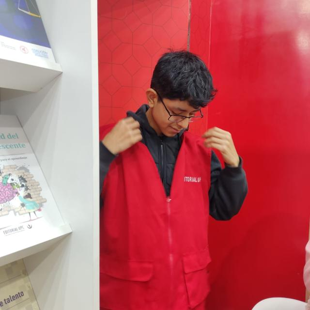
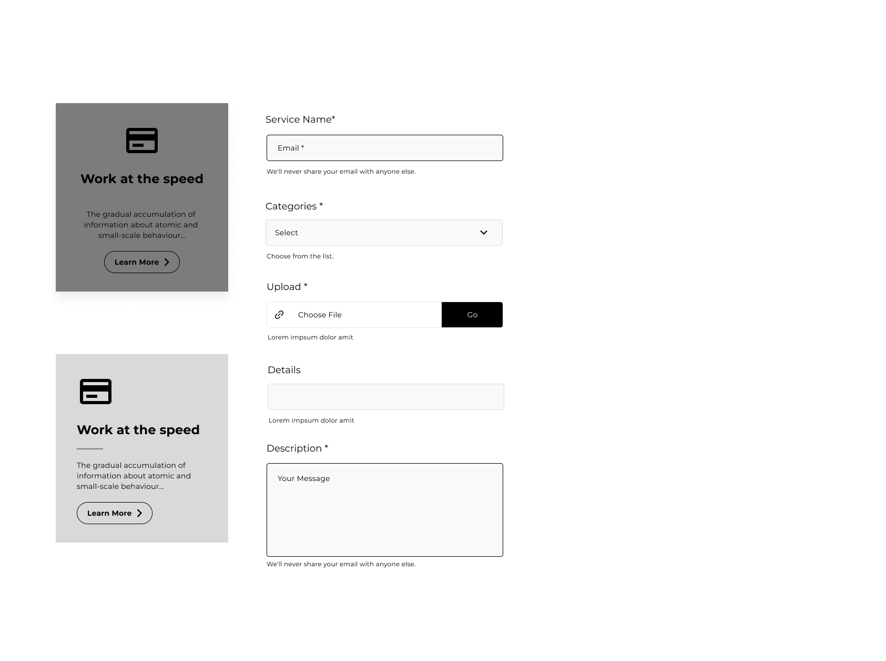

<p align="center">
  
</p>

# <center>Universidad Peruana de Ciencias Aplicadas</center>

###  <center>Ingeniería de Software</center>

###  <center>Ciclo 2024-02</center>

## <center>Desarrollo de Aplicaciones Open Source WS53</center>

###  <center>Docente: Juan Antonio Flores Moroco</center>

## <center>Informe del TB1</center>

###  <center>Startup: BeautyServices </center>

###  <center>Producto: Bliss </center>

##  <center>Integrantes

| Nombre |Código de alumno|
|:-------:|:----------:|
|André Arturo Bernaola Pérez|U202114192|
|Diego Ivan Cabrera Buitron|U20211B293|
|Elvia Marcela Rodriguez Villa|U20231C784|
|David Alejandro Rivas Sarango|U20191E831|
|Diego Martin Soriano Medrano|U202114793|

## <center>Agosto 2024</center>

## Registro de versiones del informe

| Versión   | Fecha     | Autor |Descripción de la modificación |
|-----------|-----------|-------|-------------                  |
| 1         |16/08/24|Rivas David|Creación del documento de trabajo en markdown|
| 2         |18/08/2024|Cabrera Diego|Desarrollo del capítulo 1 y Entrevistas|
| 3         |24/08/2024|Rivas David,  Rodriguez Elvia|Desarrollo de las US y Product Backlog|
|4          |25/08/2024|Bernaola Andre|Implementación de la Landing Page|
|5          |25/08/2024|Soriano Diego|Elaboracion de Diagrama de Clases|
|6          |28/08/2024|Soriano Diego|Elaboración de diegrama de base de datos|
|7          |28/08/2024|Rivas David|Capítulo 5|
|8          |30/08/2024|Cabrera Diego|Arreglo de entrevistas|
|9          |01/09/2024|Bernaola Andre|Elaboración de modelos C4|
|10          |04/09/2024|Rivas David|SEO and Meta tags|
|11          |07/09/2024| Rivas David|Puntos 4.7 y 4.8|
|12          |09/09/2024|Rodriguez Elvia, Rivas David|Implementación de Wireframes, Mockups y Prototipo|


<br/>

## Project Report Collaboration Insights

URL de la organización del proyecto: [https://github.com/upc-opensource-g-bliss]

**TB1**
|Integrante|Tareas Asignadas|
|-|-|
|André Arturo Bernaola Pérez|Elaboración de Diagramas de clase, Implementación de Landing Page y Domain-Driven Software Architecture|
|Diego Ivan Cabrera Buitron|Entrevistas, Diseño del logo y Assumptions|
|Elvia Marcela Rodriguez Villa|Elaboración de User Stories, Diseño de Landing Page|
|David Alejandro Rivas Sarango|Elaboración de User Stories, Elaboración de Product Backlog, Elaboración de Capítulo 5|
|Diego Martin Soriano Medrano|Elaboración de Diagrama de base de datos|

**TB1 Github**


***

## Contenido
1. [**Capítulo I: Introducción**](#capítulo-i-introducción) <br>
1.1. [***1.1.Startup Profile***](#11-startup-profile) <br>
1.1.1. [1.1.1. Descripción del startup](#111-descripción-del-startup) <br>
1.1.2.[1.1.2. Perfiles de los integrantes del equipo](#112-perfiles-de-los-integrantes-del-equipo) <br>
1.2. [***1.2. Solution Profile***](#12-solution-profile) <br>
1.2.1. [1.2.1.Antecedentes y Problemática](#121-antecedentes-y-problemática) <br>
1.2.2. [1.2.2.Lean UX Process](#122-lean-ux-process) <br>
1.2.2.1. [1.2.2.1.Lean UX Problem Statements](#1221-lean-ux-problem-statements) <br>
1.2.2.2. [1.2.2.2.Lean UX Assumptions](#1222-lean-ux-assumptions) <br>
1.2.2.3. [1.2.2.3.Lean UX Hypothesis Statements](#1223-lean-ux-hypothesis-statements) <br>
1.2.2.4. [1.2.2.4. Lean UX Canvas](#1224-lean-ux-canvas) <br>
1.3. [***1.3. Segmentos objetivo***](#13-segmentos-objetivo) <br>
2. [**2. Capítulo II: Requirements Elicitation & Analysis**](#capítulo-ii-requirements-elicitation-&-analysis) <br>
2.1. [***Competidores***](#21-competidores) <br>
2.1.1. [Análisis competitivo](#211-análisis-competitivo) <br>
2.1.2. [Estrategias y tácticas frente a competidores](#212-estrategias-y-tácticas-frente-a-competidores) <br>
2.2. [***Entrevistas***](#22-entrevistas) <br>
2.2.1. [Diseño de entrevistas](#221-diseño-de-entrevistas) <br>
2.2.2. [Registro de entrevistas](#222-registro-de-entrevistas) <br>
2.2.3. [Análisis de entrevistas](#223-análisis-de-entrevistas) <br>
2.3. [***Needfinding***](#23-needfinding) <br>
2.3.1. [User Personas](#231-user-personas) <br>
2.3.2. [User Task Matrix](#232-user-task-matrix) <br>
2.3.3. [User Journey Mapping](#233-user-journey-mapping) <br>
2.3.4. [Empathy Mapping](#234-empathy-mapping) <br>
2.3.5. [As-is Scenario Mapping](#235-as-is-scenario-mapping) <br>
2.4. [***Ubiquitous Language***](#24-ubiquitous-Language)
3. [**Capítulo III: Requirements Specification**](#capítulo-iii-requirements-specification) <br>
3.1. [***To-Be Scenario Mapping***](#31-to-be-scenario-mapping) <br>
3.2. [***User Stories***](#32-user-stories) <br>
3.3. [***Impact Mapping***](#33-impact-mapping) <br>
3.4. [***Product Backlog***](#34-product-backlog) <br>
4. [**Capítulo IV: Product Design**](#capítulo-iv-product-design) <br>
4.1. [***Style Guidelines***](#41-style-guidelines) <br>
4.1.1. [General Style Guidelines](#411-general-style-guidelines) <br>
4.1.2. [Web Style Guidelines](#412-web-style-guidelines) <br>
4.2. [***Information Architecture***](#42-information-architecture) <br>
4.2.1. [Organization Systems](#421-organization-systems) <br>
4.2.2. [Labeling Systems](#422-labeling-systems) <br>
4.2.3. [SEO Tags and Meta Tags](#423-seo-tags-and-meta-tags) <br>
4.2.4. [Searching Systems](#424-searching-systems) <br>
4.2.5. [Navigation Systems](#425-navigation-systems) <br>
4.3. [***Landing Page UI Design***](#43-landing-page-ui-design) <br>
4.3.1. [Landing Page Wireframe](#431-landing-page-wireframe) <br>
4.3.2. [Landing Page Mock-up](#432-landing-page-mock-up) <br>
4.4. [***Web Applications UX/UI Design***](#44-web-applications-uxui-design) <br>
4.4.1. [Web Applications Wireframes](#441-web-applications-wireframes) <br>
4.4.2. [Web Applications Wireflow Diagrams](#442-web-applications-wireflow-diagrams) <br>
4.4.3. [Web Applications Mock-ups](#443-web-applications-mock-ups) <br>
4.4.4. [Web Applications User Flow Diagrams](#444-web-applications-user-flow-diagrams) <br>
4.5. [***Web Applications Prototyping***](#45-web-applications-prototyping) <br>
4.6. [***Domain-Driven Software Architecture***](#46-domain-driven-software-architecture) <br>
4.6.1. [Software Architecture Context Diagram](#461-software-architecture-context-diagram) <br>
4.6.2. [Software Architecture Container Diagrams](#462-software-architecture-container-diagrams) <br>
4.6.3. [Software Architecture Components Diagrams](#463-software-architecture-components-diagrams) <br>
4.7. [***Software Object-Oriented Design***](#47-software-object-oriented-design) <br>
4.7.1. [Class Diagrams](#471-class-diagrams) <br>
4.7.2. [Class Dictionary](#472-class-dictionary) <br>
4.8. [***Database Design***](#48-database-design) <br>
4.8.1. [Database Diagram](#481-database-diagram) <br>
5. [**Capítulo V: Product Implementation, Validation & Deployment**](#capítulo-v-product-implementation-validation-&-deployment) <br>
5.1. [***Software Configuration Management***](#51-software-configuration-management) <br>
5.1.1. [Software Development Environment Configuration](#511-software-development-environment-configuration) <br>
5.1.2. [Source Code Management](#512-source-code-management) <br>
5.1.3. [Source Code Style Guide & Conventions](#513-source-code-style-guide-&-conventions) <br>
5.1.4. [Software Deployment Configuration](#514-software-deployment-configuration) <br>
5.2. [***Landing Page, Services & Applications Implementation***](#52-landing-page-services-&-applications-implementation) <br>
5.2.1. [Sprint 1](#521-sprint-1) <br>
5.2.1.1. [Sprint Planning 1](#5211-sprint-planning-1) <br>
5.2.1.2. [Sprint Backlog 1](#5212-sprint-backlog-1) <br>
5.2.1.3. [Development Evidence for Sprint Review](#5213-development-evidence-for-sprint-review) <br>
5.2.1.4. [Testing Suite Evidence for Sprint Review](#5214-testing-suite-evidence-for-sprint-review) <br>
5.2.1.5. [Execution Evidence for Sprint Review](#5215-execution-evidence-for-sprint-review) <br>
5.2.1.6. [Services Documentation Evidence for Sprint Review](#5216-services-documentation-evidence-for-sprint-review) <br>
5.2.1.7. [Software Deployment Evidence for Sprint Review](#5217-software-deployment-evidence-for-sprint-review) <br>
5.2.1.8. [Team Collaboration Insights during Sprint](#5218-team-collaboration-insights-during-sprint) <br>
5.3. [***Validation Interviews***](#53-validation-interviews) <br>
5.3.1.[Diseño de Entrevistas](#531-diseño-de-entrevistas) <br>
5.3.2.[Registro de Entrevistas](#532-registro-de-entrevistas) <br>
5.3.3.[Evaluaciones según Heurísticas](#533-evaluaciones-según-heurísticas) <br>
5.4. [***Video About-the-Product***](#54-video-about-the-product) <br>
6. [**Conclusiones**](#conclusiones) <br>
7. [**Bibliografía**](#bibliografía) <br>
8. [**Anexos**](#anexos)

<br/>

## Students Outcomes

| Criterio específico | Acciones realizadas | Conclusiones |
|---------------------|---------------------|--------------|
|Comunica oralmente con efectividad a diferentes rangos de audiencia.| **André Arturo Bernaola Pérez** <br> **TB1** <br> En esta entrega, expliqué a mi equipo las decisiones arquitectónicas del modelo C4, lo que facilitó la comprensión del enfoque adoptado. Además, implementé retroalimentación activa para mejorar tanto las User Stories como el diagrama de base de datos, integrando de manera efectiva las sugerencias del equipo para optimizar la calidad del proyecto. <br> <br>  **Diego Ivan Cabrera Buitron** <br> **TB1** <br> Para esta entrega identifiqué el problema a solucionar y así pude realizar los assumptions y las entrevistas de manera concreta. <br> <br>**Elvia Marcela Rodriguez Villa** <br> **TB1** En la presente actividad he colaborado con el diseño y elaboración de productos como mockups y prototipos, por ello ha sido necesaria una comunicación constante con mis compañeros de trabajo para acordar decisiones e incorporar opiniones a fin de elaborar un producto de acuerdo a las necesidads de un usuario final. <br> <br>**David Alejandro Rivas Sarango** <br> **TB1** En esta entrega diseñe la aplicación web de acuerdo a los sectores entrevistados, nuestros ahora clientes deben sentirse cómodos con el servicio que les proporcionamos y estamos al tanto de la retroalimentación que se nos brinda para una mejora continua. <br> <br>**Diego Martin Soriano Medrano** <br> **TB1** <br> Para la primera entrega del trabajo, realicé diversas actividades, entre las cuales destaco la habilidad para comunicar efectivamente mis ideas y consideraciones sobre el desarrollo del proyecto a mis compañeros de grupo. <br> | Se ha demostrado una clara comprensión y aplicación de las técnicas y herramientas necesarias, lo que ha permitido una integración coherente de los distintos componentes del proyecto. La capacidad para adaptar y mejorar las User Stories y el diagrama de base de datos ha optimizado la calidad y precisión del trabajo realizado. En general, el equipo ha establecido una base sólida para las siguientes etapas del proyecto, evidenciando un trabajo colaborativo y bien documentado que facilita la continuación del desarrollo con una visión clara y alineada. |
|Comunica por escrito con efectividad a diferentes rangos de audiencia|**André Arturo Bernaola Pérez** <br> **TB1** <br> Al realizar los diagramas del modelo C4 para el trabajo, justifiqué la arquitectura y los patrones empleados de manera detallada para asegurar una comprensión clara de las decisiones técnicas. <br> <br>  **Diego Ivan Cabrera Buitron** <br> **TB1** <br> Al identificar el problema, en la realización de las entrevistas, tomé muy en cuenta las necesidades de nuestro público objetico para poder analizarlas. <br> <br>**Elvia Marcela Rodriguez Villa** <br> **TB1** <br> Las decisiones respecto al diseño visual e interactivo de los mockups y prototipos fueron debidamente justificados de acuerdo a los parámetros y heurísticas de diseño UX, por lo mencionado, he incluido información escrita que especifica la razón detras del diseño visual y estructura de los productos mencionados. <br> <br>**David Alejandro Rivas Sarango** <br> **TB1** Para esta entrega planteamos grupalmente las pautas que nos permitirán trabajar ordenadamente durante los sprints, siendo la documentación lo primero que realizamos, en mi caso realize las historias de usuario, que son vitales para los requisitos que debe cumplir el proyecto.<br> <br>**Diego Martin Soriano Medrano** <br> **TB1** <br> Para llevar a cabo el trabajo de manera organizada, se emplearon diversos canales de comunicación, a través de los cuales fue necesario transmitir por escrito nuestras consideraciones sobre partes específicas del proyecto. <br> | El equipo ha establecido una sólida base en comunicación escrita, logrando documentar claramente los diagramas del modelo C4, las historias de usuario y el diseño UX. Esta documentación ha facilitado la coordinación y comprensión entre los miembros del equipo, sentando una base efectiva para el desarrollo continuo del proyecto.|

***

<br/>

## Capítulo I: Introducción

### 1.1. Startup Profile

#### 1.1.1. Descripción del startup

<p style="text-align: justify">
Las empresas de belleza y del cuidado personal están creciendo a un ritmo acelerado, especialmente el sector de tratamientos faciales y dermocosmética, que ha crecido casi 8 veces en los últimos 10 años. Los centros de belleza están diseñados para satisfacer las necesidades de la clase media emergente de 2019, la cual está creciendo. 

La importancia del servicio personalizado al usuario es evidente en este contexto. Los salones de belleza en Perú, que crecen cada vez más, luchan por diferenciarse en un mercado donde la oferta aún está polarizada e informal. Las pequeñas empresas familiares son un buen lugar para empezar, son un poco más moldeables y tienen un estilo de gestión diferente y poco complejo. La principal ventaja que tienen estos establecimientos es que los servicios suelen ser bastante personalizables de acuerdo a las necesidades específicas de cada cliente. Los datos del Inei muestran que el 75.6% de los salones de belleza están dirigidos por mujeres. 

Para aprovechar al máximo la alta competitividad y el constante crecimiento de estos establecimientos, es fundamental elevar la calidad del servicio y prestar atención a la forma en que se gestiona la atención a los clientes, con un mayor énfasis en ofrecer experiencias de usuario personalizadas. No sólo aumentará la satisfacción del cliente, sino que también ayudará a formalizar y "profesionalizar" la industria de la belleza, permitiéndoles establecer relaciones más sólidas y duraderas con sus clientes.
</p>

<br/>

**Misión**: Ofrecer un servicio de belleza y cuidado personal altamente personalizado, centrado en satisfacer las necesidades y expectativas de cada cliente.

**Visión**: Ser los referente en la industria de la belleza y cuidado personal, reconocidos por brindar experiencias personalizadas, contribuyendo al crecimiento y formalizar este sector.

##### Logotipo de la Startup:


##### Logotipo del producto:

 <br>

#### 1.1.2. Perfiles de los integrantes del equipo

|Integrante |Descripción|
|-----------|-----------|
| |Mi nombre es **André Arturo Bernaola Pérez**, estoy cursando la carrera de Ingeniería de Software, me gusta jugar videojuegos y aprender en mis momentos libre. Aspiro a trabajar como desarrollador fullstack. |
||**Diego Ivan Cabrera Buitron** <br> Mi nombre es **Diego Cabrera**, estoy cursando la carrera de Ingeniería de Software, me considero una persona responsable y perseverante. Al culminar mi carrera quiero especializarme en el sector de la ciberseguridad|
||**David Alejandro Rivas Sarango** <br> Mi nombre es **David Rivas**, actualmente estoy cursando la carrera de Ingeniería de Software en la UPC. Soy una persona honesta y responsable. Me interesa el área de Data Science, por esto estoy siguiendo cursos de capacitacion en SQL y Python.|
||**Elvia Marcela Rodríguez Villa** <br> Soy Elvia Rodríguez, actual estudiante universitaria y egresada de Laboratoria. Soy actual embajadora del programa de estudiantes de Microsoft y fui participante de diversos voluntariados y Hackathons cómo Ciencia en tu Comunidad y el Laboratorio de Emprendimientos de SENAJU. Asimismo, soy maestra de inglés y suelo incorporar mis conocimientos de programación de interfaces de usuario en mi labor educativa. |
||**Diego Martin Soriano Medrano** <br/> Estudio la carrera de ingeniería de software. Me considero una persona creativa y paciente. Tengo conocimiento en el uso de diferentes herramientas informáticas y lenguajes de programación. que ayudan a realizar distintos tipos de trabajo y a resolver problemas. Parte de mis habilidades blandas es siempre tomar en cuenta la opinión de mis compañeros, lo cual me facilita el poder trabajar en equipo, para agilizar diferentes actividades.|

### 1.2. Solution Profile
#### 1.2.1. Antecedentes y Problemática

##### What (Qué)
###### ¿Cuál es el problema?
Muchas personas pueden encontrar difícil reservar citas de servicios de cuidado y belleza. Asimismo, a muchas Mypes de este rubro se les dificulta encontrar nuevos clientes.
###### ¿Cuál es la relación con la persona en cuestión?
Las personas en cuestión son clientes potenciales que desean acceder a servicios de cuidado y belleza de manera conveniente y confiable; y estilistas o dueños de negocio que desean promocionar su negocio a más personas.

##### When (Cuando)
###### ¿Cuándo sucede el problema?
El problema puede ocurrir cuando los clientes desean reservar citas de servicios de cuidado y belleza, mas no tienen tiempo para buscar proveedores o llamar por teléfono para hacer una reserva.
###### ¿Cuándo utiliza el cliente el producto?
Cuando los clientes deseen buscar, reservar y pagar por servicios de cuidado y belleza, ya sea en casa o en el establecimiento del proveedor, y cuando los proveedores de servicios de cuidado y belleza necesitan hacer uso de una plataforma para promocionar sus servicios.

##### Where (Dónde)
###### ¿A dónde se dirige?
El cliente se dirige a la aplicación para buscar y reservar citas de servicios de cuidado y belleza con proveedores cercanos a su ubicación.
###### ¿Dónde surge el problema?
El problema surge cuando los clientes desean reservar citas de servicios de cuidado y belleza, pero encuentran dificultades para encontrar proveedores confiables o para coordinar horarios que se ajusten a su agenda.
###### ¿Dónde está el cliente cuando usa el producto?
El cliente puede usar el producto desde cualquier lugar donde tenga acceso a Internet, como su hogar, su lugar de trabajo o en movimiento a través de dispositivos móviles.

##### Who (Quién)
###### ¿Quiénes están involucrados?
Los clientes que buscan servicios de cuidado y belleza y los proveedores que ofrecen estos servicios.
###### ¿A quiénes les sucede el problema?
El problema afecta a los clientes que desean acceder a servicios de cuidado y belleza y a los proveedores que buscan aumentar su clientela y gestionar sus citas de manera eficiente.
###### ¿Quién lo utilizará?
El cliente de este producto es quien busque servicios de cuidado y belleza, especialmente mujeres de 20 a 45 años en el sector socioeconómico B-C de Lima, así como Mypes que brinden servicios de cuidado y belleza en Lima.

##### Why (Por qué)
###### ¿Cuál es la causa del problema?
La causa del problema es la falta de una plataforma centralizada que conecte de manera conveniente a los clientes con proveedores de servicios de cuidado y belleza, así como la dificultad para coordinar horarios y encontrar proveedores confiables en el mercado actual.

#### 2H
##### How (Cómo)
###### ¿En qué condiciones nuestros clientes usan el producto?
Nuestros clientes usarán el producto en diversas condiciones, ya sea cuando estén en casa buscando un servicio de cuidado y belleza para una ocasión especial, durante un descanso en el trabajo mientras navegan por opciones de tratamientos, o incluso en movimiento cuando necesiten reservar rápidamente un servicio mientras están fuera de casa.
###### ¿Cómo nos conocieron los compradores? 
Los compradores pueden conocernos a través de diversas fuentes, como recomendaciones de amigos o familiares, publicidad en línea a través de redes sociales, reseñas en línea, o incluso a través de promociones con otros negocios locales
###### ¿Cómo prefieren los consumidores acceder a nuestro contenido?
A través de dispositivos móviles, como teléfonos inteligentes o tabletas. A los consumidores les gustaría poder encontrar fácilmente información sobre los servicios disponibles, ver reseñas y calificaciones de otros usuarios, y realizar reservas en pocos pasos.
###### ¿Que llevó a la persona a llegar a esta situación?
La situación surge de la necesidad de las personas de mantener su apariencia y bienestar mediante servicios de cuidado y belleza, así como de la dificultad para encontrar proveedores confiables y coordinar citas de manera conveniente en el mercado actual. Esto puede deberse a la falta de tiempo o a la falta de opciones cercanas.

##### How much (Cuánto)
###### ¿Cuál es la magnitud del problema?
De acuerdo con la Asociación Peruana de Empresarios de la Belleza (2022), 4 de cada 10 peluquerías se vieron obligadas a cerrar a raíz de la pandemia, y solo un 30% de estas siguen en la formalidad. Esto, en muchos casos, es producto de los elevados costos tanto del alquiler como de la materia prima que los estilistas requieren para realiza su labor.

#### 1.2.2. Lean UX Process
El objetivo de nuestra aplicación es mejorar la gestión de clientes mediante una plataforma que facilite a los clientes la búsqueda y reserva de servicios de belleza y cuidado personal.

##### 1.2.2.1. Lean UX Problem Statements

a) El objetivo de nuestra aplicación es mejorar la gestión de clientes mediante una plataforma que facilite a los clientes la búsqueda y reserva de servicios de belleza y cuidado personal. 
Sin embargo, nos enfrentamos a un desafío significativo: la alta tasa de informalidad en la industria, que genera desconfianza entre los clientes al seleccionar un centro para sus necesidades de belleza. Esta falta de transparencia y garantías sobre la calidad de los servicios ofrecidos crea incertidumbre y afecta negativamente la experiencia del usuario.

¿Cómo podemos mejorar el proceso de selección del cliente para salones, tratamientos y servicios, asegurando un diseño que promueva la confianza y seguridad?

b) Otro objetivo a mencionar es el de proporcionar un sistema eficiente de y transparente para la búsqueda y reserva de servicios, así como establecer canales de comunicación efectivos con los clientes. Nos enfrentamos a otro desafío significativo, los sistemas de gestión de citas para servicios de cuidado y belleza son ineficientes y generan desconfiaza en el usuario final.

¿Cómo podemos implementar estrategias efectivas para fomentar la transparencia y la calidad en los servicios ofrecidos por los centros de belleza, mejorando así la confianza de los usuarios en nuestra plataforma?

c) Reconocemos la importancia de garantizar una experiencia segura y sin preocupaciones para los usuarios que utilizan nuestra plataforma para reservar servicios de belleza. La alta tasa de informalidad en la industria de los centros de belleza crea desafíos adicionales para garantizar la calidad y confiabilidad de los servicios ofrecidos.

¿Cómo podemos establecer procedimientos claros y efectivos para verificar y promover la formalidad y calidad de los centros de belleza asociados, brindando así una experiencia de usuario más segura y confiable en nuestra plataforma?

###### 1.2.2.2. Lean UX Assumptions

Creo que mis clientes necesitan saber cómo y dónde acceder a servicios de manicure, pedicure y tratamientos faciales a domicilio de manera conveniente y segura. 

Estas necesidades se pueden resolver con una aplicación que conecte a clientes con profesionales de belleza verificados, ofreciendo una amplia gama de servicios personalizados y garantizando medidas de seguridad y calidad. 

Mis clientes son personas que buscan comodidad y confiabilidad al reservar servicios de belleza, sin comprometer la calidad y la seguridad. 

El valor N°1 que mi cliente quiere de mi servicio es la facilidad de reserva, la calidad de los servicios y la tranquilidad de tener profesionales confiables en su hogar. 

El cliente también puede adquirir estos beneficios adicionales como descuentos por lealtad, recomendaciones personalizadas y acceso a productos exclusivos. 

Voy a adquirir a la mayoría de mis clientes a través de estrategias de marketing digital, colaboraciones con empresas de belleza y programas de referidos. Haré dinero a través de anuncios por colaboraciones con marcas de belleza, comisiones por reservas y membresías premium. 

Mi competencia principal en el mercado serán aplicaciones similares que ofrecen servicios de belleza a domicilio, salones de belleza locales y plataformas de reserva en línea. Los venceremos debido a nuestra estrategia de enfoque en la seguridad y calidad, personalización de servicios, y programas de fidelización. 

Mi mayor riesgo de producto es que los clientes no confíen en la seguridad de tener desconocidos en sus hogares o que prefieran la experiencia tradicional en un salón de belleza. 

Resolveremos esto a través de la implementación de rigurosos procesos de verificación de profesionales, garantías de seguridad y promoción de la comodidad y conveniencia de nuestros servicios a domicilio.

###### 1.2.2.3. Lean UX Hypothesis Statements

* **Hypothesis Statement 01:**
  
  **Creemos que** ofrecer una amplia gama de servicios de cuidado y belleza a través de nuestra aplicación para usuarios que buscan comodidad y conveniencia ayudará a que estos puedan reservar citas fácilmente y acceder a servicios de calidad.

  **Sabremos** que hemos tenido éxito
  
  **Cuando** se vea un aumento significativo en la cantidad de reservas realizadas a través de nuestra aplicación, así como una mayor retención de clientes satisfechos.

* **Hypothesis Statement 02:**
  
**Creemos que** implementar un sistema de verificación de estilistas calificados y negocios confiables garantizará la calidad de las citas reservadas y ayudará a que nuestros usuarios se sientan seguros al reservar servicios de cuidado y belleza.

**Sabremos** que hemos tenido éxito
  
  **Cuando** se reciban comentarios positivos de los usuarios acerca de la garantía y la buena calidad del servicio recibido, así como cuando veamos un mayor tráfico en la aplicación.

* **Hypothesis Statement 03:**
  
  **Creemos que** establecer colaboraciones estratégicas con salones de belleza, estilistas, marcas de belleza relevantes, y ofrecer programas de referidos atractivos ayudará a que adquiramos clientes de manera efectiva y aumentemos la visibilidad de nuestra aplicación.

**Sabremos** que hemos tenido éxito

  **Cuando** observemos un aumento en la adquisición de clientes durante los períodos de nuestras colaboraciones, así como una mayor interacción de los usuarios con la aplicación a través de programas de referidos.

* * **Hypothesis Statement 04:**
    
**Creemos que** aumentaremos la confianza del usuario y fomentaremos la lealtad a nuestra marca si incorporamos funciones de calificación y reseñas para que los usuarios puedan evaluar la calidad de los servicios recibidos y compartir sus experiencias con otros usuarios.

**Sabremos** que hemos tenido éxito

**Cuando** observemos un aumento significativo en la participación de los usuarios en la función de calificación y reseñas, así como un incremento en la cantidad de reseñas positivas y una mejora general en la percepción de la calidad de los servicios por parte de los usuarios.

###### 1.2.2.4. Lean UX Canvas

  

Enlace para acceder al Canvas (https://app.mural.co/t/studentprojects6765/m/studentprojects6765/1723924811878/e2acd47a64a2a0139c4cf13feb7c67c6a2e5f92d?sender=u9e84aeace61d1c60b4be6095)

### 1.3. Segmento objetivo

1. Clientas aficionadas al embellecimiento: Este segmento esta compuesto por mujeres en el rango de edad de 20 a 45 años, del sector socioeconómico B-C que residan en Lima.

2. MYPES: Este segmento esta compuesto por dueños de negocios que brindan servicios de cuidado y belleza que funcionan en Lima.

<br/>

## Capítulo II: Requirements Elicitation & Analysis
### 2.1. Competidores

Identificación y descripción 

<br/>

#### 2.1.1. Análisis Competitivo

||Bliss <br>|Treatwell |SimplyBook |Booksy <br>|
|:-:|:-:|:-:|:-:|:-:|
|**Overview**|Bliss es una plataforma de citas y reservas, enfocadas en la búsqueda, comparación y programación del servicio de negocios de belleza y bienestar|Treatwell es una plataforma de reserva de servicios de belleza y bienestar en Europa.|SimplyBook.me es una plataforma de programación en línea para una variedad de negocios, que facilita la gestión de citas y reservas.|Booksy es una aplicación de reserva de citas enfocada en la industria de belleza y bienestar, que facilita a los usuarios la búsqueda y reserva de servicios de peluquería, estética y cuidado personal.|
|**Ventajas Competitivas**|Ofrece una interfaz intuitiva para su facilidad de uso, disponibilidad las 24 horas del día, gestión centralizada de citas con la finalidad de poder ver y gestionar todas sus citas desde la plataforma.|Ofrece conveniencia alpermitir a los clientes reservar servicios de belleza en línea y acceso a una amplia gama de salones y tratamientos.|Ofrece conveniencia al permitir a los clientes reservar citas en línea las 24 horas del día y acceso a funciones como recordatorios automáticos y pagos en línea.|Ofrece conveniencia al permitir a los clientes encontrar y reservar servicios de belleza en línea las 24 horas del día, así como acceder a información detallada sobre profesionales, servicios y precios.|
|**Mercado Objetivo**|Las micro y pequeñas empresas enfocadas en la industria de belleza y bienestar que estén interesadas en publicar sus servicios en una plataforma online, también las mujeres que busquen gestionar y pedir este servicio.|Usuarios urbanos interesados en servicios de belleza y bienestar en Europa.|Negocios de servicios que requieren programación de citas, como peluquerías, salones de belleza, consultorios médicos, centros de fitness y más. |Usuarios que buscan servicios de belleza y bienestar, así como profesionales de la industria de belleza y cuidado personal.|
|**Estrategias de Marketing**|Fomentar la participación en nuestra plataforma al permitir que los clientes reaccionen y compartan los servicios, al igual que hacer colaboraciones con las empresas de esta industria para un marketing digital.|Marketing digital, colaboraciones con salones de belleza, promociones y programas de fidelización.|Marketing digital, promoción en redes sociales, colaboraciones con negocios afines y programas de referidos.|Marketing digital, promoción en redes sociales, colaboraciones con negocios afines y programas de referidos.|Marketing digital dirigido a usuarios finales y a profesionales, promoción en redes sociales, colaboraciones con salones y eventos de la industria.|
|**Productos & Servicios**|Gestión de citas y reserva a servicios del sector belleza y bienestar, permitir transacciones de pago en línea, interfaz intuitiva para presentar los servicios que ofrece su empresa y sección de comentarios para que los clientes muestres y opiniones y las empresas puedan comunicarse con sus clientes.|Reserva de citas para servicios de peluquería, belleza y bienestar|Plataforma de programación en línea con funciones como calendarios, recordatorios de citas, gestión de personal y pagos en línea.|Aplicación móvil y plataforma en línea que permite la reserva de citas, gestión de agendas y comunicación entre clientes y profesionales.|
|**Precios & Costos**|Las empresas deberán pagar en nuestra plataforma, será un porcentaje bajo por cada reserva o cita pagada, sin embargo, para los que buscan un servicio la aplicación será gratuita.|Varían según el servicio y la ubicación del salón.|Varían según el plan y las características seleccionadas, con opciones de suscripción mensual o anual.|Varían según el plan y las características seleccionadas para los profesionales, mientras que para los usuarios finales, la aplicación es gratuita.|
|**Canales de distribución (WEB y/o Móvil)**|Plataforma en línea y aplicación móvil.|Plataforma en línea y aplicación móvil.|Plataforma en línea y aplicación móvil.|Aplicación móvil disponible en tiendas de aplicaciones y plataforma en línea.|
|**Fortalezas**|Función de filtrado de servicios de belleza según precio, lugar, valorados por la comunidad, entre otros. Interfaz intuitiva para que las empresas puedan mostrar a los usuarios sus servicios. Herramientas para permitir a la comunidad expresarse y recomendar los servicios de su agrado.|Amplia red de salones asociados, conveniencia de reserva en línea, variedad de servicios.|Interfaz intuitiva, amplia personalización, adaptabilidad a diferentes industrias y tipos de negocios.|Especialización en la industria de belleza, interfaz intuitiva, amplia red de profesionales y servicios.|
|**Debilidades**|Dependencia por los comentarios y puntajes de los usuarios, pues sin ellos no podremos filtrar los mejores servicios. Las empresas que paguen por nuestro servicio posiblemente no puedan seguir nuestra curva de aprendizaje para todas las|Dependencia de la disponibilidad de los salones asociados, posibles problemas de calidad del servicio.|Posible curva de aprendizaje para usuarios nuevos, limitaciones en funciones avanzadas en planes más básicos.|Dependencia de la disponibilidad de los profesionales, posibles problemas de calidad del servicio.|
|**Oportunidades**|Existen usuarios interesados en plataformas similares. Muchas empresas pequeñas no usan estos medios, pero están interesados. Colaboraremos con ellos para llegar al público objetivo. Facilidad al expandir nuestros servicios pues es digital. Después de la pandemia las plataformas digitales ganaron confianza.|Expansión a nuevos mercados, introducción de nuevos servicios, mejorar la experiencia del usuario.|Expansión a nuevos mercados, mejora continua de características y funciones, colaboraciones estratégicas con otros servicios.|Expansión a nuevos mercados, introducción de nuevas características y servicios, colaboraciones estratégicas con marcas de belleza.|
|**Amenazas**|Competiremos con aplicaciones ya establecidas. Podría haber problemas a la seguridad de los datos y física de las empresas al cualquier usuario pedir sus servicios. |Competencia de otras plataformas similares, cambios en las preferencias de los consumidores, problemas regulatorios.|Competencia de otras plataformas de programación en línea, cambios en las necesidades y expectativas de los usuarios, problemas de seguridad de datos.|Competencia de otras aplicaciones de reserva de citas, cambios en las preferencias de los usuarios, problemas de calidad del servicio por parte de los profesionales.|

#### 2.1.2. Estrategias y tácticas frente a competidores

**Estrategias:**

* Ampliación de servicios: Ofrecer una amplia gama de servicios de manicura, pedicura y tratamientos faciales, asegurando que cubran las necesidades de los usuarios y proporcionen una experiencia de belleza completa en el hogar.

* Verificación de profesionales: Implementar un riguroso proceso de verificación para los estilistas y negocios asociados, garantizando la calidad y confiabilidad de los servicios ofrecidos a través de la plataforma.

* Enfoque en la comodidad del usuario: Centrarse en la conveniencia y la facilidad de uso de la aplicación para mejorar la experiencia del usuario y fomentar la repetición de negocios.

**Tácticas:**

* Optimización de la interfaz de usuario: Mejorar la navegación y la búsqueda dentro de la aplicación para que los usuarios puedan encontrar fácilmente servicios disponibles que se ajusten a sus horarios y preferencias.

* Sistema de calificación y comentarios: Implementar un sistema de calificación y comentarios para que los usuarios puedan evaluar la calidad de los servicios recibidos, lo que ayudará a construir confianza y transparencia en la plataforma.

* Programación flexible: Permitir a los usuarios seleccionar franjas horarias específicas y preferencias de estilistas al reservar citas, ofreciendo opciones que se adapten a sus
horarios y necesidades.

* Promoción de garantía de calidad: Comunicar claramente la garantía de calidad y verificación de profesionales en la plataforma a través de campañas de marketing y mensajes en la aplicación para generar confianza entre los usuarios.

* Incentivos para usuarios y estilistas: Ofrecer descuentos, promociones o recompensas tanto para los usuarios que realicen reservas como para los estilistas que mantengan altos estándares de servicio y calidad.

* Colaboraciones estratégicas: Establecer asociaciones con marcas de productos de belleza o influencers para aumentar la visibilidad y la credibilidad de la plataforma entre el público objetivo.

### 2.2. Entrevistas
#### 2.2.1. Diseño de entrevistas

### Segmento 1

• ¿Cómo sueles enterarte de nuevos servicios de cuidado y belleza, como tratamientos de belleza, manicura, masajes, extensiones de pestañas, tintes de cabello, depilación, etc.?

• ¿Qué canales de información utilizas con más frecuencia para buscar estos servicios? (Por ejemplo, redes sociales, buscadores en línea, recomendaciones de amigos o familiares, etc.)

• Cuando buscas un servicio específico, como manicura o extensiones de pestañas, ¿qué características te gustaría ver en un catálogo en línea para ayudarte a tomar una decisión informada?

• ¿Has buscado servicios de tintes de cabello, cortes de pelo o peinados en línea? ¿Qué información te gustaría encontrar en una plataforma digital para obtener una cotización precisa?

• ¿Qué aspectos te llaman más la atención al descubrir un nuevo servicio de cuidado y belleza en línea? (Por ejemplo, la calidad de las imágenes, las reseñas de otros usuarios, la descripción detallada de los servicios, etc.)

• ¿Has utilizado alguna vez plataformas digitales específicas para encontrar y reservar servicios de cuidado y belleza? Si es así, ¿qué aspectos te gustaron más de esas plataformas y cuáles crees que podrían mejorar?

• ¿Qué información consideras más importante al buscar y comparar diferentes proveedores de servicios de cuidado y belleza en línea? (Por ejemplo, precios, disponibilidad de citas, ubicación, reseñas de clientes, etc.)

• ¿Qué tan importante es para ti la facilidad y rapidez del proceso de reserva en línea al elegir un proveedor de servicios de cuidado y belleza?

• ¿Has experimentado algún problema o dificultad al reservar servicios de cuidado y belleza en línea en el pasado? ¿Qué aspectos crees que podrían mejorar para hacer este proceso más eficiente?

• ¿Te gustaría tener acceso a promociones especiales o descuentos exclusivos al reservar servicios de cuidado y belleza a través de una plataforma digital? ¿Cómo te gustaría recibir esta información?

• ¿Qué características adicionales te gustaría ver en una plataforma digital para reservar servicios de cuidado y belleza que aún no existan en otras plataformas?

• ¿Qué tan importante es para ti la seguridad y confianza en la plataforma digital al proporcionar información personal y financiera para reservar servicios de cuidado y belleza?


### Segmento 2

• ¿Qué servicios de cuidado y belleza ofrece actualmente en su negocio?

• ¿Cuáles son los servicios más solicitados por los clientes de su negocio?

• ¿Cómo suelen los clientes reservar citas actualmente en su negocio?

• ¿Cuál es su principal desafío o dificultad al gestionar las reservas y citas en su negocio actualmente?

• ¿Qué características o funciones le gustaría ver en una aplicación que les ayude a gestionar las reservas y citas de su negocio y dar a conocerlo a más personas?

• ¿Con qué frecuencia hace uso de las redes sociales o medios de información para poder contactar a sus clientes?

• ¿Qué aspectos considera más importantes al elegir una plataforma para promocionar sus servicios y aceptar reservas? (Por ejemplo, costo, facilidad de uso, popularidad)

• Actualmente, ¿ofrece servicios de cuidado y belleza a domicilio?

• Sí: ¿A qué tipo de clientes ofrece este tipo de servicio? (Por ejemplo, clientes frecuentes o conocidos, cualquier persona que lo/a contacte)

• No: ¿Por qué? (qué necesita o desea para implementar este servicio)

• *Explicación breve de la aplicación* ¿Cómo cree que una aplicación como la que estamos desarrollando podría beneficiar a su negocio y a sus clientes?

• Considerando los posibles beneficios que podría traerle esta aplicación a su negocio, ¿estaría dispuesto/a a pagar una comisión por cada servicio adquirido a través de la aplicación? (de ser posible, especificar tasa máxima en % o, si es comisión fija, monto en soles)

• ¿Estaría dispuesto/a a ofrecer promociones o descuentos exclusivos a través de la aplicación para atraer nuevos clientes o fidelizar a los existentes?

• ¿Qué sugerencias o comentarios adicionales tiene para mejorar la experiencia de reserva de servicios de cuidado y belleza a través de una aplicación?

#### 2.2.2. Registro de entrevistas

***Entrevistas a Clientes***

|**Nombre entrevistado**|  **Gabriela Suemy Ayllón García-Pacheco**|
|:-|:-|
|Edad|19 años|
|Profesión | Estudiante de Psicología|
|Departamento|Lima, Perú|
||Como primera entrevistada, tenemos a Gabriela que prefiere buscar servicios de belleza a través de recomendaciones de amigos y familiares, aunque también utiliza redes sociales y buscadores en línea. Valora las opiniones de otros clientes, descripciones detalladas de los servicios, fotos del trabajo previo, y la información sobre productos, estilistas, precios y duración de los servicios. Las imágenes de antes y después, la reputación basada en reseñas, y la calidad de los productos utilizados son aspectos clave para ella. Ha probado plataformas digitales para reservar servicios y aprecia la conveniencia de comparar proveedores, destacando la importancia de la calidad, experiencia, precios competitivos, y la facilidad para reservar citas.|
|**Nombre entrevistado**| **Paco Ramirez Serna**|
|Edad|21 años|
|Profesión | Estudiante de Economía|
|Departamento|Lima, Perú|
||Como segundo entrevistado, Paco, estudiante de economía, utiliza principalmente Instagram y Facebook para descubrir servicios de cuidado y belleza, valorando las fotos y opiniones en tiempo real. En un catálogo en línea, busca fotografías de alta calidad, testimonios de clientes, precios claros e información sobre la experiencia de los profesionales. Al obtener cotizaciones, prefiere detalles de los servicios, comparativas de precios, imágenes antes y después, y reseñas. Le atraen las imágenes de calidad y reseñas al descubrir nuevos servicios, y ya ha usado plataformas como StyleSeat, aunque cree que podrían ofrecer más detalles sobre los profesionales y su trabajo. Al comparar proveedores, prioriza las reseñas, ubicación, disponibilidad y precios.|
|**Nombre entrevistado**|  **Valeria Fernanda Valle Martinez**|
|Edad|19 años|
|Profesión | Estudiante de Psicología|
|Departamento|Lima, Perú|
||Como última entrevistada, Valeria nos menciona que usa anuncios en las redes sociales para buscar salones de belleza, el que más usa es Instagram. Sin embargo, nos cuenta que los anuncios no le permiten conocer la información completa del local como, por ejemplo: la calidad de los productos, precio, ubicación o servicio. Nos contó que no usa aplicaciones para gestionar las citas, pero reconoce el valor de estas, pues le permitirían ver la información de los salones de belleza y los compararlo con otros para buscar el mejor servicio. Mostro interés en nuestro proyecto, y afirmo que la característica más resaltante seria que la mantengan informada de las promociones y datos de los salones de belleza.|
|Duración de todas las entrevistas: 10:01|URL: [https://upcedupe-my.sharepoint.com/:v:/g/personal/u20211b293_upc_edu_pe/ETSuRSDyu71Fk7bCFMuzb8YBB6gs-mPMxVkgGed6zgOzBA?nav=eyJyZWZlcnJhbEluZm8iOnsicmVmZXJyYWxBcHAiOiJPbmVEcml2ZUZvckJ1c2luZXNzIiwicmVmZXJyYWxBcHBQbGF0Zm9ybSI6IldlYiIsInJlZmVycmFsTW9kZSI6InZpZXciLCJyZWZlcnJhbFZpZXciOiJNeUZpbGVzTGlua0NvcHkifX0&e=fDPef5]|


***Entrevistas a MYPES***

|**Nombre entrevistado**|  **Matías Munives Santamaría**|
|:-|:-|
|Edad|21 años|
|Profesión |  Estilista – Estudiante de Ingeniería de Sistemas|
|Departamento|Lima, Perú|
||Como primer entrevistado tenemos a Matías, él ofrece servicios básicos como cortes de cabello, manicura, pedicura, masajes y faciales. Comenta que los cortes de cabello y las manicuras son los servicios más solicitados por sus clientes. Actualmente, las citas se gestionan principalmente a través de llamadas y mensajes por WhatsApp, aunque a veces surgen problemas cuando los clientes cancelan a último minuto. Le interesó nuestra propuesta de una aplicación que simplifique la organización de las reservas y atraiga a más clientes, siempre que sea fácil de usar y no demasiado costosa. También mencionó que no ofrecen servicios a domicilio debido a la logística y el personal requerido, pero estarían abiertos a considerar esta opción si se simplificara el proceso. Finalmente, está dispuesto a pagar una comisión por cada servicio adquirido a través de la aplicación, pero con un límite de 50 soles.|
|**Nombre entrevistado**|  **Yaritza Gutiérrez Córdova**|
|Edad|21 años|
|Profesión |  Estilista – Estudiante de Ingeniería Civil|
|Departamento|Lima, Perú|
||Como segunda entrevistada tenemos a Yaritza, es una estudiante de la carrera de ingeniería Civil y actualmente tiene un emprendimiento de salón de belleza, ella nos cuenta que su hermana es la que hace sus reservas de las citas para sus clientes, pero tiene el miedo a que su hermana un día pueda confundirse y no pueda ella ir a la cita y que ella si va a hogares a hacer ofrecer sus servicios, pero siempre se demora al escoger los productos con los clientes. Le dimos la información sobre nuestro proyecto y le presentamos todas las funciones de nuestra plataforma con el sistema de reserva de citas, consultas y compra de productos de belleza, ella le sorprendió mucho nuestro proyecto también nos dio una recomendación para poder implementar a la aplicación y esta es que con ayuda de la IA los clientes puedan seleccionar los productos que van a querer que se le usen y puedan ver como un “resultado” con la ia con una foto de estos mismos.|
|**Nombre entrevistado**|  **María Margarita Rodríguez Ninaquispe de Cienfuegos**|
|Edad|55 años|
|Profesión | Estilista|
|Departamento|Lima, Perú|
||Como última entrevistada, María, dueña de un salón de belleza con 30 años de historia, nos cuenta que sus clientes le pueden enviar un mensaje por WhatsApp para reservar una cita, esto beneficia a sus clientes pues no se molestan en esperar su turno mejorando la atención. Menciona que está interesada en promocionar su negocio por redes sociales u otras plataformas, pero teme exponerse a la delincuencia por estos medios. Esto no la detiene de llevar servicio a domicilio con sus clientes habituales. Le contamos de nuestro proyecto y como queremos presentarle una plataforma para que clientes puedan reservar citas, pero, aunque reconozca los beneficios teme que delincuentes creen perfiles falsos y lleguen a su local, por ello incluso usando WhatsApp como medio de comunicación con clientes reconoce que solo acepta cita a los clientes habituales o por recomendación, nunca a extraños. |
|Duración de todas las entrevistas: 17:53|URL: [https://upcedupe-my.sharepoint.com/:v:/g/personal/u20211b293_upc_edu_pe/EbRAqowXhXxOk2oAw1bJc9QBacWJc91SVV_AIoctqCQ1-A?nav=eyJyZWZlcnJhbEluZm8iOnsicmVmZXJyYWxBcHAiOiJPbmVEcml2ZUZvckJ1c2luZXNzIiwicmVmZXJyYWxBcHBQbGF0Zm9ybSI6IldlYiIsInJlZmVycmFsTW9kZSI6InZpZXciLCJyZWZlcnJhbFZpZXciOiJNeUZpbGVzTGlua0NvcHkifX0&e=ood0YP]|

#### 2.2.3. Análisis de entrevistas</h4></div>

**Segmento 1: Clientes de la industria de belleza y bienestar.**

Las entrevistas revelan patrones claros en las preferencias de los clientes. La mayoría prefiere buscar servicios a través de redes sociales, especialmente Instagram, donde las imágenes de alta calidad sobre el trabajo de belleza y las reseñas de otros usuarios juegan un papel importante en su toma de decisiones. Sin embargo, muchos encuentran que la información proporcionada en estas plataformas es insuficiente. Como destacó Gabriela: “Las fotos del trabajo de belleza y las reseñas son clave, pero muchas veces no encuentro toda la información que necesito en un solo lugar”. Esto indica una clara necesidad de una plataforma como Bliss que ofrezca información visual, precios, disponibilidad y testimonios, permitiendo a los usuarios tomar decisiones informadas sin tener que buscar en múltiples fuentes.

**Segmento 2: Empresas pequeñas**

Los propietarios de MYPES, como Matías, señalan que gestionar las reservas es un desafío constante debido a las cancelaciones de último momento y la dificultad de coordinar las citas a través de múltiples canales. Además, las preocupaciones de seguridad de María resaltaron la necesidad de que nuestra empresa incluya un sistema de autenticación para proteger a la empresa y a los clientes. "Gestionar todo a través de WhatsApp es difícil y siempre existe el riesgo de atender a personas que no conocemos", comentó María, resaltando la importancia de brindar soluciones integradas que aumenten la eficiencia operativa y la seguridad.

### 2.3. Needfinding
#### 2.3.1. User Personas

**User Persona 1**


<br>

**User Persona 2**


<br>

####  2.3.2. User Task Matrix

Para la realizar el User Task Matrix se tomo a los dos sengmetos objetivos ya presenteados que son:

**1. Clientas**

| Task Matrix | Frecuencia | Importancia |
|-------------|------------|-------------|
| 1. Requerir servicios de belleza | Alta | Alta |
| 2. Buscar locales de servicios de belleza cercanos | Alta | Alta |
| 3. Seleccionar un centro de belleza | Alta | Media |
| 4. Pedir atención o realizar una reserva en el local de servicios de belleza | Media | Alta |
| 5. Recibir confirmación de reserva | Media | Media |
| 6. Elegir el servicio requerido | Media | Alta |
| 7. Pedir cambios en el servicio requerido en caso lo requiera | Media | Alta |
| 8. Proporcionar retroalimentación sobre el servicio recibido | Baja | Media |
| 9. Preferencias de comunicación | Media | Media |

<br>

**2. MYPES**

| Task Matrix | Frecuencia | Importancia |
|-------------|------------|-------------|
| 1. Publicitar el local de belleza en internet | Alta | Alta |
| 2. Mantener un catálogo de servicios actualizado | Alta | Alta |
| 3. Atender, confirmar y gestionar reservas por distintos medios | Alta | Alta |
| 4. Atender las reservas y a todos los clientes| Alta | Alta |
| 5. Realizar cambios en el servicio a ser realizado en caso el cliente lo requiera | Media | Alta |
| 6. Mantener constante comunicación con los clientes | Alta | Alta |
| 7. Gestionar y actualizar información del centro de belleza | Media | Media |
| 8. Crear y administrar promociones del local | Baja | Media |
| 9. Recibir y responder a la retroalimentación de los clientes | Baja | Media |
| 10. Optimizar tiempos de respuesta para reservas y consultas | Media | Alta |

<br>

#### 2.3.3. User Journey Mapping

|Etapa|Descubrimiento|Investigación|Reserva|Experiencia de servicio|Post-servicio|
|-|-|-|-|-|-|
|Feliz|Encuentra la plataforma por recomendación.|Encuentra reseñas positivas sobre servicios ofrecidos.|Recibe confimarción inmediata de la reserva.|Recibe un servicio satisfactorio según sus preferencias.|Recibe un agradecimiento y una invitación para futuros servicios.|
|Neutra|Navega por varias opciones de búsqueda.|Lee descripciones de servicios y precios.|Elije fecha y hora disponible para la cita.|Llega al centro de belleza según lo programado.|Deja comentarios o calificaciones sobre	la experiencia.|
|No Feliz|Selecciona nuestra plataforma debido a buenas críticas.|Filtra resultados según ubicación y servicios deseados.|Proporciona detalles	sobre preferencias del servicio.|No se	siente bienvenido	y cómodo en el centro.|No se siente valorado como cliente y motivado para regresar.|
|Experiencia|Siente curiosidad por explorar opciones.|Busca información detallada y reseñas para tomar decisiones informadas.|Necesita transparencia en los precios y opciones de personalización.|Desea un servicio de alta calidad que cumpla con sus expectativas.|Desea compartir su experiencia y ayudar a otros usuarios.|
|Expectativa|Expectativas de encontrar una solución conveniente.|Desea un centro con buena reputación y servicios	de calidad.|Necesita una herramienta intuitiva para programar citas.|Desea una experiencia satisfactoria y sin contratiempos.|Desea sentirse valorado como cliente y motivado para volver.|

<br>

#### 2.3.4. Empathy Mapping


<br>


<br>

#### 2.3.5. As-is Scenario Mapping

**User Persona 1**


<br>

**User Persona 2**

 

<br>

### 2.4. Ubiquitous Language

|Término (Inglés)|Término (Español)|Definición|
|-|-|-|
| **Client** | Cliente | Persona que utiliza los servicios de cuidado y belleza ofrecidos por el salón. El cliente puede reservar citas, pedir servicios personalizados y proporcionar feedback. |
| **Stylist** | Estilista | Profesional que ofrece servicios de cuidado y belleza dentro del salón. El estilista realiza las tareas según las citas agendadas y es responsable de la satisfacción del cliente. |
| **Local** | Local | Centro de belleza o salón de belleza donde se atiende a las clientes y se realiza los servicios de belleza. |
| **Appointment** | Cita | Reserva realizada por un cliente para recibir uno o más servicios en una fecha y hora específicas. Las citas pueden ser gestionadas y confirmadas a través del sistema. |
| **Service** | Servicio | Actividad específica ofrecida por el salón, como un corte de cabello, manicura, pedicura, etc. Los servicios son solicitados y recibidos por los clientes durante una cita. |
| **Reservation** | Reservación | Proceso de solicitar y asegurar una cita en el sistema del salón. Una reservación incluye la selección del servicio, estilista, y la fecha/hora preferida. |
| **Feedback** | Retroalimentación | Opinión, comentario o evaluación proporcionada por un cliente después de recibir un servicio. El feedback se utiliza para mejorar la calidad del servicio y la satisfacción del cliente. |
| **Promotion** | Promoción | Estrategias y acciones diseñadas para aumentar la visibilidad de los servicios del salón y atraer más clientes. Las promociones pueden incluir descuentos, paquetes especiales, y publicidad. |
| **Availability** | Disponibilidad | El tiempo en que un estilista está libre para realizar servicios y el horario disponible para que un cliente haga una reservación. La disponibilidad se gestiona a través del sistema de citas. |

<br>

## Capítulo 3: Requirements Specification
### 3.1. To-be scenario mapping

**User Persona 1**


<br>

**User Persona 2**


<br>

###  3.2. User Stories

|Epic ID|Título|Descripción|
|-|-|-|
|EP001|Gestión de usuario|Como usuario de la aplicación (cliente o empresa), quiero gestionar mi perfil personal o de empresa para mantener la información actualizada.|
|EP002|Busqueda y selección de servicios|Como cliente, quiero buscar y seleccionar servicios de belleza con facilidad, para encontrar la opción que mejor se adapte a mis necesidades.|
|EP003|Reserva y confirmacion de servicios|Como cliente, quiero reservar un servicio y recibir una confirmación clara y rápida, para asegurarme de que mi cita esté programada.|
|EP004|Retroalimentación y valoración|Como cliente, quiero proporcionar retroalimentación y valoraciones sobre los servicios recibidos, para ayudar a otros clientes y mejorar la calidad de los servicios ofrecidos.|
|EP005|Gestión del catálogo de servicios|Como empresa, deseo gestionar mis servicios ofrecidos.|
|EP006|Personalización del servicio|Como cliente, quiero adaptar mi solicitud de servicios de belleza y/o cuidado de acuerdo a mis preferencias y a la disposición de la empresa que ofrece el servicio.|
|EP007|Seguridad y Verificación|Como usuario de la aplicación (cliente o empresa), quiero asegurarme de que mi identidad y la de otros usuarios estén verificadas, para garantizar un entorno seguro y confiable dentro de la plataforma. |
|EP008|Comunicación|Como empresa, quiero comunicarme eficientemente con mis clientes.|
|EP009|Reservas|Como empresa, quiero gestionar sus reservas para garantizar una experiencia de servicio mas fluida y satisfactoria.|
|EP010|Sistema de pagos| Como usuario de la aplicación (cliente o empresa), quiero gestionar los pagos de manera segura y eficiente, para asegurar transacciones confiables y sin inconvenientes.|
|EP011|Gestión Reservas|Como usuario de la aplicación (cliente o empresa), quiero visualizar mis  reservas.|
|EP012|Acceso a información relevante |Como visitante quiero conocer la información más relevantes de Bliss|


####  3.2.1 User Stories-Usuario

|ID|Título|Descripción|Criterios de Aceptación|EpicID|
|-|-|-|-|-|
| US001 | Creación de cuenta                            | Como  visitante quiero crear una cuenta proporcionando mi nombre, dirección de correo electrónico y contraseña.|**Escenario 1: Registro completado :** <br>Dado que un nuevo visitante quiere registrarse  <br> Cuando ingresa su nombre, dirección de correo electrónico y contraseña <br>Y presiona el botón de Crear Cuenta  <br> Entonces se envía un correo de verificación a la dirección enviada  <br> **Escenario 2:Error al registrar los datos**  <br> Dado que un nuevo visitante quiere registrarse  <br> Cuando ingresa un nombre, contraseña o un correo electrónico que no cumpla los requisitos establecidos  <br>  Y presiona el botón de Crear Cuenta  <br> Entonces aparece en pantalla un mensaje de error, indicando donde se encuentra el error y pidiendo que se ingrese de nuevo.| EP001: Gestión de usuario |
| US002  | Verificación de correo electrónico           | Como visitante quiero recibir un correo electrónico de verificación después de registrarme para confirmar mi dirección de correo electrónico| **Escenario 1: Verificación exitosa** <br>Dado que un visitante quiere crear una nueva cuenta  <br> Cuando encuentra el correo que le mandamos donde está el enlace con el código para crear su cuenta  <br> Y ingresa correctamente su código al enlace  <br> Entonces la cuenta nueva esta creada y se le redirige a la página principal de la aplicación.<br>**Escenario 2: Error en la verificación** Dado que un visitante quiere crear una nueva cuenta  <br> Cuando no encuentra el correo que mandamos a la dirección registrada  <br> presiono el botón mandar de nuevo  <br> Y ya pasaron 15 minutos  <br> Entonces aparecerá un mensaje de error indicando que el correo no se pudo verificar y que pedirá ingresar de nuevo el correo electrónico.| EP007: Seguridad y Verificación|
| US003  |Inicio de sesión de usuario| Como usuario registrado, quiero iniciar sesión  utilizando mi correo electrónico y contraseña.| **Escenario 1: Inicio sesión exitoso** <br> Dado que un usuario quiere ingresar a su cuenta <br> Cuando el usuario proporciona su dirección de correo electrónico y contraseña <br> Y presiona el botón Iniciar Sesión <br> Entonces el usuario es redirigido a la página principal <br> **Escenario 2: Error al iniciar sesión** <br> Dado que un usuario quiere ingresar a su cuenta <br> Cuando el usuario proporciona un correo electrónico o contraseña invalido <br> Y presiona el botón Iniciar Sesión <br> Entonces se muestra un mensaje de error y se solicita ingrese de nuevo | EP001: Gestión de usuario|
| US004  | Recomendación por ubicación                  | Como cliente, quiero visualizar como recomendados los servicios de belleza o cuidado de establecimientos cercanos a mi ubicación actual.| **Escenario 1: Recomendaciones encontradas**<br> Dado que el cliente se encuentra en home <br> Cuando se reconoce su ubicación por localización satélital <br> Entonces se muestra una lista de servicios ofrecidos por establecimientos cercanos a la ubicación del cliente<br> **Escenario 2: No se encuentran recomendaciones** <br> Dado que el cliente se encuentra en home<br> Cuando no se reconozca su ubicación por localización satélital <br> Entonces solo se visualizan servicios basados en su historial de servicios| EP002: Busqueda y selección de servicios|
| US005  | Visualización de historial                  | Como cliente, quiero visualizar los servicios de belleza de establecimientos a los que ya he solicitado servicios anteriormente. | **Escenario 1:Recomendaciones encontradas**<br> Dado que el cliente quiere buscar servicios ya solicitados <br> Cuando ingrese a su historial <br>Entonces se muestra una lista de servicios que el usuario ya ha solicitado <br> **Escenario2:Historial sin serivicios almacenadoa **<br> Dado que el cliente quiere buscar servicios ya solicitados <br> Cuando ingrese a su historial <br> Entonces el sistema muestra un mensaje indicando que no se tiene guardado ningún servicio en el historial | EP002: Busqueda y selección de servicios|
| US006  | Visualización de disponibilidad de citas     | Como cliente, quiero poder ver la disponibilidad de citas de los centros de belleza y cuidado para elegir un horario conveniente para mí.| **Visualización detalles del servicio** <br>Cuando el cliente selecciona un servicio  específico <br> Y selecciona el especialista <br>  Y detalla los requerimientos personalizados del servicio <br> Entonces el sistema muestra un calendario con horarios disponibles y puede seleccionar una fecha y hora conveniente.<br>**Escenario 2: Error al acceder a los detalles del servicio**<br>Cuando el cliente selecciona un servicio  específico <br> Y selecciona el especialista pero los detalles del servicio no están completos <br> Entonces se muestra un mensaje de advertencia sobre la falta de información del servicio| EP003: Reserva y Confirmación de Servicios|
| US007  | Notificación de confirmación de reserva      | Como cliente, quiero recibir una notificación de confirmación después de reservar una cita para tener la seguridad de que se ha realizado correctamente.| **Escenario 1: Notificación Automática**<br> Dado que el cliente reserva una cita <br>Cuando pasa 1 minuto <br>Entonces recibe la notificación con detalles de la cita en su correo electrónico.<br> **Escenario 2: Notificación no enviada**<br> Dado que el cliente reserva una cita <br>Cuando pasa 1 minuto y  no recibe una notificación en ningún dispositivo vinculado Entonces puede seleccionar la opción de reenviar confirmación. | EP003: Reserva y confirmacion de servicios|
| US008  | Cancelación de cita por parte del cliente    | Como cliente, quiero cancelar una cita reservada en la aplicación en caso de necesidad.| **Escenario 1: Cancelación Confirmada**<br> Dado que el cliente quiere cancelar una cita<br> Cuando selecciona la opción de cancelar la cita<br> Entonces se presenta un mensaje de confirmación para asegurar la cancelación Y se elimina de su agenda personal .<br>**Escenario 2: Error de Cancelación** Dado que el cliente quiere cancelar una cita<br> Cuando selecciona la opción de cancelar la cita <br>Entonces el sistema muestra mensaje de erorr al cancelar la cita.| EP003:	Reserva y confirmacion de servicios|
| US009  | Dejar valoración y reseña después de la cita | Como cliente, quiero dejar una valoración y reseña sobre el servicio recibido después de completar una cita para ayudar a otros cliente en su elección.| **Escenario 1: Publicación de Reseña Postcita confirmada** <br> Dado que el usuario ya recibio el servicio <br>Cuando selecciona la opción de dejar reseña en el perfil de la empresa Y  escriba respecto a su experiencia Y asigne un puntaje con un indicador de 5 estrellas Y publique su reseña  <br>Entonces su reseña se visualiza en el perfil de la empresa <br>**Escenario 2: Error en la reseña**<br> Dado que el usuario ya recibio el servicio <br>Cuando selecciona la opción de dejar reseña en el perfil de la empresa Y  escriba respecto a su experiencia Y asigne un puntaje con un indicador de 5 estrellas Y no pueda publicar su reseña  <br>Entonces se le muestra al usuario un mensaje de error al publicar la reseña| EP004: Retroalimentación y valoración|
| US010  | Personalización del Servicio                 | Como cliente, quiero personalizar algunos detalles de el servicio reservado, | **Escenario 1: Correcta personalización del Servicio** <br>Dado que el cliente quiere personalizar el servicio<br> Cuando realiza una reserva, puede modificar o incluir detalles respecto al servicio (ej. técnicas específicas, productos deseados) y tiene la intencion de confirmar estas opciones.<br> Entonces se establecen los nuevos requisitos de servicio.<br>**Escenario 2: Error en la personalización del servicio**<br>Dado que el cliente quiere personalizar el servicio<br> Cuando realiza una reserva E intente modificar aspectos que no fueron aceptados por la empresa que ofrece el servicio.<br> Entonces se muestra una ventana emergente con un mensaje que menciona que no se puede modificar este aspecto del servicio | EP006: Personalización del servicio|
| US011  | Reserva de citas periódicas                 | Como cliente, quiero tener la opcion de agendar  servicios que requieran mantenimientos periódicos en una sola reserva | **Escenario 1: Confirmación Reserva de citas periódicas**<br> Dado que el cliente confirmó un servicio con cuidados que requieren más de 2 citas.<br> Cuando el cliente acepte agendar todo el paquete de citas<br> Entonces las reservas se harán válidas y podrán ser visualizadas en el calendario del cliente.<br>**Escenario 2: Error de reservas periódicas**<br> Dado que el cliente confirmó un servicio con cuidados que requieren más de 2 citas.<br> Cuando el cliente acepte agendar todo el paquete de citas<br> Entonces el sistema mostrará un mensaje de error indicando que no se han podido agendar las citas.| EP003: Reserva y confirmacion de servicios|
| US012  | Pago a través de la App                      | Como cliente, quiero pagar el servicio de belleza o cuidado en una plataforma| **Escenario 1: Pago Directo** <br>Dado que el cliente tiene su tarjeta bancaria asociada <br> Cuando selecciona un servicio para reservar una cita Y se reciba la confirmación del banco asociado <br> Entonces se reserva el servicio solicitado.<br>**Escenario 2: Error de Pago** <br>Dado que el cliente tiene su tarjeta bancaria asociada <br> Cuando selecciona un servicio para reservar una cita Y no se recibe la confirmación del banco asociado <br> Entonces no se reserva el servicio solicitado y se muestra un mensaje de error de realización de pago <br>| EP010: Sistema de pagos|
| US013  | Búsqueda de servicios                        | Como cliente, quiero  buscar un servicio o establecimiento específico mediante un cuadro de texto de busqueda. | **Escenario 1: Busqueda por nombre** <br>Cuando el cliente escribe el nombre del establecimiento o servicio <br> Entonces visualiza resultados coincidentes con su búsqueda.<br>**Escenario 2: Filtro de servicios** Cuando el cliente selecciona los filtros de búsqueda sea por tipo de servicio o por rango de precios Entonces visualiza los servicios coincidentes con el  filtrado.| EP002: Busqueda y selección de servicios|
|US014|Crear reserva de citas                           | Como cliente, quiero poder registrar una nueva reserva Para poder acceder a mi servicio deseado.|**Escenario 1:Correcta reserva de cita**<br>Dado que el cliente quiere reservar una cita <br>Cuando quiere confirmar su intención Y realiza el pago <br>Entonces el sistema se almacena en la base de datos y el cliente recibe una confirmación de reserva.<br> **Escenario 2:Error de reserva de cita**<br>Dado que el cliente quiere reservar una cita <br>Cuando quiere confirmar su intención Y no se recibe el pago <br>Entonces el sistema muestra un mensaje de error indicando que la reserva no pudo ser completada y sugerir intentar nuevamente.|EP003: Reserva y confirmacion de servicios|
|US015|Ver perfil de cliente                            |Como cliente, Quiero poder ver mi perfil Para acceder a mi informacion personal en mi cuenta.|**Escenario 1: Correcta visualización del perfil del cliente** <br>Dado que el cliente quiere ver su perfil<br> Cuando ingrese a su perfil de cliente<br>  Entonces se muestra la información del cliente<br>**Escenario 2:Error en la visualización del cliente**<br>Dado que el cliente quiere ver su perfil<br> Cuando ingrese a su perfil de cliente<br>  Entonces la información no se carga.|EP001: Gestión de usuario|
|US016|Editar mi perfil de cliente                      |Como cliente, Quiero editar mi perfil para mantener actualizada mi cuenta.|**Escenario 1: Correcta actualización del perfil del cliente** <br>Dado que el cliente modificar su informacion personal<br> Cuando realiza las modificaciones necesarias en el perfil de cliente<br> Entonces el sistema actualiza la información editada.<br> **Escenario 2: Error en la visualización del cliente**<br>Dado que el cliente modificar su información personal<br> Cuando realiza las modificaciones necesarias en el perfil de cliente<br> Entonces el sistema muestra un mensaje de error al actualizar.|EP001: Gestión de usuario|


#### 3.2.2 User Stories-Empresa Especialista

|ID|Título|Descripción|Criterios de Aceptación|EpicID|
|-|-|-|-|-|
| US017  | Registro de perfil de empresa | Como empresa, quiero crear un perfil para mostrar información sobre mi negocio y los servicios que ofrezco.|**Escenario 1: Creación exitosa de perfil de empresa:** <br>Dado que la empresa quiere crearse su perfil <br>Cuando llena el formulario de creación de perfil <br>Entonces el sistema mostrará un mensaje de creación correcta de perfil de empresa. <br>**Escenario 2: Error al crear perfil de empresa** <br>Dado que la empresa quiere crear su perfil de empresa. <br>Cuando llena el formulario de creación de perfil<br> Entonces el sistema mostrará un mensaje de error al crear el perfil.| EP001:Gestión de usuario|
| US018  | Edición de perfil de especialista  | Como empresa, quiero editar los perfiles de mis especialistas  para que el cliente pueda visualizar las características y disponibilidad de los especialistas.| **Escenario 1: Modificar el perfil de especialista**<br> Dado que la empresa quiere editar el perfil de su especialista.<br>  Cuando modifica la información en su formulario<br> Y quiere confirmar la edicion<br> Entonces el sistema muestra un mensaje de correcto guardado<br> Y puede ser visualizado por el cliente.<br>  **Escenario 2: Error al modificar el perfil del especialista**<br> Dado que la empresa quiere editar el perfil de su especialista<br> Cuando cambia la informacion en su formulario<br> Y quiere confirmar la edicion <br>Entonces el sistema muestra un mensaje incorrecto<br> Y se guarda en la base de datos.| EP001: Gestión de usuario|
| US019  | Gestión de citas                   | Como empresa, quiero asignar disponibilidad y detalles de los servicios para que los clientes puedan agendarlos.| **Escenario 1: Visualización de Citas:** <br> Dado que la empresa quiere gestionar sus citas<br> Cuando accede a la lista de citas<br> Entonces puede ver detalles de cada cita y modificar los detalles de  las mismas.<br> **Escenario 2: Error de Citas:** <br> Dado que la empresa quiere gestionar sus citas<br> Cuando accede a la lista de citas<br> Entonces no aparecerá ninguna cita.| EP009: Reservas |
|US020|Creacion de servicio                   | Como empresa, quiero crear y especificar los detalles de un servicio  para que los usuarios  lo soliciten.|**Escenario 1:Creacion correcta de servicio** <br> Dado que la empresa quiere crear un servicio<br> Cuando cree Y modifique los datos del servicio <br> Entonces el servició será publicado en el catálogo de servicios de la empresa.<br> **Escenario 2: Error al crear servicio** <br> Dado que la empresa quiere crear un servicio <br>Cuando cree Y modifique los datos del servicio<br> Entonces el sistema mostrará un mensaje de error.| EP005: Gestión del catálogo de servicios|
|US021|Eliminación de servicio| Como empresa, quiero poder eliminar un servicio que yo creé para mantener los servicio relevantes y a mi criterio.|**Escenario 1:Modificacion correcta de servicio** <br> Dado que la empresa quiera eliminar un servicio <br>Cuando quiera confirmar la eliminacion<br> Entonces el sistema muestra que el servicio ha sido correctamente eliminado.<br> **Escenario 2: Modificacion incorrecta de servicio** <br> Dado que la empresa quiere crear un servicio<br> Cuando quiera confirmar la eliminacion<br> Entonces el sistema muestra un mensaje de error en la eliminación.| EP005: Gestión del catálogo de servicios|
| US022  | Actualización de servicios ofrecidos     | Como empresa, quiero actualizar los detalles de los servicios que ofrezco en la aplicación| **Escenario 1: Actualización de Servicios:** <br>Dado que la empresa quiere modificar un servicio <br>Cuando modifica e intenta guardar los cambios uno de los servicios ofrecidos <br>Entonces los cambios se visualizarán en la sección detalles del servicio.<br>**Escenario 2: Error de Disponibilidad de Servicios** <br> Dado que la empresa quiere modificar un servicio<br> Cuando modifica e intenta guardar los cambios uno de los servicios ofrecidos <br>Entonces recibe un mensaje de error al guardar el cambio. | EP005: Gestión del catálogo de servicios|
| US023  | Suscripción al sistema de pagos    | Como empresa, quiero suscribirme al sistema de pagos en la aplicación para gestionar los pagos de las citas de manera segura.| **Escenario 1: Habilitación de Pagos Seguros:** <br> Dado que la empresa quiere recibir pagos por los servicios en la aplicación <br>Cuando sigue los pasos para completar la suscripción y confirma los reglamentos <br>Entonces está habilitado para recibir pagos de manera segura. <br>**Escenario 2: Error en la habilitación** <br>Dado que la empresa quiere recibir pagos por los servicios en la aplicación<br> Cuando sigue los pasos para completar la suscripción y confirma los reglamentos<br>  Entonces el sistema muestra un mensaje de error al habilitar los pagos.| EP010: Sistema de pagos	|
|US024|Integración con calendario personal|Como empresa, quiero sincronizar mis citas y reservas con mi calendario personal (Google Calendar, Outlook) para mantenerme organizado.| **Escenario 1: Sincronización exitosa**<br> Dado que la empresa desea sincronizar su calendario. <br>Cuando la empresa importe el calendario de citas en su calendario personal.<br> Entonces las citas y reservas se reflejarán en el calendario personal del usuario. <br>**Escenario 2: Error en la sincronización** Dado que la empresa desea sincronizar su calendario.<br> Cuando la empresa importe el calendario de citas en su calendario personal <br>Entonces el sistema muestra un mensaje de error y no se visualizan las citas.|EP012:Gestión de Citas y Reservas|

#### 3.2.2 User Stories- Landing Page

|ID|Título|Descripción|Criterios de Aceptación|EpicID|
|-|-|-|-|-|
| US025 | Solicitud de evaluación      | Como visitante del segmento empresa quiero solicitar información para convertirme en empresa asociada                                                            | **Escenario 1**<br>Dado que selecciono un elemento "call to action"<br>Cuando lleno el formulario de solicitud de información<br>Entonces Bliss podrá tener acceso a mis datos y evaluar la incorporación de la empresa como partner.                                 | EP012: Acceso a Información    |
| US026 | Visualizar alianzas          | Como visitante del segmento cliente y empresa quiero visualizar las alianzas que tiene Bliss para conocer su posicionamiento dentro de la industria de la belleza | **Escenario 1: Visualización de alianzas**<br>Dado que el usuario quiere saber las alianzas estratégicas que posee el producto.<br>Cuando se encuentre en la sección de Alianzas.<br>Entonces el usuario podrá tomar una decisión informada de acuerdo a su criterio. | EP011: Experiencia del Usuario |
| US027 | Visualizar objetivo de Bliss | Como visitante del segmento empresa y cliente quiero conocer el objetivo y valores generales de la solución                                                      | **Escenario 1: Información Correcta**<br>Dado que el visitante está en la sección "Objetivos"<br>Cuando lea la sección a detalle<br>Entonces tendrá idea de los aspectos generales de la solución.                                                                    | EP012: Acceso a la Información |
| US028 | Navegación por la landing page | Como visitante, quiero visualizar los datos más relevantes de Bliss para obtener más información sobre el producto.             | **Escenario 1: Navegación Correcta**<br>Dado que el visitante está en landing page <br>Cuando navegue por las secciones de la página estática<br>Entonces puede conocer sobre los detalles más relevantes de Bliss.                         | EP012: Acceso a la Información |
|US029|Visualizar equipo de Bliss|Como visitante del segmento empresa y cliente , quiero ver la información sobre el equipo, para conocer al equipo a cargo de la solución.|**Escenario 1: Información Correcta**<br> Dado que el visitante está en la sección "Quiénes Somos" <br>Cuando revisa la información del equipo <br>Entonces puede ver perfiles detallados de los miembros del equipo, incluyendo sus nombres, roles y biografías|EP011: Experiencia del Usuario|
|US030|Visualizar visión del equipo|Como visitante del segmento empresa y cliente de la landing page, quiero ver la visión de la empresa para conocer mejor a la empresa .|**Escenario 1: Visión Correcta** <br>Dado que el visitante está en la sección "Nuestra visión" <br>Cuando revisa la visión de la empresa <br>Entonces puede leer una declaración clara y bien presentada de la visión y objetivos de la empresa.|EP011: Experiencia del Usuario|

#### 3.2.3. Technical Stories

|ID|Título|Descripción|Criterios de Aceptación|
|-|-|-|-|
|TS001|Implementación del diseño responsivo|Como desarrollador, quiero implementar un diseño responsivo en la landing page de Bliss para que se vea bien en dispositivos de diferentes tamaños.| **Escenario 1: Diseño Correcto** <br>Dado que el visitante accede a la landing page desde cualquier dispositivo <br>Cuando visualiza la página <br>Entonces el diseño se ajusta correctamente sin desplazamiento horizontal, y las imágenes y textos se redimensionan proporcionalmente. <br>**Escenario 2: Diseño Incorrecto**<br>Dado que el visitante accede a la landing page desde cualquier dispositivo <br>Cuando visualiza la página <br>Entonces hay problemas de desplazamiento horizontal o las imágenes/textos no se redimensionan adecuadamente.|
|TS002| Implementación de la sección "Quiénes Somos" | Como desarrollador, quiero implementar la sección "Quiénes Somos" para mostrar al equipo de Bliss en la landing page. | **Escenario 1: Sección Correcta** <br>Dado que el visitante accede a la sección "Quiénes Somos" <br>Cuando revisa la página <br>Entonces puede ver las fotos del equipo, los nombres y cargos. <br>**Escenario 2: Sección Incorrecta** <br>Dado que el visitante accede a la sección "Quiénes Somos" <br>Cuando revisa la página <br>Entonces la sección no muestra correctamente las fotos, nombres o cargos del equipo. |
|TS003| Implementación de la sección de alianzas | Como desarrollador, quiero implementar la sección de alianzas en la landing page para mostrar las colaboraciones de Bliss con Montalvo, Soho Color y Artemis. | **Escenario 1: Sección Correcta** <br>Dado que el visitante accede a la sección de alianzas <br>Cuando revisa la página <br>Entonces puede ver los logotipos de Montalvo, Soho Color y Artemis con una breve descripción de cada alianza. <br>**Escenario 2: Sección Incorrecta** <br>Dado que el visitante accede a la sección de alianzas <br>Cuando revisa la página <br>Entonces los logotipos o descripciones de Montalvo, Soho Color y Artemis no se muestran correctamente. |
|TS004| Implementación de la sección "Nuestra Visión" | Como desarrollador, quiero implementar la sección "Nuestra Visión" para mostrar la visión de Bliss en la landing page. | **Escenario 1: Sección Correcta** <br>Dado que el visitante accede a la sección "Nuestra Visión" <br>Cuando revisa la página <br>Entonces puede leer un párrafo que describe claramente la visión de la empresa. <br>**Escenario 2: Sección Incorrecta** <br>Dado que el visitante accede a la sección "Nuestra Visión" <br>Cuando revisa la página <br>Entonces el párrafo que describe la visión de la empresa no se muestra correctamente. |
| TS005 | Endpoint para registro           | Como Developer, quiero crear un endpoint para permitir a los usuarios registrarse en la aplicación y autenticar su identidad para acceder a sus cuentas.                      | **Escenario 1: Registro exitoso**<br>Dado que el Developer implementa el endpoint "/api/register"<br>Cuando un usuario envía una solicitud POST con datos de registro válidos<br>Entonces la respuesta debe ser 201 Created con el encabezado 'Location' que enlace a "/users/{id}"<br>Y el usuario debe estar registrado en el sistema.<br>**Escenario 2: Datos de registro faltantes o inválidos**<br>Dado que el Developer implementa el endpoint "/api/register"<br>Cuando un usuario envía una solicitud POST con datos de registro faltantes o inválidos<br>Entonces la respuesta debe ser 400 Bad Request con un mensaje que indique los campos requeridos o el formato incorrecto.<br>**Escenario 3: Usuario ya registrado**<br>Dado que el Developer implementa el endpoint "/api/register"<br>Cuando un usuario envía una solicitud POST con un correo electrónico que ya está registrado en el sistema<br>Entonces la respuesta debe ser 409 Conflict indicando que el recurso ya existe.| EP007   |
| TS006 | Endpoint para buscar servicios   | Como Developer, quiero implementar un endpoint que permita buscar servicios de belleza según filtros aplicados.                                                               | **Escenario 1: Búsqueda exitosa de servicios**<br>Dado que el Developer implementa el endpoint "/api/search"<br>Cuando un usuario envía una solicitud GET con parámetros de búsqueda válidos (tipo de servicio, ubicación, rango de precios)<br>Entonces la respuesta debe ser 200 OK con una lista de servicios que coinciden con los filtros aplicados.<br>**Escenario 2: Parámetros de búsqueda inválidos**<br>Dado que el Developer implementa el endpoint "/api/search"<br>Cuando un usuario envía una solicitud GET con parámetros de búsqueda en un formato incorrecto<br>Entonces la respuesta debe ser 400 Bad Request con un mensaje que indique el formato correcto de los parámetros.<br>**Escenario 3: Ningún servicio encontrado**<br>Dado que el Developer implementa el endpoint "/api/search"<br>Cuando un usuario envía una solicitud GET con parámetros de búsqueda válidos pero no se encuentran servicios que coincidan<br>Entonces la respuesta debe ser 200 OK con una lista vacía de servicios.| EP002   |
| TS007 | Endpoint para gestión de citas   | Como Developer, quiero crear un endpoint para permitir a los especialistas gestionar sus citas programadas, incluyendo la actualización, visualización y cancelación.         | **Escenario 1: Actualización exitosa de cita**<br>Dado el endpoint "/stylists/{id}/appointments/{appointmentId}"<br>Y la cita existe en el sistema<br>Cuando el estilista realiza una solicitud PUT con información válida para actualizar la cita<br>Entonces la respuesta debe ser 200 OK<br>Y la cita debe reflejar las actualizaciones realizadas.<br>**Escenario 2: Visualización exitosa de cita**<br>Dado el endpoint "/stylists/{id}/appointments/{appointmentId}"<br>Y la cita existe en el sistema<br>Cuando el estilista realiza una solicitud GET<br>Entonces la respuesta debe ser 200 OK con la información de la cita.<br>**Escenario 3: Cancelación exitosa de cita**<br>Dado el endpoint "/stylists/{id}/appointments/{appointmentId}"<br>Y la cita existe en el sistema<br>Cuando el estilista realiza una solicitud DELETE<br>Entonces la respuesta debe ser 204 No Content<br>Y la cita debe ser eliminada del sistema.<br>**Escenario 4: Cita no encontrada**<br>Dado el endpoint "/stylists/{id}/appointments/{appointmentId}"<br>Cuando el estilista realiza una solicitud GET, PUT o DELETE con un ID de cita que no existe<br>Entonces la respuesta debe ser 404 Not Found indicando que la cita no fue encontrada.| EP009   |
| TS008 | Endpoint para gestión de reseñas | Como Developer, quiero crear un endpoint para permitir a los usuarios dejar una reseña y valoración sobre el servicio recibido, así como consultar y gestionar estas reseñas. | **Escenario 1: Creación exitosa de reseña**<br>Dado que el Developer implementa el endpoint "/services/{serviceId}/reviews"<br>Cuando un usuario envía una solicitud POST con una reseña válida<br>Entonces la respuesta debe ser 201 Created con el encabezado 'Location' que enlace a "/services/{serviceId}/reviews/{reviewId}"<br>Y la reseña debe ser guardada en el sistema.<br>**Escenario 2: Datos de reseña faltantes o inválidos**<br>Dado que el Developer implementa el endpoint "/services/{serviceId}/reviews"<br>Cuando un usuario envía una solicitud POST con datos de reseña faltantes o inválidos<br>Entonces la respuesta debe ser 400 Bad Request con un mensaje que indique los campos requeridos o el formato incorrecto.<br>**Escenario 3: Consulta exitosa de reseñas**<br>Dado el endpoint "/services/{serviceId}/reviews"<br>Cuando un usuario envía una solicitud GET para obtener las reseñas de un servicio<br>Entonces la respuesta debe ser 200 OK con una lista de reseñas relacionadas con ese servicio.<br>**Escenario 4: Actualización exitosa de reseña**<br>Dado el endpoint "/services/{serviceId}/reviews/{reviewId}"<br>Y la reseña existe en el sistema<br>Cuando un usuario envía una solicitud PUT con información válida para actualizar la reseña<br>Entonces la respuesta debe ser 200 OK<br>Y la reseña debe reflejar las actualizaciones realizadas.<br>**Escenario 5: Eliminación exitosa de reseña**<br>Dado el endpoint "/services/{serviceId}/reviews/{reviewId}"<br>Y la reseña existe en el sistema<br>Cuando un usuario envía una solicitud DELETE<br>Entonces la respuesta debe ser 204 No Content<br>Y la reseña debe ser eliminada del sistema.<br>**Escenario 6: Reseña no encontrada**<br>Dado el endpoint "/services/{serviceId}/reviews/{reviewId}"<br>Cuando un usuario envía una solicitud GET, PUT o DELETE con un ID de reseña que no existe<br>Entonces la respuesta debe ser 404 Not Found indicando que la reseña no fue encontrada. | EP004   |

### 3.3. Impact Mapping

El Impact Mapping es una técnica estratégica utilizada para alinear los objetivos del negocio con los entregables de producto, ayudando a visualizar cómo diferentes actores pueden contribuir a alcanzar las metas establecidas. En el proyecto Bliss, esta técnica nos ha permitido identificar los actores clave, definir los cambios esperados en su comportamiento, y establecer las acciones que el equipo debe llevar a cabo para provocar esos cambios, logrando así cumplir con los Business Goals (objetivos de negocio).


Link de Miro: https://miro.com/welcomeonboard/SjRSYUFMUThqcHdEZ2JnV3ZJVkxhendnbzJUeHpxREozMUhBdlhKM2JSVml2TFFudTZ4dlQ2RDNNRjk5NllrUXwzMDc0NDU3MzY0MTkwNzY3NzU4fDI=?share_link_id=407431920605

#### 3.4. Product Backlog

| **Orden**| **User Story ID**| **Título**| **Descripción**| **Story Points**|
| - | - | - | - | - |
| 1         | US027             | Visualizar objetivo de Bliss                  | Como visitante de la landing page, quiero ver la información del equipo, para conocer a las personas detrás de la empresa y su experiencia.                                   | 1                |
| 2         | US030             | Visualizar visión del equipo                  | Como visitante del segmento empresa y cliente de la landing page, quiero ver la visión de la empresa para conocer mejor a la empresa                                          | 1                |
| **3**     | US029             | Visualizar equipo de Bliss                    | Como visitante de la landing page, quiero ver la visión de la empresa para entender los objetivos y valores fundamentales de la empresa.                                      | 2                |
| 4         | US028             | Navegación por la landing page                | Como visitante, quiero visualizar los datos más relevantes de Bliss para obtener más información sobre el producto.                                                           | 1                |
| 5         | US025             | Solicitud de alianza                          | Como visitante del segmento empresa quiero solicitar información para convertirme en empresa asociada                                                                         | 2                |
| **6**     | TS001             | Implementación del diseño responsivo          | Como desarrollador, quiero implementar un diseño responsivo en la landing page de Bliss para que se vea bien en dispositivos de diferentes tamaños.                           | 1                |
| **7**     | TS002             | Implementación de la sección "Quiénes Somos"  | Como desarrollador, quiero implementar la sección "Quiénes Somos" para mostrar al equipo de Bliss en la landing page.                                                         | 2                |
| **8**     | TS003             | Implementación de la sección de alianzas      | Como desarrollador, quiero implementar la sección de alianzas en la landing page para mostrar las colaboraciones de Bliss.                                                    | 1                |
|      9    | US001             | Creación de cuenta                            | Como visitante, quiero crear una cuenta proporcionando mi nombre, dirección de correo electrónico y contraseña.                                                               | 3                |
| 10        | US002             | Verificación de correo electrónico            | Como visitante, quiero recibir un correo electrónico de verificación después de registrarme para confirmar mi dirección de correo electrónico.                                | 3                |
| 11        | US003             | Inicio de sesión de usuario                   | Como usuario registrado, quiero iniciar sesión utilizando mi correo electrónico y contraseña.                                                                                 | 4                |
| 12        | US004             | Recomendación por ubicación                   | Como cliente, quiero visualizar como recomendados los servicios de belleza o cuidado de establecimientos cercanos a mi ubicación actual.                                      | 3                |
| 13        | US005             | Visualización de historial                    | Como cliente, quiero visualizar los servicios de belleza de establecimientos a los que ya he solicitado servicios anteriormente.                                              | 2                |
| 14        | US006             | Visualización de disponibilidad de citas      | Como cliente, quiero poder ver la disponibilidad de citas de los centros de belleza y cuidado para elegir un horario conveniente para mí.                                     | 2                |
| 15        | US007             | Notificación de confirmación de reserva       | Como cliente, quiero recibir una notificación de confirmación después de reservar una cita para tener la seguridad de que se ha realizado correctamente.                      | 2                |
| 16        | US008             | Cancelación de cita por parte del cliente     | Como cliente, quiero cancelar una cita reservada en la aplicación en caso de necesidad.                                                                                       | 3                |
| 17        | US009             | Dejar valoración y reseña después de la cita  | Como cliente, quiero dejar una valoración y reseña sobre el servicio recibido después de completar una cita para ayudar a otros clientes en su elección.                      | 3                |
| 18        | US010             | Personalización del Servicio                  | Como cliente, quiero personalizar algunos detalles del servicio reservado.                                                                                                    | 3                |
| 19        | US011             | Reserva de citas periódicas                   | Como cliente, quiero tener la opción de agendar servicios que requieran mantenimientos periódicos en una sola reserva.                                                        | 5                |
| 20        | US012             | Pago a través de la App                       | Como usuario, quiero poder pagar el servicio de belleza directamente a la empresa a través de la aplicación.                                                                  | 5                |
| 21        | US013             | Búsqueda de servicios                         | Como usuario, quiero buscar un servicio o establecimiento específico mediante un cuadro de texto de búsqueda.                                                                 | 3                |
| 22        | US015             | Ver perfil de cliente                         | Como cliente, quiero poder ver mi perfil para acceder a mi información personal en mi cuenta.                                                                                 | 2                |
| 23        | US016             | Editar mi perfil de cliente                   | Como cliente, quiero editar mi perfil para mantener actualizada mi cuenta.                                                                                                    | 3                |
| 24        | US017             | Registro de perfil de empresa                 | Como empresa, quiero crear un perfil para mostrar información sobre mi negocio y los servicios que ofrezco.                                                                   | 2                |
| 25        | US018             | Editar mi perfil de especialista              | Como empresa, quiero editar los perfiles de mis especialistas en la aplicación para actualizar la información sobre mi negocio y servicios.                                   | 3                |
| 26        | US019             | Registro de perfil de empresa                 | Como empresa, quiero crear un perfil en la aplicación para mostrar información sobre mi negocio y los servicios que ofrezco.                                                  | 2                |
| 27        | US020             | Edición de perfil de especialista             | Como empresa, quiero editar los perfiles de mis especialistas en la aplicación para actualizar la información sobre mi negocio y servicios.                                   | 3                |
| 28        | US021             | Gestión de citas                              | Como empresa, quiero gestionar las citas realizadas a través de la aplicación.                                                                                                | 2                |
| 29        | US022             | Creación de servicio                          | Como empresa, quiero crear un servicio a través de la aplicación para que los usuarios de la aplicación lo visualicen.                                                        | 2                |
| 30        | US023             | Eliminación de servicio                       | Como empresa, quiero poder eliminar un servicio que yo creé para mantener los servicios relevantes y a mi criterio.                                                           | 2                |
| 31        | US024             | Actualización de servicios ofrecidos          | Como empresa, quiero actualizar los servicios que ofrezco en la aplicación, incluyendo la actualización de disponibilidad.                                                    | 2                |
| 32        | US025             | Suscripción al sistema de pagos               | Como empresa, quiero suscribirme al sistema de pagos en la aplicación para gestionar los pagos de las citas de manera segura.                                                 | 3                |
| 33        | US026             | Integración con calendario personal           | Como usuario, quiero sincronizar mis citas y reservas con mi calendario personal (Google Calendar, Outlook) para mantenerme organizado.                                       | 2                |
| 34        | TS004             | Implementación de la sección "Nuestra Visión" | Como desarrollador, quiero implementar la sección "Nuestra Visión" para mostrar la visión de Bliss en la landing page.                                                        | 3                |
| 35        | TS005             | Endpoint para registro                        | Como desarrollador, quiero crear un endpoint para permitir a los usuarios registrarse en la aplicación y autenticar su identidad para acceder a sus cuentas.                  | 5                |
| 36        | TS006             | Endpoint para buscar servicios                | Como desarrollador, quiero implementar un endpoint que permita buscar servicios de belleza según filtros aplicados.                                                           | 5                |
| 37        | TS007             | Endpoint para gestión de citas                | Como Developer, quiero crear un endpoint para permitir a los especialistas gestionar sus citas programadas, incluyendo la actualización, visualización y cancelación.         | 5                |
| 38        | TS008             | Endpoint para gestión de reseñas              | Como Developer, quiero crear un endpoint para permitir a los usuarios dejar una reseña y valoración sobre el servicio recibido, así como consultar y gestionar estas reseñas. | 5                |


## Capítulo 4: Product Design
###  4.1. Style Guidelines
#### 4.1.1. General Style Guidelines

##### Justificación del Diseño de BLISS

###### 1. Elección de Colores

- **Paleta de Colores de la Temporada 2016:** La selección de colores en BLISS está inspirada en la paleta de colores de la temporada 2016. Estos colores aportan una apariencia moderna y atractiva, alineada con las tendencias de diseño contemporáneas.
- **Coherencia con Identidad y Valores:** Los colores elegidos no solo siguen las tendencias de la temporada, sino que también reflejan la identidad y los valores de BLISS. Se busca transmitir profesionalismo, elegancia y un enfoque en el cuidado personal, sin dejar de lado la usabilidad. La combinación de estos colores crea un ambiente visualmente agradable y coherente con la marca.


###### 2. Tipografías Utilizadas

- **Montserrat y Tajawal:** La elección de las tipografías Montserrat y Tajawal contribuye a una experiencia de usuario óptima. Montserrat aporta una sensación de modernidad y claridad, ideal para títulos y encabezados, mientras que Tajawal proporciona una legibilidad excepcional para textos en árabe y en otros idiomas, asegurando que el contenido sea accesible para todos los usuarios.


###### 3. Uso de la Librería Simple Design System

- **Componentes de Diseño:** BLISS emplea componentes de la librería Simple Design System para garantizar un diseño coherente y una interfaz de usuario intuitiva. Esta librería facilita la creación de una plataforma estética y funcional, proporcionando una base sólida para el diseño de la interfaz y la experiencia de usuario.

###### 4. Selección de Iconos Relacionados con Belleza

- **Iconos Específicos:** En BLISS, se han seleccionado iconos que representan elementos clave de servicios de belleza, como uñas, cabello, planchas y otros aspectos relacionados. Estos iconos incluyen:
  - **Uñas:** Representan servicios de manicura y pedicura.
  - **Cabello:** Reflejan servicios de corte, peinado y coloración.
  - **Plancha:** Indica tratamientos de alisado y estilizado del cabello.
  - **Otros Servicios de Belleza:** Incluyen iconos para tratamientos faciales, depilación, etc.


#### 4.1.2. Web Style Guidelines
Tipografía Adaptativa en Web

Para garantizar una lectura cómoda y accesible en diversos dispositivos, la tipografía en BLISS utiliza unidades relativas que permiten que los tamaños de fuente se ajusten automáticamente según el ancho de la pantalla. Este enfoque asegura que el texto sea claramente legible en cualquier dispositivo, desde teléfonos móviles hasta pantallas de escritorio, sin necesidad de hacer zoom o ajustes adicionales por parte del usuario.

Jerarquía Visual en Pantallas Anchas

La jerarquía visual en BLISS se mantiene utilizando una combinación efectiva de tamaños de fuente diferenciados para encabezados, subtítulos y texto de cuerpo. Los encabezados se destacan con tamaños de fuente mayores y estilos prominentes, lo que atrae la atención del usuario y facilita la navegación. El texto de cuerpo, aunque más pequeño, sigue siendo legible y está cuidadosamente espaciado para asegurar una lectura fluida y cómoda en pantallas más amplias.

Espaciado y Distribución

En el diseño web, el espaciado juega un papel crucial para evitar la congestión y mejorar la usabilidad. El espaciado entre líneas (interlineado) y entre párrafos está diseñado para mantener una presentación ordenada y clara. En pantallas más grandes, este espaciado se ajusta para evitar el desbordamiento del texto y asegurar una apariencia limpia y atractiva, mientras que en dispositivos móviles, se adapta para proporcionar una experiencia de lectura igualmente cómoda.

Componentes Responsivos en Diseño Horizontal

Filtros y Menús

Los filtros y menús en BLISS se estructuran horizontalmente para maximizar el uso del espacio en pantallas anchas. Los filtros se presentan en una barra lateral o en un menú desplegable horizontal, lo que permite a los usuarios ajustar sus búsquedas de manera eficiente sin que el contenido principal se vea comprometido. Este diseño facilita una navegación intuitiva y accesible, manteniendo el flujo de la interfaz sin necesidad de desplazamiento vertical innecesario.

Tarjetas (Cards)

Las tarjetas en BLISS se organizan en una disposición horizontal para aprovechar el espacio disponible y mejorar la visualización de información. Cada tarjeta presenta detalles clave sobre servicios, especialistas y promociones, con un diseño que facilita la lectura y la interacción. El diseño horizontal de las tarjetas permite una vista más amplia del contenido y una navegación fluida entre diferentes secciones.

Botones y Acciones

Los botones en BLISS están estratégicamente ubicados y diseñados para ser fácilmente accesibles en pantallas anchas. Se colocan en ubicaciones visibles y se dimensionan adecuadamente para facilitar la interacción sin esfuerzo. El diseño horizontal de los botones permite un flujo natural en la navegación y asegura que las acciones principales estén siempre al alcance del usuario, promoviendo una experiencia de usuario eficiente.


#### 4.1.3. Mobile Style Guidelines

**Imágenes**

Dentro de la página web se encontrarán imágenes relacionadas a los servicios usuales que permitan a los usuarios una comprensión de cada sección de la aplicación web.

**Botones**

Utilizaremos botones cuando necesitemos una acción del usuario para confirmar o cancelar los cambios ya sea de pestaña o personales.

**Pop-Ups**

Se utilizarán ventanas emergentes cuando se desee agregar un elemento ya sea un servicio o reseña para este.


Para asegurar la legibilidad en dispositivos móviles, la tipografía se adapta a diferentes tamaños de pantalla mediante el uso de unidades relativas. Los tamaños de fuente se ajustan en función del ancho de la pantalla, permitiendo que el texto sea claramente legible sin importar el dispositivo.

1.2 Jerarquía Visual

La jerarquía visual se mantiene mediante el uso de tamaños de fuente diferenciados para encabezados, subtítulos, y texto de cuerpo. Los encabezados son más grandes y prominentes para captar la atención, mientras que el texto de cuerpo es más pequeño pero aún legible, asegurando una experiencia de lectura cómoda.

1.3 Espaciado

El espaciado entre líneas (interlineado) y el espaciado entre párrafos se ajusta para evitar el desbordamiento del texto y asegurar una presentación limpia y ordenada en pantallas más pequeñas.

2. Componentes Responsivos Verticales

2.1 Filtros

Los filtros se presentan en una estructura vertical en dispositivos móviles para facilitar la navegación. Los filtros se agrupan en secciones desplegables que permiten a los usuarios ajustar sus búsquedas sin ocupar demasiado espacio en pantalla. Esta disposición vertical permite a los usuarios aplicar filtros rápidamente y ver los resultados sin necesidad de desplazarse horizontalmente.

2.2 Tarjetas (Cards)

Las tarjetas son un componente clave en la interfaz de BLISS, y se presentan en un diseño vertical para dispositivos móviles. Cada tarjeta contiene información esencial sobre servicios, especialistas, y promociones. El diseño vertical asegura que el contenido de las tarjetas sea fácil de leer y navegar, con un tamaño adecuado para tocar y seleccionar.


2.3 Otros Elementos

- Espaciado y Márgenes: Los márgenes y el espaciado entre componentes se ajustan para evitar la superposición y garantizar una experiencia de usuario fluida. En dispositivos móviles, el espaciado adicional entre elementos interactivos ayuda a prevenir toques accidentales.

- Imágenes y Medios: Las imágenes se redimensionan y ajustan para adaptarse al tamaño de la pantalla, manteniendo la calidad visual sin comprometer la velocidad de carga. El contenido multimedia se presenta de manera vertical para facilitar la visualización en pantallas más pequeñas.

- Navegación y Menús: Los menús de navegación se presentan en formato de menú desplegable o de tipo "hamburguesa" para maximizar el espacio en pantalla. La navegación vertical permite a los usuarios acceder a diferentes secciones sin desordenar la interfaz.


### 4.2. Information Architecture

La arquitectura de la información (AI) en el diseño presentado tiene como objetivo organizar el contenido y las funciones de manera que los usuarios puedan navegar fácilmente, encontrar lo que necesitan, y realizar acciones con mínima fricción. A continuación, se presentan algunos alcances clave sobre la AI en base a los pantallazos compartidos:

Estructura jerárquica clara: La estructura de navegación es lineal y bien organizada. Las principales secciones como "Home", "Servicios", "Agenda" y "Perfil" están claramente definidas en la parte superior, lo que da a los usuarios acceso rápido a las áreas más importantes. Esto refleja una arquitectura jerárquica tradicional, donde las páginas y subpáginas están bien categorizadas.

Facilitación de tareas: El diseño facilita que los usuarios completen tareas clave, como buscar y reservar servicios. El sistema de búsqueda y filtrado (ubicado a la izquierda) permite reducir resultados en base a etiquetas, precio, o categorías, lo que agiliza la experiencia de navegación y búsqueda, un componente clave en aplicaciones centradas en servicios.

Flujo de usuario: El flujo desde la pantalla de inicio hasta el registro y la selección de servicios es lineal, asegurando que los usuarios puedan completar el proceso de manera intuitiva sin pasos confusos. La AI sigue un flujo orientado a tareas, que guía al usuario de manera secuencial hacia los resultados que busca (ej. selección de servicios, reservar citas).

Diseño de grilla y consistencia visual: Los elementos de cada página están organizados en una grilla uniforme, con una consistencia visual que facilita la exploración. Esto ayuda a los usuarios a familiarizarse rápidamente con el diseño, ya que las mismas ubicaciones y estilos de elementos interactivos (botones, tarjetas de servicio) se repiten en varias páginas.

Enfoque en accesibilidad y usabilidad: Las opciones como las categorías, los especialistas populares y las reseñas están claramente accesibles y estructuradas de manera que los usuarios puedan explorar y tomar decisiones sin esfuerzo. Esto garantiza que las opciones sean visibles y accesibles, sin necesidad de que los usuarios recuerden o busquen contenido previamente visitado.

Personalización y control del usuario: El diseño ofrece personalización a través de funciones como la selección de horarios y la gestión de citas. Esto es un ejemplo de flexibilidad, donde los usuarios tienen el control sobre sus decisiones de reservas y pueden acceder fácilmente a sus calendarios para gestionar sus citas, mostrando una arquitectura adaptable a las necesidades individuales.

Sistemas de recomendación: Los servicios recomendados y especialistas populares se presentan de manera prominente, lo cual demuestra que se han implementado sistemas de sugerencias basados en la interacción o preferencias del usuario. Estos bloques de información están bien ubicados para mejorar la relevancia y captar la atención sin ser intrusivos.

Retroalimentación e interacción clara: Las interacciones están bien definidas. Por ejemplo, los botones de "reservar" o "más información" están colocados estratégicamente para proporcionar retroalimentación instantánea cuando el usuario interactúa con ellos, asegurando una navegación fluida y sin ambigüedades.

#### 4.2.1. Organization Systems

El sistema de organización en BLISS está diseñado para estructurar la información y los servicios de manera clara y accesible. Aquí se detalla cómo se organiza el contenido y las funcionalidades en la aplicación:

1. Estructura Principal de la Interfaz

Home (Página Principal):

Objetivo: Proporcionar una visión general de las ofertas y servicios disponibles.
Contenido: Muestra salones cercanos, servicios recomendados, y especialistas populares. Esta sección sirve como punto de partida para explorar otras funcionalidades ya que se puede realizar una exploración por filtrado. 

My Services (Mis Servicios):

Objetivo: Permitir a los usuarios gestionar sus servicios reservados o favoritos.
Contenido: Lista de servicios y reservas pasadas.

Schedule (Agenda):

Objetivo: Facilitar la gestión de citas y horarios.
Contenido:  Lista de citas programadas con información de servicio, fecha y hora. 


#### 4.2.2. Labeling Systems

A continuación los labels más importantes de la organización: 

1. Salons Near to Me
Descripción: Una funcionalidad que muestra los salones cercanos al usuario, con detalles básicos como nombre, ubicación, y tipo de servicios ofrecidos.
Elementos:
Vera's Salon y My Lucky: Ejemplos de salones que aparecen en la sección, cada uno con un resumen de su enfoque y características.

2. Filter
Funcionalidad: El usuario puede filtrar los resultados para refinar la búsqueda según criterios como tipo de servicio (Hair, Nails, Makeup) o categoría de salón.
Popular Tags: Etiquetas populares que permiten a los usuarios encontrar rápidamente temas o servicios relevantes, como Agata (9) o Jelly Nails (15).
Filter By Price: Un deslizador para ajustar el rango de precios, lo que permite encontrar servicios en un rango de $0 a $1000.
3. Recommended Services
Descripción: Una sección que muestra servicios destacados o recomendados, donde se pueden ver promociones y descuentos.

4. Popular Specialist
Descripción: Esta sección destaca a especialistas conocidos en la industria de la belleza, como Julian Jameson, con varias fotos del mismo especialista.

Opciones de Visualización:
Showing All 12 Results: Esta funcionalidad indica la cantidad de resultados mostrados y permite cambiar la visualización según las preferencias del usuario (por ejemplo, lista o cuadrícula).
Views: ::: Opción para cambiar entre diferentes estilos de visualización como popularidad, precio, o productos destacados.

#### 4.2.3. SEO Tags and Meta Tags

##### 1. Meta Tags

- **Meta Title**: `BLISS: Encuentra los Mejores Servicios de Belleza Cerca de Ti`
- **Meta Description**: `Descubre los mejores salones de belleza y servicios personalizados con BLISS. Encuentra cortes de cabello, manicuras, pedicuras, maquillaje, y más cerca de ti. ¡Reserva ahora!`
**Meta Keywords**: `servicios de belleza, salones cerca de mí, cortes de cabello, manicura, pedicura, maquillaje, BLISS`
- **Meta Robots**: `index, follow`
- **Meta Charset**: `UTF-8`

##### 2. SEO Tags

- **Open Graph Tags**:
  - `og:title`: `BLISS: Encuentra los Mejores Servicios de Belleza Cerca de Ti`
  - `og:description`: `Descubre los mejores salones de belleza y servicios personalizados con BLISS. Encuentra cortes de cabello, manicuras, pedicuras, maquillaje, y más cerca de ti. ¡Reserva ahora!`Los SEO Tags y Meta Tags son fundamentales para mejorar la visibilidad en motores de búsqueda y optimizar la experiencia del usuario. A continuación, se detallan los tags que se implementarán tanto en la Landing Page estática como en la Web Application del sistema de servicios personalizados:

**Título:**

Landing Page: 

```html
<title>Servicios Personalizados de Belleza - Encuentra a los Mejores Especialistas</title>
```

Web Application: 

```html
<title>Plataforma de Gestión de Citas de Belleza - Tu Centro, Tus Servicios</title>
```

**Meta Description**

Landing Page: 

```html 
<meta name="description" content="Explora nuestra plataforma de servicios de belleza personalizados, donde puedes elegir entre una amplia gama de especialistas y tratamientos para el cuidado personal.">
```

Web Application: 
```html
<meta name="description" content="Gestiona fácilmente tus citas y servicios de belleza. Plataforma diseñada para clientes y negocios del sector de la estética.">
```

**Meta Keywords**

Landing Page: 
```html
 <meta name="keywords" content="servicios de belleza, especialistas en estética, tratamientos personalizados, belleza profesional, reservas de belleza">
```

Web Application:
```html
<meta name="keywords" content="gestión de citas, servicios de belleza, reservas online, centro de estética, negocios de belleza">
```

**Meta Author**

Landing Page:
```html
 <meta name="author" content="Equipo de Desarrollo - Servicios de Belleza Personalizados">
```

Web Application: 
```html
<meta name="author" content="Equipo de Desarrollo - Plataforma de Gestión de Belleza">
```


#### 4.2.4. Searching Systems

El sistema de búsqueda está diseñado para facilitar el acceso rápido a la información. Se proporciona una barra de búsqueda en varias secciones del diseño, permitiendo a los usuarios filtrar los resultados por diferentes criterios, como el tipo de servicio o la ubicación. Además, se ofrecen opciones de búsqueda con filtros específicos y se muestra cómo lucirán los datos después de realizar una búsqueda.

#### 4.2.5. Navigation Systems

El sistema de navegación incluye menús y botones claros que guían a los usuarios a través del contenido de manera efectiva. Los usuarios pueden navegar fácilmente entre las diferentes secciones, como "Servicios", "Comentarios", y "Promociones". La navegación está diseñada para ser intuitiva, permitiendo a los usuarios cumplir sus metas e interactuar de manera satisfactoria con el producto.

### 4.3. Landing Page UX/UI Design

#### 4.3.1 Landing Page Wireframe

Para esta entrega realizamos una landing orientada a brindar una plataforma de servicios personalizados de belleza.


#### 4.3.2. Landing Page Mock-up


### 4.4. Web Applications UX/UI Design


#### 4.4.1. Web Applications Wireframes

##### Client Section

**Log In**


**Sign In**


**Home**


**Client Service history**


**Client Reservation**


**Client My Reservations**


**Client Appointment Detail**


**Client Success Reservation Dialog**


##### Enterprise Section

**Log In**


**Enterprise profile**


**Enterprise profile form**


**Schedule**


**Enterprise detailed**


**Creating new service**



#### 4.4.2. Web Applications Wireflow Diagrams

**User Goal: Creación de cuenta**

User Persona: Cliente

En este diagrama se observan los pasos para ingresar a Bliss, iniciando con un registro de usuario, si es que no se encuentra registrado puede realizarlo yendo a la pestaña de Sign In, de esta manera se accedera a la pantalla principal donde podra ver todos los servicios.


**User Goal: Ver perfil de cliente**

User Persona: Cliente

Dado que el usuario quiere observar su perfil y manerar su información personal, podra entrar en su perfil haciendo click en el avatar localizado en el navbar.


**User Goal: Crear reserva de citas**

User Persona: Cliente

En este diagrama se observa el registro de citas, primero nos encontramos en la pantalla de Servicios o Home, luego entramos a un detalle del servicio y el costo con más información sobre este. Prosigue con la posibilidad de  colocar personalización a tu servicio, hora, lugar y costos para finalmente mostrar un dialog de éxito en la reserva.


Link de LucidChart: https://lucid.app/lucidchart/7d2c78f1-74e6-4e06-bac7-fa7053cb3a4d/edit?viewport_loc=48%2C2306%2C2501%2C1217%2C0_0&invitationId=inv_d318f86c-78f2-4c1c-80b0-0c5715a137bd

#### 4.4.3. Web Applications Mock-ups


En esta sección se presentan y explican los Mock-ups de las aplicaciones Bliss, mostrando cómo los principios de diseño y arquitectura de información se han integrado en cada una de las interfaces. A través de los mock-ups, se evidencia claramente la implementación de los principios de diseño, como la consistencia, simplicidad y jerarquía visual, asegurando una experiencia de usuario clara y fluida.

Además, hemos aplicado los elementos de diseño, como el uso estratégico de colores de la temporada y una tipografía legible y moderna, siguiendo los lineamientos establecidos en el Design System. Esto garantiza que la identidad visual del producto sea coherente en todas las plataformas, reflejando los valores de la marca Bliss y asegurando un atractivo visual alineado con los servicios de belleza que ofrecemos.

También se destacan las decisiones tomadas en torno al diseño inclusivo, proporcionando accesibilidad para todos los usuarios, independientemente de sus capacidades. Se ha prestado especial atención a aspectos como el contraste de colores, la adaptación del contenido a diferentes tamaños de pantalla, y la inclusión de textos alternativos para imágenes y elementos interactivos.

Finalmente, la arquitectura de la información está diseñada para facilitar la navegación del usuario. Los mock-ups muestran una estructura clara y organizada, permitiendo que el usuario acceda fácilmente a las secciones más relevantes (servicios, agendar citas, contacto, etc.) mediante una jerarquía visual clara y una organización lógica de los menús y categorías.

**Service client Login**


**Service client Register**


**Service client or visitor main page**


**Enterprise information**


**Service detail**


**Book an appointment form**


**Appointment saved notification**


**Service Client profile**


**Service Client Confirmed future appointments**


**Service Client service history**


**Enterprise login**


**Enterprise registration**


**Enterprise Profile**


**Enterprise list of services**


**Enterprise schedule**


**Enterprise add Service**


En el diseño del mock-up presentado, se han implementado diversos principios y heurísticas de UX/UI para optimizar la experiencia del usuario.

Consistencia es evidente en el uso uniforme de colores y tipografías en todos los elementos del diseño. Por ejemplo, el botón de "Buscar" mantiene un diseño y color consistente, lo que facilita su identificación y uso en toda la aplicación. Este enfoque asegura que los usuarios puedan interactuar de manera intuitiva con la interfaz, sin confusión sobre la función de los elementos.

Simplicidad se refleja en la estructura limpia y ordenada del mock-up. El diseño evita la sobrecarga de información, presentando solo los elementos necesarios de manera clara. Las opciones principales, como los filtros de búsqueda y categorías de servicios, están destacadas y organizadas para facilitar una navegación sin esfuerzo.

La jerarquía visual se utiliza para guiar a los usuarios hacia los elementos más importantes. Los botones de acción y las ofertas destacadas están ubicados en lugares prominentes y utilizan un tamaño y color que los hace resaltar, permitiendo a los usuarios encontrar y acceder rápidamente a las funcionalidades clave.

El feedback es proporcionado a través de mensajes claros de confirmación y notificación de errores. Después de realizar una búsqueda, los usuarios ven mensajes que indican que los resultados se han actualizado o que hubo un problema, ayudando a clarificar el estado de sus acciones.

Se asegura la visibilidad del estado del sistema al mostrar claramente qué filtros están activos y qué resultados se están mostrando. Esto mantiene a los usuarios informados sobre el estado actual de sus acciones y facilita el seguimiento de sus búsquedas.

La concordancia entre el sistema y el mundo real se logra mediante el uso de un lenguaje familiar y sencillo. Los términos empleados, como "Corte de cabello" y "Manicura", son comunes en el ámbito de los servicios de belleza, lo que facilita la comprensión y navegación.

El control y libertad del usuario se evidencian en la capacidad de modificar o eliminar filtros de búsqueda y regresar fácilmente a la página principal. Esto proporciona flexibilidad y permite a los usuarios ajustar sus búsquedas según sus necesidades.


#### 4.4.2. Web Applications User Flow Diagrams


**User Goal: Creación de cuenta**

User Persona: Cliente

En este diagrama se observan los pasos para ingresar a Bliss, iniciando con un registro de usuario, si es que no se encuentra registrado puede realizarlo yendo a la pestaña de Sign In, de esta manera se accedera a la pantalla principal donde podra ver todos los servicios.


**User Goal: Ver perfil de cliente**

User Persona: Cliente

Dado que el usuario quiere observar su perfil y manerar su información personal, podra entrar en su perfil haciendo click en el avatar localizado en el navbar.


**User Goal: Crear reserva de citas**

User Persona: Cliente

En este diagrama se observa el registro de citas, primero nos encontramos en la pantalla de Servicios o Home, luego entramos a un detalle del servicio y el costo con más información sobre este. Prosigue con la posibilidad de  colocar personalización a tu servicio, hora, lugar y costos para finalmente mostrar un dialog de éxito en la reserva.


Link de LucidChart: https://lucid.app/lucidchart/7d2c78f1-74e6-4e06-bac7-fa7053cb3a4d/edit?viewport_loc=48%2C2306%2C2501%2C1217%2C0_0&invitationId=inv_d318f86c-78f2-4c1c-80b0-0c5715a137bd

### 4.5. Web Applications Prototyping

Para visualizar cómo se han aplicado las decisiones de diseño en la plataforma BLISS, hemos creado un prototipo interactivo. Este prototipo muestra la disposición de los elementos, los colores, tipografías y el espaciado en acción.

Puedes explorar el prototipo en el siguiente enlace:

[Ver Prototipo de BLISS](https://www.figma.com/proto/5gl2eOszEgsfeYKtZEmrQZ/BLISS-UX%2FUI-OPEN-SOURCE?node-id=1-2&t=72esfpcMUIWFgKgc-1)


### 4.6. Domain-Driven Software Architecture
#### 4.6.1. Software Architecture Context Diagram

En el diagrama de contexto se consideraron tres actores clave para el negocio: los visitantes, que pueden convertirse en usuarios potenciales al visitar la página de inicio; los dueños del negocio, que incluyen tanto a estilistas como a empresas con salones de belleza; y los consumidores, que utilizan el producto final. 


#### 4.6.2. Software Architecture Container Diagrams

En el diagrama de contenedores, se ha propuesto una arquitectura monolítica modular en la cual los usuarios pueden conectarse a través de sus dispositivos móviles o navegadores a la aplicación. Esta aplicación interactúa con una API GATEWAY, la cual gestiona los cinco bounded contexts o módulos identificados. Todos estos contextos están integrados a una única base de datos.


#### 4.6.3. Software Architecture Components Diagrams

Los componentes del sistema siguen el patrón de arquitectura en capas, organizados en cinco áreas funcionales principales: Gestión de Servicios (Service Management), Gestión de Usuarios (User Management), Gestión de Reservas (Booking Management), Notificaciones (Notifications), y Gestión de Pagos (Payments). Cada área está estructurada en capas que separan claramente las responsabilidades de la lógica de presentación, la lógica de negocio, y el acceso a datos, lo que permite un diseño modular y fácil de mantener dentro del sistema monolítico. Esta organización en capas facilita la escalabilidad, el desarrollo independiente, y la reutilización de código, garantizando que cada área del sistema maneje sus propias reglas de negocio y operaciones de manera eficiente y coherente.

##### Service Management Component


##### User Management Component


##### Booking Management Component


##### Notification Component


##### Payments Component


### 4.7. Software Object-Oriented Design
#### 4.7.1. Class Diagrams

<br>

<p align="center">
    
</p>

<br>

#### 4.7.2. Class Dictionary

| Clase | Nombre de Atributos | Definición | Tipo de dato |    Restricciones     |
|-------|---------------------|------------|--------------|----------------------|
| ***Beauty Salon*** |
| 1 | ruc number | Número de RUC (Registro Único de Contribuyentes) | string | Se considera once dígitos numéricos para empresas en Perú |
| 2 | email | Dirección de correo electrónico del Salón de Belleza | string | Permite solo el formato estándar de correo electrónico |
| 3 | salonName | Nombre del Salón de Belleza | string | Permite solo caracteres o letras |
| 4 | salonDescription | Descripción del Salón de Belleza | string | Permite solo caracteres o letras |
| 5 | phone | Número telefónico del Salón de Belleza | string | Permite nueve caracteres por el formato nacional |
| 6 | address | Información que indica la ubicación física del Salón de Belleza | string | Longitud máxima de 500 caracteres |
| 7 | password | Cadena de caracteres para autenticar el acceso al sistema | string | Permite solo caracteres o letras almacenados usando hash |
| ***Especialist*** |
| 1 | firstName | Nombre del Especilista de Belleza | string | Permite solo caracteres o letras |
| 2 | lastName | Apellido del Especilista | string | Permite solo caracteres o letras |
| 3 | email | Dirección de correo electrónico del Especialista de Belleza | string | Permite solo el formato estándar de correo electrónico |
| 4 | phone | Número telefónico del Especilista | string | Permite nueve caracteres por el formato nacional |
| 5 | certificationNumber | Documento que acredita el nivel educativo del Especilista  | string | Cumplir con los formatos y normativas nacionales |
| ***Services*** |
| 1 | serviceName | Nombre del servicio a realizarse | string | Permite solo caracteres o letras |
| 2 | serviceDetail | Detalles del servicio | string | Permite solo caracteres o letras |
| ***Category*** |
| 1 | name | Nombre de la categoria de servicio | string | Permite solo caracteres o letras |
| 2 | description | Descripción de la categoria de servicio | string | Permite solo caracteres o letras |
| ***Feedbacks*** |
| 1 | punctuation | Puntuación del servicio realizado | string | Permite solo caracteres o letras |
| 2 | comment | Comentario del servicio realizado | string | Permite solo caracteres o letras |
| ***Custom Services*** |
| 1 | customDetails | Detalles del la personalización del servicio a realizarse | string | Permite solo caracteres o letras |
| 2 | description | Descripción del servicio a realizarse | string | Permite solo caracteres o letras |
| 3 | price | Precio del servicio personalizado a realizarse | int | Valores numéricos con una o más cifras decimales, no se admite negativos |
| ***Reservations*** |
| 1 | reservationDate | Fecha de reservación del servicio a realizarse | string | Permite solo caracteres o letras en formato de fecha |
| 2 | reservationHour | Hora de reservación del servicio a realizarse | int | Valores numéricos con una o más cifras decimales, no se admite negativos |
| ***Customers*** |
| 1 | firstName | Nombre del cliente | string | Permite solo caracteres o letras |
| 2 | lastName | Apellido del cliente | string | Permite solo caracteres o letras |
| 3 | email | Dirección de correo electrónico del cliente | string | Permite solo el formato estándar de correo electrónico |
| 4 | phone | Número telefónico del cliente | string | Permite nueve caracteres por el formato nacional |
| 5 | password | Cadena de caracteres para autenticar el acceso al sistema | string | Permite solo caracteres o letras almacenados usando hash |
| ***Payments*** |
| 1 | payDate | Fecha de pago del servicio realizado | string | Permite solo caracteres o letras en formato de fecha |
| 2 | payStatus | Situación actual del pago asociado al servicio, incluido por seguridad | string | Permite solo un conjunto de caracteres o letras |
| 3 | payMethod | Forma en que se realizó el pago por del servicio | string | Permite solo un conjunto de caracteres o letras |
| ***Reservation Status*** |
| 1 | status | Estado de la reservación realizada | string | Permite solo un conjunto de caracteres o letras |
| 2 | details | Detalles del estado de la reservación realizada | string | Permite solo caracteres o letras |
| ***Notifications*** |
| 1 | notifiContent | Contenido de la notificación asociado al servicio reservado | string | Permite caracteres o letras |
| 2 | notifiStatus | Indica el estado actual de la notificación asociado al servicio reservado | string | Permite solo un conjunto de caracteres o letras |

<br>

### 4.8. Database Design
#### 4.8.1. Database Diagram

<br>

<p align="center">
    
</p>

<br>

## Capítulo 5: Product Implementation, Validation & Deployment
### 5.1. Software Configuration Management
#### 5.1.1. Software Development Environment Configuration

**Project Management**

Para la organizacion del proyecto requerimos de un sistema de de asignación de tareas, palataformas y puntos de reunión y un repositorio dónde trabajaremos en conjunto cada avance del proyecto. A continuación se menciona los nombres de los productos y el propósito de uso en el proyecto:

* Centro de organización de trabajo: Github
    
* Planificación de tareas: Trello
    
* Reuniones con el equipo: Google Meet
    
**Requirements Management**

<table>
    <tbody>
        <tr>
            <td> Herramienta </td>
            <td> Descripción </td>
            <td> Link de referencia: </td>
        </tr>
        <tr>
            <td> Trello </td>
            <td> Para designar las tareas y actividades de cada integrante del grupo en caso de revisión o cambios. </td>
            <td> https://www.trello.com/</td>
        </tr>
    </tbody>
</table>

<br>

**Product UX/UI Design**

<table>
    <tbody>
        <tr>
            <td> Herramienta </td>
            <td> Descripción </td>
            <td> Link de referencia: </td>
        </tr>
        <tr>
            <td> Figma </td>
            <td> Para el diseño de los wireframe y mockups, además de la realización del prototipo de Web App </td>
            <td>https://www.figma.com/</td>
        </tr>
    </tbody>
</table>

<br>

**Software Development**

<table>
    <tbody>
        <tr>
            <td> Herramienta </td>
            <td> Descripción </td>
            <td> Link de referencia: </td>
        </tr>
        <tr>
            <td> TypeScript </td>
            <td> Lenguaje de programación usado para el desarrollo frontend del proyecto </td>
            <td> https://www.typescriptlang.org/</td>
        </tr>
        <tr>
            <td> CSS </td>
            <td> Cascade Styles Sheet maneja el diseño de las aplicaciones web. </td>
            <td>https://www.w3schools.com/css/css_intro.asp</td>
        </tr>
        <tr>
            <td> HTML </td>
            <td> El lenguaje base de etiquetado para aplicaciones web sera empleado en este proyecto. </td>
            <td>https://www.w3schools.com/html/html5_syntax.asp</td>
        </tr>
        <tr>
            <td> AngularJS </td>
            <td> Para el desarrollo Frontend de nuestra aplicación. </td>
            <td> https://angular.io/ </td>
        </tr>
        <tr>
            <td> IntelliJ IDEA </td>
            <td> Entorno de desarrollo integrado (IDE) para la codificación de nuestro proyecto </td>
            <td>https://www.jetbrains.com/idea/</td>
        </tr>
    </tbody>
</table>

**Software Testing**

<table>
    <tbody>
        <tr>
            <td> Herramienta </td>
            <td> Descripción </td>
            <td> Link de referencia: </td>
        </tr>
        <tr>
            <td> Gherkin </td>
            <td> Sistema de etiquetado utilizado para detallar como se comporta el software de manera legible. </td>
            <td> https://cucumber.io/docs/gherkin/ </td>
        </tr>
    </tbody>
</table>

<br>

**Software Deployment**

<table>
    <tbody>
        <tr>
            <td> Herramienta </td>
            <td> Descripción </td>
            <td> Link de referencia: </td>
        </tr>
        <tr>
            <td> Github Pages </td>
            <td> Para realizar el despliegue de nuestra landing page. </td>
            <td>https://pages.github.com/</td>
        </tr>
    </tbody>
</table>

<br>

**Software Documentation**

<table>
    <tbody>
        <tr>
            <td> Herramienta </td>
            <td> Descripción </td>
            <td> Link de referencia: </td>
        </tr>
        <tr>
            <td> GitHub </td>
            <td> Para gestionar la documentación del proyecto </td>
            <td> https://github.com/SI729-Bliss/Documentation </td>
        </tr>
    </tbody>
</table>


#### 5.1.2. Source Code Management

<table>
    <tbody>
        <tr>
            <td> Producto </td>
            <td> Repositorio </td>
            <td> URL </td>
        </tr>
        <tr>
            <td> Landing Page </td>
            <td> Bliss-landing-page </td>
            <td> https://github.com/SI729-Bliss/Landing-Page </td>
        </tr>
        <tr>
            <td> Web Services </td>
            <td> Bliss-web-services: </td>
            <td> https://github.com/SI729-Bliss/ </td>
        </tr>
        <tr>
            <td> Front Web Application </td>
            <td> Bliss-Frontend </td>
            <td> https://github.com/SI729-Bliss/ </td>
        </tr>
    </tbody>
</table>


**Flujo de trabajo GitFlow**

<br>


<br>

Usaremos el flujo de trabajo planteado por Vincent Driessen en "A successful Git branching model" con los siguientes parámetros:
 * Una rama de producción.
 * Una rama de pruebas.
 * Una rama en la que se solucionen los bugs rapidamente y vuelvan a producción.
 * Ramas de features a implementar.
 * Cada cambio en producción debe establecerse como una nueva versión.
 * Para este proyecto en concreto consideramos que los cambios en la rama de producción y de pruebas deben tener autorización de un compa­ñero de equipo.
   
Teniendo en cuenta la información anterior nos inclinamos por este tipo de organización en los branches:

* **Main branch:** Esta rama esta destinada a la producción de la aplicación, cada cambio deberá tener autorización de un compañero de equipo para evitar cambios sin verificar.
* **Hotfix branch:** En esta rama se incluirán todas las versiones que poseen errores identificados y que con cada arreglo de este se despliegue otra vez a Main Branch además de implementarla en lo que será Develop Branch.
* **Release branch:** Esta rama se utilizará para una previa a lo que será el Main Branch, aquí se seguirá de cerca a la aplicación en otros ambientes en busca de bugs.
* **Develop branch:** Esta rama está destinada a las constantes implementaciones en caliente de los features, 
* **Features branch:** Cada feature poseerá su respectiva rama, una vez que se encuentre correctamente implementada será fusionada con Develop branch.

Con cada deployment de la aplicación debe establecerse como una nueva versión.


#### 5.1.3. Source Code Style Guide & Conventions

Usaremos buenas prácticas en cuanto al código de manera que sea coherente y sostenible.

**HTML:**

* Cada etiqueta, id, nombre y clase será nombrada usando Lowercase.
* Utilizar UTF-8.
* Redacción en inglés.
* En cada referencia a un archivo, colocar el tipo de archivo (.css, .js).
* Terminar cada etiqueta con />.
    
**CSS:**

* Width del body al 100%.
* En cuanto a las imágenes, especificar el ancho (Width) de acuerdo a la etiqueta padre.
* Cada etiqueta, nombre y clase será nombrada de acuerdo al propósito y clasificación del elemento.
* Separación de palabras con un guion "-".
* Margin y padding en "*" con valor de 0.


#### 5.1.4.Software Deployment Configuration

**Landing Page**

**Requerimientos para realizar del despliegue:**

* Repositorio en nuestra organización de GitHub
* Permisos de Github
* Código Fuente de nuestra Landing Page

**Pasos realizados para desplegar nuestra Landing Page:**
  
1) Subir el código fuente de nuestra Landig Page a nuestro repositorio destino en GitHub.
2) Ir a la página de configuración de nuestro repositorio de GitHub.
3) Seleccionar el apartado de Pages.


4) Elegir la rama main y folder(/root).
5) Una vez hecho el paso anterior se estaría contruyendo y poco tiempo después tendriamos que observar la landing desplegada.


#### 5.2. Landing Page, Services & Applications Implementation
#### 5.2.1. Sprint 1
##### 5.2.1.1. Sprint Planning 1

<table>
    <thead>
        <tr>
            <td>Sprint #</td>
            <td>Sprint 1</td>
        </tr>
        <tr>
            <td colspan="2">Sprint Planning Background</td>
        </tr>
    </thead>
    <tbody>
        <tr>
            <td>Date</td>
            <td>20/08/2024</td>
        </tr>
        <tr>
            <td>Time</td>
            <td>21:00</td>
        </tr>
        <tr>
            <td>Location</td>
            <td>UPC</td>
        </tr>
        <tr>
            <td>Prepared By</td>
            <td>BeautyServices</td>
        </tr>
        <tr>
            <td>Attendees (to planning meeting)</td>
            <td>Soriano Medrano, Diego Martin/Rodriguez Villa, Elvia Marcela/Cabrera Buitron, Diego Ivan/ Rivas Sarango, David Alejandro / Bernaola Pérez, André Arturo</td>
        </tr>
        <tr>
            <td>Sprint n – 1 Review Summary</td>
            <td>Siendo este el primer sprint, no hay reviews de sprints anteriores.</td>
        </tr>
        <tr>
            <td>Sprint n – 1 Retrospective Summary</td>
            <td>Siendo el primer sprint, se mencionará la expectativa de los miembros del equipo: Terminar las actividades antes de la crítica. </td>
        </tr>
        <tr>
            <td colspan="2">Sprint Goal & User Stories</td>
        </tr>
        <tr>
            <td>Sprint 1 Goal</td>
            <td>Diseñar e implementar la landing page</td>
        </tr>
        <tr>
            <td>Sprint 1 Velocity</td>
            <td>6</td>
        </tr>
        <tr>
            <td>Sum of Story Points</td>
            <td>6</td>
        </tr>
    </tbody>
</table>

##### 5.2.1.2. Sprint Backlog 1

**Sprint resumen**


URL Trello: https://trello.com/b/nl4FsaI0/si729-bliss-202402-grupo3

<table>
    <thead>
        <tr>
            <td>Sprint #</td>
            <td colspan="7" >Sprint 1</td>
        </tr>
        <tr>
            <td colspan="2" > User Story</td>
            <td colspan="6" > Work-Item / Task </td>
        </tr>
    </thead>
    <tbody>
        <tr>
            <td> Id </td>
            <td> Title </td>
            <td> Id </td>
            <td> Title </td>
            <td> Description </td>
            <td> Estimation (Hours) </td>
            <td> Assigned To </td>
            <td> Status (To-do / In-Process / To-Review / Done) </td>
        </tr>
        <tr>
            <td>US014</td>
          	<td> Navegacion por la landing page </td>
          	<td> 01 </td>
          	<td> Navegar por landing page de manera fluida. </td>
            <td> El visitante debe poder navegar por la landing page sin problemas de fluidez. </td>
            <td> 2 </td>
            <td> Andre Bernaola </td>
            <td>Done</td>
        </tr>
        <tr>
            <td>US015</td>
          	<td> Visualizar alianzas </td>
          	<td> 02 </td>
          	<td> Visualizar sección de alianzas </td>
            <td>  Visitante debe pober visualizar las alianzas de manera clara. </td>
            <td> 2 </td>
            <td> Andre Bernaola </td>
            <td> Done </td>
        </tr>
      <tr>
            <td>US027</td>
          	<td> Visualizar equipo de Bliss </td>
          	<td> 03 </td>
          	<td> Visualizar sección de equipo </td>
            <td> Visitante debe pober visualizar a los miembros del equipo de manera clara. </td>
            <td> 2 </td>
            <td>Andre Bernaola  </td>
            <td> Done </td>
        </tr>
      <tr>
            <td>US028</td>
          	<td> Visualizar visión </td>
          	<td> 04 </td>
          	<td> Visualizar sección de visión del proyecto </td>
            <td> Visitante debe pober visualizar la visión del proyecto de manera clara.  </td>
            <td> 2 </td>
            <td> Andre Bernaola </td>
            <td> Done </td>
        </tr>
    </tbody>
</table>

<br>

##### 5.2.1.3. Development Evidence for Sprint Review

**Landing Page**

| Repository | Branch | Commit Id | Commit Message | Commit Message Body | Commited on (Date) |
|-|-|-|-|-|-|
| https://github.com/SI729-Bliss/Landing-Page/commits/main/ | master | e7e5461 | Initial commit | Initial commit | 15/08/2024 |
| https://github.com/SI729-Bliss/Landing-Page/commits/main/ | develop | 61e1e04 | Add files via upload | Add files via upload | 17/08/2024 |
| https://github.com/SI729-Bliss/Landing-Page/commits/main/ | develop | d1f27b5 | . | . | 17/08/2024 |
| https://github.com/SI729-Bliss/Landing-Page/commits/main/ | main | a230e21 | Merge branch 'develop' of https://github.com/upc-opensource-g-bliss/Landing-Page into develop | Merge branch 'develop' of https://github.com/upc-opensource-g-bliss/Landing-Page into develop | 17/08/2024 |
| https://github.com/SI729-Bliss/Landing-Page/commits/main/ | main | 8101b46 | Update index.html | Update index.html | 18/08/2024 |
| https://github.com/SI729-Bliss/Landing-Page/commits/main/ | main | 720fb82 | Update index.html | Update index.html | 18/08/2024 |

<br/>


##### 5.2.1.4. Testing Suite Evidence for Sprint Review

| Repository | Branch | Commit Id | Commit Message | Commit Message Body | Commited on (Date) |
|-|-|-|-|-|-|
|https://github.com/SI729-Bliss/Testing|feature/tb1-Bernaola|d4bc6df|feat: added us14 gherkin|feat: added us14 gherkin|30/08/2024|
|https://github.com/SI729-Bliss/Testing|feature/tb1-Bernaola|a00bea9|feat: added us15 gherkin|feat: added us14 gherkin|30/08/2024|
|https://github.com/SI729-Bliss/Testing|feature/tb1-Bernaola|fb81027|feat: added us27 gherkin|feat: added us14 gherkin|30/08/2024|
|https://github.com/SI729-Bliss/Testing|feature/tb1-Bernaola|2cd174a|feat: added us28 gherkin|feat: added us14 gherkin|30/08/2024|
|https://github.com/SI729-Bliss/Testing|feature/tb1-Bernaola|3400227|fix: renamed file name|fix: renamed file name|30/08/2024|
|https://github.com/SI729-Bliss/Testing|feature/tb1-Bernaola|e197a2c|fix: renamed file name|fix: renamed file name|30/08/2024|
|https://github.com/SI729-Bliss/Testing|feature/tb1-Bernaola|2455ef5|fix: renamed file name|fix: renamed file name|30/08/2024|

##### 5.2.1.5. Execution Evidence for Sprint Review

En este primer sprint se desarrolló la Landing Page con Tailwind, siendo desplegada en GithubPages. En esta landing encontraremos los features principales con el primer diseño de acuerdo al mockup de este.


##### 5.2.1.6. Services Documentation Evidence for Sprint Review

Para este primer sprint no fue contemplada la evidencia de documentación de los servicios.

##### 5.2.1.7. Software Deployment Evidence for Sprint Review


Link de Landing Page: https://si729-bliss.github.io/Landing-Page/

##### 5.2.1.8. Team Collaboration Insights during Sprint


<!-- ### 5.3. Validation Interviews -->


<!-- #### 5.3.1. Diseño de Entrevistas -->


<!-- #### 5.3.2. Registro de Entrevistas -->


<!-- #### 5.3.3. Evaluaciones según heurísticas -->


<!-- ### 5.4. Video About-the-Product -->


## Conclusiones


TB1: En esta primera entrega, nos adecuamos al proyecto con la ayuda de herramientas utilizadas como Figma o Miro. De esta manera, hemos trabajado de manera adecuada con ansias por desplegar y codear este proyecto con toda la retroalimentación posible.


## Bibliografía


## Anexos

* **Landing Page:** https://si729-bliss.github.io/Landing-Page/
* **Impact Mapping-Miro:** https://miro.com/welcomeonboard/SjRSYUFMUThqcHdEZ2JnV3ZJVkxhendnbzJUeHpxREozMUhBdlhKM2JSVml2TFFudTZ4dlQ2RDNNRjk5NllrUXwzMDc0NDU3MzY0MTkwNzY3NzU4fDI=?share_link_id=407431920605
* **Trello:** https://trello.com/b/nl4FsaI0/si729-bliss-202402-grupo3
* **Wireflows-Lucidchart:** https://lucid.app/lucidchart/7d2c78f1-74e6-4e06-bac7-fa7053cb3a4d/edit?beaconFlowId=85F79CDA3ED67A01&invitationId=inv_d318f86c-78f2-4c1c-80b0-0c5715a137bd&page=0_0#
* **Figma:** https://www.figma.com/design/5gl2eOszEgsfeYKtZEmrQZ/BLISS-UX%2FUI-OPEN-SOURCE?node-id=0-1&t=Ykry5fgskkOCcXpg-1
